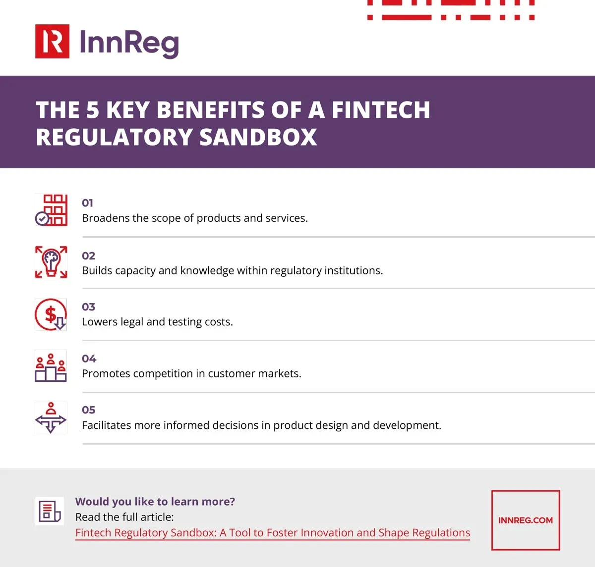

## Table of Contents

## What is a regulatory sandbox?

A regulatory sandbox is like a safe space where businesses can test new products or services without worrying about all the usual rules and regulations. It's set up by government or financial authorities to help encourage innovation, especially in areas like finance and technology. Companies can try out their ideas in a controlled environment, get feedback, and make improvements before launching their products to the public.

This approach helps both the companies and the regulators. For companies, it means they can experiment and learn without the risk of breaking laws or facing big fines. For regulators, it's a chance to see new technologies in action, understand how they work, and figure out the best way to regulate them to protect consumers and maintain a stable market. Overall, regulatory sandboxes make it easier for new ideas to grow and develop safely.

## How does a regulatory sandbox relate to cryptocurrencies?

A regulatory sandbox can be really helpful for cryptocurrencies. It lets companies that work with cryptocurrencies test their new ideas in a safe way. They can try out new ways to use cryptocurrencies, like making payments or trading, without worrying about breaking the rules right away. This helps them see if their ideas will work in the real world and make changes if they need to.

For regulators, a sandbox gives them a chance to learn about cryptocurrencies. They can watch how these new technologies work and figure out the best ways to make rules that keep people safe but also let innovation happen. By using a sandbox, regulators can make sure that new [cryptocurrency](/wiki/cryptocurrency) products are good for customers and don't cause problems in the market.

Overall, a regulatory sandbox helps both cryptocurrency companies and regulators. It makes it easier for new ideas to be tested and improved, and it helps regulators make smart rules that support new technology while keeping everything safe and fair.

## What are the main objectives of a crypto regulatory sandbox?

The main goal of a crypto regulatory sandbox is to help companies test new cryptocurrency ideas safely. It lets them try out things like new ways to pay with crypto or new trading platforms without breaking the rules right away. This means companies can see if their ideas work and fix any problems before they launch them to the public. It's like a practice space where they can learn and improve without big risks.

For regulators, the sandbox is a way to learn about cryptocurrencies too. They can watch how these new technologies work and figure out the best rules to keep people safe and the market stable. By using a sandbox, regulators can make sure new crypto products are good for customers and don't cause problems. It helps them understand the technology better so they can make smart rules that support new ideas but also keep everything fair and safe.

## Who can participate in a crypto regulatory sandbox?

A crypto regulatory sandbox is open to companies that want to test new ideas with cryptocurrencies. These companies can be startups or established businesses that are working on new ways to use crypto, like new payment methods or trading platforms. They need to apply to the sandbox and show that their idea is innovative and could benefit customers.

Regulators set up the sandbox and decide who can join. They look at the applications to make sure the ideas are safe and follow the basic rules. Once a company is in the sandbox, they can test their products in a controlled environment, get feedback, and make improvements before launching them to the public. This helps both the companies and the regulators learn and grow together.

## What are the typical entry requirements for a crypto regulatory sandbox?

To join a crypto regulatory sandbox, companies need to show that their idea is new and could help customers. They usually have to fill out an application where they explain what they want to test and how it works. The regulators look at this to make sure the idea is safe and follows the basic rules. They also want to know if the company has a good plan to test the product and learn from it.

Regulators care a lot about protecting customers and keeping the market stable. So, they check if the company has ways to keep customer information safe and if they have enough money to run the tests. They might also ask for details about the team working on the project to make sure they know what they're doing. Once everything looks good, the company can start testing in the sandbox and work closely with the regulators to make their product better.

## How long does a firm typically stay in a crypto regulatory sandbox?

A firm usually stays in a crypto regulatory sandbox for a few months to a year. The exact time can be different depending on what the firm is testing and how quickly they can get good results. The sandbox is set up to help firms test their new ideas quickly and safely, so the time spent there is meant to be useful but not too long.

During their time in the sandbox, firms work closely with regulators. They test their products, get feedback, and make changes to improve things. Once they finish testing and meet the sandbox rules, they can leave and start using their new products in the real world. The goal is for firms to learn and grow in a safe space before they go out on their own.

## What kind of regulatory relief or support can participants expect in a crypto regulatory sandbox?

In a crypto regulatory sandbox, participants can expect some relief from the usual rules and regulations. This means they can test their new ideas without worrying about breaking all the laws right away. They get a bit of freedom to try things out and see if they work. This helps them learn and make their products better before they have to follow all the normal rules.

Regulators also offer support to the participants. They give feedback and advice to help the firms improve their products. This close working relationship means firms can get help solving problems and understanding what they need to do to make their ideas safe and good for customers. By the end of their time in the sandbox, firms should have a much better product and a clearer idea of how to meet the full regulations when they leave.

## Can you describe a real-world example of a crypto regulatory sandbox?

One real-world example of a crypto regulatory sandbox is the one set up by the Financial Conduct Authority (FCA) in the United Kingdom. The FCA started this sandbox in 2016 to help companies test new financial products, including those using cryptocurrencies. Companies can apply to test their ideas in a safe environment where they don't have to follow all the usual rules right away. This helps them see if their products work well and make improvements before launching them to the public.

For example, a company called Revolut used the FCA's sandbox to test its cryptocurrency services. Revolut wanted to let its customers buy, hold, and sell cryptocurrencies like Bitcoin and Ethereum through their app. By testing in the sandbox, Revolut was able to see how their service worked in the real world, get feedback from the FCA, and make sure it was safe for customers. After their time in the sandbox, Revolut was able to launch its crypto services with more confidence, knowing they had been tested and improved.

## What are the benefits of using a crypto regulatory sandbox for new fintech companies?

Using a crypto regulatory sandbox can really help new fintech companies. It gives them a safe place to test their new ideas without worrying about breaking all the rules right away. This means they can try out things like new ways to use cryptocurrencies, see if they work, and fix any problems before they launch them to the public. It's like a practice space where they can learn and improve without big risks.

The sandbox also helps new fintech companies work closely with regulators. They can get feedback and advice to make their products better. This close working relationship means the companies can solve problems and understand what they need to do to make their ideas safe and good for customers. By the end of their time in the sandbox, these companies should have a much better product and be ready to follow all the rules when they leave.

## How do regulatory authorities monitor and assess the activities within a crypto regulatory sandbox?

Regulatory authorities keep a close eye on what's happening in a crypto regulatory sandbox. They do this by working directly with the companies that are testing their new ideas. The companies have to tell the regulators what they're doing and how it's going. This way, the regulators can make sure everything is safe and follows the basic rules. They also look at data and reports from the companies to see if the new products are working well and if they're good for customers.

The regulators also give feedback and advice to the companies in the sandbox. They help the companies understand what they need to do to make their products safe and ready for the real world. If there are any problems, the regulators work with the companies to fix them. By the end of the sandbox period, the regulators can see if the new ideas are ready to leave the sandbox and follow all the normal rules. This helps make sure that new crypto products are safe and good for everyone.

## What are the potential risks and challenges associated with operating within a crypto regulatory sandbox?

Operating within a crypto regulatory sandbox can have some risks and challenges. One risk is that companies might find it hard to meet all the rules and requirements even in the sandbox. They might need to spend a lot of time and money to make sure their products are safe and ready for the real world. Another challenge is that the sandbox might not cover all the situations a company could face when they launch their product. This means they might still find new problems after they leave the sandbox.

Another risk is that the feedback from regulators might not always be what companies expect. Sometimes, the regulators might ask for big changes that can be hard to make. This can slow down the testing process and make it harder for companies to get their products ready. Also, there's a chance that the sandbox might not be available in all countries or regions, so companies might not be able to use it everywhere they want to do business. This can limit where they can test and launch their new ideas.

## How does the data and feedback from a crypto regulatory sandbox influence future regulatory frameworks?

The data and feedback from a crypto regulatory sandbox really help shape future rules for cryptocurrencies. When companies test their new ideas in the sandbox, they share a lot of information with the regulators. This information shows how the new products work, what problems they might cause, and how they can be made better. Regulators use all this data to learn about the new technology and figure out what rules are needed to keep people safe and the market stable. They can see what works well and what doesn't, which helps them make smarter rules that support new ideas but also protect everyone.

The feedback from the sandbox also helps regulators understand the real-world impact of new crypto products. They can see how customers use these products and what they think about them. This helps regulators make rules that are fair and good for everyone. By learning from the sandbox, regulators can make sure their rules keep up with new technology and help new ideas grow in a safe way. This makes the whole process of making and following rules easier for everyone involved.

## References & Further Reading

[1]: Zohar, A., & Kalodner, H. (2021). ["A Survey of Bitcoin Protocol Security and Privacy."](https://scholar.google.com/citations?user=lUAGHd4AAAAJ&hl=en) In Financial Cryptography and Data Security.

[2]: Arner, D., Barberis, J., & Buckley, R. P. (2016). ["FinTech, RegTech and the Reconceptualization of Financial Regulation."](https://papers.ssrn.com/sol3/papers.cfm?abstract_id=2847806) Northwestern Journal of International Law and Business.

[3]: Global Financial Markets Association. (2020). ["Risk: Hong Kong Regulatory Sandbox for FinTech."](https://www.gfma.org/)

[4]: Narayanan, A., Bonneau, J., Felten, E., Miller, A., & Goldfeder, S. (2016). ["Bitcoin and Cryptocurrency Technologies: A Comprehensive Introduction."](https://press.princeton.edu/books/hardcover/9780691171692/bitcoin-and-cryptocurrency-technologies) Princeton University Press.

[5]: Mengelkamp, E., Notheisen, B., Beer, C., Dauer, D., & Weinhardt, C. (2018). ["A Blockchain-Based Smart Grid: Towards Sustainable Local Energy Markets."](https://link.springer.com/article/10.1007/s00450-017-0360-9) Computer Science - R&D.