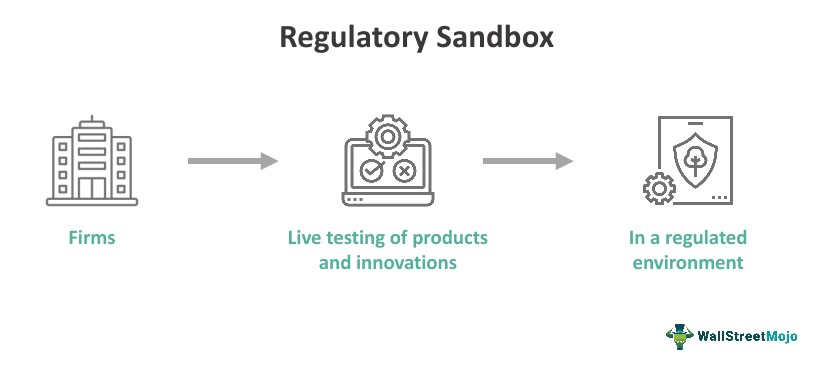

Cryptocurrency, a digital or virtual form of currency that uses cryptography for security, has seen exponential growth since the introduction of Bitcoin in 2009. As of 2023, thousands of cryptocurrencies are available, with varying functionalities and purposes, ranging from simple transactions to complex smart contracts. This burgeoning marketplace has driven significant innovation and attracted considerable investment. According to CoinMarketCap, the global market capitalization for cryptocurrencies reached over $1 trillion USD in 2023, illustrating the substantial impact of this technology on the global economy.

The rapid growth and widespread adoption of cryptocurrencies highlight the pressing need for regulation to ensure financial security and stability. Unlike traditional financial systems, cryptocurrencies operate on decentralized networks, often without intermediaries like banks. This decentralization poses unique challenges for regulators, who grapple with issues such as anonymity, cross-border transactions, and the pace of technological advancement. These factors complicate efforts to establish consistent regulatory frameworks, raising concerns about market stability, fraud, and investor protection.

Cryptocurrency regulation is crucial as it aims to create rules that safeguard investors, prevent illegal activities such as money laundering and terrorism financing, and promote transparency. The decentralized nature of cryptocurrencies means they can circumvent existing financial systems, making them attractive for illicit activities and hard for regulators to monitor and control. Governments and financial authorities worldwide are working to address these challenges by exploring regulatory measures tailored to the unique characteristics of cryptocurrencies.

One innovative approach to regulation in the crypto market is the implementation of regulatory sandboxes. These controlled environments allow companies to test innovative products and services under a regulator's oversight without immediately facing the full spectrum of regulations usually applicable to financial services. Regulatory sandboxes aim to foster innovation while ensuring consumer protection and compliance.

Simultaneously, algorithmic trading has gained a foothold in the cryptocurrency markets, akin to its role in traditional finance. Algorithmic trading encompasses the use of computer programs to execute trades at high speeds and volumes, often employing complex mathematical models and formulas. This form of trading can enhance market liquidity and efficiency but also raises potential issues such as market manipulation and volatility.

The interplay between regulation, sandboxes, and algorithmic trading is pivotal in shaping the future of the cryptocurrency ecosystem. As the market evolves, it is crucial to strike a balance between fostering innovation and implementing robust regulatory frameworks. This dynamic relationship will be explored further, shedding light on how these elements influence each other and what this means for the crypto market's future trajectory.

## Table of Contents

## Understanding Crypto Regulation

Cryptocurrency regulation refers to the frameworks, guidelines, and laws that govern the creation, operation, and trading of digital currencies. The primary objectives of crypto regulation are to ensure financial stability, protect investors, mitigate illicit activities such as money laundering, and support innovation within a secure environment.

Globally, the regulatory landscape for cryptocurrencies is diverse and continually evolving. Nations vary in their approach, ranging from outright bans to full integration of digital assets into their financial systems. For instance, Japan and Switzerland are known for having comprehensive regulatory frameworks that recognize cryptocurrencies as legitimate financial instruments. Conversely, countries like China have taken a more prohibitive stance by banning [cryptocurrency](/wiki/cryptocurrency) trading and initial coin offerings (ICOs).

Regulators face several challenges in managing cryptocurrencies. The inherent anonymity of transactions makes tracking financial activities difficult, potentially facilitating money laundering and other illicit operations. Cross-border transactions further complicate regulation due to varying international laws. Additionally, the rapid pace of technological innovation in the crypto space often outstrips existing legal frameworks, necessitating continual updates and adaptations.

Despite these challenges, effective regulation offers numerous benefits. It can enhance market stability by reducing the risk of fraudulent activities and price manipulation. By implementing clear guidelines, regulators contribute to increased investor confidence, fostering greater participation from both retail and institutional investors.

Countries with progressive crypto regulations provide valuable case studies. Japan, for example, has established a licensing system for exchanges, demanding stringent security measures to protect consumers. This has resulted in a safer trading environment and has encouraged innovation within its fintech sector. Similarly, Switzerland's "Crypto Valley" is a hub for blockchain innovation, underpinned by supportive legal structures that offer clarity and certainty for crypto businesses.

Overall, understanding crypto regulation involves recognizing the need for balance between fostering innovation and ensuring security and stability in the financial system, with each country tailoring its approach to its unique economic and political context.

## The Role of Regulatory Sandboxes in the Crypto Ecosystem

Regulatory sandboxes are controlled environments created by regulatory authorities that allow businesses to test innovative products, services, and business models under a regulator's supervision. The concept originated in the financial services sector in the UK with the launch of the first regulatory sandbox by the Financial Conduct Authority (FCA) in 2015. The primary aim of sandboxes is to strike a balance between fostering innovation and protecting consumers and markets.

**Advantages of Sandboxes in Fostering Innovation**

Regulatory sandboxes provide several advantages in fostering innovation while maintaining oversight. They offer a structured space where startups and established firms can test new technologies without immediately facing the full gamut of regulatory consequences. This enables companies to develop and refine their products with insights from regulators, which can lead to more effective and compliant solutions. By providing a degree of regulatory flexibility, sandboxes can speed up the development process and reduce costs associated with compliance.

**Benefits for Startups in the Crypto Space**

Startups in the crypto ecosystem benefit significantly from regulatory sandboxes. The complexity of the crypto markets often requires innovative approaches that fall outside existing regulatory frameworks. Sandboxes allow these startups to experiment with their products in a live environment without incurring the entire regulatory burden. This setup can lead to a more inclusive financial system by encouraging the growth of innovative solutions aimed at addressing gaps in current financial services.

**Examples of Successful Implementations in Fintech**

Several countries have implemented regulatory sandboxes successfully, contributing to the thriving fintech sector. For example, Singapore's Monetary Authority (MAS) has established a well-regarded sandbox that has attracted numerous fintech startups globally. In the European Union, Lithuania's central bank runs a sandbox that has enabled numerous blockchain-based projects to test their applications. These sandboxes have been instrumental in advancing innovative financial solutions by offering a safe testing environment under real market conditions.

**Drawbacks and Limitations of Sandboxes in Crypto Regulation**

Despite their advantages, regulatory sandboxes come with certain drawbacks and limitations. A key concern is that while sandboxes can provide temporary respite from regulations, they do not eliminate the need for startups to comply with full regulations once the testing phase is over. Moreover, sandboxes might lead to regulatory fragmentation if different jurisdictions enforce varying standards, potentially stifling innovation and creating barriers to entry. Additionally, there is a risk of regulatory capture, where firms within the sandbox might gain an unfair advantage over those that are outside, leading to an uneven playing field. 

In conclusion, regulatory sandboxes play a vital role in the crypto ecosystem by providing a balance between innovation and regulation. They offer significant opportunities for startups to test new ideas and products while ensuring that consumer protection and market integrity are upheld. However, it is crucial to address the challenges they present to avoid potential pitfalls and ensure that sandboxes serve their purpose effectively.

## Algorithmic Trading in Cryptocurrency

Algorithmic trading, often referred to as algo trading, involves the use of computer algorithms to execute trades at speeds and frequencies often impossible for human traders. This approach has become increasingly prevalent in financial markets, including the rapidly evolving cryptocurrency sector. The core advantage of [algorithmic trading](/wiki/algorithmic-trading) is its ability to process vast amounts of data and make trading decisions in real-time without human intervention.

#### Popular Algorithms and Strategies in Crypto Trading

In cryptocurrency markets, several algorithmic strategies have gained popularity due to their effectiveness in capturing opportunities at minute timescales:

1. **Arbitrage**: Cryptocurrencies are traded on multiple exchanges, often with slight price discrepancies for the same asset. Arbitrage strategies exploit these differences by buying an asset at a lower price on one exchange and selling it at a higher price on another. This strategy requires high-speed execution and low latency access to exchanges to be profitable, as price differences are typically small and transient.

2. **Market Making**: This strategy involves placing both buy and sell orders for a cryptocurrency to capture the spread between the bid and ask prices. Market makers profit from the relatively stable price difference, thereby providing liquidity and reducing volatility in the market. Market making requires sophisticated models to manage the inherent risks associated with price fluctuations.

3. **Trend Following**: This involves detecting and following trends in price movements of cryptocurrencies. Algorithms are designed to identify and act upon momentum indicators, moving averages, or other technical analysis tools. Trend following is predicated on the assumption that past price movements can predict future behavior, a concept that is particularly volatile in the crypto markets.

#### Impact on Market Dynamics and Liquidity

Algorithmic trading significantly impacts market dynamics and [liquidity](/wiki/liquidity-risk-premium) in the cryptocurrency market. By enabling high-frequency trading, it increases market liquidity, leading to narrower bid-ask spreads and more efficient price discovery. However, the high speed at which algorithmic trades are executed can also introduce rapid fluctuations and increased short-term [volatility](/wiki/volatility-trading-strategies), potentially resulting in phenomena such as "flash crashes."

#### Regulatory Concerns

The rapid pace and complexity of algorithmic trading pose several regulatory challenges. These concerns primarily center around:

- **Market Manipulation**: Strategies like spoofing and layering, where traders place deceptive orders to manipulate market prices, are difficult to regulate given the speed and anonymity of algorithmic trades.

- **Short-term Volatility**: The capacity for large, rapid trades by algorithms can lead to sudden price swings, posing financial risks to traders who are unprepared for such volatility.

Regulators face the challenge of crafting policies that mitigate these risks without stifling innovation or market efficiency.

#### The Future of Algorithmic Trading in a Regulated Environment

As the crypto market matures, the integration of algorithmic trading within a regulated framework will likely become more pronounced. Potential developments include the implementation of standardized trading protocols, enhanced transparency requirements, and real-time monitoring systems to detect and prevent manipulative practices.

The regulatory emphasis on ensuring market fairness, stability, and investor protection will drive innovations in algorithmic trading technology and practices. Future regulations may encourage collaboration between exchanges, regulators, and technology developers to create a balanced environment that supports innovation while maintaining market integrity. 

Overall, algorithmic trading will continue to be a pivotal component of the cryptocurrency ecosystem, with its evolution shaped significantly by ongoing regulatory developments and technological advancements.

## The Intersection of Regulation, Sandboxes, and Algo Trading

Cryptocurrency markets are inherently volatile and influential in the fintech landscape, driven significantly by algorithmic trading techniques. These techniques, while promoting liquidity and efficiency, are strongly shaped by the regulatory environment in which they operate. Regulations aim to curb the risks associated with rapid trading, such as market manipulation and extreme volatility, fostering a more stable market environment that benefits both individual and institutional investors.

Regulatory sandboxes play a pivotal role in the development and refinement of algorithmic trading models. A regulatory sandbox provides a controlled environment where fintech companies can test innovative solutions, including sophisticated trading algorithms, under the supervision of regulatory bodies. This setup enables startups and established firms to interact with real-world data and trading conditions without facing the full spectrum of regulatory compliance. They can experiment with different algorithms, optimize them for performance and compliance, and assess their impacts on market stability.

One notable case of a regulatory sandbox project focused on algorithmic trading in cryptocurrency occurred in the United Kingdom, facilitated by the Financial Conduct Authority (FCA). The FCA's sandbox allowed firms to test automated trading algorithms for cryptocurrencies, enabling the development of models that adapt to price fluctuations and engage in high-frequency trades. The sandbox environment helped these firms assess how their algorithms perform under regulatory scrutiny, paving the way for broader application upon project completion.

Potential conflicts exist between regulation and algorithmic trading. Regulations can impose restrictions that limit the speed or frequency of trades that algorithms execute, potentially dampening the algorithms' efficiency. Conversely, when regulations focus primarily on preventing market manipulation or ensuring transparency, they can lead to the development of more responsible trading strategies. Synergies arise as well; compliance requirements push developers towards creating more robust and reliable algorithms, fostering a culture of innovation that aligns with regulators' objectives. 

Striking a balance between fair trading practices and technological advancement is paramount. Ensuring fair trading requires ongoing monitoring and evaluation of algorithmic trading practices, which can be achieved through enhanced transparency measures and real-time transaction reporting. Algorithm developers should aim to create systems that not only optimize trading outcomes but also comply with ethical standards and regulatory guidelines. As regulations evolve, the adaptability and resilience of these algorithms become focal points for sustainable advancement in the crypto trading sector.

In conclusion, regulatory frameworks, sandboxes, and algorithmic trading are intrinsically linked, each influencing the others in the constantly evolving cryptocurrency landscape. By fostering innovation within a structured regulatory framework, it is possible to enhance market stability and protect investors while simultaneously encouraging technological progress in the crypto markets.

## Challenges and Opportunities Ahead

The regulatory landscape for cryptocurrencies presents a nexus of complex challenges and opportunities as governments and financial authorities strive to create balanced frameworks. One of the foremost challenges in crafting effective regulations is the inherent nature of cryptocurrencies—characterized by decentralization, anonymity, and borderless operations—that complicates traditional regulatory approaches. With the rapid pace of technological innovation in the blockchain space, regulators frequently face difficulties in keeping laws relevant and effective without stifling growth.

A key opportunity for regulatory bodies lies in harnessing technological advancements themselves. By integrating blockchain technology within their own operations, regulators can gain better insights into transactions and compliance. The development of regtech solutions—technological applications that streamline the administration of financial regulations—can enable authorities to monitor crypto activities more efficiently.

Future trends in crypto regulation are expected to focus on fostering environments that both protect investors and encourage innovation. The introduction of clearer legal frameworks, such as those already seen in regions like the European Union with its Markets in Crypto-Assets (MiCA) regulation, is likely to pave the way for greater market stability. However, the challenge remains to ensure these frameworks are flexible enough to adapt to rapidly changing technological innovations.

International cooperation is becoming increasingly critical, given the cross-border nature of cryptocurrencies. Global regulatory harmony can prevent regulatory [arbitrage](/wiki/arbitrage) opportunities, where businesses exploit the differences in national regulations to operate in jurisdictions with lax rules. Initiatives like the Financial Stability Board's efforts to coordinate international regulatory frameworks can serve as models for how nations might work together to create consistent and comprehensive crypto regulations.

In conclusion, striking the right balance between regulation and innovation is crucial for the sustainable growth of the cryptocurrency market. While regulations are necessary to protect investors and maintain market integrity, they must be designed to accommodate the innovative spirit inherent in the crypto space. A collaborative approach involving regulators, developers, and investors will be essential in achieving a regulatory environment that supports responsible innovation while ensuring financial stability.

## Conclusion

Cryptocurrency regulation is becoming increasingly essential in a world where digital currencies and blockchain technologies are rapidly evolving. As these technologies grow, effective regulation ensures financial stability, protects investors, and promotes the safe expansion of the crypto market. Regulation helps maintain a secure environment for all participants, minimizing risks related to fraud and malpractice.

Regulatory sandboxes and algorithmic trading play critical roles in this evolving market. Sandboxes provide a safe space for fintech startups and established firms alike to test innovative approaches under regulatory supervision. This fosters a balance between innovation and oversight, allowing for the development of products and services that comply with legal standards while pushing technological boundaries. Algorithmic trading, on the other hand, enhances market efficiency and liquidity, making it a vital component of modern financial systems. The interplay between these trading technologies and robust regulatory frameworks ensures a more stable and transparent crypto ecosystem.

A key [factor](/wiki/factor-investing) in the advancement of cryptocurrencies is the ongoing dialogue among regulators, developers, and traders. This open communication channel ensures that regulations are informed by the realities of technological advancements and market dynamics. Continuous discussions also pave the way for adaptive policies that accommodate new innovations while safeguarding economic interests. As regulatory frameworks solidify, the future of cryptocurrencies appears promising, with the potential for greater mainstream acceptance and integration into global financial systems.

Moving forward, it is crucial for all stakeholders, including policymakers, industry leaders, and developers, to work collaboratively. This engagement will be instrumental in crafting responsible regulatory measures that encourage innovation while protecting the interests of market participants. Active participation in this dialogue assures that cryptocurrencies can flourish as a secure, efficient, and transformative part of the financial landscape. Through collective efforts and a shared vision, the crypto community can achieve balanced growth and sustainable innovation.

## References & Further Reading

[1]: Zohar, A., & Kalodner, H. (2021). ["A Survey of Bitcoin Protocol Security and Privacy."](https://scholar.google.com/citations?user=lUAGHd4AAAAJ&hl=en) In Financial Cryptography and Data Security.

[2]: Arner, D., Barberis, J., & Buckley, R. P. (2016). ["FinTech, RegTech and the Reconceptualization of Financial Regulation."](https://papers.ssrn.com/sol3/papers.cfm?abstract_id=2847806) Northwestern Journal of International Law and Business.

[3]: Global Financial Markets Association. (2020). ["Risk: Hong Kong Regulatory Sandbox for FinTech."](https://www.gfma.org/)

[4]: Narayanan, A., Bonneau, J., Felten, E., Miller, A., & Goldfeder, S. (2016). ["Bitcoin and Cryptocurrency Technologies: A Comprehensive Introduction."](https://press.princeton.edu/books/hardcover/9780691171692/bitcoin-and-cryptocurrency-technologies) Princeton University Press.

[5]: Mengelkamp, E., Notheisen, B., Beer, C., Dauer, D., & Weinhardt, C. (2018). ["A Blockchain-Based Smart Grid: Towards Sustainable Local Energy Markets."](https://link.springer.com/article/10.1007/s00450-017-0360-9) Computer Science - R&D.