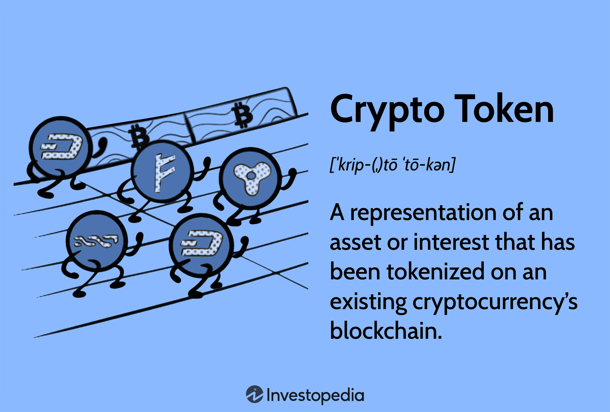

In recent years, the digital finance landscape has undergone significant transformation, primarily driven by the advent of technologies such as blockchain and algorithmic trading. These innovations have facilitated the emergence of digital assets, including cryptocurrencies like Bitcoin and Ethereum, and crypto tokens, creating new opportunities for traders and investors across the globe. Blockchain technology, by underpinning these digital assets, offers a decentralized platform for secure and transparent transactions, minimizing the role of traditional intermediaries and enabling faster and more cost-effective financial dealings.

Algorithmic trading further complements digital assets by allowing traders to utilize automated strategies driven by pre-defined criteria, enhancing the efficiency and competitiveness of trading operations. By leveraging algorithms, traders can quickly respond to market movements, capitalize on trends, and exploit arbitrage opportunities without succumbing to the emotional biases that may impact manual trading decisions. This confluence of blockchain innovations and algorithmic trading methodologies promises to redefine market engagement, introducing both opportunities for profit and challenges related to market dynamics and technological implementation.



This article is intended to provide an insightful exploration of how digital assets, blockchain, crypto tokens, and algorithmic trading converge to reshape the financial industry. By examining their individual roles and combined impacts, we aim to shed light on the significant changes these technologies bring to modern finance, as well as the potential hurdles and considerations they introduce for stakeholders. As the financial landscape continues to evolve with these advancements, understanding their implications is crucial for investors and traders aiming to navigate and succeed in this dynamic ecosystem.

## Table of Contents

## Understanding Digital Assets and Blockchain

Digital assets have become a pivotal component of the modern financial ecosystem, encompassing a range of entities like cryptocurrencies, tokens, and other blockchain-based assets that represent value. At the core of digital assets is blockchain technology, a decentralized ledger that facilitates secure and transparent record-keeping. 

Blockchain technology enables decentralized record-keeping and secure transactions by distributing data across a network of computers, making it resistant to tampering. Each block in a blockchain contains transaction data, a timestamp, and a cryptographic hash of the previous block, forming a chain that is immutable and transparent. This structure eliminates the need for traditional intermediaries, reducing costs and enhancing transaction speeds.

Cryptocurrencies like Bitcoin and Ethereum have become the archetypes of digital assets, acting as a medium of exchange, a store of value, and a unit of account. Bitcoin, introduced in 2009, was the first decentralized cryptocurrency and has paved the way for numerous others. Ethereum, launched in 2015, expanded the concept of blockchain with its smart contract functionality, allowing for programmable transactions. Since then, a multitude of cryptocurrencies have emerged, each with unique features and use cases.

The decentralized nature of blockchain technology minimizes reliance on traditional intermediaries, offering advantages such as reduced transaction costs and increased speed. Transactions conducted through blockchain are typically faster and cheaper because they bypass the need for banks or other financial institutions to verify and process the transactions. Additionally, the peer-to-peer network ensures that each transaction is securely recorded across a distributed ledger, providing transparency and reducing the risk of fraud.

In addition to cryptocurrencies, blockchain technology facilitates the creation of tokens, which can represent a wide array of assets or rights within a blockchain ecosystem. Tokens can be categorized into different types, such as utility tokens, which provide access to a specific product or service within a blockchain, and security tokens, which represent ownership in an asset or a company. These tokens are often created through initial coin offerings (ICOs) or similar fundraising mechanisms.

By providing a digital representation of value, tokens enable innovative business models that leverage the efficiencies of the blockchain. For example, tokens can be used to create decentralized applications (dApps), conduct transactions within a digital ecosystem, or offer new ways to raise capital. As the technology and regulatory frameworks continue to evolve, the potential applications for digital assets and blockchain are likely to expand, presenting new opportunities for businesses and investors alike.

## Crypto Tokens: Features and Differentiation

Crypto tokens are digital representations of assets, utilities, or rights on a blockchain, offering unique functionalities distinct from cryptocurrencies like Bitcoin or Ethereum. While cryptocurrencies operate primarily as digital currencies aiming to replace or complement traditional fiat currencies, crypto tokens are often designed to serve specific purposes within a particular blockchain ecosystem. These functions can range from granting access to unique features, services, or governance rights within decentralized applications (DApps) or blockchain networks.

One of the key mechanisms for the creation and distribution of crypto tokens is through Initial Coin Offerings (ICOs). ICOs allow developers to raise funds for blockchain projects by selling tokens to investors, typically in exchange for more established cryptocurrencies such as Bitcoin or Ethereum. This fundraising model is comparable to traditional securities offerings and has been pivotal in financing many successful blockchain initiatives.

Tokens also serve as investment vehicles, similar to shares in a company, but with distinct differences reflecting their digital nature and issuance on a blockchain. For instance, security tokens, a subset of crypto tokens, are explicitly designed to comply with regulatory standards, akin to traditional investment instruments. On the other hand, utility tokens provide holders with access to specific services or functionalities within the issuing project's ecosystem, such as voting rights, discounts, or premium features.

For investors and participants in the blockchain space, understanding the purpose and functionality of a token is crucial. Tokens can differ significantly in their design, application, and value proposition. For example, governance tokens enable holders to influence project decisions, such as protocol updates or ecosystem fund allocations. This decentralized governance model allows for community-driven development and decision-making, enhancing user involvement and engagement.

In summary, crypto tokens are versatile instruments that expand beyond mere financial transactions. They offer a wide array of functions, from enabling decentralized governance to acting as fundraising tools or granting access to specific utilities. Recognizing these distinctions is foundational for anyone engaging with blockchain technology and the emerging digital asset landscape.

## The Role of Algorithmic Trading in Crypto Markets

Algorithmic trading in the [cryptocurrency](/wiki/cryptocurrency) market relies on automated processes to execute trades based on predetermined criteria, enabling transactions at speeds and efficiencies beyond human capability. This method has become increasingly significant due to the highly volatile and dynamic nature of the crypto markets. Algorithmic trading strategies are designed to exploit market trends, price [volatility](/wiki/volatility-trading-strategies), and [arbitrage](/wiki/arbitrage) opportunities that frequently arise across the numerous cryptocurrency exchanges. 

These strategies reduce human emotional interference in trading decisions, which often leads to better execution of planned objectives. Algorithmic trading systems can be constructed using simple scripts that perform basic functions or advanced [artificial intelligence](/wiki/ai-artificial-intelligence) capable of analyzing vast datasets and executing complex trading strategies across multiple platforms. The sophistication of the algorithms dictates their ability to capitalize on fleeting opportunities and manage risk effectively.

One of the key components of [algorithmic trading](/wiki/algorithmic-trading) is the use of historical data and [backtesting](/wiki/backtesting) strategies. By analyzing past market behaviors, traders can develop and test algorithms to predict future price movements with greater accuracy. Backtesting involves running a trading algorithm on historical data to evaluate its performance, which helps in identifying potential risks and refining strategies before live deployment. 

For instance, a basic Python algorithm for a moving average crossover strategy might look like this:

```python
import pandas as pd

data = pd.read_csv('historical_data.csv')

short_window = 40
long_window = 100

data['Short_MA'] = data['Close'].rolling(window=short_window, min_periods=1).mean()
data['Long_MA'] = data['Close'].rolling(window=long_window, min_periods=1).mean()

# Buy signal
data['Signal'] = 0.0
data['Signal'] = np.where(data['Short_MA'] > data['Long_MA'], 1.0, 0.0)

# Calculate daily returns
data['Strategy_Returns'] = data['Signal'].shift(1) * data['Close'].pct_change()

# Output cumulative returns
cumulative_returns = (data['Strategy_Returns'] + 1).cumprod() - 1
print(cumulative_returns.tail(1))
```

The example above calculates the short and long-term moving averages of a given cryptocurrency's closing prices. A buy signal is generated when the short-term average crosses above the long-term average. By backtesting this strategy on historical data, a trader can assess its viability before applying it to real-time trading environments.

Algorithmic trading continues to evolve with technological advancements, offering traders unparalleled capacity to exploit the fast-paced nature of the crypto markets. However, success in algorithmic trading requires continuous monitoring and adjustment of strategies to adapt to evolving market conditions.

## Developing a Crypto Trading Algorithm

To develop an effective crypto trading algorithm, the initial step involves defining a clear trading strategy and setting precise parameters. A trading strategy is a comprehensive plan that outlines how the algorithm will respond to various market conditions, such as trends, volatility, and market cycles. Parameters might include the entry and [exit](/wiki/exit-strategy) points, the size of trades, and the timing of trades. A well-defined strategy helps in optimizing algorithm performance and aligning with investment goals.

Selecting appropriate exchanges is crucial, as these platforms provide the necessary infrastructure to access real-time market data and execute trades. Robust APIs (Application Programming Interfaces) play a pivotal role here, allowing algorithms to interact with the exchange, fetch market data, and execute trades efficiently. When choosing exchanges, factors such as [liquidity](/wiki/liquidity-risk-premium), transaction fees, security features, and API reliability should be considered to ensure optimal algorithm performance.

Continuous monitoring and maintenance of the algorithm are essential to keep pace with the dynamic conditions of the crypto market. Algorithms need to adapt to new patterns, technological advances, and macroeconomic factors that can influence market behavior. Automated alert systems can be implemented to notify users of significant market changes or potential errors in the algorithm, enhancing responsiveness and decision-making.

Risk management is a key element in algorithmic trading. Implementing mechanisms like stop-loss and take-profit parameters helps mitigate potential losses and lock in profits by defining clear thresholds for exiting trades. Stop-loss limits can automatically sell a position once the price falls to a certain level, thus limiting losses. Take-profit points ensure that profits are captured when a favorable price is reached, thus balancing potential gains with risks.

Testing algorithms with historical data, a process known as backtesting, is integral to assessing their effectiveness before deployment in live markets. Through backtesting, algorithms are run against historical market data to evaluate their performance across various market scenarios. This process aids in identifying potential weaknesses or inefficiencies and provides insights into expected returns and risk levels. Using statistical metrics such as the Sharpe ratio, traders can measure the risk-adjusted return of the strategy.

Incorporating Python for algorithm development offers flexibility and power, particularly through libraries such as Pandas for data manipulation and NumPy for numerical computations. A sample code snippet for calculating moving average crossover, a common trading strategy, might look like:

```python
import numpy as np
import pandas as pd

def moving_average_crossover(data, short_window=40, long_window=100):
    signals = pd.DataFrame(index=data.index)
    signals['signal'] = 0.0

    # Calculate short and long moving averages
    signals['short_mavg'] = data['close'].rolling(window=short_window, min_periods=1, center=False).mean()
    signals['long_mavg'] = data['close'].rolling(window=long_window, min_periods=1, center=False).mean()

    # Generate trading signals
    signals['signal'][short_window:] = np.where(signals['short_mavg'][short_window:] > signals['long_mavg'][short_window:], 1.0, 0.0)

    return signals

# Example usage with market data
market_data = pd.DataFrame([...])  # Provided market data
trading_signals = moving_average_crossover(market_data)
```

This code computes the short-term and long-term moving averages of closing prices and generates a buy signal when the short-term moving average crosses above the long-term moving average.

In summary, crafting a successful crypto trading algorithm demands a structured approach, prioritizing strategy definition, careful exchange selection, vigilant risk management, and thorough pre-launch testing. Robust algorithms equipped with adaptive features and advanced risk controls empower traders to navigate the volatile crypto landscape effectively.

## Challenges and Risks in Algorithmic Crypto Trading

Algorithmic trading in crypto markets offers numerous advantages, such as increased precision and fast transaction speeds. However, traders must navigate several significant challenges and risks that could impact financial outcomes.

Technical issues or errors in code can result in substantial financial losses. The complexity of algorithms means that even minor bugs can lead to unexpected behavior and loss of capital. For example, a miscalculation in an arbitrage algorithm might erroneously identify profitable opportunities, leading to trades that incur losses. It is crucial for developers to rigorously test and validate every line of code in their algorithms, using simulated environments and historical data to identify potential flaws.

Market manipulation and liquidity issues further complicate algorithmic trading in crypto markets. Crypto markets are less regulated than traditional financial markets, making them susceptible to manipulation tactics such as pump-and-dump schemes. These practices can distort price signals and lead to erroneous trading decisions by algorithms. Additionally, the liquidity of a cryptocurrency can vary significantly across different exchanges, and low liquidity can result in slippage where trades are executed at unfavorable prices. Traders must design algorithms that account for these conditions, potentially incorporating safeguards like adjusted limit orders that prevent trades from executing at suboptimal prices.

Regulatory compliance presents another evolving challenge. Cryptocurrency regulations are continuously adapting, with different countries imposing various rules on trading practices, platform usage, and security. Maintaining compliance requires traders to stay informed about current regulations and to adjust their algorithms and strategies accordingly. Non-compliance can lead to significant penalties or even legal actions, potentially crippling investment operations.

Continuous learning and adaptation are imperative for dealing with rapid technological and market changes. The fast-evolving nature of crypto markets demands that algorithms be updated to incorporate new data and strategies. Machine learning techniques can be employed to help adapt to novel market conditions. For instance, [reinforcement learning](/wiki/reinforcement-learning) models can dynamically adjust trading strategies based on past performance and current market conditions. However, these models must be carefully managed and tested to ensure they do not overfit historical data, leading to poor real-time performance.

In summary, while algorithmic trading in crypto markets can enhance trading efficiency, the associated challenges and risks necessitate meticulous attention to detail, thorough testing, and ongoing adaptation to technological and regulatory environments. By proactively addressing potential pitfalls, traders can better safeguard their investments and leverage these advanced techniques in the rapidly changing digital finance landscape.

## Conclusion

The integration of digital assets, blockchain, crypto tokens, and algorithmic trading represents a significant evolution in financial markets. These technologies have introduced novel methods of conducting transactions, investing, and building financial architectures that were previously unimaginable. The decentralized nature of blockchain and the programmable features of crypto tokens have opened the door to increased transactional efficiency and drastic cost reductions. In parallel, algorithmic trading has advanced trading capabilities by leveraging sophisticated mathematical models and computing power to execute trades with precision and speed.

However, these innovations are not without challenges. The fast-paced nature of technological development in these areas can lead to significant complexities and risks. Investors and traders must navigate issues such as technical vulnerabilities, market manipulation, and regulatory uncertainties. The complexity of algorithmic trading models and the volatile nature of cryptocurrency markets require a thorough understanding and rigorous risk management strategies.

To effectively engage with these technologies, participants should approach with informed caution. Staying updated with ongoing developments, from changes in regulation to technological advancements, is critical. As the market matures, the interplay between digital assets, blockchain technologies, and algorithmic trading is expected to generate further opportunities for innovation. The potential for creating efficient, transparent, and inclusive financial systems is immense if the risks are managed wisely.

By understanding and leveraging these technologies, traders and investors have the potential to establish themselves advantageously within the dynamic digital financial landscape. Adopting a strategic approach grounded in knowledge and adaptability will be crucial as these technologies continue to evolve and reshape the financial world.

## References & Further Reading

[1]: Narayanan, A., Bonneau, J., Felten, E., Miller, A., & Goldfeder, S. (2016). ["Bitcoin and Cryptocurrency Technologies: A Comprehensive Introduction."](https://press.princeton.edu/books/hardcover/9780691171692/bitcoin-and-cryptocurrency-technologies) Princeton University Press.

[2]: Lopez de Prado, M. (2018). ["Advances in Financial Machine Learning."](https://books.google.com/books/about/Advances_in_Financial_Machine_Learning.html?id=oU9KDwAAQBAJ) Wiley.

[3]: Tapscott, D., & Tapscott, A. (2016). ["Blockchain Revolution: How the Technology Behind Bitcoin and Other Cryptocurrencies Is Changing the World."](https://dl.acm.org/doi/10.5555/3051781) Portfolio.

[4]: Chan, E. (2013). ["Algorithmic Trading: Winning Strategies and Their Rationale."](https://github.com/leoncuhk/awesome-quant-ai) Wiley.

[5]: Nakamoto, S. (2008). ["Bitcoin: A Peer-to-Peer Electronic Cash System."](https://nakamotoinstitute.org/library/bitcoin/) Bitcoin.org.