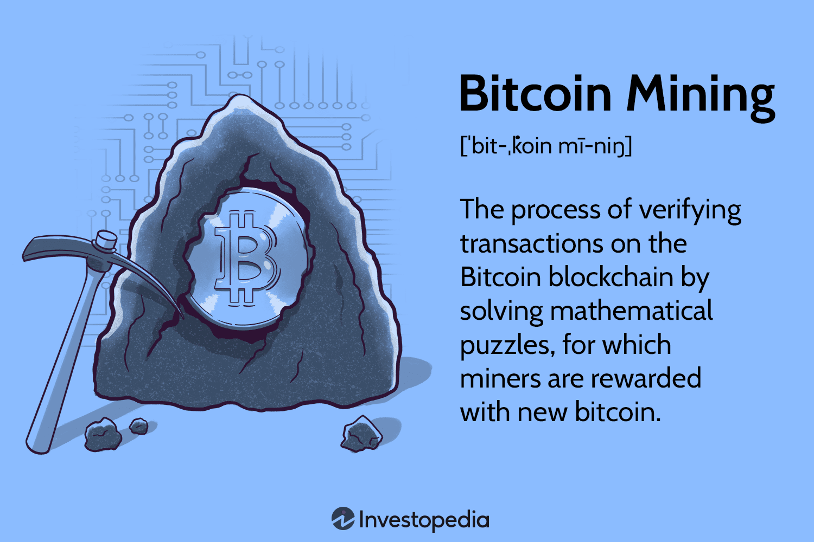

## Table of Contents

## What is cryptocurrency?

Cryptocurrency is a type of digital money that you can use to buy things online. It's different from regular money because it's not controlled by banks or governments. Instead, it uses a special technology called blockchain, which is like a big, shared record book that keeps track of all the transactions.

People can send and receive cryptocurrencies through the internet, and it's often used to buy things like games, apps, or even pizza. Some popular cryptocurrencies include Bitcoin, Ethereum, and Dogecoin. They can also be traded like stocks, and their value can go up or down based on what people think they're worth.

Using cryptocurrency can be a bit tricky because it's still new and not everyone accepts it as payment. But it's becoming more popular, and some people see it as a way to have more control over their money. Just remember, like any investment, it can be risky, so it's important to learn about it before you start using it.

## How does cryptocurrency differ from traditional currency?

Cryptocurrency is different from traditional currency in several ways. First, it's digital, meaning it only exists on the internet and not in physical form like coins or paper money. Traditional currency, on the other hand, can be both digital and physical. Second, cryptocurrencies are not controlled by any central authority like a bank or government. Instead, they use a technology called blockchain, which is like a big, shared record book that everyone can see and agree on. Traditional currency is managed by banks and governments, who decide how much money is printed and how it's used.

Another big difference is how you can use them. With traditional currency, you can easily buy things at most stores and online. Cryptocurrency is not accepted everywhere yet, so you might have to look harder to find places that take it. Also, the value of cryptocurrencies can change a lot from day to day, making them riskier than traditional money. If you have traditional currency in a bank, its value stays pretty steady. But if you have [cryptocurrency](/wiki/cryptocurrency), its value might go up or down quickly, which can be exciting but also a bit scary.

## What does it mean for a cryptocurrency to be considered a commodity?

When a cryptocurrency is considered a commodity, it means it's treated like other things you can buy and sell, like gold or oil. Commodities are things that can be traded on special markets, and their value can go up or down based on what people think they're worth. For a cryptocurrency to be a commodity, it usually doesn't represent something else, like a company's stock, but is valued for itself.

In the United States, the Commodity Futures Trading Commission (CFTC) is the group that decides if something is a commodity. They've said that Bitcoin and Ethereum are commodities. This means they can be traded on futures markets, where people can bet on what their price will be in the future. Being a commodity can affect how a cryptocurrency is regulated and taxed, which is important for people who want to invest in them.

## What are the key characteristics that define a commodity?

A commodity is something you can buy and sell that is the same no matter who makes it. For example, oil from one company is pretty much the same as oil from another company. Commodities are often things that come from nature, like gold, oil, or wheat, but they can also be things people make, like steel. The important thing is that they are traded in big markets where the price can go up or down based on how much people want them and how much there is to buy.

Another key characteristic of a commodity is that it's used as a basic building block for other things. For example, oil is used to make gasoline, and wheat is used to make bread. Commodities are often traded on special markets called futures markets, where people can bet on what the price will be in the future. This helps businesses plan ahead and can make the price of commodities go up or down a lot.

## Can you provide examples of cryptocurrencies that are treated as commodities?

Bitcoin and Ethereum are two examples of cryptocurrencies that are treated as commodities. The Commodity Futures Trading Commission (CFTC) in the United States says they are commodities. This means they can be traded on special markets called futures markets, where people can bet on what their price will be later. Because they are commodities, they are not controlled by any one company or government, but their value can go up and down a lot based on what people think they are worth.

Being treated as commodities affects how Bitcoin and Ethereum are regulated and taxed. For example, if you buy and sell these cryptocurrencies, you might have to pay different taxes than if you were buying and selling a company's stock. It also means that big investors and companies can use futures markets to plan ahead and manage risk, which can be important for them but can also make the price of these cryptocurrencies go up or down quickly.

## How are cryptocurrencies classified as commodities by regulatory bodies?

Cryptocurrencies like Bitcoin and Ethereum are classified as commodities by regulatory bodies like the Commodity Futures Trading Commission (CFTC) in the United States. This means they are treated like other things you can buy and sell, such as gold or oil. The CFTC looks at whether a cryptocurrency is a basic item that can be traded on special markets called futures markets. If it is, and if it's not controlled by any one company or government, it can be considered a commodity.

Being classified as a commodity affects how these cryptocurrencies are regulated and taxed. For example, if you buy and sell Bitcoin or Ethereum, you might have to pay different taxes than if you were buying and selling a company's stock. It also means that big investors and companies can use futures markets to plan ahead and manage risk. This can make the price of these cryptocurrencies go up or down quickly, based on what people think they are worth.

## What are the implications of classifying cryptocurrencies as commodities for investors?

When cryptocurrencies are classified as commodities, it changes how investors have to think about them. Instead of being like stocks, which represent a part of a company, commodities like Bitcoin and Ethereum are more like gold or oil. This means their value can go up or down based on what people think they're worth, not just how well a company is doing. Investors need to watch the special markets called futures markets, where people can bet on what the price of these cryptocurrencies will be later. This can make the prices move a lot, and it's something investors have to be ready for.

Another big thing for investors is how taxes work with commodities. When you buy and sell commodities like Bitcoin, you might have to pay different taxes than if you were buying and selling stocks. This can affect how much money you make or lose. Also, because commodities aren't controlled by any one company or government, they can be riskier. Investors need to understand these risks and how the rules for commodities can change their plans. It's important to learn about all this before jumping into investing in cryptocurrencies classified as commodities.

## How does the commodity status of a cryptocurrency affect its taxation?

When a cryptocurrency is classified as a commodity, it changes how it's taxed. If you buy and sell a commodity like Bitcoin, you might have to pay taxes on any money you make from it. This is different from stocks, where you might pay different kinds of taxes. With commodities, the tax you pay can depend on how long you hold onto the cryptocurrency before selling it. If you hold it for less than a year, you might pay a higher tax rate than if you hold it for more than a year.

This tax treatment can be important for people who want to invest in cryptocurrencies. Because commodities are not controlled by any one company or government, their value can go up or down a lot. This means that the taxes you owe can also change a lot. It's a good idea to talk to a tax expert to understand how the commodity status of a cryptocurrency can affect your taxes. They can help you plan better and maybe save money on taxes.

## What role do commodity futures play in the cryptocurrency market?

Commodity futures are special contracts that let people bet on what the price of a cryptocurrency like Bitcoin will be in the future. They are traded on big markets called futures markets. When a cryptocurrency is treated as a commodity, it can be traded on these markets. This means big investors and companies can use futures to plan ahead and manage risk. For example, if they think the price of Bitcoin will go up, they can buy a futures contract to lock in that price now. If the price does go up, they can make money.

The use of commodity futures can make the price of cryptocurrencies go up or down a lot. This is because a lot of people are betting on what the price will be, and their bets can affect the actual price. For people who want to invest in cryptocurrencies, this can be both good and bad. It can be good because it means there's a lot of action and chances to make money. But it can be bad because the price can change quickly, and it's hard to predict. So, investors need to be careful and think about how futures markets can affect their plans.

## How do commodity exchanges influence the trading of cryptocurrencies?

Commodity exchanges are big markets where people can trade things like Bitcoin and Ethereum, which are treated as commodities. When these cryptocurrencies are traded on commodity exchanges, it can make their prices go up or down a lot. This is because a lot of people are buying and selling them, and their actions can affect the price. For example, if a lot of people want to buy Bitcoin on a commodity exchange, its price might go up. But if a lot of people want to sell it, the price might go down.

These exchanges also let people use something called futures contracts. Futures contracts are special agreements where people bet on what the price of a cryptocurrency will be in the future. This can help big investors and companies plan ahead and manage risk. But it can also make the price of cryptocurrencies move a lot, because so many people are betting on what the price will be. So, if you're thinking about investing in cryptocurrencies, it's important to know how commodity exchanges can affect their prices.

## What are the potential risks and benefits of treating cryptocurrencies as commodities?

Treating cryptocurrencies as commodities can bring some big benefits. For one, it lets them be traded on special markets called futures markets. This means big investors and companies can use futures contracts to plan ahead and manage risk. They can bet on what the price of a cryptocurrency will be in the future, which can help them make money if they guess right. Also, being a commodity can make cryptocurrencies more popular and easier to buy and sell. This can help more people get into the market and maybe make the prices more stable over time.

But there are also some risks to think about. When cryptocurrencies are treated as commodities, their prices can go up or down a lot. This is because a lot of people are betting on what the price will be, and their bets can affect the actual price. This can be scary for people who want to invest, because they might lose money if the price goes down a lot. Also, the rules for commodities can be different from the rules for other investments, like stocks. This can make it harder to understand how to invest and how to pay taxes on any money you make. So, it's important to learn about these risks before you start investing in cryptocurrencies treated as commodities.

## How might future regulatory changes impact the classification of cryptocurrencies as commodities?

Future regulatory changes could change how cryptocurrencies are treated as commodities. Right now, groups like the Commodity Futures Trading Commission (CFTC) in the United States say that Bitcoin and Ethereum are commodities. But if the rules change, maybe other cryptocurrencies will be treated as commodities too, or maybe some that are commodities now won't be anymore. This could affect how people buy and sell them, and how they are taxed.

If the rules change, it might also affect the big markets where commodities are traded. If more cryptocurrencies are treated as commodities, more of them might be traded on futures markets. This could make the prices go up or down even more, because more people would be betting on what the prices will be in the future. People who invest in cryptocurrencies need to keep an eye on these changes, because they could affect how much money they make or lose.

## References & Further Reading

[1]: [Bergstra, J., Bardenet, R., Bengio, Y., & Kégl, B. (2011). "Algorithms for Hyper-Parameter Optimization."](https://dl.acm.org/doi/10.5555/2986459.2986743) Advances in Neural Information Processing Systems 24.

[2]: [Lopez de Prado, M. (2018). "Advances in Financial Machine Learning."](https://www.amazon.com/Advances-Financial-Machine-Learning-Marcos/dp/1119482089) Wiley.

[3]: [Aronson, D. (2006). "Evidence-Based Technical Analysis: Applying the Scientific Method and Statistical Inference to Trading Signals."](https://www.amazon.com/Evidence-Based-Technical-Analysis-Scientific-Statistical/dp/0470008741) Wiley.

[4]: [Jansen, S. (2020). "Machine Learning for Algorithmic Trading."](https://github.com/stefan-jansen/machine-learning-for-trading) Packt Publishing.

[5]: [Chan, E. P. (2009). "Quantitative Trading: How to Build Your Own Algorithmic Trading Business."](https://github.com/ftvision/quant_trading_echan_book) Wiley.