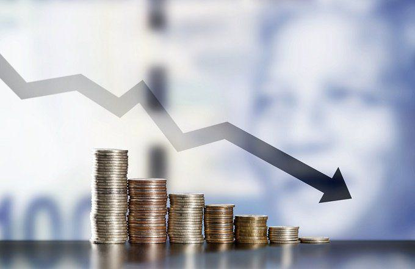

The world of cryptocurrency is ever-evolving, with new terminologies and strategies emerging regularly. Among these, 'crypto burning' has garnered significant attention as a mechanism intricately linked to blockchain technology. This process involves permanently removing cryptocurrency tokens from circulation, thereby affecting their scarcity and potentially their market value. As cryptocurrency markets continue to grow, strategies like crypto burning have found a place in influencing supply dynamics and value propositions within the digital asset environment.

Simultaneously, the advent of algorithmic trading is transforming how investors engage with cryptocurrencies. Algorithmic trading, or algo trading, involves using automated systems to execute trades at optimal moments based on pre-defined criteria and real-time data analysis. This automation enhances the efficiency and speed of trading, providing investors with tools to navigate the volatile crypto markets more effectively.



This article examines the impact of these strategies on the cryptocurrency ecosystem. By exploring the nuances of crypto burning and algorithmic trading, readers can gain insights into how these practices are shaping the future of digital finance. We will explore not only how these phenomena function independently but also their potential interplay within the broader context of the cryptocurrency market.

## Table of Contents

## What is Cryptocurrency Burning?

Cryptocurrency burning is a process within digital currency systems where tokens are permanently removed from circulation. This is typically done by sending the tokens to a specific address known as a "burner address." These burner addresses are created in such a way that they have no accessible private keys, meaning that any tokens sent to them can never be retrieved or used again.

The primary aim of burning cryptocurrencies is to decrease the total supply available in the market. By reducing the supply, the intrinsic value of the remaining tokens may potentially increase due to the fundamental economic principle of scarcity. When there are fewer tokens available, assuming demand remains constant or increases, each token can become more valuable.

To illustrate how cryptocurrency burning works, consider a blockchain-based token with a total supply of 1,000,000 units. Suppose the creators decide to burn 200,000 units. They would generate a transaction sending these tokens to a burner address. The blockchain would record this transaction, and the total available supply would reduce to 800,000 units. This reduction in supply could create upward pressure on the token's market price, providing potential benefits to the holders of the remaining tokens.

Burning is not only used for increasing a token's value. For some cryptocurrencies, such as stablecoins, burning can help maintain price stability. For instance, if a stablecoin's supply exceeds the demand, burning excess coins can help restore its pegged value by balancing supply and demand. Other tokens use burning to manage inflation rates, distribute network rewards, or for various governance and network maintenance reasons.

In practice, crypto burning involves careful consideration of technical and market factors. The design of burner addresses ensures that tokens sent to them are irretrievably removed from circulation, thus assuring the finality of the burning process. This irreversible nature helps maintain trust in the process, ensuring that once a token is burned, it cannot enter circulation again.

## How Crypto Burning Works

Crypto burning is a process in which [cryptocurrency](/wiki/cryptocurrency) tokens are permanently removed from circulation by being sent to unspendable addresses known as 'null' or 'burner' addresses. These addresses lack accessible private keys, thus rendering any tokens sent to them irretrievable. This mechanism aligns with the fundamental economic principles of supply and demand; reducing the supply of an asset may influence its demand and, by extension, its market value.

A common practice involves blockchain projects periodically burning tokens as part of their monetary policy. This can be observed in the functioning of cryptocurrencies like Binance Coin (BNB) and Ripple (XRP). For example, Binance regularly conducts quarterly burns, using 20% of its profits to buy back and burn BNB tokens, aiming to decrease total supply from 200 million to 100 million tokens.

From a technical perspective, executing a token burn typically involves creating a transaction that sends the tokens to a predetermined null address. This process is facilitated through smart contracts, which are deployed to ensure compliance and transparency in token burning. Here's an illustrative Python snippet that simulates sending tokens to a null address on the Ethereum blockchain:

```python
from web3 import Web3

# Initialize a Web3 instance
web3 = Web3(Web3.HTTPProvider('https://mainnet.infura.io/v3/YOUR-INFURA-PROJECT-ID'))

# Define the null address
null_address = '0x0000000000000000000000000000000000000000'

# Define account and transaction details
account = web3.eth.account.privateKeyToAccount('PRIVATE_KEY_HERE')
transaction = {
    'to': null_address,
    'value': web3.toWei(1, 'ether'),
    'gas': 21000,
    'gasPrice': web3.toWei('50', 'gwei'),
    'nonce': web3.eth.getTransactionCount(account.address),
}

# Sign and send the transaction
signed_txn = account.signTransaction(transaction)
txn_hash = web3.eth.sendRawTransaction(signed_txn.rawTransaction)

print(f"Transaction hash: {web3.toHex(txn_hash)}")
```

In this example, tokens (in this case, Ether) are sent to the null address 0x0000000000000000000000000000000000000000, effectively removing them from supply.

Burning also involves consideration of blockchain fees. The transaction costs associated with burning tokens must be evaluated as they can impact the economic feasibility of the burn, especially in networks with high gas fees like Ethereum.

Moreover, the implementation of crypto burning requires careful handling to maintain transparency and trust among investors. Blockchain explorers can be used to verify burn transactions, ensuring that the tokens have been effectively removed from circulation.

In conclusion, crypto burning serves as a deliberate economic strategy to manage token supply. By understanding the technical nuances and strategic implications of this process, projects can aim to bolster the value and sustainability of their cryptocurrencies.

## Practical Applications of Crypto Burning

Cryptocurrency burning finds versatile applications across various blockchain platforms, serving multiple purposes critical to token economy management. 

One significant application is in maintaining asset parity, particularly in stablecoins and synthetic assets. Stablecoins, like USD Coin (USDC) and Tether (USDT), aim to maintain a 1:1 peg with a fiat currency. Burning tokens can be an effective means to control supply and thereby assist in achieving and maintaining this parity. For example, if the demand for a stablecoin decreases, the issuing entity might burn a portion of the supply, preventing excess circulation which could destabilize the price peg. Similarly, synthetic assets, which mimic the value of other assets, utilize burning to adjust supply in response to market changes, ensuring the synthetic asset accurately reflects the value of the underlying asset.

Another application of crypto burning is in regulating token supply to potentially boost the value of the remaining tokens. This principle is akin to deflationary monetary policy, where reducing the supply of a currency can increase its value, assuming stable demand. For instance, Binance Coin (BNB) periodically conducts coin burns to reduce total supply, with the implicit goal of increasing scarcity and potentially enhancing token value. Such burns are often predetermined and executed based on formulas or pre-set conditions embedded in the cryptocurrency's protocol.

Crypto burning also serves as a mechanism to protect blockchain networks against spam. This is evident in platforms that require a small fee, often paid in the form of the network's native token, to execute transactions or smart contracts. By burning these fees rather than recycling them into the economy, the network ensures that spamming becomes economically unfeasible, thus maintaining the efficiency and reliability of the network.

Concrete case studies highlight these applications in action. For example, Ethereum Improvement Proposal (EIP) 1559, implemented in August 2021, introduced a base fee that is burned during each transaction. This mechanism not only helps regulate Ethereum's supply by burning a portion of the transaction fees but also aims to reduce network congestion and optimize transaction costs. This strategic burning has implications for Ethereum's value proposition and overall network efficiency.

These practical applications demonstrate the multifaceted roles crypto burning plays in enhancing blockchain ecosystem stability, value, and operability.

## Algorithmic Trading in Cryptocurrency

Algorithmic trading, commonly referred to as algo trading, has become a central feature in the rapidly expanding cryptocurrency market. Algo trading employs sophisticated algorithms to make rapid decisions about buying and selling digital assets, aiming to execute trades at the most opportune moments. This automated approach capitalizes on the volatile nature of cryptocurrency markets, where prices can fluctuate significantly within seconds.

These algorithms analyze various market conditions in real-time, considering numerous factors such as historical prices, trading [volume](/wiki/volume-trading-strategy), and even social media sentiment. The primary goal of algo trading is to enhance trading efficiency and effectiveness by minimizing the emotional bias and human error that often accompany manual trading. This is achieved through predefined criteria encoded into trading scripts that operate across different market conditions.

In the cryptocurrency landscape, algo trading has gained popularity due to several distinctive features:

1. **Market Volatility**: Cryptocurrency markets are known for their high volatility, which makes them fertile ground for algorithmic strategies that capitalize on short-term price movements. Algorithms can quickly respond to sudden price swings, capturing profits that might be missed by human traders.

2. **24/7 Market**: Unlike traditional stock markets that operate during set hours, cryptocurrency markets function around the clock. This continuous operation requires constant monitoring and rapid decision-making, tasks ideally suited for automated systems.

3. **Diverse Trading Strategies**: Algo trading supports a variety of strategies, including arbitrage, market-making, and trend-following. Arbitrage algorithms exploit price differences across exchanges, market-making algorithms provide liquidity by placing both buy and sell orders, and trend-following algorithms identify and capitalize on emerging price trends.

4. **Backtesting and Simulation**: Algorithms can be rigorously tested against historical data before being deployed live. Backtesting allows developers to assess the potential effectiveness of a trading strategy and refine its parameters, minimizing the risk of financial loss.

A basic example of a simple [algorithmic trading](/wiki/algorithmic-trading) strategy in Python could involve using a basic moving average crossover strategy:

```python
import pandas as pd
import numpy as np

# Sample data assuming you have a DataFrame 'df' with a 'Price' column
df['SMA50'] = df['Price'].rolling(window=50).mean()
df['SMA200'] = df['Price'].rolling(window=200).mean()

# Buy signal
df['Signal'] = np.where(df['SMA50'] > df['SMA200'], 1, 0)

# Calculate positions
df['Position'] = df['Signal'].diff()

# Visualizing the strategy
import matplotlib.pyplot as plt

plt.figure(figsize=(14,7))
plt.plot(df['Price'], label = 'Price')
plt.plot(df['SMA50'], label = '50-day SMA', alpha = 0.7)
plt.plot(df['SMA200'], label = '200-day SMA', alpha = 0.7)
plt.scatter(df.index, df[df['Position'] == 1]['Price'], marker='^', color='g', label='Buy', alpha = 1) 
plt.scatter(df.index, df[df['Position'] == -1]['Price'], marker='v', color='r', label='Sell', alpha = 1)
plt.title('Simple Moving Average Crossover Strategy')
plt.xlabel('Date')
plt.ylabel('Price')
plt.legend()
plt.show()
```

In this simple moving average crossover strategy, the algorithm generates buy and sell signals based on the crossovers of short-term and long-term moving averages of price data. While simplistic, it serves to illustrate how algorithms can systematically approach trading decisions based on historical price patterns.

In conclusion, algorithmic trading in cryptocurrency plays a pivotal role by leveraging technology to exploit market inefficiencies, providing traders with a competitive edge. Its integration into the crypto ecosystem underscores the importance of adaptability and continuous technological enhancement. As the market matures, the sophistication of these algorithms is likely to increase, further blurring the lines between traditional and digital financial markets.

## Interrelation Between Crypto Burning and Algo Trading

Crypto burning and algorithmic trading are two dynamic components of the cryptocurrency ecosystem, and their interaction can significantly impact market behavior. Crypto burning can affect asset availability by reducing the supply of a token. When tokens are sent to a burn address, they become irretrievable, leading to a decreased circulating supply. This reduction can create scarcity, potentially driving up the asset’s value through simple supply and demand principles. As the supply decreases, if the demand remains constant or increases, the price of the asset may rise, making it a favorable condition for traders.

Algorithmic trading, which relies on algorithms to interpret real-time market data and execute trades, reacts to these changes in token supply and market conditions. Algo trading systems capitalize on the opportunities presented by varying [volatility](/wiki/volatility-trading-strategies) or scarcity-induced price movements resulting from burning events. The ability to process vast amounts of data quickly enables these systems to adapt trading strategies in real-time, optimizing for the best possible trading outcomes. For instance, an algorithm might be programmed to increase buying pressure on a token when a burning event is detected, anticipating a rise in price due to reduced supply.

Moreover, the volatility induced by crypto burning can be both a risk and an opportunity for algorithmic systems. Increased volatility often translates to higher potential for profit but involves greater risk. Algo trading systems analyze volatility patterns and historical data to adjust risk management protocols and execute trades that align with changing market dynamics. These systems can incorporate rules that trigger buy or sell orders based on predefined conditions linked to burning events, such as a specific percentage reduction in circulating supply or a threshold change in volatility metrics.

Additionally, with advancements in [machine learning](/wiki/machine-learning) and predictive analytics, algorithmic systems are becoming more adept at forecasting the outcomes of burning events. By employing techniques such as regression analysis or neural networks, these systems can predict probable price movements post-burning and strategize accordingly. A simple predictive model in Python could resemble the following:

```python
import numpy as np
from sklearn.linear_model import LinearRegression

# Example data: historical burning impacts (X) and resulting price changes (y)
X = np.array([[10], [20], [30], [40], [50]])
y = np.array([1, 2, 2.5, 4, 5])

# Create and train the model
model = LinearRegression().fit(X, y)

# Predict future price change after a new burning event
new_burning_event = np.array([[25]])
predicted_price_change = model.predict(new_burning_event)

print(f"Predicted price change: {predicted_price_change[0]}")
```

In sum, the interplay between crypto burning and algorithmic trading is complex, with burning events having the potential to redefine trading strategies and outcomes. Algo trading systems that can swiftly respond to the reduced supply and accompanying market changes position themselves advantageously within the cryptocurrency market. As both technologies advance, their interrelation is expected to continue evolving, offering sophisticated tools to navigate the challenging and rewarding landscape of crypto trading.

## The Future of Crypto Burning and Algo Trading

As the cryptocurrency landscape continues to mature, both crypto burning and algorithmic trading are poised to become more sophisticated and intertwined. This potential increase in complexity underscores the necessity for market participants to deepen their understanding of these mechanisms and leverage them effectively.

**Integration of Crypto Burning with Algorithmic Strategies**

One avenue for future developments in this space is the strategic integration of crypto burning with algorithmic trading strategies. As crypto burning reduces the supply of specific tokens, it inherently impacts market [liquidity](/wiki/liquidity-risk-premium) and volatility—two critical factors in algorithmic trading models. Algorithms designed to capitalize on price volatility may begin to incorporate data on burning events, adjusting their strategies in real-time. For instance, a spike in burning activity might trigger an algorithm to increase trading frequency to exploit anticipated price movements.

**Advanced Predictive Models**

The advent of machine learning and [artificial intelligence](/wiki/ai-artificial-intelligence) offers promising advancements for integrating crypto burning with predictive trading models. By analyzing historical burning data alongside market reactions, these models can identify patterns and predict future market behavior more accurately. Python, with libraries like TensorFlow and scikit-learn, can be used to develop such predictive models as demonstrated below:

```python
import numpy as np
from sklearn.model_selection import train_test_split
from sklearn.ensemble import RandomForestRegressor

# Sample data
burn_data = np.array([[10, 0.5], [20, 0.2], [30, -0.1]])  # [burn_rate, price_change]
target = np.array([1.5, 1.3, 1.2])  # Future price prediction

# Train-test split
X_train, X_test, y_train, y_test = train_test_split(burn_data, target, test_size=0.2, random_state=42)

# Model
model = RandomForestRegressor(n_estimators=100, random_state=42)
model.fit(X_train, y_train)

# Prediction
predictions = model.predict(X_test)
```

**Challenges and Regulatory Considerations**

Despite the potential benefits, the intertwining of crypto burning and algorithmic trading comes with challenges. Regulatory bodies may scrutinize these strategies, especially if they are perceived to manipulate market prices unfairly. This could lead to the development of new regulations aimed at maintaining market integrity.

Moreover, the technical complexity of these systems might limit their adoption to well-resourced institutional investors, potentially widening the gap between professional and retail market participants. This disparity could drive further innovation in creating more accessible tools for smaller investors.

**Future Trends and Adaptation**

Looking ahead, the continued evolution of blockchain technology is likely to introduce new dimensions to both crypto burning and algorithmic trading. Enhanced blockchain interoperability and scalability could lead to more dynamic burning protocols and more responsive trading algorithms.

Success in this rapidly evolving domain will require continual adaptation to technological advances and market shifts. Investors and developers must stay informed and flexible to effectively harness these strategic tools to influence market trends and investor behavior.

## Conclusion

Crypto burning and algorithmic trading embody significant transformations within the cryptocurrency market. These strategies, while distinct, share a commonality in their requirement for an intricate understanding of both blockchain technologies and the dynamics of financial markets. The strategic execution of crypto burning involves the permanent removal of a certain amount of cryptocurrency tokens, potentially impacting the token's market supply and value. Simultaneously, algorithmic trading leverages complex algorithms to make real-time trading decisions, often benefiting from the volatility and liquidity that characterize the cryptocurrency market.

As these practices evolve, their implications for investors and the broader cryptocurrency ecosystem are becoming even more profound. Crypto burning can influence market metrics like supply, scarcity, and even investor perception. These changes, in turn, can trigger modifications in algorithmic trading strategies, where traders may adjust their programs to respond to altered market conditions, such as changes in volatility or available liquidity.

The ongoing evolution of blockchain technologies and trading platforms indicates that both crypto burning and algorithmic trading will likely grow in complexity and application. A thorough understanding of blockchain mechanics, financial theories, and algorithms is crucial for investors and traders aiming to harness these tools effectively. This evolution presents both opportunities and challenges, necessitating that market participants remain informed and adaptable.

Navigating this dynamic landscape will require a commitment to continuous education and flexibility. The rapid pace at which technologies and market strategies develop in the cryptocurrency world means that staying updated on the latest trends and innovations is not just beneficial but essential. As crypto burning and algorithmic trading become more interlinked, understanding their interplay will be key to leveraging these strategic tools successfully.

## FAQs

### FAQs

**What does it mean to burn crypto?**  
Crypto burning involves permanently removing coins from the available circulating supply. This process is typically achieved by sending tokens to a designated burner address, which is an inaccessible wallet address with no private keys. Once sent, these tokens become irretrievable, effectively 'burning' them.

**How does coin burning affect the price?**  
Coin burning can impact price by altering the supply-demand dynamics of a cryptocurrency. By reducing the total supply, the scarcity of the tokens increases, potentially leading to a rise in their value if demand remains constant or increases. This can be mathematically represented through the formula of supply and demand equilibrium, where a decrease in supply with constant demand generally results in increased prices:

$$
P = \frac{D}{S}
$$

Where $P$ is the price, $D$ is demand, and $S$ is supply. 

**Is crypto burning similar to stock buybacks?**  
Crypto burning is somewhat analogous to stock buybacks in traditional finance, where a company repurchases its shares from the market to reduce the number of outstanding shares. Both strategies aim to increase the value of the remaining assets held by investors through scarcity. However, unlike stock buybacks, which may pose liquidity issues, burned cryptocurrencies cannot be recovered or reused, making the reduction permanent.

**What are the advantages and risks associated with crypto burning?**  
Advantages of crypto burning include potentially increasing the value of tokens by reducing their supply, signaling commitment to investors by project developers, and helping maintain the value of stablecoins. Conversely, risks involve the potential for manipulative practices if burning strategies are not transparent. Additionally, burning does not guarantee an increase in price, as market conditions can saturate or fluctuate unpredictable any external factors.

**How do algorithmic systems utilize information from crypto burning events?**  
Algorithmic trading systems leverage real-time data, including burning events, to adjust trading strategies and optimize performance. When significant burning events impact supply, algorithms might alter their approaches to seize potential volatility in the market. A simple Python snippet that could be used in an algorithmic trading system to react to burning events might look like this:

```python
def adjust_strategy_on_burn(event_data):
    if event_data['type'] == 'burn':
        token_supply = event_data['new_supply']
        market_conditions = assess_market_conditions()
        if market_conditions == 'favorable':
            # Adjust strategy favorably
            increase_buying_pressure(token_supply)
        else:
            # Decrease exposure
            reduce_risk(token_supply)

def assess_market_conditions():
    # Placeholder function to evaluate market conditions
    # Returns 'favorable' or 'unfavorable' based on analysis
    pass
```

These systems adapt by reevaluating supply metrics and responding to changing market conditions to maximize trading efficiencies.

## References & Further Reading

[1]: Bergstra, J., Bardenet, R., Bengio, Y., & Kégl, B. (2011). ["Algorithms for Hyper-Parameter Optimization."](https://dl.acm.org/doi/10.5555/2986459.2986743) Advances in Neural Information Processing Systems 24.

[2]: ["Advances in Financial Machine Learning"](https://www.amazon.com/Advances-Financial-Machine-Learning-Marcos/dp/1119482089) by Marcos Lopez de Prado

[3]: ["Evidence-Based Technical Analysis: Applying the Scientific Method and Statistical Inference to Trading Signals"](https://www.amazon.com/Evidence-Based-Technical-Analysis-Scientific-Statistical/dp/0470008741) by David Aronson

[4]: ["Machine Learning for Algorithmic Trading"](https://github.com/PacktPublishing/Machine-Learning-for-Algorithmic-Trading-Second-Edition) by Stefan Jansen

[5]: ["Quantitative Trading: How to Build Your Own Algorithmic Trading Business"](https://books.google.com/books/about/Quantitative_Trading.html?id=j70yEAAAQBAJ) by Ernest P. Chan