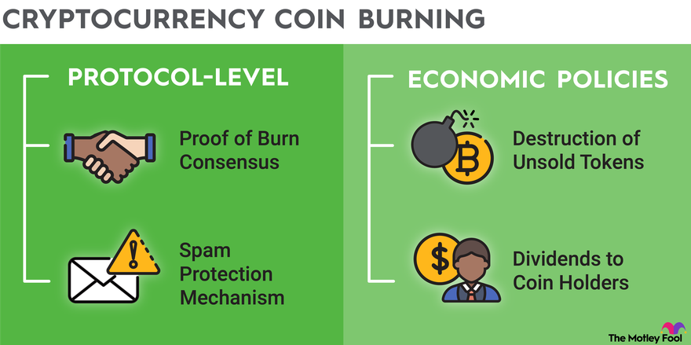

## Table of Contents

## What is cryptocurrency burning?

Cryptocurrency burning is when people take some of the digital money out of circulation permanently. They do this by sending the coins to a special address where no one can use them again. This can make the remaining coins more valuable because there are fewer of them available.

People burn cryptocurrencies for different reasons. Sometimes, it's to control the total supply of the currency, making it more scarce and potentially increasing its value. Other times, it's part of a project's rules, like when a company burns a portion of transaction fees to keep the system running smoothly. Burning can also be used to show commitment to a project, as it removes coins from the market, which can build trust among users.

## Why do projects burn their tokens?

Projects burn their tokens to make them more valuable. When there are fewer tokens available, the ones that are left can become more scarce. This is like when a toy company makes fewer toys; the toys can become more valuable because more people want them than there are toys available. By burning tokens, a project can try to increase the value of the remaining tokens, which can be good for the people who hold them.

Another reason projects burn tokens is to follow the rules they set up. Some projects have rules that say they must burn a certain amount of tokens from transaction fees or other sources. This helps keep the system fair and can make people trust the project more. When a project follows its own rules and burns tokens, it shows that they are serious about managing their token supply and keeping the system running smoothly.

## How does token burning affect the value of a cryptocurrency?

Token burning can make a [cryptocurrency](/wiki/cryptocurrency) more valuable. When a project burns tokens, it takes some of them out of circulation forever. This makes the remaining tokens rarer, kind of like how a rare toy can be worth more money because fewer people have it. If people think the cryptocurrency is going to be more valuable because there are fewer tokens, they might want to buy more of it, which can push the price up.

Burning tokens can also make people trust the project more. When a project follows its own rules and burns tokens, it shows that they are serious about managing their token supply. This can make people feel more confident that the project is being run well. If more people trust the project and want to hold its tokens, this can also help increase the value of the cryptocurrency.

## What are the different methods of token burning?

One way to burn tokens is by sending them to a special address that no one can access. This address is called a "burn address" or "eater address." Once the tokens are sent there, they can't be used again, so they are taken out of circulation forever. This method is common because it's easy to do and everyone can see that the tokens have been burned.

Another method is to use smart contracts. Smart contracts are like automatic agreements on the blockchain that can burn tokens based on certain rules. For example, a project might set up a smart contract that burns a portion of the transaction fees. This way, burning happens automatically without anyone needing to do it manually. It helps keep the system running smoothly and can make people trust the project more.

Sometimes, projects might also burn tokens manually. This means someone from the project team will send the tokens to a burn address on purpose. This can be done to follow the project's rules or to show that they are serious about managing the token supply. When people see that tokens are being burned regularly, it can make them feel more confident about the project's future.

## Can you provide examples of cryptocurrencies that have implemented burning?

One example of a cryptocurrency that uses burning is Binance Coin (BNB). Binance, the company behind BNB, burns tokens regularly to reduce the total supply. They do this by using a portion of their profits to buy back and burn BNB tokens. This makes the remaining BNB tokens more valuable because there are fewer of them available.

Another example is Shiba Inu (SHIB). The team behind SHIB has burned a huge amount of tokens to make them rarer. They sent a big chunk of SHIB to a special address where no one can use them again. This burning helps increase the value of the SHIB tokens that are still around.

Tron (TRX) is another cryptocurrency that has used burning. The Tron network burns a portion of the transaction fees to keep the system running smoothly. By burning these fees, Tron aims to control the supply of TRX and potentially increase its value over time.

## What is the impact of token burning on the circulating supply?

Token burning reduces the circulating supply of a cryptocurrency. When tokens are burned, they are sent to a special address where no one can use them again. This means there are fewer tokens available for people to buy, sell, or trade. By taking tokens out of circulation, burning makes the remaining tokens more scarce.

When the circulating supply goes down, it can make the value of the cryptocurrency go up. If people think the tokens are going to be more valuable because there are fewer of them, they might want to buy more. This increased demand can push the price up. So, burning tokens is a way for projects to try to increase the value of their cryptocurrency by making it rarer.

## How is token burning different from token buybacks?

Token burning and token buybacks are two different ways that projects try to make their cryptocurrency more valuable. When a project burns tokens, it sends them to a special address where no one can use them again. This means the tokens are taken out of circulation forever, making the remaining tokens rarer. Burning is like throwing away a toy so that fewer people have it, which can make the toy more valuable.

Token buybacks, on the other hand, happen when a project uses money to buy its own tokens from people who are selling them. The project then holds onto these tokens, which means they are still in circulation but not being used. Buybacks can also make the cryptocurrency more valuable because there are fewer tokens available for people to buy. But unlike burning, the tokens can still be used again if the project decides to sell them later. So, burning takes tokens out of circulation for good, while buybacks just take them out of circulation temporarily.

## What are the potential risks associated with token burning?

One risk of token burning is that it might not always make the cryptocurrency more valuable. Even though burning can make tokens rarer, if people don't think the project is good or if there are other problems, the price might not go up. Sometimes, burning too many tokens too quickly can scare people and make them think the project is in trouble, which can make the price go down instead.

Another risk is that burning can be used to trick people. Some projects might burn tokens to make it look like they are doing something good for the cryptocurrency, but they might not have a real plan to make the project better. If people find out that the burning is just a trick, they might lose trust in the project, and the value of the cryptocurrency could drop.

## How can token burning be used as a mechanism for deflation?

Token burning can be used as a way to make a cryptocurrency deflationary. Deflation means that the value of the cryptocurrency can go up over time because there are fewer tokens available. When a project burns tokens, it takes them out of circulation forever. This makes the remaining tokens rarer, kind of like how a rare toy can be worth more money because fewer people have it. By burning tokens regularly, a project can control the total supply and try to make the cryptocurrency more valuable.

However, token burning is not always guaranteed to make a cryptocurrency deflationary. It depends on how people see the project and if they think the burning is a good thing. If people don't trust the project or if the burning is done in a way that looks like a trick, it might not work. But if burning is done well and people believe in the project, it can help make the cryptocurrency deflationary by making the tokens more scarce and potentially more valuable.

## What role does token burning play in decentralized finance (DeFi) applications?

Token burning plays an important role in decentralized finance (DeFi) applications by helping to manage the supply of tokens and potentially increase their value. In DeFi, tokens are often used for things like lending, borrowing, and trading. When a DeFi project burns tokens, it takes some of them out of circulation forever. This makes the remaining tokens rarer, which can make them more valuable if people want them more. By burning tokens, DeFi projects can try to keep the value of their tokens stable or even make them go up over time.

Another way token burning helps in DeFi is by building trust among users. When a DeFi project follows its own rules and burns tokens regularly, it shows that they are serious about managing their token supply and keeping the system fair. This can make people feel more confident that the project is being run well. If more people trust the project and want to use its tokens, this can also help increase the value of the cryptocurrency and make the DeFi application more popular.

## How do regulatory frameworks address token burning practices?

Regulatory frameworks are still figuring out how to handle token burning. Some countries see it as a way to control the supply of cryptocurrencies, but they want to make sure it's not used to trick people. Regulators want to know if burning is done fairly and if it follows the rules set by the project. They might ask for clear reports on how and why tokens are burned so they can check if everything is above board.

In some places, regulators might look at token burning as part of bigger rules about how cryptocurrencies are managed. They might want to make sure that burning doesn't hurt people who own the tokens or make the market unfair. If a project burns tokens in a way that seems shady, regulators might step in to protect investors and keep the market honest. So, while token burning can be a good thing for a project, it has to be done in a way that follows the law and treats everyone fairly.

## What advanced strategies can be employed to optimize the effects of token burning?

One advanced strategy to make token burning work better is to burn tokens based on how much the cryptocurrency is being used. For example, a project could burn a small part of the fees from every transaction. This way, the more people use the cryptocurrency, the more tokens get burned. This can make people want to use the cryptocurrency more because they know it will become rarer and maybe more valuable. It also helps keep the burning fair and transparent because everyone can see how it's being done.

Another strategy is to time the burning carefully. Instead of burning tokens all at once, a project could burn them little by little over time. This can help keep the value of the cryptocurrency steady and avoid big changes in the price. By spreading out the burning, a project can make sure that the market stays calm and people keep trusting the cryptocurrency. This way, burning can be a steady part of making the cryptocurrency more valuable without causing too much excitement or worry.

## What are the frequently asked questions?

### FAQs

**What does it mean to burn crypto?**  
Crypto burning involves permanently removing coins from the available circulating supply. This process is typically achieved by sending tokens to a designated burner address, which is an inaccessible wallet address with no private keys. Once sent, these tokens become irretrievable, effectively 'burning' them.

**How does coin burning affect the price?**  
Coin burning can impact price by altering the supply-demand dynamics of a cryptocurrency. By reducing the total supply, the scarcity of the tokens increases, potentially leading to a rise in their value if demand remains constant or increases. This can be mathematically represented through the formula of supply and demand equilibrium, where a decrease in supply with constant demand generally results in increased prices:

$$
P = \frac{D}{S}
$$

Where $P$ is the price, $D$ is demand, and $S$ is supply. 

**Is crypto burning similar to stock buybacks?**  
Crypto burning is somewhat analogous to stock buybacks in traditional finance, where a company repurchases its shares from the market to reduce the number of outstanding shares. Both strategies aim to increase the value of the remaining assets held by investors through scarcity. However, unlike stock buybacks, which may pose [liquidity](/wiki/liquidity-risk-premium) issues, burned cryptocurrencies cannot be recovered or reused, making the reduction permanent.

**What are the advantages and risks associated with crypto burning?**  
Advantages of crypto burning include potentially increasing the value of tokens by reducing their supply, signaling commitment to investors by project developers, and helping maintain the value of stablecoins. Conversely, risks involve the potential for manipulative practices if burning strategies are not transparent. Additionally, burning does not guarantee an increase in price, as market conditions can saturate or fluctuate unpredictable any external factors.

**How do algorithmic systems utilize information from crypto burning events?**  
Algorithmic trading systems leverage real-time data, including burning events, to adjust trading strategies and optimize performance. When significant burning events impact supply, algorithms might alter their approaches to seize potential [volatility](/wiki/volatility-trading-strategies) in the market. A simple Python snippet that could be used in an [algorithmic trading](/wiki/algorithmic-trading) system to react to burning events might look like this:

```python
def adjust_strategy_on_burn(event_data):
    if event_data['type'] == 'burn':
        token_supply = event_data['new_supply']
        market_conditions = assess_market_conditions()
        if market_conditions == 'favorable':
            # Adjust strategy favorably
            increase_buying_pressure(token_supply)
        else:
            # Decrease exposure
            reduce_risk(token_supply)

def assess_market_conditions():
    # Placeholder function to evaluate market conditions
    # Returns 'favorable' or 'unfavorable' based on analysis
    pass
```

These systems adapt by reevaluating supply metrics and responding to changing market conditions to maximize trading efficiencies.

## References & Further Reading

[1]: Bergstra, J., Bardenet, R., Bengio, Y., & Kégl, B. (2011). ["Algorithms for Hyper-Parameter Optimization."](https://dl.acm.org/doi/10.5555/2986459.2986743) Advances in Neural Information Processing Systems 24.

[2]: ["Advances in Financial Machine Learning"](https://www.amazon.com/Advances-Financial-Machine-Learning-Marcos/dp/1119482089) by Marcos Lopez de Prado

[3]: ["Evidence-Based Technical Analysis: Applying the Scientific Method and Statistical Inference to Trading Signals"](https://www.amazon.com/Evidence-Based-Technical-Analysis-Scientific-Statistical/dp/0470008741) by David Aronson

[4]: ["Machine Learning for Algorithmic Trading"](https://github.com/PacktPublishing/Machine-Learning-for-Algorithmic-Trading-Second-Edition) by Stefan Jansen

[5]: ["Quantitative Trading: How to Build Your Own Algorithmic Trading Business"](https://books.google.com/books/about/Quantitative_Trading.html?id=j70yEAAAQBAJ) by Ernest P. Chan