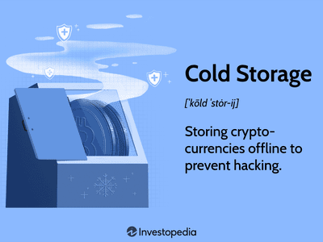

In the rapidly evolving landscape of digital finance, securing cryptocurrency assets has become an essential consideration for both individual investors and institutional market participants. Unlike traditional currencies, cryptocurrencies exist entirely in digital form, which makes them susceptible to a range of cyber threats including hacking and theft. The decentralized nature of cryptocurrencies, while providing autonomy and freedom from centralized control, also imposes the responsibility of security entirely on the holder, necessitating secure storage solutions.

Cold storage emerges as a preferred method for safeguarding digital assets. This approach involves keeping the private keys required to access cryptocurrency funds offline and away from a networked environment. By being disconnected from the internet, cold storage methods inherently protect against online threats, providing an essential layer of security that is crucial given the increasing sophistication of cyber-attacks targeting digital currencies.



Balancing security with accessibility is a critical consideration in crypto storage. While cold storage provides enhanced security, it often requires trade-offs in terms of accessibility and convenience, particularly for users who may need frequent access to their funds. This trade-off becomes particularly relevant in the context of algorithmic trading, commonly known as algo trading. Algorithmic trading relies on executing trades at speeds and frequencies that are impossible for human traders. As such, having a rapid access to funds is crucial. However, managing the juxtaposition of accessibility for trading while maintaining robust security for storage necessitates thoughtful integration of secure storage practices, even within automated trading strategies. This balance ensures that while the rapid market demands of algorithmic trading are met, the security of stored assets is never compromised.

## Table of Contents

## What is Cryptocurrency Cold Storage?

Cryptocurrency cold storage is a method that involves keeping cryptocurrency private keys completely offline, effectively disconnecting them from any network. This means the keys are stored in environments where they are protected from unauthorized access, cyber threats, and potential online hacks. Cold storage is widely adopted in the cryptocurrency community due to its inherent security advantages over other forms of storage.

The primary purpose of cold storage is to safeguard digital assets from online threats. In a landscape filled with cyber-attacks, phishing, and malware, keeping cryptocurrency offline ensures that such risks are significantly mitigated. By not being connected to the internet, cold storage solutions eliminate vulnerabilities typically exploited in hot storage environments (where keys are stored on internet-connected devices).

Comparatively, hot storage offers greater accessibility since funds can be easily transferred and traded. However, this convenience comes with increased exposure to security risks. Hot storage involves the use of wallets connected to the internet, whether on computers, smartphones, or other devices, making them susceptible to hacking and unauthorized access. While hot storage is advantageous for frequent transactions and rapid access, it does not provide the same level of security as cold storage. In contrast, cold storage is favored for long-term holding, emphasizing security over convenience.

Cold storage is considered an exceptionally secure method for storing [cryptocurrency](/wiki/cryptocurrency) primarily due to its offline nature. This creates a barrier ("air-gap") that is difficult for cyber attackers to penetrate. By ensuring that private keys and sensitive data never touch an online system, cold storage methods prevent exposure to a wide array of online threats. For individuals and institutions looking to protect large amounts of cryptocurrency, cold storage is an indispensable tool in digital asset security.

## Understanding How Cold Storage Works

Cold storage is a method of safeguarding cryptocurrency by storing private keys offline, thereby protecting them from online threats such as hacking, phishing, and other cyber-attacks. The fundamental functionality of cold storage is its disconnection from any network, providing an inherent immunity to online attacks. This distinct characteristic makes it an exceptionally secure solution for storing cryptocurrencies compared to online or "hot" storage methods, which are constantly connected to the internet and, thus, more vulnerable to breaches.

There are several types of cold storage, each catering to different security needs and preferences. Paper wallets are one of the simplest forms, consisting of a printed piece of paper containing the public and private keys. This method is inexpensive and easy to generate but requires careful handling to avoid physical damage or loss.

Hardware wallets, such as those manufactured by Ledger and Trezor, are specialized devices similar to USB drives that store private keys offline. They often include additional security features like PIN protection and two-[factor](/wiki/factor-investing) authentication. The portability and enhanced security layers of hardware wallets make them a popular choice among crypto enthusiasts.

Sound wallets represent a less conventional method, involving the encoding of private keys into sound files or QR codes that can be stored on various physical media. This approach is relatively novel and can serve as a robust backup technique, albeit not as widely adopted as paper or hardware wallets.

Another variant is deep cold storage, which implements additional security protocols and often involves storing keys in geographically isolated and secure locations. This method prioritizes security over accessibility and is suitable for substantial, long-term investments where immediate access to funds is not a necessity.

The benefits of cold storage over online storage are significant, especially for long-term investors. By keeping private keys offline, users are protected from potential cyber threats that target hot wallets. This security is particularly crucial for those who plan to hold onto their investments for extended periods.

Air-gapped devices, those that never connect to the internet, play a crucial role in maintaining cold storage security. Such devices, whether they are computers or hardware wallets, can generate and store private keys without ever being exposed to an online environment. This complete disconnection from the network minimizes the risk of software vulnerabilities being exploited by malicious actors.

Overall, understanding how cold storage works and its various implementations allow cryptocurrency holders to make informed decisions about protecting their digital assets while ensuring that their investment strategies align with their security needs.

## Popular Cold Storage Methods for Cryptocurrency

Cryptocurrency cold storage methods serve as important solutions to securely store digital assets offline, minimizing exposure to online threats. Each method has its assets and limitations, catering to varying needs and preferences of crypto holders. Here’s a closer examination of popular cold storage methods:

### Paper Wallets
Paper wallets involve the physical printout of private and public keys, usually generated using dedicated software or websites that can safely produce keys offline. Once printed, these wallets should never be stored digitally to minimize the risk of unauthorized access. A paper wallet offers a high level of security since it is completely offline, but it requires diligent efforts to protect the physical document against loss, damage, or theft. Effective security measures include laminating the paper wallet for durability and storing it in a safe or another secure location. Secure backup and the use of QR codes enhance this method’s usability.

### Hardware Wallets
Hardware wallets, like Trezor and Ledger, provide a sophisticated way of storing cryptocurrencies offline. These are physical devices akin to USB drives, specifically designed to hold private keys securely. They connect to a computer or smartphone only to sign transactions, keeping the private keys isolated even in the presence of malware. Although hardware wallets purchase might incur initial costs, they are favored for their user-friendly interface and robust security features. Regular firmware updates ensure they remain resilient against emerging security threats. Keeping the recovery seed phrase secure is crucial, as it enables wallet recovery if the device is lost or damaged.

### Sound Wallets
Sound wallets represent an innovative approach by recording cryptographic keys in an audio format. Using sound as a storage medium, these wallets leverage techniques such as steganography or audibly encrypted sequences. The novelty lies in transforming digital data to analog, which can be stored on vinyl records or compact discs. While this method of storage isn't widely used, it offers a unique set of challenges and benefits. It is resistant to conventional digital theft methods but requires specialized knowledge to securely encode and decode the data. Having a reliable and secure backup of the audio file is essential for recovery purposes.

### Deep Cold Storage
Deep cold storage refers to extremely secure storage methods that drastically reduce the ease of retrieving cryptocurrency assets. Techniques under this category often involve geographically dispersed secure vaults, which store keys in environments that are difficult to access. Deep cold storage is ideal for long-term holders of significant cryptocurrency amounts who forego immediate access in favor of unbeatable security. It might involve the utilization of multisignature wallets, requiring multiple approvals before executing a transaction, further enhancing security at the potential cost of rapid access. Users must plan retrieval strategies appropriately to ensure they can access their funds when needed, possibly using trusted intermediaries under certain conditions.

Each of these cold storage methods caters to different levels of security demands and convenience preferences, empowering cryptocurrency holders to safeguard their assets effectively against evolving threats.

## Benefits of Using Cold Storage for Crypto Security

Cold storage solutions offer enhanced security for cryptocurrency holders by remaining offline, thereby isolating digital assets from potential online threats and hacks. This feature is particularly beneficial for securing private keys, which are essential for accessing and managing cryptocurrencies. By keeping these keys offline, the risk of unauthorized access and cyber-attacks is significantly reduced. 

For long-term holders, cold storage methods serve as an ideal means of safeguarding assets from the [volatility](/wiki/volatility-trading-strategies) and risks associated with online storage. Unlike hot wallets, which are connected to the internet and susceptible to various threats, cold storage provides a more stable and secure environment for storing digital assets over extended periods. This ensures that investors can hold onto their assets without constant exposure to online vulnerabilities.

Control over private keys is a crucial aspect of cryptocurrency management, dictating ownership and access. Cold storage solutions empower users by granting complete control over their private keys, thereby eliminating potential reliance on third-party services. This autonomy ensures that users maintain absolute ownership of their digital assets, without entrusting sensitive information to external entities that may pose security risks.

Additionally, reduced dependency on third-party services is another significant advantage of using cold storage. By managing their own keys and storage solutions, users ensure total ownership and eliminate the need to rely on potentially insecure third-party platforms. This self-reliance not only enhances security but also aligns with the decentralized ethos of cryptocurrency, where individual ownership and control are paramount.

In summary, cold storage offers robust protection against cyber threats, ensures consistent asset security for long-term holders, provides total control over private keys, and promotes independence from third-party services. These benefits collectively make cold storage a preferred choice for individuals seeking secure and reliable cryptocurrency storage solutions.

## Potential Drawbacks of Cold Storage

Cold storage, while a highly secure method for safeguarding cryptocurrency, presents several challenges that users must navigate. One of the primary drawbacks is the inconvenience in accessing funds compared to hot wallets. Cold storage requires physical access to the storage media, which necessitates additional steps to retrieve and utilize the stored cryptocurrency. This contrasts sharply with hot wallets, where funds can be accessed instantly via internet-connected devices, making cold storage less practical for frequent transactions.

Another significant concern involves the risks associated with physical damage or loss of storage media. Cold storage often relies on tangible objects like hardware wallets or paper wallets, which are susceptible to physical harm. Damage from environmental factors, such as water or fire, can lead to the irretrievable loss of stored assets. Similarly, misplacing or losing the storage medium equates to losing access to the cryptocurrency unless secure backups exist.

The necessity for secure backup of private keys and retrieval methods is crucial in mitigating these risks. Establishing a reliable backup solution ensures that private keys, which are critical in accessing the stored cryptocurrency, remain safeguarded against loss or damage. However, the process of creating and managing such backups introduces additional complexities and requires meticulous attention to detail to maintain security.

Physical security risks are also a concern if unauthorized persons gain access to the storage media. The reliance on physical devices means that should these devices fall into the wrong hands, the stored cryptocurrency could be compromised. Users must therefore implement robust physical security measures to prevent unauthorized access, including safe storage locations and employing encryption or multi-signature schemes for enhanced protection.

Overall, while cold storage offers a high level of security for cryptocurrency, these potential drawbacks emphasize the importance of careful management and strategic planning to protect digital assets effectively.

## Algo Trading and the Importance of Secure Storage

Algorithmic trading, or algo trading, is a form of trading that utilizes computer algorithms to execute trades automatically. These algorithms can process vast amounts of data and execute trades at speeds far beyond human capability. The efficiency and success of algo trading rely heavily on the ability to access funds rapidly, as trading opportunities can arise and vanish within milliseconds. Therefore, ensuring that digital assets are both secure and accessible is critical for traders who engage in this practice.

The challenge in algo trading lies in balancing the need for quick access to funds with the necessity of secure storage. Cryptocurrency assets, due to their intangible nature, are susceptible to cyber threats, necessitating stringent security measures. However, while top-tier security is a priority, it must not impede the swift transfer of funds that algo trading demands. This creates a complex interplay between security protocols and trading efficiency.

Cold storage, traditionally favored for its robust security, faces scrutiny in the context of algo trading due to its limited accessibility. Storing cryptocurrency offline significantly reduces exposure to online threats but can slow down the access required for timely trades. Yet, innovative integrations of cold storage with algo trading solutions can offer a compromise. For instance, traders may employ a hybrid approach, using hot wallets for trading funds that require immediate access while keeping the majority of their portfolio secure in cold storage. This method involves regularly transferring small amounts from cold to hot storage, ensuring that only a minimal portion of the asset is exposed to the network at any given time.

Advanced trading strategies can also benefit from a secure framework by using smart contracts and multi-layered security methods. Smart contracts can be configured to maintain critical elements of a trading strategy, ensuring that funds are only transferred when predefined conditions are met. Moreover, these contracts can be stored securely offline until required by the trading system.

For further integration, secure storage solutions are now being designed with features conducive to algo trading. Some hardware wallets, for example, are beginning to include functionalities that allow them to connect securely to exchanges or trading platforms only during the execution of trades, reducing the chance of exposure but maintaining the capability for rapid fund transfer.

In implementing these strategies, traders can leverage both the security benefits of cold storage and the operational demands of algo trading. Creating this balance is crucial to safeguarding digital assets while optimizing trading performance. The evolving landscape of secure storage options and their adaptability to trading needs reflects the continuous advancements in the cryptocurrency domain.

## Best Practices for Maintaining Cold Storage Security

To maintain the security of cryptocurrency cold storage, several best practices must be followed to ensure that digital assets remain protected from potential threats. Regularly updating hardware is crucial for defending against vulnerabilities that could compromise the storage's integrity. This involves ensuring that any hardware wallet or device firmware is kept up-to-date with the latest security patches and features. Manufacturers often release updates to resolve identified security issues, and neglecting these updates may expose the devices to risks that could otherwise be mitigated.

Using secure methods for generating and storing cryptographic keys is another critical aspect. The process begins with the random generation of keys. Utilizing hardware random number generators or tools like Python's `secrets` module can help ensure that the keys generated are secure and unpredictable. For example:

```python
import secrets

# Generate a secure random private key (256-bit)
private_key = secrets.token_hex(32)
print("Secure private key:", private_key)
```

Once generated, storing keys requires careful consideration to prevent unauthorized access. Cold storage options such as hardware wallets inherently provide offline methods to keep keys secure. However, ensuring that physical access is restricted is equally important.

Implementing multi-layered security measures, such as encryption and multi-signature schemes, further enhances protection. Encryption adds a critical layer of defense by encoding stored keys such that they can only be decoded by authorized parties with the correct decryption key. Multi-signature technology increases security by requiring multiple keys from different parties to authorize a transaction. This not only prevents unilateral control but also provides an additional safeguard against fraud and theft.

By adhering to these best practices, cold storage users can significantly bolster the security of their cryptocurrency holdings, protecting against both technical vulnerabilities and potential physical threats.

## Conclusion

Cold storage remains a pivotal element in securing cryptocurrency assets, offering robust protection against the multitude of online threats prevalent in the digital landscape. By keeping private keys offline, cold storage significantly reduces the risk of unauthorized access and cyber attacks, thereby ensuring a higher degree of security for investors and crypto holders.

The necessity of vigilance and stringent security protocols in digital asset management cannot be overstated. With the continuous advancement of hacking techniques and cyber threats, crypto holders must continually evaluate and update their security measures, maintaining a proactive approach to safeguarding their investments. This vigilance is crucial in preventing potential breaches that could lead to significant financial losses.

Furthermore, it is essential for crypto traders and investors to align their storage solutions with their trading strategies. Different strategies may require varying levels of accessibility and security; thus, a thorough assessment of one's storage needs is imperative. For long-term holders focused on security, more extensive measures like deep cold storage may be beneficial. Conversely, traders engaging in [algorithmic trading](/wiki/algorithmic-trading) will need to find a balance, ensuring rapid access while maintaining sufficient security.

Ultimately, the choice of storage should cater to individual requirements, balancing security with convenience while recognizing the inherent risks associated with digital currency management.

## References & Further Reading

[1]: Nakamoto, Satoshi. (2008). ["Bitcoin: A Peer-to-Peer Electronic Cash System."](https://nakamotoinstitute.org/library/bitcoin/)

[2]: Antonopoulos, Andreas M. (2014). ["Mastering Bitcoin: Unlocking Digital Cryptocurrencies."](https://books.google.com/books/about/Mastering_Bitcoin.html?id=IXmrBQAAQBAJ)

[3]: Kaspersky Lab. (2017). ["Virtual Risks: The Growing Threat of Cryptocurrency Wallet Hacks."](https://media.kasperskycontenthub.com/wp-content/uploads/sites/43/2018/03/07162608/Kaspersky_Lab_financial_cyberthreats_in_2017.pdf)

[4]: Ledger and Trezor Products. (n.d.). ["Official Website of Ledger and Trezor Hardware Wallets."](https://trezor.io/) / [https://trezor.io](https://trezor.io/)

[5]: Lopez de Prado, Marcos. (2018). ["Advances in Financial Machine Learning."](https://www.amazon.com/Advances-Financial-Machine-Learning-Marcos/dp/1119482089)