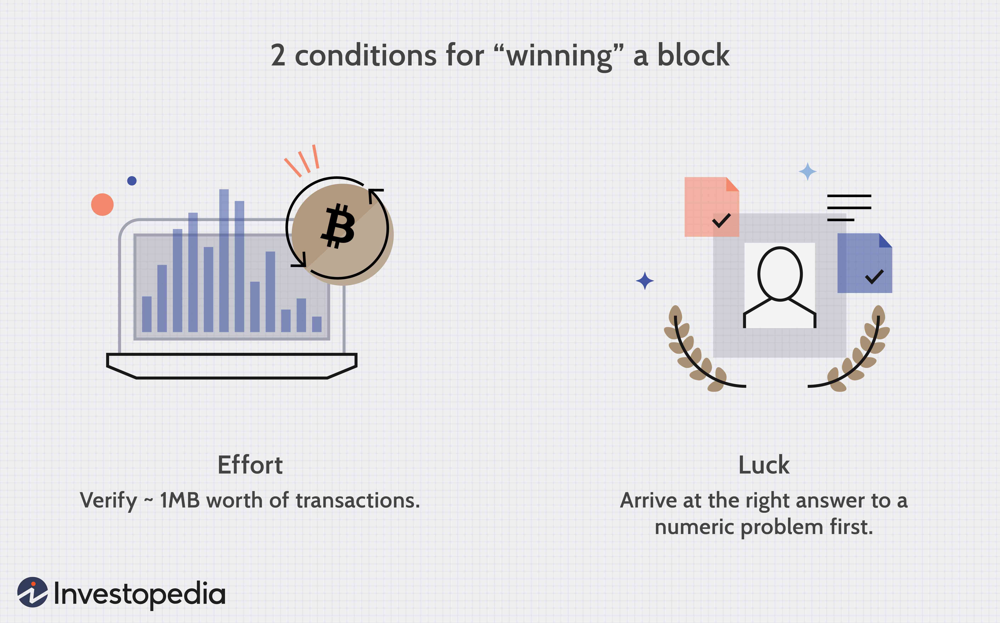

Blockchain technology and digital currencies have fundamentally transformed the financial landscape, introducing new paradigms that challenge traditional systems. The emergence of cryptocurrencies such as Bitcoin and Ethereum represents a significant shift toward decentralized financial models, which depart from conventional banking and monetary systems. These digital assets have not only disrupted how transactions are conducted but have also catalyzed the development of algorithmic trading within the crypto market.

Algorithmic trading, or algo trading, utilizes computer algorithms to execute trades at speeds and frequencies that are impossible for human traders. This method has gained traction across various financial markets, including cryptocurrencies, where it leverages the high volatility and liquidity inherent to these digital assets. Through complex algorithms, traders and firms can capitalize on minute price discrepancies and trends that occur within fractions of a second.



The integration of blockchain, digital currencies, and algorithmic trading marks a confluence of technologies that collectively enhance the trading experience and efficiency. Blockchain, a decentralized digital ledger, ensures transparency, security, and immutability of transactions, thereby fostering trust in digital currency systems. Meanwhile, digital currencies, predominantly cryptocurrencies, serve as the medium of transactions in this decentralized ecosystem, enabling frictionless and borderless financial activities.

This article seeks to explore the dynamic interactions between blockchain technology, digital currencies, cryptocurrencies, and algorithmic trading. By examining how these components function individually and in concert, we gain insight into the potential innovations they may bring to traders and investors. The rapid evolution of these technologies suggests a promising future where traditional barriers in finance are continuously challenged and redefined.

To fully appreciate this modern financial revolution, understanding the fundamentals of blockchain and digital currency is essential, as they form the core upon which the current and future landscapes of trading and investment are being built.

## Table of Contents

## Understanding Blockchain and Digital Currency

Blockchain technology has emerged as a transformative force in the digital landscape, functioning as a decentralized digital ledger that meticulously records transactions across a network of computers. This decentralized nature is vital as it ensures the immutability and transparency of transactional data, a cornerstone feature that underpins the security of blockchain systems. Each block within a blockchain contains a cryptographic hash of the previous block, a timestamp, and transaction data, forming a chain, with each additional block reinforcing the verifiability of the entire sequence.

Cryptocurrencies are inherently dependent on blockchain technology to operate, with the blockchain serving as the backbone that facilitates secure and transparent transactions. The infrastructure provided by blockchain allows for the elimination of intermediaries, thereby fostering a peer-to-peer network where digital currency transactions can occur without the need for central authority oversight. This aspect is crucial in understanding the foundational disparity blockchain introduces when compared to traditional digital currency systems reliant on centralized control.

Digital currency is an umbrella term encompassing any form of currency available solely in a digital format. Unlike physical currencies, digital currencies exist only in electronic form and can be transacted electronically. Within the sphere of digital currencies, cryptocurrencies represent a distinct category characterized by the employment of cryptographic methods to secure transactions and to regulate the creation of new units. The decentralized control inherent to cryptocurrencies is achieved through blockchain technology, which allows them to operate independently of central banks or government entities.

The fundamental support that blockchain provides to digital currencies can be best understood through its decentralized ledger system, which ensures every transaction is publicly recorded and validated by network participants. This decentralized framework minimizes the risk of fraud or double-spending because each transaction must be agreed upon by the majority of network nodes before it is added to the chain. This process, known as consensus, is integral to maintaining the integrity and security of the blockchain.

Moreover, the transparency offered by blockchain technology enables users to track and verify transactions easily, fostering trust within the network. This transparency is particularly relevant in an era where digital interactions are increasingly scrutinized for security concerns. The deployment of blockchain ensures that transaction records are available for audit while remaining tamper-proof.

In summary, blockchain technology is pivotal in supporting digital currencies by providing a secure, transparent, and decentralized environment for transactions. Cryptocurrencies, as a subset of digital currencies, are uniquely positioned to leverage the benefits of blockchain, offering a robust alternative to traditional currency systems. This paradigm shift facilitated by blockchain is reshaping the way transactions are recorded, verified, and secured in the digital economy.

## Cryptocurrency: What You Need to Know

Cryptocurrencies represent a paradigm shift in the concept of money, emerging as digital or virtual currencies that utilize cryptographic methods to ensure secure transactions. The inception of this technology can be traced back to Bitcoin, introduced in 2009 by an anonymous individual or group known as Satoshi Nakamoto. Bitcoin stands as the pioneering decentralized [cryptocurrency](/wiki/cryptocurrency), designed to operate without the need for a central authority, governed instead by a distributed network of nodes utilizing blockchain technology.

Bitcoin's implementation offered a proof-of-concept for what cryptocurrencies could achieve, providing foundational aspects like decentralization, pseudo-anonymity, and immutability. It operates on a consensus mechanism known as Proof of Work (PoW), where miners solve complex mathematical problems to validate transactions and secure the network.

Beyond Bitcoin, several other cryptocurrencies have gained substantial traction due to their unique features and use cases:

1. **Ethereum (ETH):** Launched in 2015 by Vitalik Buterin, Ethereum introduced the concept of smart contracts. These are self-executing contracts with terms directly written into lines of code, enabling automatic and trustless transactions without intermediaries. Ethereum's blockchain serves as a platform for numerous decentralized applications (dApps) and has been instrumental in the burgeoning field of Decentralized Finance (DeFi).

2. **Ripple (XRP):** Unlike most cryptocurrencies, Ripple is designed primarily for facilitating fast and cost-effective cross-border payments. It fundamentally differs in its consensus protocol, the Ripple Protocol Consensus Algorithm (RPCA), allowing for quicker transaction times without relying on energy-intensive mining processes.

3. **Litecoin (LTC):** Created by Charlie Lee in 2011, Litecoin is often considered the silver to Bitcoin's gold. It was developed to provide faster transaction times, utilizing a different hashing algorithm, Scrypt, which enables more accessible, albeit slightly less secure, mining processes.

Cryptocurrencies function over decentralized networks established on blockchain technology, a distributed ledger protecting the integrity and chronological order of transactions. Each cryptocurrency has its own unique blockchain or operates on existing ones like Ethereum, supporting diverse applications from simple currency transfers to complex programmable ecosystems.

Use cases of cryptocurrencies extend beyond simple transactions:

- **Store of Value:** Bitcoin is often considered digital gold. It's seen as a hedge against inflation and a store of value, given its limited supply capped at 21 million coins.

- **Smart Contracts and dApps:** Ethereum facilitates the creation of applications that operate autonomously, executing terms set within smart contracts. This functionality is the backbone of platforms like DeFi and NFTs (Non-Fungible Tokens).

- **Remittances and Payments:** Given their global reach and lower fees compared to traditional financial systems, cryptocurrencies like Ripple are utilized for international payments and remittances.

- **Privacy and Anonymity:** Some cryptocurrencies like Monero and Zcash emphasize enhanced privacy, employing cryptographic techniques to obscure transaction details.

As cryptocurrencies continue evolving, so do their potential applications and implications in the financial ecosystem, making them a significant area of interest for technology enthusiasts, investors, and regulators alike.

## The Essentials of Algo Trading

Algorithmic trading, known as algo trading, utilizes computer programs to perform trading operations with unmatched speed and precision. These algorithms automatically execute buy or sell orders in financial markets by following specific, pre-set criteria, thereby eliminating much of the emotion-driven decision-making inherent to human trading. Traditionally, algo trading has been a staple in conventional financial markets including stocks, bonds, and foreign exchange. However, it is increasingly becoming integral in cryptocurrency markets due to their unique characteristics and 24/7 availability.

**The Rise of Algo Trading in Cryptocurrency Markets:**
Algo trading is gaining popularity in the cryptocurrency domain for several reasons. First, the high [volatility](/wiki/volatility-trading-strategies) of cryptocurrencies presents ample opportunities for traders to exploit price movements efficiently. Additionally, the round-the-clock nature of cryptocurrency markets necessitates the use of automated trading to monitor and leverage trades without the constraints of human traders' availability. This capability makes algo trading an enticing option for both individual and institutional investors.

**Benefits of Algo Trading:**
The primary advantages of [algorithmic trading](/wiki/algorithmic-trading) include enhanced speed, efficiency, and accuracy in trade execution. Algorithms can analyze massive volumes of data at exceptionally high speeds, allowing traders to identify and exploit market inefficiencies that would be impossible for human traders to detect in real-time. Furthermore, algorithmic systems are designed to reduce the impact of human emotions on trading decisions, which is crucial in a highly volatile market like cryptocurrencies. 

**Application in Cryptocurrencies:**
In the cryptocurrency market, algorithms are developed to handle a range of trading strategies such as [arbitrage](/wiki/arbitrage), [market making](/wiki/market-making), and [trend following](/wiki/trend-following). For instance, arbitrage algorithms detect price discrepancies between different exchanges and execute trades to capitalize on these differences profitably. Market-making algorithms place both buy and sell orders to profit from the spread, the difference between the bid and ask price. Trend-following algorithms analyze historical data to predict future price trends and initiate trades accordingly. These strategies are implemented using sophisticated math models that quantify the trading signals and risks, often requiring an element of [machine learning](/wiki/machine-learning) or AI for continuous adaptation to changing market conditions.

Python code example for a simple moving average crossover strategy could look like this:

```python
import pandas as pd
import numpy as np

# Load historical cryptocurrency data
data = pd.read_csv('crypto_data.csv')

# Calculate short-term and long-term moving averages
short_window = 40
long_window = 100

data['short_mavg'] = data['Close'].rolling(window=short_window, min_periods=1).mean()
data['long_mavg'] = data['Close'].rolling(window=long_window, min_periods=1).mean()

# Generate trading signals
data['signal'] = 0
data['signal'][short_window:] = np.where(data['short_mavg'][short_window:] 
                                        > data['long_mavg'][short_window:], 1, 0)   

# Create positions
data['positions'] = data['signal'].diff()

print(data[['Date', 'short_mavg', 'long_mavg', 'signal', 'positions']].head())
```

In this example, the algorithm executes trades when the short-term moving average crosses above or below the long-term moving average, signaling potential buying or selling opportunities respectively. 

Given the increasing sophistication of trading algorithms and improvements in computational power, the role of algo trading in cryptocurrency markets is set to expand, offering innovative solutions for harnessing the potential of these dynamic markets.

## How Algo Trading Enhances Cryptocurrency Trading

Algorithmic trading, also known as algo trading, has emerged as a transformative force in cryptocurrency markets, thanks to its ability to analyze vast pools of data and execute trades at lightning speed. Cryptocurrencies, by their nature, present a unique environment characterized by high volatility and 24/7 market access, making them ideal for algorithmic trading strategies. The main objective of algo trading in this context is to exploit market inefficiencies and respond deftly to market conditions, often producing consistent returns that manual trading might not achieve.

**Exploiting Market Inefficiencies**

Cryptocurrency markets, while maturing, remain rife with inefficiencies. These can stem from differing prices across multiple exchanges or swift price movements following news releases. Algorithmic trading strategies, such as arbitrage, enable traders to capitalize on these price discrepancies. For instance, if Bitcoin is priced differently on two exchanges, an arbitrage algorithm will buy on the cheaper exchange and sell on the more expensive one, thereby locking in a risk-free profit.

**Swift Response to Market Conditions**

The volatile nature of cryptocurrencies necessitates rapid reaction to market changes, which algo trading provides through predefined conditions coded into trading programs. These conditions are based on technical indicators like moving averages, relative strength indexes (RSI), and other metrics. For example, a simplistic moving average crossover strategy may dictate buying a cryptocurrency when the short-term moving average crosses above the long-term moving average, indicating upward [momentum](/wiki/momentum).

In Python, such a strategy could be implemented using the following snippet:

```python
def moving_average_strategy(prices, short_window=40, long_window=100):
    short_mavg = prices.rolling(window=short_window).mean()
    long_mavg = prices.rolling(window=long_window).mean()
    signals = pd.DataFrame(index=prices.index)
    signals['signal'] = 0.0
    signals['signal'][short_window:] = np.where(short_mavg[short_window:] > long_mavg[short_window:], 1.0, 0.0)
    return signals
```

**Strategies in Algo Trading**

Several algorithmic trading strategies are prevalent in cryptocurrency markets. Apart from arbitrage and moving average strategies, traders also employ market-making and mean-reversion strategies:

1. **Market Making:** Involves placing both buy and sell limit orders around the current market price, profiting from the spread. This strategy benefits from the bid-ask spread and contributes to market liquidity.

2. **Mean Reversion:** Based on the principle that the price of an asset will revert to its mean over time. When a cryptocurrency's price deviates from its historical average, the algorithmic system generates buy or sell signals to capitalize on the anticipated return to the mean.

In summary, algo trading enhances cryptocurrency trading by increasing efficiency and the ability to capture profits in volatile and inefficient markets. Its strategies are designed to respond promptly to shifting market dynamics, providing an edge over traditional trading methods.

## Challenges and Risks in Crypto Algo Trading

Crypto algorithmic trading, while offering efficiencies, faces several challenges, predominantly due to market volatility and security risks. The unpredictable nature of cryptocurrency markets, characterized by rapid price swings, can lead to substantial financial losses for traders using automated systems. Algo trading systems operate on predefined rules and algorithms, which can lead to significant errors during unexpected market conditions. 

For example, a flash crash, a very rapid, deep, and volatile fall in security prices occurring within an extremely short time period, often followed by a swift recovery, is a notable risk. These are often exacerbated by algorithms that fail to account for, or adapt to, abrupt market changes. An example was the Bitcoin flash crash on May 19, 2021, when prices plummeted by more than 30% within a few hours before partially recovering.

Security risks are also inherent in crypto algo trading, where hacking and system vulnerabilities can lead to unauthorized access and manipulation of trading systems. The decentralized nature of digital currencies makes them appealing targets for cybercriminals, and the pseudo-anonymous transactions can obscure the tracing of hacked assets.

Moreover, regulatory frameworks for cryptocurrency and algorithmic trading are often underdeveloped compared to traditional financial markets. This lack of regulation and oversight presents risks, including the potential for market manipulation and insider trading. Different jurisdictions have varying degrees of regulatory readiness, leading to uncertainties that traders must navigate. The absence of standardized regulations can also complicate legal recourse in the event of disputes involving algorithmic trading errors or fraudulent activities.

For investors involved in crypto algo trading, it is essential to meticulously understand these risks. Implementing robust risk management strategies, such as setting stop-loss limits or employing diverse trading algorithms to mitigate the impact of single-point failures, can help manage potential downsides. Additionally, keeping abreast of regulatory changes and security practices can further safeguard against potential pitfalls in the crypto algo trading landscape.

## The Future of Blockchain, Digital Currency, and Algo Trading

As technology advances, the synergy between blockchain, digital currency, and algorithmic trading is expected to intensify, driving transformative changes in the financial sector. Decentralized Finance (DeFi) platforms are at the forefront of this evolution, reshaping traditional financial services by leveraging blockchain's transparency, security, and decentralization. DeFi eliminates intermediaries by enabling peer-to-peer transactions, thus reducing costs and increasing accessibility. The rapid growth of DeFi is evident through various applications, such as lending, borrowing, and yield farming, which are conducted on decentralized platforms like Uniswap and Aave.

Simultaneously, Artificial Intelligence (AI) and Machine Learning (ML) are poised to revolutionize trading algorithms, enhancing their ability to process vast quantities of data and adapt to ever-changing market conditions. These technologies can identify patterns and trends that may not be discernible through traditional analysis, enabling more sophisticated trading strategies and improved decision-making. For instance, AI-driven algorithms can optimize trading strategies in real-time by analyzing historical and current market data to predict price movements and manage risks more effectively.

Python, with libraries such as TensorFlow and scikit-learn, offers powerful tools for developing these advanced trading systems. A simple example of a Python-based approach for predictive modeling in trading might look like this:

```python
import pandas as pd
from sklearn.model_selection import train_test_split
from sklearn.ensemble import RandomForestRegressor

# Load and prepare your dataset
data = pd.read_csv('market_data.csv')
features = data.drop('target_price', axis=1)
target = data['target_price']

# Split the data into training and testing sets
X_train, X_test, y_train, y_test = train_test_split(features, target, test_size=0.2, random_state=42)

# Initialize and train the model
model = RandomForestRegressor(n_estimators=100, random_state=42)
model.fit(X_train, y_train)

# Evaluate the model
print(f"Model Accuracy: {model.score(X_test, y_test)}")
```

The future of blockchain, digital currency, and algo trading also faces challenges, particularly regarding regulation and security. As these technologies evolve, regulatory frameworks must adapt to address issues such as compliance and consumer protection. The decentralized nature of these innovations necessitates new strategies to manage cybersecurity risks effectively and maintain trust among participants.

The integration of DeFi, AI, and ML in trading algorithms marks a significant milestone in financial technology, promising more efficient and inclusive markets. For traders and investors, this means enhanced flexibility, lower costs, and improved financial services. As these technologies continue to evolve, they hold the potential to redefine the future of finance, offering unprecedented opportunities and challenges alike.

## References & Further Reading

[1]: Narayanan, A., Bonneau, J., Felten, E., Miller, A., & Goldfeder, S. (2016). ["Bitcoin and Cryptocurrency Technologies: A Comprehensive Introduction."](https://press.princeton.edu/books/hardcover/9780691171692/bitcoin-and-cryptocurrency-technologies) Princeton University Press.

[2]: Gandal, N., & Halaburda, H. (2016). ["Can We Predict the Winner in a Market with Network Effects? Competition in Cryptocurrency Market."](https://papers.ssrn.com/sol3/papers.cfm?abstract_id=2832836) Games and Economic Behavior, 100, 72-88.

[3]: Easley, D., O'Hara, M., & Basu, S. (2019). ["From Mining to Markets: The Evolution of Bitcoin Transaction Fees."](https://www.sciencedirect.com/science/article/pii/S0304405X19300583) Journal of Financial Economics.

[4]: Biais, B., Bisiere, C., Bouvard, M., & Casamatta, C. (2019). ["The Blockchain Folk Theorem."](https://academic.oup.com/rfs/article/32/5/1662/5427771) The Review of Economic Studies, 88(3), 1307–1325.

[5]: de Prado, M.L. (2018). ["Advances in Financial Machine Learning."](https://www.amazon.com/Advances-Financial-Machine-Learning-Marcos/dp/1119482089) Wiley.

[6]: Chan, E. (2009). ["Quantitative Trading: How to Build Your Own Algorithmic Trading Business."](https://github.com/ftvision/quant_trading_echan_book) Wiley.

[7]: Jansen, S. (2020). ["Machine Learning for Algorithmic Trading - Second Edition."](https://github.com/stefan-jansen/machine-learning-for-trading) Packt Publishing.