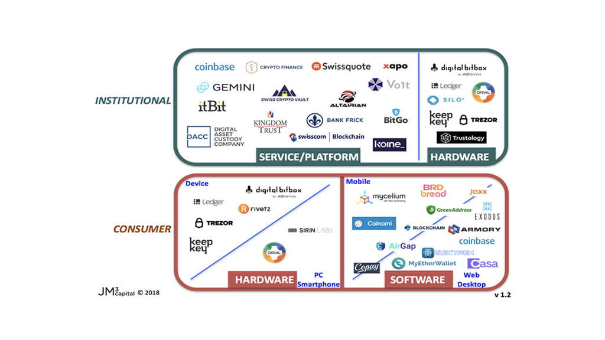

## Table of Contents

## What is cryptocurrency custody?

Cryptocurrency custody refers to the safekeeping and management of digital assets like Bitcoin or Ethereum. It's like having a secure wallet where you can store your cryptocurrencies. Custody services can be provided by specialized companies or platforms, which use advanced security measures to protect your digital money from theft or loss.

There are different types of custody solutions. Some people choose to keep their cryptocurrencies in their own wallets, which they control completely. This is called self-custody. Others prefer to use third-party custodians, which are like banks for digital assets. These custodians manage the security and storage for you, but you need to trust them to keep your money safe. Each option has its own benefits and risks, so it's important to choose the one that best fits your needs.

## Why is custody important for cryptocurrency?

Custody is important for cryptocurrency because it keeps your digital money safe. Just like you wouldn't leave cash lying around, you need a secure place to store your cryptocurrencies. If you don't use good custody, hackers might steal your digital money, or you might lose it by accident. Good custody helps protect your cryptocurrencies from these risks.

There are different ways to keep your cryptocurrencies safe. You can use self-custody, where you control your own digital wallet. This means you are fully responsible for keeping it secure. Or, you can use a third-party custodian, which is like a bank for your digital assets. They take care of the security for you, but you have to trust them to do a good job. Choosing the right custody option is important to make sure your cryptocurrencies stay safe.

## What are the different types of cryptocurrency custody solutions?

Cryptocurrency custody solutions come in different forms, but they all aim to keep your digital money safe. One type is self-custody, where you control your own digital wallet. You are fully responsible for keeping it secure, which means you need to protect your private keys and make sure no one else can access your wallet. Self-custody gives you full control over your cryptocurrencies, but it also means you have to be careful and know how to keep things safe.

Another type of custody solution is using a third-party custodian. This is like having a bank for your digital assets. The custodian takes care of the security for you, using advanced technology and security measures to protect your cryptocurrencies. You don't have to worry about the technical details, but you need to trust the custodian to keep your money safe. Some well-known custodians include companies like Coinbase Custody and BitGo.

There are also hybrid solutions that combine elements of both self-custody and third-party custody. For example, some platforms offer multi-signature wallets, where you and the custodian both have to approve transactions. This adds an extra layer of security and control. Each type of custody solution has its own benefits and risks, so it's important to choose the one that best fits your needs and comfort level with managing digital assets.

## How does a custodial wallet differ from a non-custodial wallet?

A custodial wallet is like a bank for your cryptocurrencies. When you use a custodial wallet, you trust a company to keep your digital money safe for you. They handle all the security stuff, so you don't have to worry about it. But, this also means you have to trust them completely. If the company gets hacked or goes out of business, you might lose your cryptocurrencies. Examples of custodial wallets include services like Coinbase and Binance.

A non-custodial wallet, on the other hand, is like having your own safe at home. You control your own digital wallet and are fully responsible for keeping it secure. You need to protect your private keys and make sure no one else can access your wallet. This gives you more control over your cryptocurrencies, but it also means you have to be careful and know how to keep things safe. Examples of non-custodial wallets include hardware wallets like Ledger and software wallets like MetaMask.

Choosing between a custodial and a non-custodial wallet depends on what you feel comfortable with. If you want someone else to handle the security and you trust them, a custodial wallet might be right for you. But if you want full control over your digital money and are willing to manage the security yourself, a non-custodial wallet is the way to go.

## What are the security features to look for in a cryptocurrency custody solution?

When looking for a good [cryptocurrency](/wiki/cryptocurrency) custody solution, one of the main things to check is how they keep your digital money safe. A good solution should use strong encryption to protect your private keys, which are like the passwords to your wallet. They should also have multi-[factor](/wiki/factor-investing) authentication, which means you need more than one way to prove it's really you trying to access your money. This could be something like a password plus a code sent to your phone. Another important feature is cold storage, where your cryptocurrencies are kept offline, away from hackers who might try to steal them online.

Also, it's good to look for a solution that has regular security audits. These are checks done by experts to make sure the system is safe and up to date. A good custody solution should also have insurance to protect your money if something goes wrong. And if you're using a third-party custodian, it's important to know how they handle your private keys. Do they keep them separate from your money, and do they have a way to recover them if you lose them? All these features together help make sure your cryptocurrencies are as safe as possible.

## How do institutional investors typically manage cryptocurrency custody?

Institutional investors, like big companies or funds, usually manage their cryptocurrency custody carefully because they handle a lot of money. They often use third-party custodians, which are like special banks for digital money. These custodians have strong security measures, like keeping most of the money offline in cold storage to protect it from hackers. They also use insurance to cover losses if something goes wrong. Institutional investors choose these custodians because they want to make sure their digital money is safe and they don't have to worry about managing it themselves.

Some institutional investors also use multi-signature wallets, where more than one person needs to approve a transaction before it can happen. This adds an extra layer of security and control. They might also have their own security audits done regularly to check that everything is safe. By using these methods, institutional investors can feel confident that their cryptocurrencies are well-protected and managed properly.

## What are the regulatory considerations for cryptocurrency custody?

When it comes to cryptocurrency custody, there are rules that companies have to follow to make sure everything is safe and fair. These rules can be different in each country. For example, in the United States, companies that hold cryptocurrencies for other people might need to follow rules set by the Securities and Exchange Commission (SEC) or the Financial Crimes Enforcement Network (FinCEN). These rules help stop fraud and make sure that the companies are doing things the right way. They might need to have certain security measures in place and report any suspicious activity.

In Europe, the rules can be a bit different. The European Union has its own set of regulations, like the Markets in Crypto-Assets (MiCA) regulation, which will soon apply to crypto custody services. These rules aim to protect people's money and make the crypto market more trustworthy. Companies need to follow these rules to keep their customers' cryptocurrencies safe and to make sure they are not used for illegal activities. No matter where they are, companies need to keep up with these rules to avoid getting into trouble and to keep their customers happy and safe.

## What is cold storage and how does it relate to custody solutions?

Cold storage is a way to keep your cryptocurrencies safe by storing them offline. Think of it like keeping your money in a safe at home instead of carrying it around in your pocket. When your digital money is in cold storage, it's not connected to the internet, so hackers can't easily steal it. This makes cold storage a very secure option for keeping your cryptocurrencies safe.

Cold storage is an important part of many custody solutions, especially for people and companies that want to keep their digital money extra safe. Custodians, which are like banks for cryptocurrencies, often use cold storage to protect their clients' money. By keeping most of the cryptocurrencies offline, they reduce the risk of hacks and theft. This makes cold storage a key feature to look for when choosing a custody solution, whether you're using a third-party service or managing your own digital wallet.

## How can multi-signature wallets enhance the security of cryptocurrency custody?

Multi-signature wallets, often called multi-sig wallets, make cryptocurrency custody safer by needing more than one person to approve a transaction before it can happen. Imagine you and your friend both have to sign a check before the bank will take the money out. This means that even if a hacker gets one person's private key, they can't steal the money without the other keys. It's like having extra locks on your digital wallet, making it much harder for anyone to take your cryptocurrencies without permission.

Institutional investors and companies often use multi-sig wallets because they handle a lot of money and want to be extra careful. By spreading the control over several people, they reduce the risk of someone inside the company stealing the money or making a mistake. This added layer of security helps keep their digital assets safe and gives them peace of mind knowing that their cryptocurrencies are well-protected.

## What are the best practices for managing keys in a cryptocurrency custody setup?

Managing keys in a cryptocurrency custody setup is important to keep your digital money safe. One of the best things you can do is to use strong passwords for your keys and never share them with anyone. It's also a good idea to keep your keys in more than one place, so if you lose one, you still have another copy. Using a hardware wallet, which is a special device that keeps your keys offline, can make things even safer. And don't forget to update your software and use two-factor authentication to add extra protection.

Another important practice is to be careful about where you store your keys. If you're using a third-party custodian, make sure they have good security measures in place. For self-custody, consider using multi-signature wallets, where more than one person needs to approve a transaction. This can help prevent someone from stealing your money even if they get one of your keys. Regularly checking your wallet and keeping an eye out for any strange activity can also help you catch problems early and keep your cryptocurrencies safe.

## How do insurance and liability play a role in cryptocurrency custody?

Insurance and liability are important when it comes to keeping your cryptocurrencies safe. Insurance is like a safety net that can help you get your money back if something bad happens, like a hack or a mistake by the company holding your digital money. Some companies that offer custody services have insurance to cover losses, which can give you peace of mind knowing that your money might be protected even if something goes wrong. It's a good idea to check if the company you're using has insurance and what it covers.

Liability is about who is responsible if something goes wrong. If a company is holding your cryptocurrencies and they get hacked or lose your money, you might want to know if they can be held responsible. Some companies might have rules that limit their liability, meaning they might not have to pay you back if something happens. It's important to read the fine print and understand what the company's responsibilities are. This way, you can make a better choice about where to keep your digital money and feel more secure about it.

## What are the emerging technologies and trends in cryptocurrency custody solutions?

New technologies are making cryptocurrency custody safer and easier. One big trend is the use of hardware security modules (HSMs), which are special devices that keep your private keys super safe. They're like extra-strong locks for your digital wallet. Another cool thing is the growth of decentralized custody solutions, where your cryptocurrencies are spread out across many places instead of being kept in one spot. This makes it harder for hackers to steal your money because they'd have to break into many places at once. Also, more companies are using [artificial intelligence](/wiki/ai-artificial-intelligence) to watch for strange activity and stop hacks before they happen.

Another trend is the use of smart contracts for custody. Smart contracts are like digital agreements that automatically do what they're supposed to do when certain things happen. They can help manage your cryptocurrencies without needing a middleman, which can make things safer and more private. Plus, there's a growing focus on making custody solutions easier for everyone to use, not just tech experts. Companies are working on user-friendly apps and interfaces so that more people can safely keep their digital money. These trends are making cryptocurrency custody better and more secure for everyone.

## References & Further Reading

[1]: Meher, S., Baquee, M., & Johari, R. (2022). ["Cryptocurrency and its Volatility: An Analysis of the Impact of Algorithmic Trading in Financial Markets."](https://www.researchgate.net/publication/362947127_Cryptocurrency_and_its_Volatility_An_Analysis_of_the_Impact_of_Algorithmic_Trading_in_Financial_Markets) Journal of Financial Markets.

[2]: Goodell, J. W., & Goutte, S. (2021). ["Diversification of Cryptocurrency Holdings"](https://papers.ssrn.com/sol3/papers.cfm?abstract_id=3631971) in Journal of Financial Stability, 54. 

[3]: Narayanan, A., Bonneau, J., Felten, E., Miller, A., & Goldfeder, S. (2016). ["Bitcoin and Cryptocurrency Technologies: A Comprehensive Introduction"](https://press.princeton.edu/books/hardcover/9780691171692/bitcoin-and-cryptocurrency-technologies) Princeton University Press.

[4]: Antonopoulos, A. M. (2018). ["Mastering Bitcoin: Unlocking Digital Cryptocurrencies"](https://books.google.com/books/about/Mastering_Bitcoin.html?id=IXmrBQAAQBAJ) O'Reilly Media.

[5]: Tarasava, A., & Mallipeddi, R. (2019). ["Algorithmic Trading and Insights into Exchanges and Execution"](https://www.researchgate.net/publication/378548435_Algorithmic_Trading_and_AI_A_Review_of_Strategies_and_Market_Impact) in Handbook of Investors' Behavior during Financial Crises.