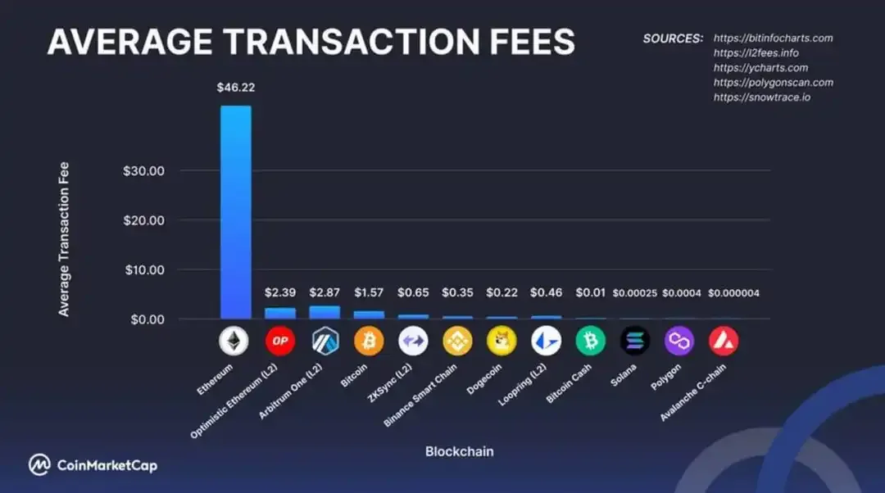

## Table of Contents

## What is a cryptocurrency exchange fee?

A cryptocurrency exchange fee is the amount of money you have to pay when you buy or sell cryptocurrencies on an exchange platform. It's like a small charge for using the service to trade your digital money. These fees help the exchange keep running and provide services like fast transactions and good customer support.

The fee can be different depending on the exchange you use and the kind of trade you make. Some exchanges charge a percentage of the total amount you're trading, while others might have a fixed fee. It's a good idea to check the fee structure of an exchange before you start trading, so you know how much it will cost you.

## How do cryptocurrency exchange fees differ from traditional financial transaction fees?

Cryptocurrency exchange fees and traditional financial transaction fees both serve as charges for using a service to move or trade money, but they can be different in a few ways. With cryptocurrencies, you often pay a fee to the exchange platform when you buy or sell digital currencies. This fee can be a percentage of the total amount you're trading or a fixed amount. Sometimes, there are also network fees, which are paid to the blockchain for processing the transaction. These fees can change a lot depending on how busy the network is.

On the other hand, traditional financial transaction fees usually come from banks or other financial institutions when you move money between accounts, use an ATM, or make a payment. These fees can be for things like monthly account maintenance, ATM withdrawals, or transferring money to another person. The fees can be a fixed amount or a percentage, but they are often more predictable than crypto fees because they are set by the bank and don't change as much with the volume of transactions. Also, traditional fees might be lower for certain types of transactions or if you have a special account type.

## What are the different types of fees charged by cryptocurrency exchanges?

Cryptocurrency exchanges charge different types of fees, and it's important to know about them before you start trading. One common type is the trading fee, which is what you pay when you buy or sell cryptocurrencies on the exchange. This fee can be a small percentage of the total amount you're trading, like 0.1% or 0.25%, or it might be a fixed amount. Some exchanges offer different fee rates depending on how much you trade or if you use their own cryptocurrency for the transaction.

Another type of fee is the deposit and withdrawal fee. When you add money or cryptocurrencies to your exchange account, you might have to pay a deposit fee. The same goes for taking your money or cryptocurrencies out of the exchange, where you might be charged a withdrawal fee. These fees can be different depending on the payment method you use, like a bank transfer, credit card, or another cryptocurrency. Some exchanges don't charge for deposits but do charge for withdrawals, especially for cryptocurrencies, where the fee might also depend on how busy the blockchain network is.

Lastly, there are network fees, also known as miner fees or gas fees, which are paid to the blockchain network for processing your transaction. These fees are not set by the exchange but by the network itself and can change a lot based on how busy the network is. For example, if you're sending Bitcoin or Ethereum, you might have to pay a higher fee during times when a lot of people are using the network. It's good to keep an eye on these fees because they can add up, especially if you're making a lot of small transactions.

## How can beginners minimize their cryptocurrency exchange fees?

Beginners can minimize their cryptocurrency exchange fees by choosing the right exchange and understanding the fee structure. Some exchanges offer lower fees than others, so it's a good idea to compare different platforms before you start trading. Also, some exchanges give you a discount if you pay your fees with their own cryptocurrency or if you trade a lot. So, if you plan to trade often, [picking](/wiki/asset-class-picking) an exchange with lower fees for high-volume traders can save you money.

Another way to cut down on fees is to be smart about how you deposit and withdraw money. Some exchanges don't charge you for adding money to your account, but they might charge you for taking it out, especially if you're moving cryptocurrencies. It's best to do fewer, bigger transactions instead of a lot of small ones because the fees add up less that way. Also, try to do your transactions when the network isn't too busy, because that can lower the network fees you have to pay.

## What factors influence the fee structure on cryptocurrency exchanges?

The fee structure on cryptocurrency exchanges can be influenced by a few different things. One big [factor](/wiki/factor-investing) is the type of trade you're doing. If you're buying or selling cryptocurrencies, the exchange might charge you a trading fee, which could be a small percentage of the total amount you're trading or a fixed amount. Some exchanges offer lower fees if you use their own cryptocurrency to pay for the trade or if you trade a lot. Another factor is how you're adding or taking money out of your account. Some exchanges might charge you for deposits or withdrawals, and the fee can depend on whether you're using a bank transfer, credit card, or another cryptocurrency.

Another thing that can affect the fee structure is how busy the blockchain network is. When you send cryptocurrencies, you have to pay a network fee, also called a miner fee or gas fee, to the blockchain for processing your transaction. This fee isn't set by the exchange but by the network itself, and it can change a lot depending on how many people are using the network at the same time. If the network is really busy, the fee might be higher. So, it's a good idea to keep an eye on these fees and try to do your transactions when the network isn't too busy to save money.

## How do maker and taker fees work in cryptocurrency trading?

In cryptocurrency trading, you might hear about maker and taker fees. These are two different kinds of trading fees that exchanges charge. A maker fee is what you pay when you add a new order to the exchange's order book without it being filled right away. This means you're "making" [liquidity](/wiki/liquidity-risk-premium) on the exchange. On the other hand, a taker fee is what you pay when you take an order that's already on the order book and it gets filled right away. This means you're "taking" liquidity from the exchange. Usually, maker fees are lower than taker fees because the exchange wants to encourage people to add more orders to the order book.

The difference between maker and taker fees can affect how much you pay when you trade. If you want to save money on fees, you might try to place orders that don't get filled right away, so you pay the lower maker fee. But if you need to buy or sell your cryptocurrencies quickly, you'll have to take an order that's already there and pay the higher taker fee. It's good to know about these fees because they can add up, especially if you're trading a lot.

## What are the average fee rates for major cryptocurrency exchanges?

The average fee rates for major cryptocurrency exchanges can vary a lot, but they usually fall into a few common ranges. For trading fees, many big exchanges charge between 0.1% and 0.25% of the total amount you're trading. Some exchanges, like Binance, have even lower fees, around 0.1% for makers and 0.1% for takers, but they might offer discounts if you pay with their own cryptocurrency, like BNB. Other exchanges, like Coinbase, might charge a bit more, with fees that can go up to 0.5% or even higher depending on the payment method and the size of the trade.

When it comes to deposit and withdrawal fees, the rates can be different depending on the exchange and the method you use. Some exchanges don't charge you for adding money to your account, but they might charge you for taking it out. For example, withdrawing Bitcoin might cost you a small fee, like 0.0005 BTC, while withdrawing other cryptocurrencies could be a bit more or less. Network fees, which you pay to the blockchain for processing your transaction, can also change a lot. They might be around $1 to $5 for Bitcoin, but they can go up if the network is really busy.

## How do withdrawal and deposit fees affect the overall cost of trading?

Withdrawal and deposit fees can add to the overall cost of trading on cryptocurrency exchanges. When you add money or cryptocurrencies to your exchange account, you might have to pay a deposit fee. This fee can be different depending on how you're adding the money, like using a bank transfer, credit card, or another cryptocurrency. Some exchanges don't charge for deposits, but if they do, it can make your trades more expensive. The same goes for taking your money or cryptocurrencies out of the exchange. Withdrawal fees can add up, especially if you're moving cryptocurrencies, because the fee might also depend on how busy the blockchain network is.

These fees can have a big impact on how much it costs you to trade. If you're doing a lot of small transactions, the fees can add up quickly and eat into your profits. It's a good idea to try to do fewer, bigger transactions to keep the fees down. Also, some exchanges charge more for certain types of withdrawals or deposits, so it's smart to check the fee structure before you start trading. By understanding and managing these fees, you can save money and make your trading more cost-effective.

## What strategies can advanced traders use to optimize their fee expenses?

Advanced traders can use different strategies to lower their fee costs. One good way is to choose the right exchange. Some exchanges have lower fees than others, so it's smart to compare them before you start trading. Also, some exchanges offer discounts if you pay your fees with their own cryptocurrency or if you trade a lot. If you're planning to trade often, picking an exchange with lower fees for high-volume traders can save you money. Another strategy is to use maker orders instead of taker orders. Maker orders add liquidity to the exchange and usually have lower fees than taker orders, which take liquidity away. By placing orders that don't get filled right away, you can pay the lower maker fee and save money.

Another way to optimize fee expenses is to be smart about how you deposit and withdraw money. Some exchanges don't charge for adding money to your account, but they might charge for taking it out, especially if you're moving cryptocurrencies. It's best to do fewer, bigger transactions instead of a lot of small ones because the fees add up less that way. Also, try to do your transactions when the network isn't too busy, because that can lower the network fees you have to pay. By understanding and managing these fees, advanced traders can keep their costs down and make their trading more profitable.

## How do decentralized exchanges (DEXs) handle fees differently from centralized exchanges (CEXs)?

Decentralized exchanges (DEXs) and centralized exchanges (CEXs) handle fees in different ways. DEXs usually don't have a central authority setting the fees. Instead, the fees are often set by the blockchain network itself. When you trade on a DEX, you might have to pay a network fee, also called a gas fee, to process your transaction on the blockchain. This fee can change a lot depending on how busy the network is. Some DEXs also charge a small trading fee, but it's usually lower than what you'd pay on a CEX because there's no middleman taking a cut.

On the other hand, centralized exchanges (CEXs) have more control over the fees they charge. They set their own trading fees, which can be a percentage of the total amount you're trading or a fixed amount. CEXs might also charge deposit and withdrawal fees, which can be different depending on how you're moving your money. These fees help the exchange keep running and provide services like fast transactions and good customer support. Because CEXs have more control over their fees, they can offer discounts or different fee structures based on how much you trade or if you use their own cryptocurrency to pay for the fees.

## What role do volume discounts play in reducing fees for high-frequency traders?

Volume discounts are really important for high-frequency traders because they can help lower the fees they have to pay. When you trade a lot on an exchange, you might get a discount on the trading fees. This means the more you trade, the less you pay for each trade. High-frequency traders, who make a lot of trades in a short time, can save a lot of money with these discounts. It's like getting a special deal because you're a big customer.

Exchanges offer volume discounts to keep high-frequency traders happy and coming back. These traders bring a lot of business to the exchange, so it makes sense for the exchange to give them a break on fees. By trading more, high-frequency traders can lower their overall costs and make their trading more profitable. It's a win-win situation because the exchange gets more trading activity, and the traders pay less in fees.

## How might future regulatory changes impact cryptocurrency exchange fee structures?

Future regulatory changes could change how cryptocurrency exchanges charge fees. Governments might make new rules that say exchanges have to be more clear about their fees. This could mean exchanges have to show their fees in a simple way so everyone can understand them. Also, if the government decides to tax cryptocurrency trades, that could make the fees go up. Exchanges might have to add the tax to the fees they charge, which would make trading more expensive for everyone.

Another way regulations could affect fees is by making exchanges follow strict rules about how they handle money. If the rules get tougher, exchanges might have to spend more money to follow them. They might then raise their fees to cover these extra costs. But, if the regulations help make the exchanges safer and more trusted, more people might start using them. This could lead to more competition, and some exchanges might lower their fees to attract more customers. So, while some changes might make fees go up, others could help keep them down.

## What are Trading Fees: Maker and Taker?

Trading fees are a fundamental component of [cryptocurrency](/wiki/cryptocurrency) exchange costs, primarily divided into two categories: maker fees and taker fees. Understanding these fees is essential for optimizing trading strategies and minimizing costs associated with cryptocurrency trading.

**Maker Fees**

Maker fees are incurred when a trader adds liquidity to the market. Liquidity refers to how easily assets can be bought or sold in the market without affecting the asset's price. By placing a limit order that is not immediately fulfilled, a trader provides liquidity. Since exchanges aim to maintain robust market liquidity, they often incentivize liquidity provision by offering lower maker fees. This means that when a trader's order adds to the [order book](/wiki/order-book-trading-strategies), rather than executes instantly against an existing order, a lower fee applies. The formula for calculating the maker fee can be expressed as:

$$
\text{Maker Fee} = \text{Trade Volume} \times \text{Maker Fee Rate}
$$

where the Trade Volume is the size of the transaction, and the Maker Fee Rate is the percentage charged by the exchange.

**Taker Fees**

Contrarily, taker fees are charged when a trader removes liquidity from the market. This occurs when a trader places an order that matches an existing order, fulfilling the transaction immediately. Since this action reduces the liquidity in the market, taker fees are generally higher than maker fees. For traders that frequently execute market orders, this can result in increased trading costs:

$$
\text{Taker Fee} = \text{Trade Volume} \times \text{Taker Fee Rate}
$$

Similar to maker fees, the Taker Fee Rate is typically a percentage set by the exchange.

**Strategic Implications**

The distinction between maker and taker fees has strategic implications for traders. By understanding these fees, traders can adjust their trading strategies to minimize costs. For example, using limit orders that contribute to liquidity can reduce trading expenses due to lower maker fees. Conversely, market orders, while ensuring rapid execution, should be used judiciously to avoid higher taker fees unless immediate execution is crucial.

The profitability of various trading strategies, particularly those involving high-frequency trading or substantial transaction volumes, often depends significantly on understanding and exploiting the cost dynamics of maker and taker fees. In [algorithmic trading](/wiki/algorithmic-trading), these distinctions become even more vital as automated systems can be programmed to favor liquidity-adding orders, thus minimizing costs and maximizing net returns.

In conclusion, a thorough understanding of maker and taker fees enables traders to optimize their strategies, thereby enhancing overall trading profitability and efficiency.

## What are Network Fees: Gas Fees and Transaction Costs?

Network fees, often referred to as gas fees, are essential components of the transaction process within blockchain networks, particularly in Ethereum. These fees are payments made by users to compensate for the computing energy required to process and validate transactions on the network. As a fundamental part of blockchain operations, network fees ensure the security and integrity of the platform by deterring spam and allocating resources proportionally to users’ demands.

The cost of network fees varies and is substantially influenced by network congestion. When the demand for transaction processing exceeds the network's capacity, fees increase due to limited supply, akin to traditional supply and demand economic principles. This variability can lead to periods where transaction costs become prohibitively high, impacting the efficiency and feasibility of trading activities.

Ethereum's gas fee mechanism is intricately designed. Gas refers to the unit that measures the computational work of operations, such as transactions and smart contract executions. The total transaction fee is calculated as:

$$
\text{Transaction Fee} = \text{Gas Units} \times \text{Gas Price}
$$

- **Gas Units** signify the amount of computational effort undertaken.
- **Gas Price** is the cost per unit of gas, typically denoted in Gwei (where 1 Gwei = $10^{-9}$ ETH).

For example, if a transaction requires 21,000 gas units and the gas price is set at 50 Gwei, the fee would be calculated as:

$$
\text{Transaction Fee} = 21,000 \times 50 \times 10^{-9} = 0.00105 \text{ ETH}
$$

Managing network fees effectively is crucial for optimizing transaction costs in cryptocurrency trading. Traders can adjust transaction times to coincide with lower network activity periods, thereby reducing fees. Additionally, selecting exchanges that either incorporate strategies to optimize network fees or offer features like batched transactions can help mitigate these costs. Some platforms provide tools that allow traders to analyze current network loads and predict optimal times to initiate transactions.

Furthermore, traders often benefit from monitoring Ethereum's transition to Ethereum 2.0, which aims to reduce gas fees through scalability enhancements and a shift to a proof-of-stake consensus mechanism. As the blockchain evolves, staying informed about such technological advancements is essential for managing transaction costs efficiently.

In conclusion, network fees are a critical consideration for cryptocurrency traders. By understanding the factors influencing gas fees and employing strategic timing and platform selection, traders can minimize these costs, thereby enhancing their overall trading profitability.

## What are the differences when comparing fee structures?

Cryptocurrency exchanges utilize diverse fee structures to accommodate different trading needs and volumes, impacting the cost-effectiveness of trading. These structures typically include flat fees, tiered fees, and percentage-based fees. 

Flat fee models impose a fixed charge for each transaction, irrespective of the trade size. This structure simplifies cost calculations, making it predictable. However, while beneficial for large transactions, where the fee represents a smaller percentage of the total trade value, it might be less favorable for small trades where the fee constitutes a significant portion of the transaction.

Tiered fee structures are designed to reward high-[volume](/wiki/volume-trading-strategy) traders with reduced transaction costs. These systems establish fee levels based on the trading volume over a specified period. For example, an exchange might offer the following tiered structure:

- 0-10 BTC traded per month: 0.1% fee
- 10-50 BTC traded per month: 0.08% fee
- 50+ BTC traded per month: 0.06% fee

This incentivizes traders to increase their trading volume to benefit from lower fees, thus aligning exchange revenue with increased liquidity.

Percentage-based fees calculate costs as a percentage of the trade value, directly linking the fee to the transaction size. This method affects traders differently based on their order sizes: larger trades incur higher fees, proportionate to their transaction size, while smaller trades incur less cost.

Mathematically, if $F$ represents the fee, $P$ is the percentage fee rate, and $V$ is the value of the trade, the formula is:

$$
F = P \times V
$$

For instance, with a 0.2% fee rate ($P = 0.002$) on a trade volume of 5 BTC ($V = 5$), the fee would be:

$$
F = 0.002 \times 5 = 0.01 \text{ BTC}
$$

Each of these fee structures offers unique advantages and challenges, influencing traders’ choice of exchanges based on their trading strategies and volume. Efficiently navigating these models is essential for optimizing trading costs.

## References & Further Reading

[1]: Antonopoulos, A. M., & Wood, G. (2018). ["Mastering Ethereum: Building Smart Contracts and DApps"](https://www.amazon.com/Mastering-Ethereum-Building-Smart-Contracts/dp/1491971940). O'Reilly Media.

[2]: Narayanan, A., Bonneau, J., Felten, E. W., Miller, A., & Goldfeder, S. (2016). ["Bitcoin and Cryptocurrency Technologies: A Comprehensive Introduction"](https://press.princeton.edu/books/hardcover/9780691171692/bitcoin-and-cryptocurrency-technologies). Princeton University Press.

[3]: De Filippi, P., & Wright, A. (2018). ["Blockchain and the Law: The Rule of Code"](https://www.jstor.org/stable/j.ctv2867sp). Harvard University Press.

[4]: Fabozzi, F. J., Focardi, S. M., & Kolm, P. N. (2020). ["Quantitative Equity Investing: Techniques and Strategies"](https://www.semanticscholar.org/paper/Quantitative-Equity-Investing%3A-Techniques-and-Fabozzi-Focardi/1c49a2a53919f7e65cb96f16691b8ff726fd3cd7). Wiley.

[5]: Patterson, S. (2017). ["A Brief History of Cryptocurrencies and Getting Started in Basic Cryptocurrency Trading"](https://www.decryptouniversity.com/introduction/history/). baixo books.