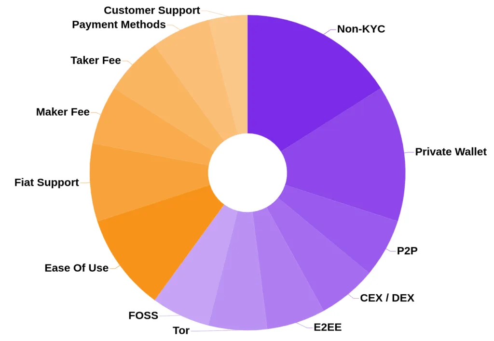

## Table of Contents

## What is a cryptocurrency exchange?

A cryptocurrency exchange is a platform where you can buy, sell, or trade cryptocurrencies. It's like an online marketplace where people from all over the world can exchange different types of digital money, like Bitcoin or Ethereum, for other cryptocurrencies or traditional money, like dollars or euros.

These exchanges make it easy for people to trade because they match buyers with sellers. They also keep the cryptocurrencies safe in digital wallets until you want to move them. Some exchanges charge a small fee for each trade you make, which helps them run the platform and keep everything secure.

## Why is it important to rate cryptocurrency exchanges?

Rating cryptocurrency exchanges is important because it helps people choose the best place to trade their digital money. When exchanges are rated, people can see which ones are safe, easy to use, and have good customer service. This is important because not all exchanges are the same. Some might have better security to protect your money, while others might be easier to use if you're new to trading.

Ratings also help people know about the fees they might have to pay. Some exchanges charge more than others, and knowing this can help you save money. By looking at ratings, you can find an exchange that fits your needs, whether you care most about low fees, good security, or how easy it is to use the platform. This way, you can feel more confident when you trade your cryptocurrencies.

## What are the basic security features to look for in a cryptocurrency exchange?

When you're looking at a cryptocurrency exchange, it's really important to check for good security features. One big thing to look for is two-factor authentication (2FA). This means you need two ways to prove it's really you before you can log in, like a password and a code sent to your phone. This makes it much harder for someone else to get into your account. Another key feature is encryption. This is like a secret code that keeps your information safe when it's sent from your computer to the exchange's servers. Without encryption, your personal details and money could be stolen.

Also, you should see if the exchange keeps most of the money in what's called "cold storage." Cold storage means the money is kept offline, so it's much safer from hackers. If an exchange uses cold storage, it shows they care about keeping your money safe. Lastly, check if the exchange has insurance. This is like a safety net; if something bad happens, like a hack, the insurance can help get your money back. Good security features like these help you trust that your money is safe on the exchange.

## How does user experience affect the rating of a cryptocurrency exchange?

User experience is really important when people rate a cryptocurrency exchange. If the website or app is easy to use and looks nice, people usually give it a higher rating. They like it when they can find what they need quickly, like how to buy or sell their cryptocurrencies. If the exchange has good instructions and helps new users understand how to use it, that makes a big difference. People also care about how fast the exchange works. If it's slow or crashes a lot, they will rate it lower because it's frustrating to use.

Another part of user experience is customer support. If you have a problem and the exchange helps you quickly and nicely, you'll rate them higher. Good customer support makes people feel taken care of and more likely to keep using the exchange. On the other hand, if it's hard to get help or the support team isn't friendly, people will be less happy and give lower ratings. So, a good user experience can make a big difference in how people feel about an exchange and how they rate it.

## What role do fees play in evaluating a cryptocurrency exchange?

Fees are a big deal when people are looking at cryptocurrency exchanges. They want to know how much it will cost them to buy, sell, or trade their digital money. If an exchange charges high fees, people might choose to go somewhere else where it's cheaper. Lower fees mean you get to keep more of your money, which is good for anyone using the exchange. That's why exchanges with lower fees often get better ratings from users.

But it's not just about the fees being low. People also look at what they're getting for those fees. Some exchanges might charge a bit more but offer better services, like faster trades or better security. If users feel like they're getting good value for what they pay, they might not mind the higher fees as much. So, when rating an exchange, people think about both how much they're paying and what they're getting in return.

## How important is the variety of cryptocurrencies offered by an exchange?

The variety of cryptocurrencies offered by an exchange is really important. When an exchange has a lot of different cryptocurrencies, it gives people more choices. Some people might want to trade popular ones like Bitcoin and Ethereum, but others might be interested in newer or less common cryptocurrencies. Having a wide selection means more people can find what they're looking for and do the trades they want.

Having a good variety can also make an exchange more attractive to users. If you can find all the cryptocurrencies you want to trade in one place, you don't have to go to different exchanges. This can save time and make trading easier. Exchanges with a big variety of cryptocurrencies often get higher ratings because they meet the needs of more people.

## What are the key regulatory compliance factors to consider when rating an exchange?

When you're looking at how well a cryptocurrency exchange follows the rules, one big thing to check is if they have the right licenses and approvals from government groups. This shows they're playing by the rules and trying to keep things safe and fair for everyone. Another important part is how they handle things like knowing their customers (KYC) and keeping an eye out for any shady activities (AML). If an exchange is good at these, it means they're working hard to stop bad things like money laundering and fraud.

Also, it's good to see if the exchange is open about how they follow the rules. If they share information about their audits and how they keep up with new laws, that's a plus. This kind of openness helps build trust because it shows they're serious about doing things the right way. So, when you're rating an exchange, thinking about these regulatory compliance factors can help you pick one that's safe and trustworthy.

## How does liquidity impact the rating of a cryptocurrency exchange?

Liquidity is really important when people are rating a cryptocurrency exchange. It means how easily you can buy or sell your cryptocurrencies without the price changing too much. If an exchange has high liquidity, it's easier for you to trade because there are always people ready to buy or sell. This makes the exchange more popular and usually gets it a higher rating. People like exchanges where they can quickly trade their money without waiting or worrying about big price swings.

On the other hand, if an exchange has low liquidity, it can be hard to trade. You might have to wait longer to find someone to trade with, and the price might change a lot while you're waiting. This can be frustrating and risky. So, when people rate an exchange, they look at how liquid it is because it affects how easy and safe it is to use. Exchanges with better liquidity often get better ratings because they make trading smoother and more reliable for everyone.

## What advanced security measures should be evaluated in top-rated exchanges?

When you're looking at top-rated cryptocurrency exchanges, one advanced security measure to check for is multi-signature wallets. This means that to move money out of the exchange, more than one person has to agree and sign off on it. It's like needing more than one key to open a safe. This makes it much harder for hackers to steal money because they can't do it alone. Another important feature is real-time monitoring and anomaly detection systems. These systems watch what's happening on the exchange all the time and can spot strange behavior that might be a hack or fraud. If something fishy is detected, the system can lock things down or alert security teams to take action quickly.

Also, top exchanges often use advanced encryption methods beyond just basic SSL. They might use things like end-to-end encryption for messages and transactions, which keeps your information super safe while it's being sent. Another cool feature is the use of hardware security modules (HSMs). These are special devices that keep the keys to your digital money safe, even if the rest of the system gets hacked. They're like a super secure vault for your crypto keys. By looking for these advanced security measures, you can feel more confident that your money is in good hands on a top-rated exchange.

## How can the customer support quality influence an exchange's rating?

Customer support quality can really affect how people rate a cryptocurrency exchange. If you have a problem and the support team helps you quickly and nicely, you'll feel good about the exchange. People like it when they can get help easily, like through live chat or phone calls. If the exchange has good support, it shows they care about their users. This makes people trust the exchange more and give it a higher rating. On the other hand, if it's hard to get help or the support team isn't friendly, people will be less happy. They might rate the exchange lower because they feel like they're not being taken care of.

Another important part of customer support is how well they can solve problems. If the support team knows a lot about cryptocurrencies and can fix issues fast, that's a big plus. People want to feel like they're in good hands, especially when they're dealing with their money. If an exchange has a support team that can answer questions clearly and help with any issues, it makes a big difference. This kind of good service can make people more likely to keep using the exchange and recommend it to others, which can lead to higher ratings.

## What are the considerations for scalability and performance in rating an exchange?

When people rate a cryptocurrency exchange, they look at how well it can handle a lot of users and trades at the same time. This is called scalability. If an exchange can grow and keep working well even when a lot of people are using it, that's a good sign. People like exchanges that can handle busy times without slowing down or crashing. If an exchange can't keep up with a lot of activity, users might get frustrated and rate it lower.

Performance is another big part of rating an exchange. It's about how fast and smoothly the exchange works. People want to be able to buy and sell their cryptocurrencies quickly without waiting a long time. If an exchange is slow or has a lot of problems, users will be unhappy and give it a lower rating. Good performance means the exchange can process trades fast and keep everything running smoothly, which makes people more likely to give it a higher rating.

## How do expert users assess the trading tools and features of a cryptocurrency exchange?

Expert users look at a lot of things when they check out the trading tools and features of a cryptocurrency exchange. They want to see if the exchange has advanced order types, like limit orders, stop-loss orders, and margin trading. These tools help them trade more smartly and manage their risks better. They also look for good charting and analysis tools. These help them understand how the market is moving and make better trading decisions. If an exchange has a lot of these tools and they work well, expert users will rate it higher.

Another thing expert users care about is how easy it is to use the trading platform. They want the interface to be clear and easy to navigate, even with all the advanced features. They also look for things like trading bots and APIs that let them automate their trades. If an exchange offers these and they work well, it can make a big difference in how expert users rate it. They like exchanges that give them the tools they need to trade effectively and efficiently.

## What is Algorithmic Trading in Cryptocurrency?

Algorithmic trading in the cryptocurrency market employs pre-programmed instructions to automate trading processes, allowing traders to execute trades based on real-time market data. These algorithms can perform tasks at speeds and frequencies that are humanly impractical, significantly increasing the efficiency of trading strategies.

### Key Elements of a Crypto Trading Algorithm

1. **Data Analysis**: At the core of any crypto trading algorithm is the analysis of vast amounts of market data. This includes real-time pricing, volume, historical data, and other market indicators. The ability to process and interpret this data quickly allows algorithms to identify potential trade opportunities. Data analysis often involves statistical methods and can utilize machine learning techniques to improve predictions over time.

2. **Technical Indicators**: Crypto trading algorithms rely heavily on technical indicators to make informed decisions. Common indicators include moving averages, relative strength indices (RSI), and Bollinger Bands. These indicators help the algorithm assess market conditions and predict future price movements. For instance, a simple moving average (SMA) is calculated as follows:
$$
   SMA = \frac{\sum_{i=0}^{n} P_i}{n}

$$

   where $P_i$ is the price of the asset at adding period $i$, and $n$ is the number of periods considered.

3. **Risk Management Strategies**: Effective risk management is crucial in algorithmic trading, which involves setting stop-loss and take-profit orders, diversifying portfolios, and adjusting position sizes. The goal is to minimize potential losses while maximizing potential gains. Algorithms can incorporate dynamic risk management strategies to adapt to changing market conditions.

### Pros and Cons of Using Trading Bots

**Pros**:
- **Consistency and Speed**: Trading bots respond immediately to market changes, executing trades faster than human capabilities. This removes emotional influences from trading decisions, ensuring consistent strategy application.
- **24/7 Trading**: Cryptocurrency markets operate 24/7, and bots can trade continuously without downtime, capturing opportunities at any time of day.
- **Backtesting**: Before deployment, algorithms can be backtested against historical data to evaluate their performance and optimize parameters, reducing the risk of unforeseen losses.

**Cons**:
- **Complexity and Cost**: Developing a robust trading bot requires significant expertise and can be costly. Maintenance and regular updates to adapt to algorithmic improvements are necessary.
- **Over-Optimization**: There is a risk of over-optimizing algorithms for past data, which could reduce their effectiveness in real trading environments due to changing market conditions.
- **Security Risks**: Deploying trading bots involves risks such as account hacking or algorithmic errors, potentially leading to financial losses.

Despite these challenges, trading bots provide traders with the tools needed to enhance their strategies, offering a blend of precision, efficiency, and automated decision-making. As the cryptocurrency market continues to evolve, the integration of advanced algorithms and data science techniques will likely increase, offering new ways for traders to gain a competitive edge.

## References & Further Reading

[1]: Narang, R. K. (2009). ["Inside the Black Box: The Simple Truth About Quantitative Trading."](https://onlinelibrary.wiley.com/doi/book/10.1002/9781118267738) John Wiley & Sons.

[2]: Chan, E. P. (2008). ["Quantitative Trading: How to Build Your Own Algorithmic Trading Business."](https://github.com/ftvision/quant_trading_echan_book) Wiley.

[3]: Patterson, S. (2011). ["The Quants: How a New Breed of Math Whizzes Conquered Wall Street and Nearly Destroyed It."](https://www.amazon.com/Quants-Whizzes-Conquered-Street-Destroyed/dp/0307453383) Crown Business.

[4]: Vogel, K., & Deepak, M. (2017). ["Trading Evolved: Anyone can Build Killer Trading Strategies in Python."](https://www.amazon.com/Trading-Evolved-Anyone-Killer-Strategies-ebook/dp/B07VDLX55H) KDP.

[5]: Lopez de Prado, M. (2018). ["Advances in Financial Machine Learning."](https://www.amazon.com/Advances-Financial-Machine-Learning-Marcos/dp/1119482089) Wiley.