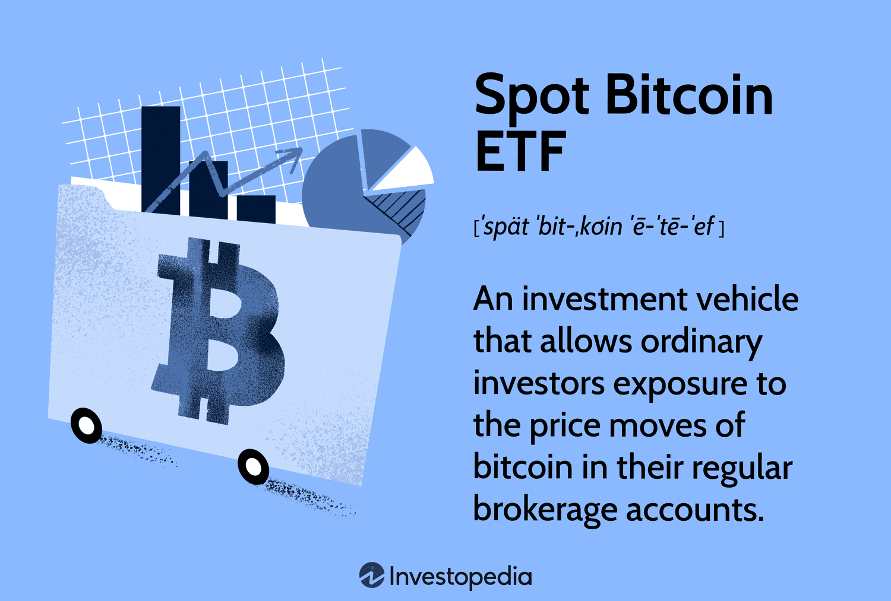

## Table of Contents

## What is a Cryptocurrency Exchange-Traded Fund (ETF)?

A Cryptocurrency Exchange-Traded Fund (ETF) is a type of investment fund that tracks the price of one or more cryptocurrencies, like Bitcoin or Ethereum. It's traded on stock exchanges, just like regular stocks. This means that instead of buying the actual cryptocurrency, you can buy shares in the ETF, which makes it easier and more accessible for people who want to invest in cryptocurrencies without dealing with the complexities of buying and storing them directly.

ETFs are popular because they offer a simpler way to invest in cryptocurrencies. They help reduce some of the risks associated with buying cryptocurrencies directly, like the need to manage digital wallets and protect against hacking. However, investing in a cryptocurrency ETF still comes with risks, such as the volatility of the cryptocurrency market. It's important for investors to understand these risks and do their research before investing.

## How does a Cryptocurrency ETF work?

A Cryptocurrency ETF works by tracking the price of one or more cryptocurrencies. When you buy shares in a Cryptocurrency ETF, you're not buying the actual cryptocurrency. Instead, you're buying a piece of a fund that owns the cryptocurrency. The value of your shares goes up and down based on the price of the cryptocurrency that the ETF is tracking. For example, if the ETF tracks Bitcoin, and the price of Bitcoin goes up, the value of your ETF shares will also go up.

The ETF is managed by a company that takes care of buying and storing the cryptocurrency. This makes it easier for you because you don't have to worry about setting up a digital wallet or protecting your cryptocurrency from hackers. You can buy and sell shares of the ETF just like you would with regular stocks, through a stock exchange. This makes it more convenient for people who want to invest in cryptocurrencies but find the process of buying them directly too complicated or risky.

## What are the benefits of investing in a Cryptocurrency ETF?

Investing in a Cryptocurrency ETF can make it easier for you to get into the world of cryptocurrencies without the hassle of managing them yourself. When you buy shares in an ETF, you don't have to worry about setting up a digital wallet or keeping your cryptocurrencies safe from hackers. The ETF company takes care of all that for you. This can save you a lot of time and reduce the stress of dealing with the technical side of cryptocurrencies.

Another benefit is that ETFs are traded on regular stock exchanges, which means you can buy and sell them just like you would with stocks. This makes it more convenient and familiar for many people. Plus, ETFs often track a basket of cryptocurrencies, which can help spread out your risk. Instead of putting all your money into one cryptocurrency, you can invest in a mix, which might be less risky overall.

## What are the risks associated with Cryptocurrency ETFs?

Investing in Cryptocurrency ETFs comes with some risks that you should know about. One big risk is the volatility of cryptocurrencies. This means their prices can go up and down a lot in a short time. If you're invested in an ETF that tracks a cryptocurrency, the value of your investment can change a lot, too. This can be stressful and risky if you're not ready for those big swings.

Another risk is that the ETF might not track the cryptocurrency perfectly. Sometimes, the price of the ETF can be different from the actual price of the cryptocurrency it's supposed to follow. This is called tracking error, and it can affect how much money you make or lose. Also, the company that manages the ETF charges fees for their services. These fees can eat into your returns, so you need to think about them when deciding if an ETF is right for you.

Lastly, there are regulatory risks. Governments around the world are still figuring out how to handle cryptocurrencies. If new rules come out that make it harder for ETFs to operate, it could hurt your investment. It's important to keep an eye on what's happening with laws and regulations in this area.

## How can one start investing in Cryptocurrency ETFs?

To start investing in Cryptocurrency ETFs, you first need to open a brokerage account. This is like a bank account but for buying and selling investments like stocks and ETFs. You can choose from many different brokers, so pick one that fits your needs. Once your account is set up, you'll need to add money to it. This is called funding your account, and you can usually do it by transferring money from your bank.

After your account is funded, you can search for the Cryptocurrency ETF you want to invest in. Most brokers have a search tool where you can type in the name or the symbol of the ETF. Once you find it, you can place an order to buy shares. Just decide how many shares you want and hit the buy button. It's that simple! Remember, though, that investing in cryptocurrencies can be risky, so make sure you understand what you're getting into before you start.

## What are the differences between a Cryptocurrency ETF and directly buying cryptocurrencies?

When you invest in a Cryptocurrency ETF, you're buying shares in a fund that tracks the price of one or more cryptocurrencies, like Bitcoin or Ethereum. You don't actually own the cryptocurrency itself. Instead, the ETF company manages the cryptocurrency for you, which means you don't have to worry about setting up a digital wallet or protecting your investment from hackers. This can make it easier and less stressful to invest in cryptocurrencies, especially if you're new to them. Plus, ETFs are traded on regular stock exchanges, so you can buy and sell them just like you would with stocks.

On the other hand, when you buy cryptocurrencies directly, you're actually owning the digital currency. You need to set up a digital wallet to store your cryptocurrency, and you're responsible for keeping it safe from hackers. This can be more complicated and risky, but it also gives you more control over your investment. You can use your cryptocurrency to make purchases or trade it on different platforms. The price of your cryptocurrency can go up and down a lot, and you'll feel those changes directly. With a Cryptocurrency ETF, the price changes are reflected in the value of your shares, but you don't have to manage the cryptocurrency itself.

## Can you list some popular Cryptocurrency ETFs currently available?

Some popular Cryptocurrency ETFs that people can invest in are the ProShares Bitcoin Strategy ETF (BITO) and the Valkyrie Bitcoin Strategy ETF (BTF). The ProShares Bitcoin Strategy ETF is one of the first ETFs to offer investors exposure to Bitcoin through futures contracts. It's a good choice for people who want to invest in Bitcoin without having to buy the actual cryptocurrency. The Valkyrie Bitcoin Strategy ETF is another option that also uses Bitcoin futures to track the price of Bitcoin. Both of these ETFs make it easier for people to get into the cryptocurrency market without dealing with the complexities of managing digital wallets.

Another popular ETF is the VanEck Bitcoin Strategy ETF (XBTF). This ETF also focuses on Bitcoin futures and is designed to give investors a way to invest in Bitcoin without the need to buy and store the cryptocurrency themselves. It's a good choice for those who want a straightforward way to invest in Bitcoin. These ETFs are traded on stock exchanges, which means you can buy and sell them just like you would with regular stocks. This makes it more convenient for people who are used to investing in the stock market but want to dip their toes into the world of cryptocurrencies.

## What regulatory considerations should be taken into account when investing in Cryptocurrency ETFs?

When you're thinking about investing in Cryptocurrency ETFs, it's important to know about the rules and regulations that can affect them. Different countries have different rules about cryptocurrencies, and these rules can change. In the United States, for example, the Securities and Exchange Commission (SEC) keeps a close eye on ETFs. They have to make sure that the ETFs follow all the rules and are safe for investors. If the SEC decides to change the rules or if they don't approve a new ETF, it can affect the value of your investment. So, it's a good idea to keep up with what's happening with regulations in the countries where the ETFs you're interested in are based.

Another thing to think about is how the rules might change in the future. Governments around the world are still figuring out how to handle cryptocurrencies. If new laws come out that make it harder for ETFs to operate, it could hurt your investment. For example, if a country decides to ban cryptocurrencies or put strict limits on them, it could make the ETFs less valuable. It's important to stay informed about what's happening with laws and regulations in this area. That way, you can make smarter choices about whether to invest in Cryptocurrency ETFs and how to manage your investments.

## How do Cryptocurrency ETFs impact the broader cryptocurrency market?

Cryptocurrency ETFs can have a big effect on the whole cryptocurrency market. When people buy shares in a Cryptocurrency ETF, it can make the price of the cryptocurrency that the ETF tracks go up. This is because the ETF company needs to buy more of the cryptocurrency to keep the ETF's value in line with the cryptocurrency's price. This extra demand can push the price higher. Also, when ETFs make it easier for regular people to invest in cryptocurrencies without having to buy them directly, more people might want to get involved. This can bring more money into the market and make it grow.

But there can be downsides, too. If a lot of people decide to sell their shares in a Cryptocurrency ETF at the same time, it can make the price of the cryptocurrency go down. The ETF company might have to sell some of its cryptocurrency to meet the demand for shares, which can add more cryptocurrency to the market and lower the price. Also, because ETFs can make it easier for people to invest, they can sometimes make the market more volatile. When more people are buying and selling, the prices can go up and down more quickly. So, while Cryptocurrency ETFs can help grow the market, they can also make it more unpredictable.

## What are the tax implications of investing in Cryptocurrency ETFs?

When you invest in Cryptocurrency ETFs, you need to think about taxes. If you make money from your investment, you'll have to pay taxes on it. This can happen in two ways: if the price of the ETF goes up and you sell it for more than you paid, that's called a capital gain. You'll have to pay taxes on that gain. The other way is if the ETF pays you dividends, which is like getting a little bit of money back from the ETF. You'll have to pay taxes on those dividends, too. The tax rate can be different depending on how long you held the ETF and how much money you made.

It's also important to know that tax rules can be different in different countries. In the United States, for example, the IRS treats Cryptocurrency ETFs like other investments. But if you're in another country, the rules might be different. It's a good idea to talk to a tax professional to make sure you understand what you need to do. They can help you figure out how much you might have to pay in taxes and how to report your earnings correctly.

## How do Cryptocurrency ETFs manage their holdings and what strategies do they employ?

Cryptocurrency ETFs manage their holdings by buying and holding the cryptocurrencies they are supposed to track, like Bitcoin or Ethereum. They do this to make sure the ETF's value stays in line with the price of the cryptocurrency. For example, if the ETF is tracking Bitcoin, the company running the ETF will buy Bitcoin and keep it in a secure digital wallet. They have to keep buying more Bitcoin if more people want to invest in the ETF, and they might have to sell some if people want to take their money out. This way, the ETF's value goes up and down with the price of Bitcoin.

Some Cryptocurrency ETFs use a different strategy called futures contracts. Instead of buying the actual cryptocurrency, they buy contracts that promise to buy or sell the cryptocurrency at a certain price in the future. This can be a way to track the price of the cryptocurrency without having to store it themselves. It can be a bit more complicated, but it's another way to make sure the ETF's value follows the price of the cryptocurrency. Both strategies have their own risks and benefits, and the ETF company will choose the one that they think works best for their goals.

## What future developments can we expect in the Cryptocurrency ETF space?

In the future, we might see more types of Cryptocurrency ETFs. Right now, most ETFs focus on big cryptocurrencies like Bitcoin and Ethereum. But as more people get interested in other cryptocurrencies, we could see ETFs that track smaller or newer ones. Also, companies might start offering ETFs that track a mix of different cryptocurrencies. This could help spread out the risk for investors. Plus, as more countries start to allow Cryptocurrency ETFs, we might see them become more popular around the world.

Another thing that could happen is that the rules for Cryptocurrency ETFs might change. Governments are still figuring out how to handle cryptocurrencies, and new laws could make it easier or harder for ETFs to work. If the rules become clearer and more friendly to ETFs, we might see more of them. But if the rules get stricter, it could slow down the growth of Cryptocurrency ETFs. Either way, it's important for investors to keep an eye on what's happening with regulations so they can make smart choices about their investments.

## What are the benefits and risks?

Integrating Exchange-Traded Funds (ETFs), cryptocurrencies, and algorithmic trading offers numerous benefits and poses several risks that investors should carefully consider. 

### Benefits

**Potential Returns and Diversification**

The combination of ETFs, cryptocurrencies, and algorithmic trading provides opportunities for enhanced returns and diversification. ETFs inherently provide diversification by bundling various assets, which can range from stocks and bonds to commodities, reducing the risk associated with single asset exposure. When cryptocurrencies are incorporated into this mix, investors gain access to a new, potentially high-return asset class. Algorithmic trading further optimizes this combination by executing trades based on precise data-driven strategies, maximizing returns while minimizing human error.

**Strategic Advantages**

Algorithmic trading algorithms can evaluate vast datasets to identify patterns and execute trades at high speeds, capturing opportunities in the market that might be missed by manual trades. This is particularly valuable in volatile markets, such as those often seen with cryptocurrencies. Algorithms can rapidly adapt to changing market conditions, offering strategic advantages such as timing market entries and exits more effectively than traditional trading methods.

### Risks

**Market Volatility**

Cryptocurrencies are notorious for their volatility, often experiencing significant price swings in short time frames. This volatility can be exacerbated when combined with leverage and advanced trading strategies. ETF portfolios might mitigate some risks through diversification, but they are not immune to systemic shocks or extreme market conditions affecting entire sectors or asset classes.

**Technological Glitches**

Algorithmic trading relies heavily on technology, and any technological failures can lead to substantial losses. These include software bugs, connectivity issues, and hardware failures, which might cause unintended trades or missed opportunities. It's crucial to implement robust risk management systems, like circuit breakers or failsafe algorithms, to handle such glitches effectively.

**Security Concerns**

The integration of cryptocurrencies with trading platforms introduces unique security challenges. Cryptographic exchanges and wallets are frequent targets for cyberattacks, which can lead to asset losses. Ensuring security involves using well-secured platforms, keeping software updated, and employing strong authentication practices. 

### Risk Mitigation Strategies

To mitigate risks, investors should:

1. **Diversify Portfolios**: Spread investments across a blend of ETFs, cryptocurrencies, and other assets to minimize risk concentration.

2. **Implement Robust Risk Management**: Use stop-loss orders, position sizing, and volatility clustering models to manage and mitigate potential losses. For volatility clustering, consider models like GARCH (Generalized Autoregressive Conditional Heteroskedasticity):
$$
   \sigma_t^2 = \alpha_0 + \alpha_1 \epsilon_{t-1}^2 + \beta_1 \sigma_{t-1}^2

$$

   where $\sigma_t^2$ is the variance at time $t$, $\alpha_0$ is a constant, $\epsilon_{t-1}^2$ is the squared error term from the previous period, and $\beta_1$ is the volatility persistence.

3. **Use Secure Platforms**: Select reliable trading platforms and custodians with robust security measures and insurance policies.

4. **Stay Educated**: Continuously educate oneself about market trends, technological advancements, and changes in regulatory environments. Engaging in online courses, webinars, and investment forums can provide valuable insights and help keep strategies current.

Understanding the balance between benefits and risks is pivotal for investors looking to leverage ETFs, cryptocurrencies, and algorithmic trading. By effectively integrating these elements, investors can harness their combined potential while safeguarding against their inherent risks.

## What are the practical steps for investors?

To begin investing in Exchange-Traded Funds (ETFs) and cryptocurrencies, investors should adhere to a structured approach. Understanding these investment vehicles and employing algorithmic trading can significantly enhance the investment experience.

### Getting Started with ETFs and Cryptocurrencies

1. **Research and Education**: Before diving into investments, familiarize yourself with the basics of ETFs and cryptocurrencies. Numerous online resources, financial news websites, and educational platforms like Coursera or Khan Academy offer courses on these topics. Understanding the fundamentals of blockchain technology and the stock market is essential.

2. **Platform Selection**: Various platforms are available for trading ETFs and cryptocurrencies. For ETFs, platforms like Vanguard, Charles Schwab, and Fidelity offer robust trading experiences. For cryptocurrencies, Coinbase, Binance, or Kraken provide extensive market access. Prioritize platforms with user-friendly interfaces, comprehensive educational resources, and efficient customer support.

### Algorithmic Trading Tools

Algorithmic trading involves using automated systems to execute trades based on pre-defined criteria. Beginners can use platforms like QuantConnect or Alpaca, which provide tools for developing, testing, and deploying trading algorithms. Python is a popular language in this field, and resources like Investopedia or Codecademy can help newcomers learn how to program algorithms.

Example of a simple trading algorithm in Python using the library `pandas`:

```python
import pandas as pd

# Sample moving average crossover algorithm
def moving_average_crossover(data, short_window=40, long_window=100):
    signals = pd.DataFrame(index=data.index)
    signals['signal'] = 0.0
    signals['short_mavg'] = data['Close'].rolling(window=short_window, min_periods=1).mean()
    signals['long_mavg'] = data['Close'].rolling(window=long_window, min_periods=1).mean()

    # Signal to buy
    signals['signal'][short_window:] = np.where(
        signals['short_mavg'][short_window:] > signals['long_mavg'][short_window:], 1.0, 0.0)

    # Generate trading orders
    signals['positions'] = signals['signal'].diff()

    return signals
```

### Selecting Brokers and Custodians

Choosing the right broker is critical for a seamless trading experience. Consider factors like transaction fees, available research tools, and security measures. For ETFs, brokers such as TD Ameritrade or E*TRADE offer competitive trading platforms. For cryptocurrency investments, ensure that chosen platforms like Gemini or BlockFi are reputable and secure, as the cryptocurrency space faces unique custodial challenges.

### Importance of Diversification and Risk Assessment

Diversification is a cardinal rule in investment strategies. By spreading investments across various assets and sectors, potential risks are mitigated. Consider combining traditional and digital assets to balance the volatility typically associated with cryptocurrencies. Utilization of diversification formulas, such as:

$$
\sigma_p = \sqrt{\sum_{i=1}^{n} (w_i^2 \cdot \sigma_i^2) + 2\sum_{i=1}^{n-1}\sum_{j=i+1}^{n} (w_i \cdot w_j \cdot \sigma_i \cdot \sigma_j \cdot \rho_{ij})}
$$

Where $\sigma_p$ is portfolio standard deviation, $w_i$ the weight of each asset, $\sigma_i$ its volatility, and $\rho_{ij}$ the correlation coefficient between assets, can assist in evaluating portfolio risk.

### Continuous Education and Reliable Resources

The financial market is ever-evolving, hence, staying informed is crucial. Engage with platforms like Bloomberg, Morningstar, or the Wall Street Journal for the latest news and expert analyses. Books and podcasts by finance professionals also offer valuable insights. Joining investment communities on Reddit or LinkedIn can facilitate knowledge exchange and provide support from fellow investors.

By adhering to these practical steps, investors can systematically build a diversified portfolio, leverage algorithmic trading capabilities, and make informed decisions in the dynamic landscape of ETFs and cryptocurrencies.

## References & Further Reading

[1]: ["Exchange-Traded Funds for Beginners"](https://www.nerdwallet.com/article/investing/what-is-an-etf) by Morningstar 

[2]: Nakamoto, Satoshi. (2008). ["Bitcoin: A Peer-to-Peer Electronic Cash System."](https://nakamotoinstitute.org/library/bitcoin/)

[3]: Narang, R. (2009). ["Inside the Black Box: The Simple Truth About Quantitative Trading"](https://onlinelibrary.wiley.com/doi/book/10.1002/9781118267738) by Rishi K. Narang

[4]: Tsay, R. S. (2010). ["Analysis of Financial Time Series"](https://onlinelibrary.wiley.com/doi/book/10.1002/9780470644560) by Ruey S. Tsay

[5]: "Understanding Cryptocurrencies, Blockchain and ICOs," by Chris Brummer, in Annual Review of Financial Economics, 2019. Available on [Annual Reviews](https://minnesota.realtyhive.com/data/virtual-library/default.aspx/nutshells_constit_and_admin_law_7ed.pdf)

[6]: ["Algorithmic and High-Frequency Trading"](https://assets.cambridge.org/97811070/91146/frontmatter/9781107091146_frontmatter.pdf) by Álvaro Cartea, Sebastian Jaimungal, and José Penalva

[7]: Fabozzi, F. J., & Moussawi, R. (2010). "ETF substitution following the introduction of ETFs." Journal of Banking & Finance. Available through [ScienceDirect](https://www.sciencedirect.com/science/article/pii/S0378426610001445)

[8]: Pring, M. J. (2014). ["Technical Analysis Explained: The Successful Investor's Guide to Spotting Investment Trends and Turning Points"](https://www.amazon.com/Technical-Analysis-Explained-Fifth-Successful/dp/0071825177) by Martin J. Pring

[9]: "Cryptoassets: The Innovative Investor's Guide to Bitcoin and Beyond" by Chris Burniske and Jack Tatar. Accessible via [Amazon](https://www.amazon.com/Cryptoassets-Innovative-Investors-Bitcoin-Beyond/dp/1260026671)

[10]: "The Age of Cryptocurrency: How Bitcoin and Digital Money Are Challenging the Global Economic Order" by Paul Vigna and Michael J. Casey, available on [Amazon](https://www.amazon.com/Age-Cryptocurrency-Bitcoin-Challenging-Economic/dp/1250065631)

[11]: Hendershott, T., & Riordan, R. (2013). "Algorithmic trading and the market for liquidity." Journal of Financial and Quantitative Analysis. Available through [Cambridge Core](https://www.cambridge.org/core/journals/journal-of-financial-and-quantitative-analysis/article/abs/algorithmic-trading-and-the-market-for-liquidity/C1A34D3767436529EA4F23DB1780273C)