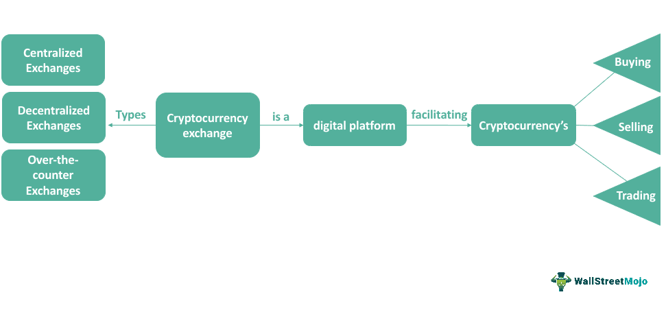

Cryptocurrency algorithmic trading is becoming increasingly popular among both professional traders and retail investors. This method leverages computer programs and algorithms to execute trades at speeds and frequencies that are impossible for human traders. The advantages of using algorithmic trading within the cryptocurrency market include enhanced trading efficiency, the ability to backtest strategies on historical data, and the reduction of emotional decision-making. As the cryptocurrency market continues to evolve, the importance of choosing the right exchange for successful trading cannot be overstated.

Selecting the appropriate cryptocurrency exchange is crucial for a trader's ability to successfully implement algorithmic strategies. Exchanges act as the intermediary, providing the infrastructure necessary for trading and often offering specific tools to support algorithmic traders. The right exchange will offer a combination of features such as API accessibility, advanced trading functionalities, robust security measures, and competitive fee structures. Each of these factors can significantly impact a trader’s ability to optimize algorithmic strategies and achieve desired financial outcomes.



This article will cover the key selection criteria that traders should consider when choosing a cryptocurrency exchange for algorithmic trading. These criteria include liquidity, security, trading fees, advanced trading features and tools, regulatory compliance, reputation, and user experience. By understanding these factors, traders will be better equipped to choose an exchange that aligns with their trading goals and enhances their algorithmic trading strategies.

## Table of Contents

## Understanding Cryptocurrency Algorithmic Trading

Algorithmic trading is a method of executing trades using automated pre-programmed trading instructions, accounting for variables such as time, price, and volume. This method has become increasingly prevalent in the cryptocurrency markets due to its ability to process large volumes of data and make trades at a speed and frequency that would be difficult for a human trader. In the context of cryptocurrencies, algorithmic trading leverages the volatile nature of digital assets to potentially yield profits based on short-term price swings or long-term market trends.

The use of algorithms in trading offers numerous advantages over manual trading. Primarily, algorithms can execute trades at a much quicker pace, allowing traders to capitalize on fleeting opportunities for profit. They reduce the risk of human error and emotional biases, adhering strictly to predefined trading strategies. Algorithms can analyze vast datasets far more efficiently than humans, facilitating informed decision-making based on complex calculations and historical data analysis.

Common algorithms employed in cryptocurrency trading include:

1. **Trend Following Algorithms**: These algorithms are designed to identify and exploit opportunities presented by market trends, buying assets that are showing an upward trajectory and selling those that are declining. They rely on indicators such as moving averages and channel breakouts.

2. **Mean Reversion Algorithms**: This strategy is based on the assumption that the price of a cryptocurrency will revert to its historical mean or average. Algorithms detect discrepancies from this average to identify buying or selling opportunities.

3. **Arbitrage Algorithms**: Cryptocurrency markets are decentralized and fragmented across multiple exchanges, leading to price discrepancies for the same assets on different platforms. Arbitrage algorithms capitalize on these differences by buying low on one exchange and selling high on another.

4. **Market Making Algorithms**: These algorithms provide liquidity to the markets by simultaneously offering to buy and sell a particular cryptocurrency, profiting from the bid-ask spread. They play a critical role in maintaining market efficiency and liquidity.

5. **Sentiment Analysis Algorithms**: By analyzing social media, news articles, and other public data sources, these algorithms assess market sentiment and make trading decisions based on the general mood towards the cryptocurrency market.

Algorithmic trading in cryptocurrencies allows for scalable and efficient trading strategies, minimizing costs and potentially enhancing returns. Its effectiveness hinges on the accuracy of the trading models, the speed of the trade execution, and the ability of algorithms to assess market conditions. As the [cryptocurrency](/wiki/cryptocurrency) market continues to mature, [algorithmic trading](/wiki/algorithmic-trading) is expected to play an even more significant role in how digital assets are bought and sold.

## The Role of Cryptocurrency Exchanges in Algo Trading

Cryptocurrency exchanges play a crucial role in facilitating algorithmic trading by providing a digital marketplace where automated buying and selling strategies are executed. Exchanges serve as the bridge between algorithmic traders and the cryptocurrency ecosystem, enabling robust trading opportunities through technical infrastructure and [liquidity](/wiki/liquidity-risk-premium) access.

There are primarily two types of cryptocurrency exchanges: centralized (CEXs) and decentralized (DEXs). Centralized exchanges are platforms managed by a centralized organization and function as intermediaries between buyers and sellers. These exchanges typically offer high liquidity, faster transaction speeds, and a broader range of trading pairs. Notable examples include Binance, Coinbase, and Kraken. Centralized exchanges implement advanced order types and trading features, which are vital for algorithmic trading, but they also require traders to deposit funds into the exchange's custodial wallets, which might pose security risks and dependence on the platform’s integrity.

In contrast, decentralized exchanges operate without a central authority, leveraging smart contracts and blockchain technology to facilitate peer-to-peer trades directly from users' wallets. DEXs provide enhanced privacy and control over funds. Platforms like Uniswap, SushiSwap, and PancakeSwap represent this category. While decentralized exchanges offer a higher level of control and security over personal assets, they often face challenges such as lower liquidity and slower transaction speeds, potentially impacting algorithmic strategies that require swift execution.

Exchanges enhance algorithmic trading by supporting a variety of features designed specifically for automated systems. One fundamental element is the availability and robustness of application programming interfaces (APIs). APIs offer programmatic access to the exchange’s trading engine, allowing algorithms to retrieve real-time market data, execute trades, and manage orders efficiently. Features such as REST and WebSocket APIs are commonly employed by developers to build and execute trading bots, ensuring they can monitor market conditions and respond to sudden changes with low latency.

Advanced order types offered by exchanges further bolster algorithmic trading strategies. These may include stop-loss orders, take-profit orders, and trailing stops, allowing algorithms to automate complex trade execution plans without constant oversight. Furthermore, access to in-depth historical data and real-time market data feeds is crucial for developing, testing, and refining algorithms. Exchanges typically provide extensive datasets comprising past trade histories and statistical data that algorithms require to train models and make informed predictions.

To summarize, cryptocurrency exchanges are pivotal in algorithmic trading by providing the necessary infrastructure, liquidity, and features that enable efficient and effective automated trading. The choice between centralized and decentralized platforms depends on the specific needs and risk preferences of traders, weighing factors such as security, control, and liquidity against each other to optimize algorithmic trading strategies.

## Key Selection Criteria for Cryptocurrency Exchanges

When selecting a cryptocurrency exchange for algorithmic trading, several key criteria must be considered to ensure optimal performance and security. These criteria include liquidity, security, and trading fees, each of which plays a fundamental role in the trading experience and strategy execution.

**Liquidity**

Liquidity is crucial in cryptocurrency trading as it determines how easily assets can be bought or sold without causing significant price fluctuations. High liquidity indicates a robust market with a high [volume](/wiki/volume-trading-strategy) of buyers and sellers, allowing traders to execute trades quickly and at predictable prices. In algorithmic trading, where speed and precision are critical, liquidity ensures that algorithms can function efficiently without encountering slippage or delays.

To assess liquidity on a cryptocurrency exchange, traders can examine the trading volume, [order book](/wiki/order-book-trading-strategies) depth, and bid-ask spreads. High trading volumes and deeper order [books](/wiki/algo-trading-books) generally indicate a more liquid market. The bid-ask spread, which represents the difference between the highest price a buyer is willing to pay and the lowest price a seller is willing to accept, should be narrow for a liquid market. A low spread suggests that trades can be executed with minimal price impact, which is advantageous for algorithmic strategies.

**Security**

Security is paramount when selecting a cryptocurrency exchange, as it safeguards the assets and sensitive information of its users. Strong security measures protect against potential threats such as hacking, fraud, and unauthorized access. Key security features to look for include two-[factor](/wiki/factor-investing) authentication (2FA), encryption protocols, cold storage solutions, and regular security audits.

Exchanges with robust security frameworks often invest in insurance policies to protect their users' funds. These insurance policies can cover losses in cases of security breaches or system failures, providing an additional layer of assurance to traders.

**Trading Fees**

Trading fees are a critical consideration for algorithmic traders, as they directly affect the profitability of trading strategies. Cryptocurrency exchanges typically charge fees in several forms: maker fees, taker fees, withdrawal fees, and sometimes deposit fees. Maker fees apply to orders that add liquidity to the order book, while taker fees are for orders that remove liquidity.

A favorable fee structure for algorithmic trading is one where the maker fees are lower or even zero, incentivizing traders to provide liquidity. Additionally, exchanges that offer tiered fee structures based on trading volume can be beneficial for high-frequency traders, as increased trading activity can lead to reduced fees.

To calculate the impact of trading fees on profitability, consider the following Python snippet to estimate the total cost of executing multiple trades:

```python
def calculate_total_cost(trades, maker_fee, taker_fee, volume_discount=0):
    total_cost = 0
    for trade in trades:
        if trade['type'] == 'maker':
            fee = maker_fee - volume_discount
        else:
            fee = taker_fee - volume_discount
        total_cost += trade['amount'] * fee
    return total_cost

# Example usage
trades = [{'type': 'maker', 'amount': 5000}, {'type': 'taker', 'amount': 3000}]
maker_fee = 0.001  # 0.1%
taker_fee = 0.002  # 0.2%
volume_discount = 0.0005  # 0.05% discount

print(calculate_total_cost(trades, maker_fee, taker_fee, volume_discount))
```

By understanding and evaluating these three criteria—liquidity, security, and trading fees—traders can make informed decisions about which cryptocurrency exchange best aligns with their trading strategy and risk tolerance. Selecting the appropriate exchange as per these parameters is crucial for the successful execution of algorithmic trading strategies.

## Advanced Trading Features and Tools

Cryptocurrency exchanges play a critical role in facilitating algorithmic trading by offering advanced features and tools that enable seamless and efficient trade execution. These tools help traders implement complex strategies, manage risks, and maximize profits. 

API accessibility is fundamental for algorithm integration in cryptocurrency exchanges. A well-documented and robust API allows traders to connect their custom algorithms to the exchange's systems, enabling real-time data access and automated trade execution. Reliability, latency, and uptime are crucial components of a good API, as they ensure uninterrupted trading operations. Popular programming languages for interacting with exchange APIs include Python and JavaScript, due to their strong library support and ease of use.

Advanced order types are vital for implementing sophisticated trading strategies. Cryptocurrency exchanges often support a variety of orders beyond the basic market and limit orders. These may include stop orders, which execute once the price reaches a specified level; trailing stop orders, which move with the market price; and iceberg orders, designed to hide the full size of an order by breaking it into smaller lots. The availability of these features assists traders in automating complex strategies that react dynamically to market changes.

Access to historical and real-time market data feeds is another critical aspect of algorithmic trading on cryptocurrency exchanges. Historical data allows traders to backtest and validate strategies against past market conditions. Exchanges typically provide large datasets, which can include tick-by-tick data, OHLC (open, high, low, close) data, and volume information. Real-time feeds ensure that algorithms have up-to-date information to react swiftly to market movements. Data quality, granularity, and the speed at which new data is available are important considerations when choosing an exchange for algorithmic trading.

In conclusion, the advanced trading features and tools provided by cryptocurrency exchanges — including robust APIs, diverse order types, and comprehensive data access — are essential for the effective execution of algorithmic trading strategies. These features enable traders to leverage technology in managing trades, analyzing market trends, and optimizing performance.

## Regulatory Compliance and Jurisdiction

Cryptocurrency exchanges that comply with regulatory standards play a crucial role in safeguarding the interests of traders and investors. Regulatory compliance ensures that an exchange adheres to established financial laws and standards set by governmental bodies. These regulations aim to maintain financial stability, protect investor funds, and prevent illegal activities like money laundering and fraud. Compliance creates a more secure trading environment, fostering trust and confidence among users.

Operational jurisdiction significantly influences how an exchange functions. It defines the legal framework within which an exchange operates, affecting everything from transaction handling and dispute resolution to taxation. Jurisdictions that offer clear and supportive regulatory frameworks can attract more users, as traders often prefer exchanges that operate under predictable and transparent legal conditions. For instance, exchanges based in countries with stringent regulations tend to have higher compliance levels, reducing the risk of fraudulent activities and enhancing user protection.

Legal implications and protections offered by a compliant exchange are paramount for traders. Regulatory bodies may mandate insurance coverage to protect against potential losses from hacks or operational failures, thereby mitigating financial risk for users. Additionally, exchanges operating under well-established jurisdictions must adhere to strict anti-money laundering (AML) and know your customer (KYC) protocols, which are essential for maintaining the integrity and security of the trading environment. These protections ensure that exchanges can provide recourse in the event of a dispute, offering traders the legal backing necessary to safeguard their interests.

In summary, choosing an exchange that is compliant with relevant regulatory bodies, operating in a favorable jurisdiction, provides traders with essential legal safeguards. This choice can significantly impact the effectiveness and security of their algorithmic trading strategies, emphasizing the importance of regulatory compliance in the evolving landscape of cryptocurrency trading.

## Reputation and User Experience

Evaluating the reputation and reliability of cryptocurrency exchanges involves a multifaceted approach. A well-reputed exchange is often characterized by transparency, historical performance, and community perception. Many traders rely on user reviews and industry reports to gauge an exchange's trustworthiness. A strong correlation exists between an exchange's reputation and its adherence to regulatory standards, security protocols, and responsiveness to market changes.

The user interface (UI) and experience (UX) significantly affect an algorithmic trader's efficiency and satisfaction. A well-designed interface enables traders to navigate the platform effortlessly, access important metrics and data, and manage their trading activities seamlessly. Key elements of a good UI/UX for algorithmic traders include intuitive dashboard layouts, customizable interfaces, and straightforward navigation systems. Advanced visualization tools and performance analytics are also crucial, allowing traders to analyze large datasets and execute trades quickly.

Customer support responsiveness and quality are vital aspects affecting an exchange's reputation. Users should find comprehensive support channels, including live chat, email, and community forums. An effective customer service team should be knowledgeable, able to resolve technical issues swiftly, and assist with complex inquiries related to algorithmic trading. Quick response times can be crucial in times of market [volatility](/wiki/volatility-trading-strategies), where delays might lead to substantial financial losses. 

Cryptocurrency exchanges that excel in reputation and user experience often rank higher in user reviews and industry assessments, making them a preferred choice for both novice and seasoned traders. Platforms such as Coinbase, Binance, and Kraken often receive positive feedback for their user-centric designs and customer support, highlighting their commitment to providing a reliable and user-friendly trading environment for algorithmic traders.

## Case Studies: Top Exchanges for Cryptocurrency Algo Trading

Cryptocurrency algorithmic trading has gained traction, necessitating the use of reliable exchanges that offer robust features to facilitate this advanced trading approach. This section explores some of the top exchanges renowned for their support of algorithmic trading, comparing their offerings and presenting case studies of successful traders who have utilized these platforms effectively.

### Binance

**Features and Fees:** Binance is one of the world's leading cryptocurrency exchanges, known for its extensive range of supported cryptocurrencies and powerful API integration, which is crucial for algorithmic traders. It offers a tiered fee structure, beginning at 0.1% for both makers and takers, with discounts available through the use of the platform's native token, BNB.

**User Feedback:** Traders appreciate Binance for its depth of liquidity, which is essential for executing large algorithmic trades without significant price impact. The exchange also receives positive feedback for its comprehensive suite of tools, including spot, futures, and options trading.

**Case Study:** A trading firm specializing in high-frequency trading reported leveraging Binance's API to execute over 100 trades per second across multiple trading pairs. The firm's success was attributed to Binance’s robust infrastructure and high liquidity, which minimized slippage and maximized execution speed.

### Coinbase Pro

**Features and Fees:** Coinbase Pro is notable for its strong security protocols and compliance with regulatory standards. The platform features advanced charting and trading tools, suitable for algorithmic traders. Its fee structure is based on a maker-taker model, starting at 0.5% but decreasing with higher trading volumes.

**User Feedback:** Users often highlight Coinbase Pro’s user-friendliness and its strong reputation for security and trustworthiness. However, some traders note that the fees can be slightly higher compared to other exchanges.

**Case Study:** An individual trader, utilizing market-making algorithms on Coinbase Pro, managed to capitalize on the exchange's liquidity and regulatory compliance to achieve a consistent profit margin, while adhering to compliance requirements seamlessly.

### Kraken

**Features and Fees:** Kraken is known for its strong security measures and diverse range of cryptocurrencies. It offers algorithmic traders features like futures trading and margin trading. The fees are competitive, with spot trading fees starting from 0.16% for makers and 0.26% for takers.

**User Feedback:** Kraken is praised for its security and extensive API options, which facilitate sophisticated trading strategies. Some users, however, report occasional issues with platform stability during high volatility periods.

**Case Study:** A hedge fund leveraged Kraken's API to deploy an arbitrage strategy across various trading pairs. The fund highlighted Kraken’s security features as critical in protecting their investments against potential breaches.

### Bitfinex

**Features and Fees:** Bitfinex is especially well-regarded for its wide array of order types and margin trading capabilities. The exchange supports algorithmic trading with an advanced API and offers competitive fees starting at 0.1% for makers and 0.2% for takers.

**User Feedback:** Users commend Bitfinex for its comprehensive set of advanced trading features, though it is often perceived as more suitable for experienced traders due to its complex interface.

**Case Study:** A professional trader used Bitfinex's API to implement a sophisticated market-neutral trading strategy, taking advantage of the diverse order types and margin trading features. This approach led to consistent returns, demonstrating the exchange's capability to support complex trading operations.

### Conclusion

Selecting the right cryptocurrency exchange is pivotal in optimizing algorithmic trading strategies. Platforms like Binance, Coinbase Pro, Kraken, and Bitfinex offer unique features, competitive fees, and robust security measures that cater to different trading needs. Successful traders continuously adapt and leverage these exchanges' specific strengths to enhance their trading outcomes. Ultimately, understanding the features and reputations of these exchanges can empower traders to make informed decisions that align with their trading objectives.

## Conclusion

Selecting the appropriate cryptocurrency exchange is pivotal for the success of algorithmic trading strategies. As explored in this article, several key criteria must be taken into account. Liquidity is essential, as it ensures that buy and sell orders can be executed rapidly at desired prices, minimizing slippage. Security measures, including robust encryption protocols and insurance policies, are critical for safeguarding assets against potential breaches. Trading fees should be scrutinized to optimize cost efficiency, as frequent trading can significantly impact profitability.

Advanced trading features, such as comprehensive APIs and access to historical and real-time market data, facilitate seamless integration of trading algorithms and the execution of complex strategies. Compliance with regulatory standards provides legal protections and enhances the integrity and reliability of trading operations. Additionally, the reputation of the exchange, coupled with user-friendly interfaces and responsive customer support, contribute to a positive trading experience.

Traders should thoroughly research and evaluate exchanges based on these criteria, considering their personal trading needs and objectives. By aligning an exchange's offerings with specific algorithmic strategies, traders can maximize their trading efficacy and potential returns. The choice of exchange is not a mere logistical decision; it is a strategic one that can fundamentally influence the success of trading activities. Therefore, due diligence and thoughtful consideration are imperative for any trader aiming to optimize their algorithmic trading endeavors.

## References & Further Reading

[1]: Bergstra, J., Bardenet, R., Bengio, Y., & Kégl, B. (2011). ["Algorithms for Hyper-Parameter Optimization."](https://papers.nips.cc/paper/4443-algorithms-for-hyper-parameter-optimization) Advances in Neural Information Processing Systems 24.

[2]: ["Advances in Financial Machine Learning"](https://www.amazon.com/Advances-Financial-Machine-Learning-Marcos/dp/1119482089) by Marcos Lopez de Prado

[3]: ["Evidence-Based Technical Analysis: Applying the Scientific Method and Statistical Inference to Trading Signals"](https://www.amazon.com/Evidence-Based-Technical-Analysis-Scientific-Statistical/dp/0470008741) by David Aronson

[4]: ["Machine Learning for Algorithmic Trading"](https://github.com/stefan-jansen/machine-learning-for-trading) by Stefan Jansen

[5]: ["Quantitative Trading: How to Build Your Own Algorithmic Trading Business"](https://www.amazon.com/Quantitative-Trading-Build-Algorithmic-Business/dp/1119800064) by Ernest P. Chan