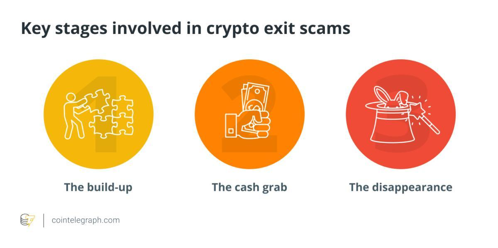

## Table of Contents

## What is a cryptocurrency exit scam?

A cryptocurrency exit scam happens when the people who started a cryptocurrency project suddenly take all the money and disappear. They usually do this after they have convinced a lot of people to invest in their project. The investors are left with nothing because the value of the cryptocurrency drops to zero when everyone finds out about the scam.

These scams are common in the world of cryptocurrencies because it's easy to start a new project without much oversight. The scammers often promise big returns and use social media to make their project look legitimate. It's important for investors to be careful and do a lot of research before putting money into any cryptocurrency project.

## How can I identify the early signs of an exit scam?

To spot an early sign of an exit scam, pay attention to how the project team acts. If the team suddenly stops sharing updates or becomes hard to reach, this could be a red flag. Scammers often go quiet when they are planning to run away with the money. Also, watch out if the project's website or social media accounts start to disappear or if the team starts to remove information about themselves.

Another warning sign is if the project promises unrealistically high returns in a short time. If it sounds too good to be true, it probably is. Be suspicious if the team pressures you to invest quickly or if they keep asking for more money without showing real progress. It's wise to do your own research and look for reviews from other people before you decide to invest.

Lastly, be careful if you see the project's value going up and down a lot without clear reasons. Sudden, unexplained price spikes can be a tactic used by scammers to attract more investors before they pull the plug. Always check if the project has a clear plan and if it's backed by a team with a good reputation. If something feels off, it's better to stay away and protect your money.

## What are common tactics used by scammers in cryptocurrency exit schemes?

Scammers in [cryptocurrency](/wiki/cryptocurrency) [exit](/wiki/exit-strategy) schemes often use fake promises to trick people. They say their project will make a lot of money fast, which sounds exciting but is usually not true. They might show fake charts or success stories to make their project look good. They also use social media a lot to make their project seem popular and trustworthy. They might even pay people to say good things about their project online.

Another common trick is to make it hard to get your money back. Scammers might say you need to wait a long time before you can take your money out, or they might make the process so complicated that people give up. They might also suddenly change the rules or the way the project works, which can confuse investors and make it easier for the scammers to steal the money. If the project's leaders start to disappear or stop talking to people, it's a big warning sign that an exit scam might be happening.

## How do exit scams differ from other types of cryptocurrency fraud?

Exit scams are different from other types of cryptocurrency fraud because they happen at the end of a project. In an exit scam, the people who started the project take all the money and disappear after they have convinced many people to invest. This is different from other frauds like Ponzi schemes, where the fraud keeps going by using new investors' money to pay old investors. In an exit scam, the fraud stops suddenly, and everyone loses their money at once.

Other types of cryptocurrency fraud might include fake initial coin offerings (ICOs), where scammers create a new cryptocurrency and sell it to people, but the project never really exists. There are also phishing scams, where fraudsters trick people into giving them their private keys or passwords. Unlike exit scams, these other frauds might not involve a sudden end to the project; instead, they can keep going until they are found out or until the scammers decide to stop. The main difference is that exit scams focus on the end game, where the scammers run away with all the money, while other frauds might have different ways of tricking people over a longer time.

## What role do smart contracts play in exit scams?

Smart contracts can be used in exit scams because they let scammers set up rules that automatically happen when certain things are done. For example, a scammer might make a smart contract that lets them take all the money out of the project if a certain condition is met, like a date or a certain amount of money being reached. This means they can plan their escape and make it happen without anyone knowing until it's too late.

But smart contracts can also help stop exit scams if they are made well. If the rules in the smart contract are clear and fair, and if they are checked by a lot of people, it can be harder for scammers to trick people. So, it's important for people to understand how the smart contract works and to be careful about what they are agreeing to before they invest in any cryptocurrency project.

## How can blockchain analysis help in detecting exit scams?

Blockchain analysis can help in detecting exit scams by looking at the movement of money on the blockchain. When people do a lot of research on the blockchain, they can see if money is being moved in strange ways. For example, if a lot of money is suddenly being sent to one place, or if the people running the project are moving money to their own accounts, it could be a sign of an exit scam. By keeping an eye on these money movements, experts can warn others before it's too late.

Another way blockchain analysis helps is by looking at the history of the people involved in the project. If the people running the project have been part of other projects that failed or were scams, it's a big warning sign. Blockchain analysis tools can find these connections and help people make better choices about where to put their money. By using these tools, people can protect themselves from getting tricked by exit scams.

## What are the legal implications of being involved in an exit scam?

If you are involved in an exit scam, you could face serious legal problems. In many countries, running an exit scam is considered fraud, which is a crime. If you get caught, you might have to go to court and could end up in jail. The laws are strict because exit scams hurt a lot of people and take away their money. Governments and law enforcement agencies are working hard to stop these scams and punish the people who do them.

Being part of an exit scam can also lead to other legal troubles. For example, if you helped the scammers by promoting their project, you could be charged with being an accomplice to fraud. This means you could be in trouble even if you didn't take the money yourself. It's important to be careful and make sure you are not helping scammers, because the legal consequences can be very serious and can affect your life for a long time.

## How can investors protect themselves from falling victim to exit scams?

Investors can protect themselves from exit scams by doing a lot of research before they put their money into a cryptocurrency project. They should check the background of the people running the project and see if they have been involved in any other scams before. It's also important to read reviews and see what other people are saying about the project. If something sounds too good to be true, it probably is. Investors should be careful of projects that promise big returns in a short time and should always take their time to understand the project fully before investing.

Another way to stay safe is to keep an eye on how the project is doing. If the people running the project start to disappear or stop giving updates, that could be a sign of an exit scam. Investors should also be careful if they see the project's value going up and down a lot without clear reasons. Using blockchain analysis tools can help too, because these tools can show if money is being moved in strange ways. By being careful and doing their homework, investors can avoid falling victim to exit scams and protect their money.

## What are the best practices for due diligence before investing in a cryptocurrency project?

Before you put your money into a cryptocurrency project, it's really important to do a lot of research. Start by looking at the people who are running the project. Check their past work and see if they have been involved in any scams before. You can also look at their social media and online profiles to see if they seem trustworthy. Read reviews and see what other people are saying about the project. If a lot of people are complaining or if the project promises to make you a lot of money very quickly, be very careful. It's also a good idea to look at the project's website and read their plan carefully. Make sure you understand what the project is trying to do and how they plan to do it.

Another important part of doing your homework is to look at the project's financials. Use blockchain analysis tools to see how money is being moved around. If you see a lot of money going to one place or if the people running the project are moving money to their own accounts, that could be a warning sign. Also, keep an eye on how the project is doing over time. If the people in charge start to disappear or stop giving updates, that's a big red flag. By taking your time and doing a lot of research, you can make a better decision about whether to invest in a cryptocurrency project and protect your money from scams.

## How can machine learning and AI be used to predict and identify exit scams?

Machine learning and AI can help predict and identify exit scams by looking at a lot of data and finding patterns that might be hard for people to see. These technologies can be trained to recognize signs of an exit scam, like sudden changes in how money is moved around or if the people running the project start to disappear. By analyzing past data from known scams, [machine learning](/wiki/machine-learning) models can learn what to look for and then use that knowledge to watch new projects. If the model sees something that looks like an exit scam, it can warn people before they invest their money.

AI can also be used to keep an eye on social media and online forums where people talk about cryptocurrency projects. By reading what people are saying, AI can pick up on warning signs like a lot of negative comments or if the project's team stops responding to questions. This can help catch an exit scam early, before it's too late. By using machine learning and AI, investors can get help in spotting the red flags of an exit scam and make smarter choices about where to put their money.

## What are the psychological factors that make exit scams successful?

Exit scams work because they play on people's hopes and fears. Scammers promise big, quick profits, which can make people excited and want to invest without thinking too much. They use stories of other people making money to make their project seem real and trustworthy. This can make people feel like they don't want to miss out on a good opportunity, so they invest without doing enough research.

Also, scammers often create a sense of urgency, telling people they need to invest right away or they'll miss out. This pressure can make people act quickly without checking if the project is safe. Scammers might also use fake updates and news to keep people feeling hopeful and trusting, even when the project is really a scam. By understanding these tricks, people can be more careful and protect themselves from falling for exit scams.

## How have regulatory bodies responded to the increase in cryptocurrency exit scams?

Regulatory bodies around the world have been working hard to stop cryptocurrency exit scams. They have made new rules to make sure that people who start cryptocurrency projects have to be more open about what they are doing. This means they have to tell investors more about their plans and who is running the project. Some countries have also set up special groups to watch the cryptocurrency market and catch scammers. If someone is caught running an exit scam, they can be fined a lot of money or even go to jail.

Regulators are also trying to help people learn more about how to stay safe when investing in cryptocurrencies. They share information and warnings about common scams and what to look out for. They work with other countries to share information and stop scammers from moving to different places to keep scamming people. By making these changes, regulatory bodies hope to make the cryptocurrency market safer and stop exit scams from happening so often.

## References & Further Reading

[1]: Bonneau, J., Miller, A., Clark, J., Narayanan, A., Kroll, J. A., & Felten, E. W. (2015). ["SoK: Research Perspectives and Challenges for Bitcoin and Cryptocurrencies."](https://ieeexplore.ieee.org/document/7163021) 2015 IEEE Symposium on Security and Privacy.

[2]: Zohar, A. (2015). ["Bitcoin: under the hood."](https://dl.acm.org/doi/10.1145/2701411) Communications of the ACM, 58(9), 104-113.

[3]: Conti, M., Kumar, E. S., Lal, C., & Ruj, S. (2018). ["A survey on security and privacy issues of Bitcoin."](https://ieeexplore.ieee.org/document/8369416) IEEE Communications Surveys & Tutorials, 20(4), 3416-3452.

[4]: Howell, S. T., Niessner, M., & Yermack, D. (2018). ["Initial Coin Offerings: Financing growth with cryptocurrency token sales."](https://www.nber.org/papers/w24774) The Review of Financial Studies, 33(7), 001-070.

[5]: Lee, M. D. (2020). ["Cryptocurrency Algorithms and Machines: An Introduction."](https://www.ncbi.nlm.nih.gov/pmc/articles/PMC9739450/) CRC Press.