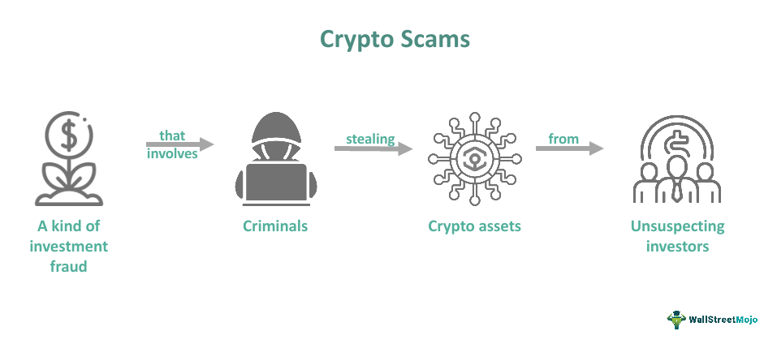

Cryptocurrency exit scams, commonly known as 'rug pulls', are a critical issue that has increasingly plagued the digital finance sector. In these scams, crypto project developers suddenly disappear with investors’ money, often resulting in severe financial damage to unsuspecting participants. This type of fraud has been facilitated by the rise of decentralized finance (DeFi) platforms, which allow individuals to launch new tokens with minimal oversight or regulatory scrutiny.

Decentralized finance has democratized financial operations, but it has also created fertile ground for fraudulent schemes. These platforms make it easier for scammers to operate, as they provide tools for launching initial coin offerings (ICOs) or forming new tokens that appear legitimate to investors. Scammers typically exploit the lack of regulatory oversight, creating enticing projects that promise high returns with minimal risk. Once sufficient investment capital has been amassed, the perpetrators execute a 'rug pull', leaving investors with worthless tokens and no recourse to regain their lost funds.



Understanding the mechanics of these scams is critical for market participants. Recognizing red flags, such as unrealistic promises or unverifiable project teams, can prevent individuals from falling victim. Moreover, advancements in technology, such as algorithmic trading, have become instrumental in detecting fraudulent activities. By using sophisticated algorithms, these systems can identify suspicious patterns and trading activities that might otherwise go unnoticed by human observers.

This article examines the alarming frequency and sophistication of exit scams in the cryptocurrency marketplace. It will address the operational methods used by fraudsters, identify warning signs of potential scams, and explore how algorithmic tools can assist in preventing such deceptive practices. As the cryptocurrency space continues to evolve, staying informed and implementing these countermeasures is crucial for safeguarding investments and maintaining trust in the digital finance landscape.

## Table of Contents

## Understanding Cryptocurrency Exit Scams

Cryptocurrency exit scams typically exploit investment vehicles such as Initial Coin Offerings (ICOs) and decentralized finance (DeFi) platforms. These scams begin with the creation and promotion of a cryptocurrency project, often supported by an intricate marketing scheme designed to attract potential investors. The project developers lure investors by promising groundbreaking technology, substantial returns, and unique market solutions, often presented through appealing white papers and engaging digital campaigns.

In the initial phase, the project appears legitimate, with developers actively interacting with potential investors and the community through various channels such as social media, forums, and official websites. However, once a substantial sum has been invested, these developers abandon the project and abscond with the funds, leaving investors with tokens that are effectively worthless. This act of disappearing with investor money is commonly referred to as a "rug pull."

Exit scams not only inflict financial losses on individual investors but also erode trust in [cryptocurrency](/wiki/cryptocurrency) markets. They contribute to the [volatility](/wiki/volatility-trading-strategies) associated with digital assets and deter potential investors from participating in otherwise legitimate projects. The market impact is exacerbated when scams target nascent DeFi platforms, which, due to their decentralized and less regulated nature, can be particularly vulnerable to fraudulent schemes.

A typical [exit](/wiki/exit-strategy) scam scenario may unfold as follows: a developer creates a new token and initiates a sale through an ICO or engages with a DeFi [liquidity](/wiki/liquidity-risk-premium) pool. As the tokens are distributed and trading commences, artificial hype is generated to boost demand and inflame speculative interest. This often results in a significant increase in the token’s market value. However, as sell orders start to outnumber buy orders—usually set off by suspicious spikes in trading [volume](/wiki/volume-trading-strategy) or unexplained delays in project updates—investors may notice that communication from the developers becomes sparse or ceases altogether. Eventually, platforms and communication channels may shut down, reflecting the completion of the scam.

The impact of such scams extends beyond individual losses, affecting broader market dynamics by fostering skepticism towards new projects, regardless of their legitimacy. This general distrust can stagnate the growth of genuine innovations within the cryptocurrency ecosystem, emphasizing the urgent need for vigilant strategies and robust regulatory frameworks to mitigate the risk of exit scams.

## Operation Mechanisms of Exit Scams

Cryptocurrency exit scams, often orchestrated during periods of heightened interest in digital assets, employ multiple sophisticated mechanisms to deceive investors and abscond with their funds. One common tactic involves creating a buzz through aggressive marketing strategies. Scammers frequently employ social media influencers, paid advertisements, and community engagement on platforms such as Telegram and Discord to promote the credibility of their project. These campaigns aim to generate enthusiasm and FOMO (Fear of Missing Out) among potential investors, thereby driving them to invest hastily without conducting thorough due diligence.

A crucial step in legitimizing their project is the creation of fraudulent documentation. Scammers often produce compelling white papers that mimic the structure and depth of legitimate cryptocurrency endeavors. These documents are often embellished with technical jargon and impressive graphics to appear convincing to even seasoned investors. The white papers typically detail unrealistic features and promised returns that are strategically designed to allure investors.

Moreover, to enhance the project's visibility and perceived authenticity, scammers list the token on decentralized exchanges (DEXs). These exchanges, due to their open nature, allow any token to be listed with minimal oversight. By listing the token on a DEX, scammers leverage the platform’s reputation and user base to reach a wider audience, giving the illusion of a valid market presence.

Once they have successfully raised a substantial amount of funds, scammers execute a 'rug pull'. This term describes the abrupt withdrawal of liquidity by the project developers, effectively collapsing the market for the token and leaving investors with worthless digital assets. In a typical ‘rug pull’, the liquidity provider — usually the project team — removes their token pair from the liquidity pool on the decentralized exchange. This action results in the dramatic plummet of the token's price, effectively erasing the value of all investments made by unsuspecting participants.

In some cases, scammers may use smart contracts that contain backdoors, allowing them to seize control of investor funds under certain conditions. The slight complexity of blockchain technology often shields such malicious activities from easy detection until it is too late for investors to withdraw their funds. Consequently, the combination of deceptive marketing, fraudulent documentation, and strategic exploitation of decentralized finance platforms creates a potent formula for cryptocurrency exit scams.

## Red Flags for Identifying Potential Exit Scams

Cryptocurrency exit scams are often designed to entice unsuspecting investors with outlandish promises and appealing narratives. A critical red flag is the guarantee of high returns on investment, which is rarely feasible in the volatile and unpredictable world of cryptocurrencies. Legitimate projects typically present potential risks and realistic returns, whereas scams rely on exaggerated claims to attract investments.

An essential aspect to scrutinize is the project's team. Projects with anonymous or unverifiable team members pose a significant risk. Transparency regarding the team's background and experience is crucial for assessing the project's credibility. Investors should be wary if they cannot find verifiable information about the individuals behind a project, as anonymity often shields scammers from accountability.

Evaluating the project’s progress towards a minimum viable product (MVP) can also reveal potential scams. A project that remains purely conceptual without demonstrable progress or a clear roadmap to launch an MVP warrants suspicion. Established projects usually have a working product or clear development milestones, differentiating them from fraudulent schemes.

Another indication of a potential scam is heavy promotional activity without corresponding substance. Projects that invest heavily in marketing campaigns but offer little in terms of technical documentation or real utility should be approached with caution. Excessive hype, especially if driven by social media influencers or paid endorsements without substantial technological backing, is often employed by scammers to inflate interest and investment.

By meticulously analyzing these factors, investors can better protect themselves from falling victim to cryptocurrency exit scams.

## The Role of Algorithmic Trading in Detecting Frauds

Algorithmic trading has emerged as a potent tool in detecting fraudulent activities within the cryptocurrency space, where traditional methods often fall short due to the decentralized and anonymous nature of transactions. By automating the trading process, algorithms can scrutinize vast amounts of data, identify patterns, and detect anomalies that may signal fraudulent activities, such as exit scams or rug pulls.

The strength of [algorithmic trading](/wiki/algorithmic-trading) lies in its use of [machine learning](/wiki/machine-learning) (ML) models to detect unusual trading behaviors. Machine learning algorithms are capable of processing and analyzing large datasets to uncover subtle patterns indicating potential fraud. For example, sudden spikes in buying activity followed by significant sell-offs could suggest a rug pull is imminent. These patterns are often too complex or occur too quickly for human traders to identify in real time.

Machine learning models used in algorithmic trading include supervised, unsupervised, and [reinforcement learning](/wiki/reinforcement-learning). Supervised learning models can be trained on historical data to predict future anomalies, using features such as transaction volume, price volatility, and buy-sell order discrepancies. Unsupervised learning models, such as clustering algorithms, can group similar transactions and identify outliers that deviate from established norms. Reinforcement learning models can optimize trading strategies by adjusting parameters based on feedback from the market environment.

Algorithmic systems can also incorporate natural language processing (NLP) to analyze textual data from social media, news outlets, and forums. For instance, a sudden influx of positive news across social media, not supported by legitimate developments, could trigger a skeptical investigation by the algorithm, allowing for preemptive action against a suspected exit scam.

An example of a simple machine learning approach in Python could involve using a decision tree classifier to predict potential fraudulent activities:

```python
from sklearn.tree import DecisionTreeClassifier
from sklearn.model_selection import train_test_split
from sklearn.metrics import accuracy_score
import pandas as pd

# Load dataset
data = pd.read_csv('crypto_trading_data.csv')
X = data[['volume', 'price_change', 'transaction_count']]
y = data['scam_likelihood']

# Split data into training and test sets
X_train, X_test, y_train, y_test = train_test_split(X, y, test_size=0.3, random_state=42)

# Initialize and train decision tree classifier
clf = DecisionTreeClassifier()
clf.fit(X_train, y_train)

# Predict and evaluate model
y_pred = clf.predict(X_test)
accuracy = accuracy_score(y_test, y_pred)
print(f"Model accuracy: {accuracy}")
```

Algorithmic trading systems continuously evolve by integrating real-time data feeds and adapting to new fraudulent tactics. As these systems become more sophisticated, their ability to identify and prevent fraudulent activities in the cryptocurrency market will enhance, providing a safer environment for investors. While no system can offer absolute certainty, the combination of data-driven insights and predictive modeling significantly enhances the ability to preemptively identify and mitigate the risk posed by exit scams.

## Examples of Notable Cryptocurrency Exit Scams

Cryptocurrency exit scams have become notorious for their ability to exploit investor trust and disappear with significant sums of money. Some high-profile cases demonstrate the mechanisms and impact of these fraudulent activities within the digital currency market.

One notorious case is Confido, a cryptocurrency project that staged an exit scam in 2017. The project had attracted significant attention through an initial coin offering (ICO), promising to revolutionize the crypto transaction space with smart contracts. However, after raising approximately $375,000, the team behind Confido evaporated overnight. This sudden disappearance led to a dramatic plunge in the project's market capitalization, leaving investors with worthless tokens. The Confido case exemplifies how exit scams can operate and the financial devastation they can cause.

Another significant example is LoopX, a crypto project that promised substantial returns through proprietary trading algorithms. The project successfully raised about $4.5 million through a combination of Bitcoin and Ethereum from investors. In early 2018, shortly after acquiring the funds, the LoopX development team vanished, taking with them all the funds raised and rendering any remaining project assets useless. LoopX's scam highlighted the critical importance of thorough vetting and skepticism of projects offering guaranteed returns without transparent and verifiable operations.

In 2020, the Yfdex.Finance scam represented one of the most rapid cryptocurrency exit scams recorded. Within just two days, the developers behind Yfdex.Finance absconded with $20 million. The scam involved releasing attractive yield farming promises across various social media platforms, leveraging the growing interest in decentralized finance (DeFi) projects. Once enough funds were accumulated, the developers dismantled their online presence, leading to substantial financial losses for investors. This incident stressed the vulnerabilities within the DeFi space and underscored the need for caution when engaging with new and unproven projects.

These examples illustrate the various tactics employed in cryptocurrency exit scams and the substantial financial impact on victims. Each case underscores the necessity for potential investors to exercise due diligence, critically evaluate project credibility, and remain vigilant against the lure of quick profits in the cryptocurrency market.

## Reporting and Recovering from Scam Activities

Reporting exit scams to financial regulators and law enforcement agencies is crucial in addressing fraud in the cryptocurrency sector. Timely reporting can aid in the investigation and potentially lead to the recovery of lost funds. Additionally, using decentralized platforms for reporting can enhance the chances of identifying and apprehending scammers early in their fraudulent activities.

### Steps for Reporting Cryptocurrency Exit Scams

1. **Gather Evidence:** Before reporting the scam, collect all relevant information and evidence. This includes transaction IDs, communication with the project team, promotional materials, and any promises made by the project promoters.

2. **Contact Financial Regulators:** Different countries have specific agencies responsible for overseeing financial activities. In the United States, the Securities and Exchange Commission (SEC) and the Commodity Futures Trading Commission (CFTC) handle such cases. The Financial Conduct Authority (FCA) is the equivalent in the United Kingdom. Providing them with detailed information can initiate an investigation into the scam.

3. **Engage Law Enforcement:** File a report with local law enforcement agencies. In many countries, cybercrime units specialize in dealing with online fraud, including cryptocurrency scams. They can collaborate with international agencies if the scam extends beyond national borders.

4. **Use Online Reporting Platforms:** Websites like [ICO Scam List](https://www.icoholder.com/en/scams) and [CoinScam](https://www.coinscam.org/) allow users to report fraudulent activities. These platforms maintain a database of scam projects, helping other investors stay informed.

5. **Notify Cryptocurrency Exchanges:** If the tokens were listed on exchanges, inform these platforms. Exchanges can delist the fraudulent token, preventing further investments and reducing the chances of additional victimization.

### Potential Recovery Steps

Recovering funds from an exit scam is challenging due to the pseudonymous nature of blockchain transactions. Nevertheless, several strategies can be pursued:

- **Utilize Blockchain Analytics Firms:** These companies can trace blockchain transactions and potentially identify the final destination of the stolen funds. Firms like Chainalysis and Elliptic specialize in these services, often collaborating with law enforcement.

- **Engage with Legal Experts:** Some legal firms specialize in cryptocurrency and blockchain technology. They can assist in navigating the complex legal landscape to try and recover funds.

- **Consider a Class-Action Lawsuit:** If multiple investors are affected, a class-action lawsuit could increase the likelihood of recovery. Such an approach combines resources and presents a stronger case against the perpetrators.

### The Role of Decentralized Reporting Platforms

Decentralized reporting platforms are emerging as a powerful tool in combating cryptocurrency fraud. These platforms, based on blockchain technology, allow transparent and immutable reporting of fraudulent activities. By leveraging smart contracts, these systems can automatically alert users and other stakeholders about suspicious activities, leading to quicker responses.

For example, a blockchain-based reporting system can maintain a public record of complaints against a specific crypto project. This transparency deters potential scammers and provides investors with a reference point for due diligence.

In conclusion, while the immediate recovery of funds in the wake of an exit scam remains difficult, proactive reporting and the use of innovative technologies can enhance the chances of mitigating such threats. Investors are encouraged to remain vigilant and to utilize all available resources in reporting fraudulent activities.

## The Future of Fraud Detection in Cryptocurrency

The future of fraud detection in cryptocurrency hinges on advancements in [artificial intelligence](/wiki/ai-artificial-intelligence) (AI) and machine learning, promising to fortify the security of digital financial ecosystems. AI and machine learning enable the analysis of extensive datasets exceeding human analytical capabilities, thus providing a crucial advantage in detecting fraudulent activities in decentralized platforms. These technologies employ predictive analytics to identify aberrant patterns that may signal fraudulent activity.

Machine learning models, especially those utilizing [deep learning](/wiki/deep-learning) techniques, can be trained to recognize subtle indicators of potential fraud by analyzing historical transaction data. For instance, anomaly detection algorithms can be used to pinpoint irregularities in trading volumes or token movements, which often precede exit scams. An example of such an algorithm is the Isolation Forest, which can effectively distinguish anomalies by isolating outliers from the rest of the data. The basic principle involves the repeated splitting of data points until each point is isolated, with anomalies requiring fewer splits due to their distinctive nature.

```python
from sklearn.ensemble import IsolationForest
import numpy as np

# Example data: simulated transaction values
data = np.array([[10], [12], [10.5], [11], [1000], [12.5], [11.5]])
clf = IsolationForest(contamination=0.1)
clf.fit(data)
anomalies = data[clf.predict(data) == -1]
print("Detected anomalies:", anomalies)
```

In addition to anomaly detection, AI-driven sentiment analysis can assess social media and online forums to gauge public perception and detect sudden shifts in sentiment that may indicate fraudulent activities. Large language models, such as OpenAI's GPT, can be utilized to process and understand nuanced textual information, providing insights into market sentiment and potential fraud-related discussions.

As these technological tools become more sophisticated, the blockchain community is better equipped to create safer financial ecosystems. However, these advancements come with the challenge of continuously adapting to evolving fraudulent tactics. As the technology progresses, fraudsters are likely to develop more complex schemes, necessitating ongoing vigilance and adaptation from developers and investors alike.

Investors will benefit from staying informed and cautious, as new forms of fraud will likely emerge alongside technological advancements. The implementation of advanced fraud detection mechanisms, combined with a commitment to due diligence and education, can significantly mitigate risks and foster a more secure environment for cryptocurrency transactions. The proactive engagement of the community in adopting cutting-edge technologies will be a pivotal [factor](/wiki/factor-investing) in maintaining the integrity of digital financial systems.

## Conclusion

Cryptocurrency exit scams, particularly those known as "rug pulls," pose a serious challenge to the integrity and sustainability of the digital finance sector. These scams exploit the decentralized nature and lack of stringent regulation in the cryptocurrency market. As a result, they leave investors vulnerable to significant financial losses. To combat this threat, investors should remain vigilant, engaging in thorough research and due diligence when considering investments in cryptocurrency projects. This involves scrutinizing project fundamentals, such as the transparency and credibility of the development team, the project's viability, and the realism of promised returns.

To further protect themselves, investors can utilize a host of available tools and best practices designed to mitigate the risk of falling victim to exit scams. This includes leveraging the power of algorithmic trading and machine learning models to detect abnormal trading patterns that often signal fraudulent activities.

As the cryptocurrency ecosystem progresses, the integration of advanced technology with fundamental due diligence will be crucial in minimizing the potential for fraud. Continuous enhancements in artificial intelligence and blockchain analytics are expected to fortify these defenses, allowing for a more secure environment. In such a dynamic landscape, the cooperation between technology and caution is essential not only to preserve individual assets but also to foster trust and confidence in the broader digital financial architecture. By adopting these preventive measures, investors and stakeholders can contribute to a safer and more resilient cryptocurrency market.

## References & Further Reading

[1]: Bonneau, J., Miller, A., Clark, J., Narayanan, A., Kroll, J. A., & Felten, E. W. (2015). ["SoK: Research Perspectives and Challenges for Bitcoin and Cryptocurrencies."](https://ieeexplore.ieee.org/document/7163021) 2015 IEEE Symposium on Security and Privacy.

[2]: Zohar, A. (2015). ["Bitcoin: under the hood."](https://dl.acm.org/doi/10.1145/2701411) Communications of the ACM, 58(9), 104-113.

[3]: Conti, M., Kumar, E. S., Lal, C., & Ruj, S. (2018). ["A survey on security and privacy issues of Bitcoin."](https://ieeexplore.ieee.org/document/8369416) IEEE Communications Surveys & Tutorials, 20(4), 3416-3452.

[4]: Howell, S. T., Niessner, M., & Yermack, D. (2018). ["Initial Coin Offerings: Financing growth with cryptocurrency token sales."](https://www.nber.org/papers/w24774) The Review of Financial Studies, 33(7), 001-070.

[5]: Lee, M. D. (2020). ["Cryptocurrency Algorithms and Machines: An Introduction."](https://www.ncbi.nlm.nih.gov/pmc/articles/PMC9739450/) CRC Press.