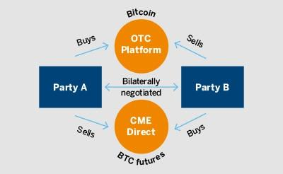

Cryptocurrency futures have emerged as a significant segment in the trading of digital assets, gaining momentum due to their potential for high returns and flexibility in market positions. These financial derivatives allow traders to speculate on the future price of cryptocurrencies, providing a mechanism to hedge against market volatility and capitalize on price movements. Futures contracts, in essence, obligate the buyer to purchase, or the seller to sell, an asset at a predetermined future date and price, offering traders a strategic tool to leverage their investments.

Crypto exchanges serve as the primary platforms facilitating futures trading, connecting buyers and sellers in a secure and efficient marketplace. Leading exchanges such as Binance, BitMEX, and others provide an ecosystem where traders can leverage their positions, often offering high leverage ratios, which magnify potential returns but also elevate risk. These platforms have been instrumental in popularizing futures trades by introducing varied contract options, including perpetual and quarterly futures, which cater to diverse trading strategies and risk appetites.

Algorithmic trading has become a critical component in the futures market, allowing traders to utilize automated systems to execute trades based on pre-defined criteria. Algorithms can analyze vast datasets in real-time, identifying trends and opportunities that might be invisible to human traders. This capability is particularly advantageous in the volatile crypto markets, where price movements can be swift and substantial. Algorithmic trading helps in optimizing execution strategies, reducing human error, and enhancing the speed of trades, thus becoming indispensable for both institutional and retail traders.

This article centers on the convergence of cryptocurrency futures, exchanges, and algorithmic trading, providing a comprehensive guide for beginners and intermediate traders aiming to better understand and navigate this dynamic landscape. By exploring the mechanisms of futures contracts, the functionality of trading platforms, and the strategic benefit of algorithmic tools, this piece aims to equip traders with the necessary knowledge and skills to make informed decisions. The goal is to demystify the complexities of futures trading and to empower traders to engage with the market more confidently and effectively.

## Table of Contents

## Understanding Cryptocurrency Futures

Cryptocurrency futures are financial contracts that obligate the buyer to purchase, or the seller to sell, a specific quantity of a cryptocurrency at a predetermined price and date in the future. These contracts enable traders to speculate on the price direction of cryptocurrencies, offering a more structured method of trading that can lead to significant profits or losses.

Futures contracts operate by establishing terms for buying or selling an asset at a future date, where the contract's value is derived from the underlying asset, in this case, a cryptocurrency like Bitcoin or Ethereum. Traders can take a long position, betting that the asset's price will increase, or a short position, anticipating a decrease in value. This binary framework is a core component of futures trading, allowing participants to hedge against price volatility or capitalize on speculations of price movements.

The primary advantage of trading [cryptocurrency](/wiki/cryptocurrency) futures is the ability to leverage, meaning traders can control a large contract value with a relatively small initial margin. This can amplify returns on investment but also magnifies potential losses, introducing substantial risk. Futures trading is also marked by its flexibility: traders can profit or hedge in both rising and falling markets without owning the underlying asset.

Despite the benefits, trading futures requires an understanding of risk management. The volatile nature of cryptocurrencies can lead to rapid contract value fluctuations, posing significant financial risk, particularly when leverage is used. This necessitates a comprehensive risk management strategy that involves stop-loss orders, careful position sizing, and constant market monitoring.

In comparison to other types of crypto trading, such as spot trading, where assets are bought and sold for immediate delivery, futures offer different risk-reward dynamics. Spot trading allows for straightforward transactions without the complexities of future price speculation. Options trading, another derivative market, provides the right, but not the obligation, to trade at a set price, offering defined risk through premium payment. In contrast, futures entail an obligation to fulfill the contract, increasing exposure but also the potential for higher returns.

Popular cryptocurrencies available for futures trading include Bitcoin (BTC), Ethereum (ETH), Ripple (XRP), Litecoin (LTC), and Binance Coin (BNB). These assets are typically chosen due to their [liquidity](/wiki/liquidity-risk-premium) and established market presence, ensuring active participation and price discovery essential for futures markets.

Ultimately, cryptocurrency futures represent a powerful tool for traders aiming to capitalize on market movements, though they require a sophisticated approach and in-depth understanding of market mechanisms and risk management techniques.

## Major Crypto Exchanges for Futures Trading

Cryptocurrency futures trading has gained significant traction, with several key exchanges providing robust platforms for this burgeoning market. Among the most prominent platforms facilitating futures trading are Binance, BitMEX, and Bybit, each offering unique features catering to various trading needs.

### Binance

Binance is renowned for its extensive array of digital assets and its comprehensive suite of trading options, including futures. The Binance Futures platform allows traders to speculate on the price movements of cryptocurrencies via perpetual and quarterly contracts. One of its standout features is the wide range of supported cryptocurrencies, offering diverse trading opportunities. Security is a high priority, with features like two-[factor](/wiki/factor-investing) authentication (2FA) and withdrawal whitelist to protect user accounts. Additionally, Binance provides up to 125x leverage, allowing traders to maximize their potential returns – albeit with increased risk. The fee structure is competitive, employing a tiered system based on trading [volume](/wiki/volume-trading-strategy). For beginners, the user interface is intuitive, offering both a basic and advanced version to cater to different levels of trading experience.

### BitMEX

BitMEX, a pioneer in cryptocurrency derivatives, offers a platform specifically for trading futures and perpetual contracts. Known for its high leverage options, BitMEX allows up to 100x leverage on Bitcoin futures, appealing to experienced traders seeking substantial exposure with a limited capital outlay. Security is robust, employing multi-signature wallets and a comprehensive system of requiring manual and automatic checks for withdrawals. Fees are calculated using a maker-taker model, which incentivizes liquidity on the platform. One of the primary critiques is its user interface, which can be daunting for beginners, yet it offers a powerful array of tools and charting features for adept traders.

### Bybit

Bybit is another notable platform in the crypto futures space, providing both inverse and linear perpetual contracts. It stands out with its flexible leverage options up to 100x and an emphasis on customer service, offering multilingual support around the clock. The platform’s security features include hierarchical deterministic cold wallets and an in-depth risk management system. Bybit applies a taker and maker fee model, with competitive rates tailored to encourage active trading. The interface is modern and designed with user-friendliness in mind, making it easily navigable for both novice and veteran traders.

### Security Considerations and Fees

Security remains a paramount concern for traders selecting a futures trading platform. Users should prioritize exchanges with strong authentication protocols, cold storage for funds, and transparent security practices. Fees are also a critical factor, as they can significantly impact net trading gains. Traders should examine the fee structure closely, considering not just the trading fees but also withdrawal and deposit charges.

### User Interface and Accessibility

For beginners, the ease of navigating a platform can heavily influence their trading experience. While exchanges like Binance offer simplified interfaces suitable for new users, platforms such as BitMEX require a steeper learning curve. However, the latter's rich feature set may provide advantages as traders gain experience.

In summary, choosing the right crypto exchange for futures trading involves balancing security features, fee structures, leverage offerings, and the usability of the trading interface. Each platform has distinct advantages that cater to different trading styles and levels of expertise, making it essential for traders to consider their individual needs and goals.

## The Role of Algorithmic Trading in Futures

Algorithmic trading involves the use of computer programs to execute trades based on pre-determined criteria. In the futures markets, algorithms analyze market data, identify trading opportunities, and execute buy or sell orders at high speeds and frequencies impractical for human traders. This automated trading approach is pertinent to futures markets due to the high [volatility](/wiki/volatility-trading-strategies) and rapid price changes often seen in these environments, particularly in cryptocurrency futures.

The implementation of [algorithmic trading](/wiki/algorithmic-trading) tools can significantly enhance trading strategies by automating the execution process, minimizing human error, and optimizing trading efficiency. These tools allow traders to analyze vast amounts of data rapidly, make informed decisions, and capitalize on emerging market trends. Algorithmic strategies can include [market making](/wiki/market-making), [trend following](/wiki/trend-following), or statistical [arbitrage](/wiki/arbitrage). For example, market-making algorithms provide liquidity by simultaneously posting both buy and sell orders, profiting from the bid-ask spread. 

Common algorithms utilized in crypto futures trading include Mean Reversion, Momentum, and Arbitrage strategies. Mean Reversion strategies exploit the assumption that asset prices will revert to their historical mean over time. Momentum strategies focus on identifying and investing in assets showing strong trend behavior, betting that these trends will continue. Arbitrage algorithms take advantage of price discrepancies between different markets or products, enabling risk-free profits.

While algorithmic trading presents several advantages, such as speed and precision, there are notable drawbacks, particularly in volatile markets. Algorithms may exacerbate market fluctuations, leading to significant price distortions. Additionally, algorithms require constant refinement and back-testing to ensure they adapt effectively to changing market conditions. In highly volatile markets like cryptocurrency futures, where prices can swing drastically within minutes, algorithms might struggle to accurately predict short-term market movements, possibly resulting in losses.

Case studies have highlighted successful algorithmic trading strategies within crypto futures. One such example involves a trend-following algorithm that captured price [momentum](/wiki/momentum) during significant cryptocurrency rallies, yielding substantial returns. Another study demonstrated a successful arbitrage strategy that capitalized on price differences between different cryptocurrency exchanges, proving profitable even in turbulent market conditions. These case studies emphasize the potential of algorithmic approaches when properly tailored to specific market environments and conditions.

Overall, algorithmic trading stands as a pivotal component of futures markets, offering traders sophisticated tools to navigate complex and fast-changing environments effectively. However, thorough understanding and careful implementation are crucial to leveraging these tools successfully, particularly within the high-risk, high-reward cryptocurrency futures landscape.

## Setting Up for Success: Tips and Best Practices

Cryptocurrency futures trading is inherently risky due to the volatile nature of digital assets. However, prudent risk management strategies can help mitigate potential losses. Essential strategies include setting stop-loss limits to automatically sell assets when they fall to a certain price, thus preventing further losses. Additionally, leveraging only a small fraction of capital in high-risk trades is advisable to avoid significant financial exposure. Diversifying across different assets and types of trades can also reduce risk by not tying your success to a single market movement.

Algorithmic trading offers robust tools to enhance trading strategies by automating processes based on pre-defined criteria. To integrate these tools safely into your trading routine, it is crucial to start with straightforward algorithms that execute basic functions, such as moving averages or trend-following strategies. More complex algorithms can be developed as proficiency increases. Using [backtesting](/wiki/backtesting) (e.g., in Python using libraries like pandas and [backtrader](/wiki/backtrader)) allows traders to test the effectiveness of their algorithms against historical data before implementing them in live markets. It’s important to continuously monitor algorithm performance and to update them as market conditions change to maintain their effectiveness and safety.

Continuous learning is crucial in the fast-evolving cryptocurrency market. Market conditions, regulatory environments, and technologies change frequently. Therefore, staying updated is essential for success. Engaging with online courses, participating in webinars, and reading financial news can provide valuable insights. Joining community forums like Reddit’s r/CryptoMarkets or engaging with professional networks can help share strategies and gain knowledge from experienced traders.

For technical analysis and tracking market trends, resources like TradingView and CoinGecko offer comprehensive tools and data. TradingView enables detailed chart analysis with numerous indicators, while CoinGecko provides broad market data and trends. Additionally, platforms like Glassnode offer on-chain and market data analytics, helping traders make informed decisions based on real-time market information.

Further reading and skill enhancement are vital for both beginners and intermediate traders. Books such as "Mastering Bitcoin" by Andreas M. Antonopoulos and "Crypto Trading 101" can provide foundational knowledge. Online platforms like Coursera and Udemy offer cryptocurrency and trading courses to expand technical skills and strategic thinking. Engaging with these resources regularly can significantly enhance trading acumen and adaptability in the dynamic cryptocurrency futures market.

## Conclusion

In this exploration of cryptocurrency futures and algorithmic trading, we have highlighted the expanding role of crypto futures in modern finance, their functionalities, and their growing allure among traders. The examination of major crypto exchanges such as Binance and BitMEX showcased the diverse features, security considerations, fees, and leverage options that these platforms offer to enhance traders' experiences. Algorithmic trading was presented as a pivotal tool, furnishing traders with sophisticated strategies to navigate the volatile cryptocurrency market effectively.

Looking ahead, the landscape of futures and algorithmic trading in cryptocurrency continues to evolve rapidly. As technology advances, the integration of [machine learning](/wiki/machine-learning) and [artificial intelligence](/wiki/ai-artificial-intelligence) in trading algorithms is expected to heighten efficiency and decision-making capabilities. However, given the inherent volatility in cryptocurrency markets, traders should exercise caution, employing informed and strategic approaches to manage risks effectively. Engaging continuously with the latest market trends, regulatory changes, and technological advancements is paramount to maintaining a competitive edge in this dynamic field.

To foster a robust trading practice, we urge individuals to actively participate in the crypto trading community. This engagement provides valuable insights, peer learning, and access to a wealth of shared knowledge. For those eager to deepen their understanding, additional resources and expert insights are available through esteemed trading forums, webinars hosted by industry leaders, and comprehensive courses on algorithmic trading. Staying informed and adaptable will ensure traders are well-equipped to thrive in the ever-evolving landscape of cryptocurrency futures.

## References & Further Reading

[1]: ["Mastering Bitcoin: Unlocking Digital Cryptocurrencies"](https://books.google.com/books/about/Mastering_Bitcoin.html?id=IXmrBQAAQBAJ) by Andreas M. Antonopoulos

[2]: ["Cryptoassets: The Innovative Investor's Guide to Bitcoin and Beyond"](https://www.amazon.com/Cryptoassets-Innovative-Investors-Bitcoin-Beyond/dp/1260026671) by Chris Burniske and Jack Tatar

[3]: Antonopoulos, Andreas M., and Gavin Wood. ["Mastering Ethereum: Building Smart Contracts and Dapps"](https://www.amazon.com/Mastering-Ethereum-Building-Smart-Contracts/dp/1491971940)

[4]: ["Advances in Financial Machine Learning"](https://www.wiley.com/en-us/Advances+in+Financial+Machine+Learning-p-9781119482086) by Marcos Lopez de Prado

[5]: Johnson, B. ["Algorithmic Trading & DMA"](https://www.amazon.com/Algorithmic-Trading-DMA-introduction-strategies/dp/0956399207) 

[6]: Beinhocker, E. D. (2006). ["The Origin of Wealth: Evolution, Complexity, and the Radical Remaking of Economics."](https://books.google.com/books/about/The_Origin_of_Wealth.html?id=eUoolrxSFy0C)

[7]: Zamani, Mahmoud, et al. (2017). ["A survey of algorithmic trading strategies in cryptocurrency markets"](https://scholar.google.com/citations?user=i1OZXOAAAAAJ).