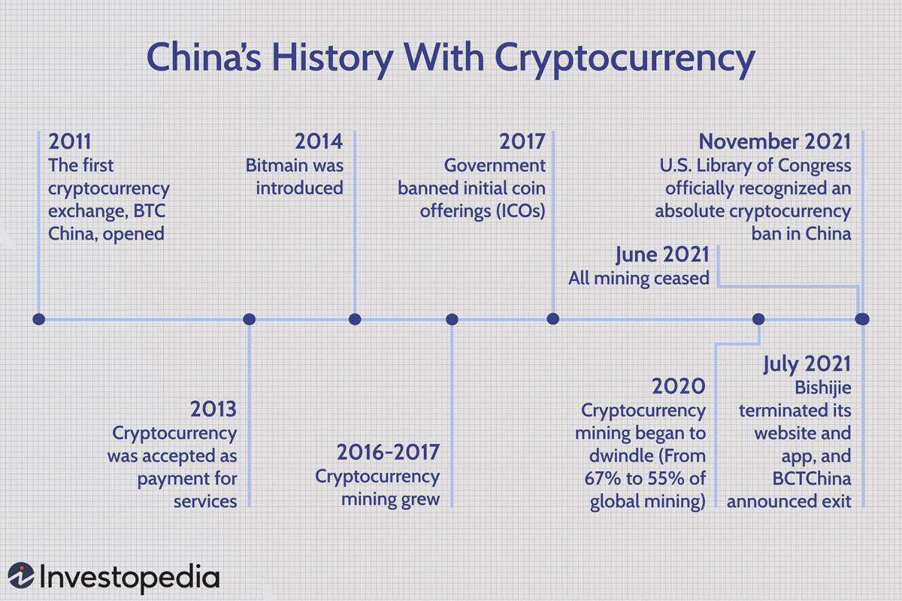

The world of cryptocurrency represents a dynamic and complex segment of the global economy, characterized by rapid technological innovations and continually evolving regulations. Among the major global players, China stands out for having a significant and multifaceted impact on cryptocurrency's historical development. As one of the world's largest economies and a technological powerhouse, China's engagement with cryptocurrency goes beyond simple adoption, influencing technological progress and regulatory norms.

Cryptocurrency in China has experienced an enthralling evolution, from initial enthusiasm and widespread adoption to stringent regulatory measures aimed at controlling its growth and associated financial risks. This article aims to detail this progression, highlighting China's pivotal role and its journey marked by both innovation and clampdowns. Central to this narrative is the rise of algorithmic trading within China's cryptocurrency ecosystem. This sophisticated, technology-driven form of trading has become a cornerstone, leveraging high-frequency techniques to operate within China's particular regulatory and financial frameworks.

Understanding the role of algorithmic trading within China's cryptocurrency markets is essential. These technologies and strategies have shaped how cryptocurrencies are traded and managed, interacting with the country's regulatory stance. The exploration of China's cryptocurrency history, particularly through the lens of algorithmic trading, provides valuable insights into the intersection of technology, finance, and policy. Such an exploration serves not only to illuminate China's impact on cryptocurrency but also offers a perspective on how large economies balance innovation with regulatory control in the digital age.

## Table of Contents

## Early Adoption of Cryptocurrency in China

China quickly positioned itself at the forefront of global cryptocurrency adoption with the establishment of BTC China in 2011. As one of the first Bitcoin exchanges worldwide, BTC China played a crucial role in establishing digital currencies as viable financial instruments. The emergence of Bitcoin as a digital currency attracted considerable interest within Chinese markets, highlighting the country's early engagement with innovative financial technologies.

The initial years saw major Chinese companies, such as Baidu, embracing Bitcoin, marking a phase of significant acceptance and innovation. In 2013, Baidu began accepting Bitcoin for their Jiasule service, a website performance and security platform, signifying mainstream acknowledgement of cryptocurrency's potential utility [1]. This willingness to integrate Bitcoin within existing business models illustrated a broader acceptance of digital currencies and foreshadowed subsequent developments within China's economic landscape.

Moreover, China's abundant and inexpensive electricity resources incentivized large-scale cryptocurrency mining operations. Mining, a crucial component of the cryptocurrency ecosystem, involves solving complex mathematical problems to validate and secure transactions, a process which consumes significant amounts of energy. The availability of cheap electricity, particularly from coal and hydropower, made China an attractive hub for these energy-intensive operations. During the early 2010s, regions such as Sichuan and Xinjiang emerged as mining hotspots, fostering increased participation in the global crypto economy [2]. 

These early advancements laid the foundation for China's significant impact on the [cryptocurrency](/wiki/cryptocurrency) market. China's rapid adoption, coupled with favorable economic conditions, allowed it to shape the trajectory of digital assets and cement its role in the evolving landscape of global finance.

[1] Williams-Grut, O. (2013). "Baidu Starts Accepting Bitcoin". Business Insider.  
[2] Zohner, C., et al. (2018). "An analysis of power consumption in a Bitcoin network". IEEE Access.

## Growth of Algorithmic Trading in China's Crypto Market

Algorithmic trading has emerged as a fundamental pillar within China's cryptocurrency market, facilitating the rapid evolution of trading mechanisms and strategies. This innovative approach to trading encompasses the use of advanced algorithms and computational models to make high-speed trading decisions, processing vast amounts of market data in fractions of a second. The competitive advantage offered by [algorithmic trading](/wiki/algorithmic-trading) has drawn experts to develop and optimize sophisticated strategies that enhance trading performance and profitability.

One of the primary benefits of algorithmic trading is its ability to execute trades at [high frequency](/wiki/high-frequency-trading) with minimal latency, providing traders with a distinct edge in the fast-paced crypto markets. Algorithms can analyze multiple market variables simultaneously, identifying profitable trading opportunities and making instant decisions that human traders cannot match in terms of speed or precision. This advantage is particularly critical in the cryptocurrency market, where price fluctuations can occur in mere seconds.

The development and implementation of algorithmic trading strategies in China have been closely affected by the country's regulatory environment. The relatively stringent regulatory framework necessitates that such technologies are designed with an emphasis on compliance and risk management. The need to align with regulatory requirements has driven a focus on creating algorithms that are not only effective but also adhere to legal standards, thereby minimizing financial risk and enhancing transparency in trading activities.

Understanding the role of these technologies within China's regulatory landscape offers insights into potential future trends in the country's financial sector. As algorithmic trading continues to integrate more sophisticated [machine learning](/wiki/machine-learning) techniques and leverage big data analytics, the potential for more innovative and efficient trading strategies is significant. The ongoing evolution of these technologies, combined with China's dynamic regulatory environment, will likely shape the future trajectory of financial markets in the region.

Given the efficient nature of algorithmic trading, it offers not just a technical edge but also a means to navigate and operate within the structured confines of China's evolving legal landscape concerning digital assets. As China continues to refine its approach to financial technology and cryptocurrency regulation, algorithmic trading remains a key area of development, underscoring the intersections between technological advancements and regulatory adaptation.

## Government Crackdowns and Impact on Crypto Trading

China's initial enthusiasm for cryptocurrencies encountered significant governmental intervention as authorities sought to regain control over their monetary policy. The first major move was a series of bans targeting cryptocurrency exchanges and initial coin offerings (ICOs). In September 2017, China's central bank, the People's Bank of China (PBoC), declared ICOs illegal and ordered all related fundraising activities to cease immediately. This measure aimed to mitigate the financial risks associated with unregulated fundraising and to curb speculative trading activities that had surged with the rise of ICO practices.

The ban extended to domestic cryptocurrency exchanges, which were ordered to shut down operations. Major platforms such as BTC China and Huobi, which facilitated large volumes of Bitcoin and other cryptocurrencies, had to halt their services to comply with these regulations. This action aimed to prevent financial instability and potential losses for investors unfamiliar with the volatile nature of digital currencies at the time.

In 2021, China's stance on cryptocurrencies took a decisive turn with the implementation of a sweeping ban on all cryptocurrency transactions. The directive not only prohibited crypto-trading platforms and service providers from offering services to Chinese residents but also made the holding and mining of cryptocurrencies illegal. This marked a significant turning point in China's crypto-trading landscape, compelling both investors and service providers to adapt or relocate.

The government's rationale behind such stringent measures was to mitigate financial risks, control capital outflows, and address the potential use of cryptocurrencies in illegal activities, including money laundering. Moreover, these actions aligned with China's broader economic policy to maintain strict oversight over its monetary system and prevent any disruption caused by decentralized digital currencies.

As a result of these crackdowns, the cryptocurrency market in China faced substantial challenges. Companies had to innovate new strategies to operate within or pivot away from the Chinese market. Many traders turned to over-the-counter (OTC) services and peer-to-peer (P2P) platforms, despite the potential legal and financial risks, illustrating a shift in the ecosystem driven by regulatory pressures.

Overall, China's regulatory interventions have profoundly shaped its cryptocurrency environment, compelling stakeholders to either adopt new strategies or [exit](/wiki/exit-strategy) the market entirely. This regulatory approach reflects the government's commitment to maintaining economic stability and control over its financial systems, even as it explores innovation through government-backed digital initiatives like the digital yuan.

## The Role of Digital Currency Developments

China's introduction of the digital yuan, also known as the e-CNY, marks a strategic advancement towards the establishment of a fully controlled digital finance system. This Central Bank Digital Currency (CBDC) is being actively developed by the People's Bank of China (PBOC) to work in tandem with existing monetary policies, paving the way for a legally backed digital currency that is under stringent government control. 

The development of the digital yuan is integral to China's broader monetary strategy, aimed at enhancing the efficiency of the financial system and reinforcing governmental influence over the economy. By leveraging blockchain technology, the e-CNY seeks to offer enhanced security features combined with the ease of digital transactions, ultimately aiming to reduce the dependency on cash. The digital currency also aims to provide better traceability of transactions, improve anti-money laundering measures, and offer the government increased visibility into financial activities.

In international finance, the digital yuan presents potential to bolster China's influence by facilitating cross-border transactions and offering an alternative to the U.S. dollar in global markets. The controlled circulation of the digital currency could support international trade settlements in e-CNY, thus reinforcing China's economic leadership.

The implementation of a digital yuan has significant implications not only for economic policy but also for the technological landscape, offering a platform for future advancements in digital payments and financial technologies. As China pioneers this novel initiative, it sets a precedent for other nations considering the adoption of their own digital currencies, thereby reshaping the global financial infrastructure.

## Challenges and Opportunities

China's approach to cryptocurrency regulation presents both challenges and opportunities. On the one hand, stringent regulations can stifle innovation by imposing tight controls that limit the scope of cryptocurrency activities. On the other hand, these constraints create a fertile ground for legal fintech innovations to rise and meet the challenges posed by a heavily regulated environment.

Algorithmic trading, a key component of financial technology, benefits from operating within a regulated framework. The regulations necessitate a focus on security, which is vital in protecting sensitive data and transactions from fraudulent activities, thus promoting trust among users. Efficiency is another pillar that regulations encourage. With clear rules and guidelines, algorithmic trading can optimize processes, reducing latency and improving the execution speed of trades. This allows traders to implement high-frequency trading strategies, which can greatly enhance profitability.

Legitimacy in the crypto market is further reinforced as regulatory measures bring about transparency and standardization. These help mitigate risks associated with unregulated markets, such as price manipulations and market abuses. As a result, legal and compliant fintech solutions can thrive, attracting traditional financial institutions and fostering broader acceptance of digital currencies.

The evolving regulatory landscape necessitates adaptability among players in the crypto field. Regulatory frameworks are dynamic, reflecting changes in technology, economic policy, and geopolitical considerations. Consequently, businesses must remain agile, adapting their strategies to align with new regulations while identifying emergent opportunities. For instance, companies could explore partnerships with government bodies to develop compliant blockchain solutions or shift their focus towards decentralized finance (DeFi) projects that meet regulatory standards.

In summary, while China's rigorous regulations pose significant challenges, they also compel the industry to innovate, ensuring that cryptocurrency operations are secure, efficient, and legitimate. These conditions, albeit challenging, set the stage for sustainable growth and stable market participation in China's crypto ecosystem.

## The Future of Cryptocurrency and Algo Trading in China

Rumors about lifting cryptocurrency bans in China continue to circulate, yet the nation's future stance remains cautiously developmental. The emphasis is likely to remain on the development and deployment of Central Bank Digital Currencies (CBDCs), such as the digital yuan (e-CNY), along with other government-sanctioned digital currencies. This focus reflects a strategic move towards integrating digital innovations with tightly controlled monetary policies. The introduction of the digital yuan signifies an aspiration to establish a state-regulated digital finance system that aligns with global digital currency trends.

In the context of global crypto regulations, China is in a pivotal position to navigate the fine line between maintaining control and fostering innovation. The nation’s regulation-centric approach to cryptocurrency ensures that while speculative activities are curtailed, the technological advancements associated with financial innovations are not abandoned entirely. This approach allows China to leverage global developments in digital currencies, adapting them to fit within its controlled framework, and setting a precedent for other nations grappling with similar challenges.

Algorithmic trading is set to play a significant role in shaping the future landscape of China's financial ecosystem. This technology-driven trading method will continue to be crucial due to its ability to execute high-frequency trades and optimize strategies using complex market data analyses. The efficiency and precision of algorithmic trading represent an intersection of sophisticated technology and finance, which aligns with China’s goals of establishing a robust digital economy underpinned by rigorous oversight.

Developing sophisticated algorithmic trading strategies is imperative to operate effectively within China's evolving regulatory framework. This necessity will drive a continuous cycle of innovation, where adaptation to new policies will be as critical as the innovations themselves. As global finance trends toward embracing digital ecosystems, China’s trajectory will provide insights into balancing regulatory control with technological advancements in the cryptocurrency and financial sector, offering lessons that may inform international policy formulation.

## Conclusion

China's journey with cryptocurrency underscores the complex interplay between innovation and stringent regulatory frameworks. The country's aggressive stances, such as the prohibition of crypto transactions and the development of its own digital yuan, reflect a cautious yet strategic approach toward digital currencies. These measures, while seemingly restrictive, are instrumental in channeling the innovation within the confines of government oversight, promoting fintech solutions that align with national financial objectives.

Algorithmic trading stands out as a critical component of this evolutionary path. It exemplifies how technological advancements can coexist and even thrive within a regulated environment. The deployment of high-frequency trading strategies and sophisticated algorithms showcases China's ability to harness computational power for market efficiency and strategic advantage, even amid regulatory constraints. This synergy between technology and policy indicates an adaptable financial sector capable of leveraging scientific progress while adhering to regulatory mandates.

Understanding China's approach provides valuable insights into potential global trends in cryptocurrency. It showcases how nations might navigate the delicate balance of fostering technological innovation while maintaining regulatory control to manage financial stability and security. China's experience offers a glimpse into the future of digital finance, where regulatory frameworks play a pivotal role in shaping the trajectory of technological advancements in cryptocurrency markets across the world.

## References & Further Reading

[1]: Williams-Grut, O. (2013). ["Baidu Starts Accepting Bitcoin."](https://finance.yahoo.com/news/history-bitcoins-first-decade-one-chart-003220581.html) Business Insider.

[2]: Zohner, C., et al. (2018). ["An analysis of power consumption in a Bitcoin network."](https://www.researchgate.net/profile/Constantin-Zohner) IEEE Access.

[3]: Fantazzini, D., Nigmatullin, E., Sukhanovskaya, V., & Ivliev, S. (2016). ["Everything You Wanted to Know About Bitcoin Modeling but Were Afraid to Ask."](https://papers.ssrn.com/sol3/papers.cfm?abstract_id=2794622) Applied Econometrics, 42.

[4]: Cai, J., & Zhu, Y. (2016). ["Algorithmic and High-Frequency Trading in China's Securities Markets."](https://assets.cambridge.org/97811070/91146/frontmatter/9781107091146_frontmatter.pdf)01002-X/full/html) In "Handbook of Asian Finance" Vol 1: Financial Markets and Sovereign Wealth Funds, 37–55. 

[5]: Lorenz, T. (2021). ["China Declares All Cryptocurrency Transactions Illegal, Sending Bitcoin Tumbling."](https://www.bbc.co.uk/news/technology-58678907) The New York Times.