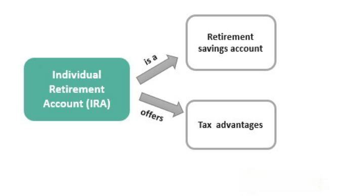

In recent years, the investment landscape has broadened significantly, incorporating digital assets such as cryptocurrencies as a viable means to diversify portfolios. Among these innovations is the emergence of Cryptocurrency IRAs, which allow investors to include digital currencies like Bitcoin and Ethereum within their retirement accounts. This new approach is gaining traction as more individuals see the potential benefits of integrating cryptocurrencies with their long-term financial planning.

Cryptocurrency IRAs offer a unique blend of traditional retirement savings strategies with the dynamic world of digital currencies. This article seeks to explore the complexities associated with investing in cryptocurrency IRAs, examining both the potential benefits and inherent risks. Furthermore, we will investigate the ascending field of algorithmic trading, particularly how it applies to crypto investments, to provide a comprehensive understanding of these emerging financial instruments.



As financial markets exhibit increased volatility and new financial products emerge, it is essential to grasp the complexities of these offerings before engaging with crypto retirement accounts or automated trading systems. The forthcoming sections will detail the constitution of cryptocurrency IRAs, their pros and cons, and the role of algorithmic trading in optimizing investment returns.

Let us initiate this discourse by analyzing the structure of cryptocurrency IRAs and exploring why they might attract certain investors. Understanding these mechanisms is crucial for those considering digital currencies as part of their retirement strategy. By juxtaposing traditional and modern investment practices, individuals can make informed decisions about incorporating cryptocurrencies into their financial planning.

## Table of Contents

## Cryptocurrency IRAs: An Overview

A Cryptocurrency IRA is a retirement account that integrates digital assets like Bitcoin and Ethereum into a self-directed Individual Retirement Account (IRA) portfolio. This innovative approach to retirement investing is gaining traction among those seeking to diversify beyond traditional assets such as stocks, bonds, and mutual funds.

Cryptocurrencies are treated as property by the Internal Revenue Service (IRS) under current regulations, akin to other investment assets like stocks and bonds. This classification entails specific capital gains tax implications when these digital currencies are bought, sold, or exchanged. Therefore, any gains realized from cryptocurrency investments within an IRA may be subject to taxation upon withdrawal, as per the type of IRA opted—Traditional or Roth.

To include cryptocurrencies in an IRA, individual investors must engage with a custodian offering such capabilities. Typically, this involves setting up a self-directed IRA, a type of IRA that provides increased flexibility in choosing investment types, including alternative assets. A self-directed IRA allows account holders to explore a wider range of investment options, as opposed to a conventional IRA limited to standard financial products like stocks and bonds.

Specialized custodians and platforms have emerged to meet the growing demand for Cryptocurrency IRAs. Notable among them are BitIRA, Equity Trust, and Bitcoin IRA, each providing tailored services for individuals aiming to hold digital currencies within their retirement accounts. These platforms facilitate the execution, safekeeping, and regulatory compliance needed to manage digital assets securely in a retirement portfolio.

With these frameworks in place, investors can strategically incorporate cryptocurrencies into their retirement plans, potentially offsetting the limitations of traditional investment routes. As digital currencies continue integrating into the global financial system, Cryptocurrency IRAs represent a flexible and modern approach to retirement fund diversification.

## Advantages of Cryptocurrency IRAs

Cryptocurrency IRAs offer several advantages that can enhance a retirement portfolio's resilience and growth potential. One of the primary benefits is diversification. Including cryptocurrencies in a retirement portfolio can reduce risks typically associated with traditional assets such as stocks and bonds. The unique price movements and trends in [cryptocurrency](/wiki/cryptocurrency) markets can complement more conventional investment products, potentially leading to a more balanced risk profile.

The growth potential of cryptocurrencies is another significant advantage. Over the past decade, digital currencies like Bitcoin and Ethereum have demonstrated substantial returns, often surpassing those seen in traditional markets. This impressive growth potential attracts investors who are looking for opportunities to enhance their overall returns on retirement savings. While past performance is not indicative of future results, the innovative nature of blockchain technology continues to drive interest and investment into the crypto space.

In terms of tax benefits, cryptocurrency IRAs provide a notable advantage. Depending on whether an investor opts for a Traditional or Roth IRA, the tax implications differ. With a Traditional IRA, contributions are made pre-tax, offering tax-deferred growth, where taxes are paid upon withdrawal during retirement. In contrast, Roth IRAs involve contributions made with post-tax income, allowing for tax-free growth and withdrawals in retirement. This tax-efficient structuring can lead to significant savings and improved long-term outcomes for investors committed to growing their retirement wealth.

As cryptocurrencies gain broader acceptance and utility in global financial systems, they are likely to play a more prominent role in retirement portfolios. Increased adoption in everyday transactions, integration into digital economies, and the potential for regulation that could stabilize [volatility](/wiki/volatility-trading-strategies) further support the case for incorporating cryptocurrencies into IRAs. As the market matures, these factors may enhance the security and reliability of crypto investments, reinforcing their position as viable components of a diversified retirement portfolio.

## Disadvantages of Cryptocurrency IRAs

Cryptocurrency IRAs present several challenges that potential investors need to consider. One of the most significant issues is the inherent price volatility of cryptocurrencies. Cryptocurrencies like Bitcoin and Ethereum are known for their rapid price fluctuations. This volatility can be problematic for individuals nearing retirement, as sudden market swings could negatively affect the value of their investments and potentially alter retirement plans.

Security concerns are another critical disadvantage. The digital nature of cryptocurrencies makes them vulnerable to hacking and theft. While traditional financial accounts typically benefit from robust regulatory and security measures, the same cannot always be said for cryptocurrencies. Investors must rely on digital wallets and exchanges, which can be targets for cybercriminals. There have been numerous high-profile cases of cryptocurrency theft, underscoring the risks associated with digital asset security.

Additionally, cryptocurrency IRAs often involve higher fees compared to traditional IRAs. These fees can include setup fees, trading fees, and custodial fees. Traditional IRAs generally have lower cost structures because of the established systems and processes for managing stocks and bonds. In contrast, the newer nature of digital currencies and the specialized handling required for secure storage contribute to increased expenses.

Lastly, there's a risk of fraud within the crypto investment space. The cryptocurrency industry is relatively young, and the lack of comprehensive regulation has allowed fraudulent schemes to proliferate. Unscrupulous firms may offer retirement services without proper oversight, posing significant risks to investors. Potential investors should exercise due diligence and verify the legitimacy of a service provider before committing their assets to a crypto IRA.

## Algorithmic Trading in Crypto IRAs

Algorithmic trading involves the use of computer programs to execute trades automatically based on predefined rules. This method leverages quantitative models to determine the optimal timing, size, and price of trades, enhancing the precision and efficiency of trading operations. In the volatile world of cryptocurrencies, [algorithmic trading](/wiki/algorithmic-trading) can be particularly advantageous, offering several potential benefits when integrated into cryptocurrency IRAs.

**Managing High Volatility**

Cryptocurrency markets are known for their significant price volatility, which can pose challenges for manual traders. Algorithmic trading systems can address this by executing trades at optimal times. By analyzing large datasets, these algorithms can identify patterns and trends that are not readily apparent, enabling the execution of trades that capitalize on momentary price discrepancies. For instance, algorithms can be programmed to implement strategies such as [momentum](/wiki/momentum) trading, where trades are executed based on the strength of recent price trends, or mean reversion, where trades occur in anticipation of price corrections.

**Consistency and Reduced Human Error**

One of the primary advantages of algorithmic trading in crypto IRAs is its ability to provide consistent trading strategies. These systems operate without fatigue and emotional bias, which can affect human traders. By adhering to predefined criteria, algorithmic trading minimizes the likelihood of impulsive decisions that might result from emotional reactions to market fluctuations. This consistency is particularly beneficial in a retirement account, where a long-term strategy is crucial for sustained growth.

**Implementation and Risks**

Despite its advantages, algorithmic trading in crypto IRAs is not without risks. The effectiveness of an algorithmic trading system depends heavily on its setup and the criteria predefined in its code. Poorly designed algorithms can result in suboptimal trades, leading to significant financial losses. Additionally, the crypto market's rapid pace necessitates constant monitoring and updates to the algorithms to ensure they remain relevant and effective under changing market conditions.

Here's a simple example of what a basic algorithmic trading strategy might look like in Python:

```python
import ccxt
import numpy as np

exchange = ccxt.binance()
symbol = 'BTC/USDT'
timeframe = '1h'

def get_moving_average(data, period):
    return np.mean(data[-period:])

def execute_trade():
    bars = exchange.fetch_ohlcv(symbol, timeframe=timeframe)
    close_prices = [bar[4] for bar in bars]

    short_ma = get_moving_average(close_prices, 5)
    long_ma = get_moving_average(close_prices, 20)

    if short_ma > long_ma:
        print("Buy signal")
        # Add buy order logic here
    elif short_ma < long_ma:
        print("Sell signal")
        # Add sell order logic here

execute_trade()
```

This sample code uses the moving average crossover strategy, a simple method where trade signals are generated based on the crossover of short-term and long-term moving averages. However, implementing a reliable and profitable algorithm goes far beyond such simple strategies; it requires continuous refinement and adaptation to market changes.

In summary, integrating algorithmic trading into cryptocurrency IRAs can offer consistency and a systematic approach to managing investments in volatile markets. However, investors must exercise diligence in selecting and configuring these systems, often benefiting from the guidance of financial and technical experts to navigate the complexities involved.

## Conclusion

Cryptocurrency IRAs offer a novel approach to retirement investing, blending the emerging world of digital assets with traditional financial vehicles. This fusion, while promising, comes with its own set of complexities that necessitate careful evaluation. Investors must contemplate both the potential advantages and inherent risks. The high growth potential and diversification benefits seen with cryptocurrencies are matched by significant price volatility and security concerns. Therefore, an individual's risk tolerance and retirement timeline play crucial roles in determining the suitability of such investments in their portfolio.

Algorithmic trading offers a solution to the volatility challenges associated with cryptocurrency investments. By leveraging computer algorithms to automate and manage trades, investors can achieve precise and timely execution, minimizing emotional biases. However, the technical nature of algorithmic strategies requires expertise to implement effectively. Missteps in setup or oversight can result in suboptimal outcomes, underscoring the need for technical proficiency or collaboration with knowledgeable traders.

Lastly, potential investors should seek guidance from financial advisors who possess a deep understanding of both cryptocurrencies and tax implications. Such advisors can aid in navigating the regulatory landscape and ensure that investments align with long-term retirement goals. By making informed decisions, investors can harness the potential of cryptocurrency IRAs while mitigating undue risks.

## References & Further Reading

[1]: ["IRS Virtual Currency Guidance."](https://www.irs.gov/pub/irs-drop/n-14-21.pdf) Internal Revenue Service (IRS).

[2]: Slavin, T. (2017). ["Investing in Cryptocurrency with Self-Directed IRAs."](https://www.forbes.com/councils/forbesfinancecouncil/2021/03/16/how-to-invest-in-cryptocurrency-with-a-self-directed-ira/) Kitces.com.

[3]: Antonopoulos, A. M. (2017). ["Mastering Bitcoin: Unlocking Digital Cryptocurrencies"](https://books.google.com/books/about/Mastering_Bitcoin.html?id=IXmrBQAAQBAJ) O'Reilly Media.

[4]: Antonopoulos, A. M., & Wood, G. (2018). ["Mastering Ethereum: Building Smart Contracts and DApps"](https://www.amazon.com/Mastering-Ethereum-Building-Smart-Contracts/dp/1491971940) O'Reilly Media.

[5]: Narang, R. K. (2013). ["Inside the Black Box: A Simple Guide to Quantitative and High-Frequency Trading"](https://onlinelibrary.wiley.com/doi/book/10.1002/9781118662717) Wiley.