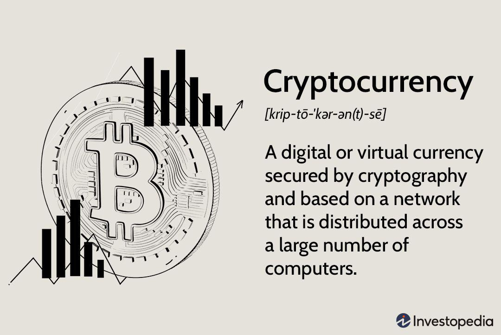

Cryptocurrency has become a prominent subject within digital finance, capturing both interest and skepticism. At the forefront, Bitcoin and Ethereum exemplify the potential of digital currencies to redefine financial systems. These cryptocurrencies offer a decentralized model, independent of traditional banking structures, aimed at enhancing transparency and security through blockchain technology.

The allure of cryptocurrencies extends beyond their technological innovation. They present unique investment opportunities, characterized by the potential for substantial returns alongside considerable risks. As the market continues to evolve, the role of algorithmic trading in cryptocurrency further amplifies the intrigue, offering sophisticated tools for managing investments in a volatile environment.



This article will examine the merits and drawbacks of cryptocurrencies, assessing their viability as investment assets. Additionally, it will delve into algorithmic trading's influence in this dynamic sector, providing insights for investors aiming to navigate the complexities of digital finance.

## Table of Contents

## What is Cryptocurrency?

Cryptocurrencies are digital assets secured through the use of cryptography, a method that ensures secure transactions and control over the creation of new units. Unlike traditional currencies, cryptocurrencies operate on decentralized networks based on blockchain technology. A blockchain is an immutable ledger of records distributed across a network of computers, ensuring transparency and security without the need for a central authority. This decentralization aims to enhance security and reduce vulnerability to central points of failure in financial systems.

The security of cryptocurrencies is grounded in principles of cryptography, particularly public-key cryptography. In public-key cryptography, each participant possesses a public key, which is shared openly, and a private key, which is kept secret. During transactions, the public key is used to encrypt the data, and only the corresponding private key can decrypt it, ensuring that sensitive information is accessible only to the intended recipient. 

Cryptocurrencies' prominence is partially attributed to their theoretical immunity to government intervention and control. Traditional currencies are regulated and influenced by governmental policies and central banking systems, affecting monetary supply and economic stability. In contrast, cryptocurrencies are generally not subject to such direct control, potentially shielding them from inflationary pressures induced by government actions. This lack of centralized control appeals to those seeking financial autonomy and privacy.

Bitcoin, introduced in 2009 by an anonymous individual or group known as Satoshi Nakamoto, was the first [cryptocurrency](/wiki/cryptocurrency) and remains the most widely recognized and used. Its creation challenged the concept of currency by promoting a system where users could transact directly without intermediaries like banks. Bitcoin’s decentralized nature laid the foundation for the subsequent proliferation of thousands of other cryptocurrencies, also known as altcoins.

In summary, cryptocurrencies represent an innovative digital asset class designed to operate without centralized control, promising secure, transparent, and autonomous financial transactions. Through the integration of blockchain technology and cryptographic principles, cryptocurrencies offer a paradigmatic shift in how digital finance is understood and utilized.

## Understanding Cryptocurrency Investment

Investing in cryptocurrency involves purchasing digital coins with the aim of generating profit through appreciation or trading. The key to successful cryptocurrency investment is understanding the market dynamics, which encompasses price movements, market sentiment, and technological developments that can affect digital assets.

Cryptocurrencies are inherently volatile, with prices subject to significant fluctuations. This [volatility](/wiki/volatility-trading-strategies) can translate into lucrative rewards when investments appreciate rapidly. However, it also poses substantial risks as prices can plummet, leading to potential financial losses. Therefore, prospective investors should assess their risk tolerance and investment goals before engaging in cryptocurrency markets.

Market dynamics in cryptocurrency are influenced by several factors:

1. **Supply and Demand**: The price of a cryptocurrency is primarily driven by supply and demand dynamics. Limited supply, as seen with Bitcoin's capped issuance at 21 million coins, can drive prices higher if demand increases. Conversely, oversupply or waning interest can suppress prices.

2. **Market Sentiment**: Investor perception and sentiment play a crucial role in cryptocurrency prices. News events, regulatory changes, and social media trends can trigger rapid price changes as investors respond to new information.

3. **Technological Developments**: Innovations in blockchain and related technologies can impact cryptocurrency valuations. Improvements in scalability, security, and utility can enhance a cryptocurrency's attractiveness, affecting its market price.

4. **Regulatory Environment**: The legal framework surrounding cryptocurrencies is evolving, with varying levels of acceptance across different jurisdictions. Favorable regulations can encourage investment, while restrictions or bans can suppress market activity.

To navigate these dynamics, investors may employ technical analysis, studying price charts and patterns to predict future movements. Additionally, [fundamental analysis](/wiki/fundamental-analysis), which evaluates the intrinsic value of a cryptocurrency based on utility, adoption, and technology, can provide insights into long-term investment potential.

Given the complexity and volatility of the crypto market, it is advisable for investors to diversify their portfolio to mitigate risks. This can be achieved by investing in a mix of cryptocurrencies with differing use cases and market capitalization.

In conclusion, cryptocurrency investment requires careful consideration of market dynamics, risk management strategies, and a comprehensive understanding of the crypto ecosystem. As an emerging asset class, cryptocurrencies offer unique opportunities and challenges that investors must navigate with diligence and informed decision-making.

## Types of Cryptocurrencies

Cryptocurrencies are diverse digital assets that serve various functions within blockchain ecosystems. Understanding the different types of cryptocurrencies is essential for assessing their potential investment value. Broadly, cryptocurrencies can be categorized into utility tokens, transactional tokens, and platform tokens, each with distinct characteristics and uses.

**Utility Tokens**  
Utility tokens are digital assets designed to provide access to a product or service within a blockchain ecosystem. They are not primarily intended as a means of payment, but instead, they serve specific functions within their respective platforms. For example, Filecoin (FIL) is a utility token used to access and pay for decentralized storage services on the Filecoin network. Similarly, Basic Attention Token (BAT) is integrated into the Brave browser and is used to reward users and publishers for attention-based advertising. The investment potential of utility tokens often hinges on the growth and adoption of the platforms they are associated with.

**Transactional Tokens**  
Transactional tokens, be it Bitcoin (BTC) or Litecoin (LTC), are primarily used to conduct transactions between parties. These tokens aim to facilitate the exchange of value across decentralized networks without reliance on traditional financial intermediaries. Bitcoin, often referred to as digital gold, was the first cryptocurrency developed for this purpose, emphasizing security, transparency, and immutability. Litecoin, as a derivative of Bitcoin, offers faster transaction confirmation times and an alternative hashing algorithm (Scrypt). The investment value of transactional tokens is typically tied to their adoption as mediums of exchange and their ability to maintain network security and efficiency.

**Platform Tokens**  
Platform tokens operate as the native currency for blockchain platforms that support decentralized applications. Ethereum (ETH) is a prime example, acting as the native token for the Ethereum network, which facilitates the execution of smart contracts. Platform tokens like ETH are essential for developers who need to pay for computational resources to build and execute applications on the network. The value of platform tokens is often linked to the proliferation of decentralized applications and the demand for the underlying network's functionalities. Solana (SOL) and Binance Smart Chain (BNB) serve similar purposes in their respective blockchain environments.

In conclusion, recognizing the distinctions among these types of cryptocurrencies aids investors in assessing their applicability and potential growth within the digital asset market. Each type carries its own set of utility, market dynamics, and investment prospects, which can influence the decision-making process for potential investors.

## The Pros of Cryptocurrency

Cryptocurrencies present several advantages that are reshaping the landscape of digital finance. One of the primary benefits is their decentralized nature, which enhances financial inclusivity and liberates users from the constraints of traditional banking systems. Unlike conventional financial institutions that require intermediaries, cryptocurrencies allow direct peer-to-peer transactions, reducing dependency on banks and enabling broader access to financial services, especially in regions with limited banking infrastructure.

Additionally, cryptocurrencies offer faster and cheaper transactions by eliminating third-party interventions. This efficiency is mainly due to the use of blockchain technology, which records and verifies transactions across a distributed ledger system. For instance, Bitcoin transactions can be completed in minutes, and often at a lower cost than traditional currency transfers, particularly for international payments where bank fees and exchange rate costs can accumulate.

The potential for high returns is another significant advantage of cryptocurrencies. Historically, digital currencies like Bitcoin and Ethereum have experienced substantial price increases, especially during market uptrends. This potential for appreciation makes cryptocurrencies an attractive investment option for those willing to accept higher risk in exchange for the possibility of significant financial gain. However, it is essential to acknowledge that this potential is accompanied by high volatility, which can lead to rapid price fluctuations.

In summary, cryptocurrencies offer the benefits of decentralization, efficiency in transactions, and the prospect of considerable investment returns, positioning them as a compelling alternative to traditional financial systems.

## The Cons of Cryptocurrency

Cryptocurrency, while innovative and potentially lucrative, presents several challenges and risks that potential investors and users should consider.

One of the primary concerns is the high price volatility associated with digital currencies. Cryptocurrencies such as Bitcoin and Ethereum have experienced dramatic price swings over short periods, which can result in substantial financial losses for investors. This unpredictability is largely driven by speculative trading, market sentiment, regulatory news, and macroeconomic factors. The extreme volatility is exemplified by Bitcoin's price history, where its value surged from approximately $900 in early 2017 to nearly $20,000 by the end of the year, only to plummet to around $3,200 in December 2018.

Another significant concern is the pseudonymous nature of cryptocurrencies. This characteristic allows transactions to take place without revealing the identities of the parties involved, making it attractive for illicit activities such as money laundering, tax evasion, and the funding of illegal operations. Cryptocurrencies are often the medium of choice for transactions on the dark web, further complicating efforts to curtail illegal activities.

Regulatory uncertainties represent an additional challenge for cryptocurrency users and investors. The legal status of cryptocurrencies varies significantly across different jurisdictions, with some countries embracing digital currencies and others imposing strict regulations or outright bans. This varying legal landscape can create challenges for compliance and exposes investors to potential legal risks. Moreover, regulatory developments can have a profound impact on cryptocurrency prices, as seen when regulatory news surrounding potential bans or crackdowns leads to market volatility.

Finally, there are notable security risks associated with cryptocurrency exchanges and wallets. Despite adhering to security protocols, exchanges frequently become targets for cyberattacks, resulting in significant losses of funds. For instance, the infamous Mt. Gox hack in 2014 led to the loss of approximately 850,000 bitcoins, emphasizing the need for robust security measures. Similarly, individual wallets, if not properly secured, can fall prey to hacking or phishing attacks, leading to the loss of assets.

In conclusion, while cryptocurrencies offer substantial benefits and opportunities, they also present notable risks, including volatility, potential for misuse, regulatory challenges, and security vulnerabilities. Individuals considering involvement in the cryptocurrency market should carefully evaluate these factors and exercise caution.

## Algo Trading in Cryptocurrency

Algorithmic trading in cryptocurrency involves the use of computer algorithms to execute trades automatically based on pre-defined strategies. This approach leverages the power of automation to capitalize on market inefficiencies, allowing traders to operate at speeds and levels of precision unattainable by humans. Algorithms can track multiple markets and currencies simultaneously, swiftly responding to minute price movements to exploit [arbitrage](/wiki/arbitrage) opportunities or execute pre-planned strategies.

The primary advantage of [algorithmic trading](/wiki/algorithmic-trading) lies in its speed and efficiency. By executing trades without human intervention, it minimizes emotional decision-making, which is often a pitfall for traders. Algorithms can be programmed to follow strict guidelines, capturing favorable trading conditions without hesitation. This ability is particularly useful in the cryptocurrency market, notorious for its volatility and rapid price fluctuations.

However, algorithmic trading is not without its challenges and risks. One significant concern is the "flash crash," where an algorithm behaves unexpectedly, leading to rapid market sell-offs. Additionally, technical failures such as connectivity issues or software bugs can result in substantial financial losses. Therefore, robust testing and continuous monitoring of algorithmic systems are essential to mitigate these risks.

An algorithmic trading system generally comprises several components:

1. **Strategy Identification**: Defining a profitable trading strategy is fundamental. This could involve arbitrage, trend following, market making, or statistical arbitrage, among others. 

2. **Backtesting**: This involves testing the strategy against historical data to gauge its potential effectiveness. The accuracy of backtesting is a function of the quality of historical data and assumptions made in the algorithm design.

3. **Execution**: The core function where the algorithm executes buy and sell orders. Execution efficiency can significantly impact overall profitability, affected by factors like slippage and liquidity.

4. **Risk Management**: Implementing stringent risk controls within the algorithm helps manage exposure and prevent excessive losses. This could involve setting stop-loss limits or using diversification strategies.

For those interested in algorithmic trading, a fundamental understanding of programming languages such as Python is advantageous. Libraries like NumPy, Pandas, and scikit-learn are commonly used for data manipulation and analysis, while APIs provided by cryptocurrency exchanges facilitate automated trading. Here's a simple illustration of a moving average crossover strategy using Python:

```python
import pandas as pd
import numpy as np

# Fetch historical data
data = pd.read_csv('historical_prices.csv')
data['Short_MA'] = data['Close'].rolling(window=40, min_periods=1).mean()
data['Long_MA'] = data['Close'].rolling(window=100, min_periods=1).mean()

# Define Buy/Sell signals
data['Signal'] = 0
data['Signal'][40:] = np.where(data['Short_MA'][40:] > data['Long_MA'][40:], 1, 0)

# Calculate daily returns and strategy returns
data['Market_Returns'] = data['Close'].pct_change()
data['Strategy_Returns'] = data['Market_Returns'] * data['Signal'].shift(1)

# Output last few rows
print(data.tail())
```

In conclusion, while algorithmic trading offers unprecedented speed and accuracy, understanding its intricacies is crucial. This requires a strong foundation in both trading strategies and technology to effectively leverage its potential and manage its inherent risks in the volatile world of cryptocurrencies.

## Cryptocurrency and Legal Considerations

The legal status of cryptocurrency differs significantly across the globe, reflecting diverse governmental attitudes towards digital finance. Some countries view cryptocurrencies as a revolutionary asset class capable of transforming the financial landscape, while others express concern over their implications for security, financial stability, and governance.

Countries such as El Salvador have embraced Bitcoin as legal tender, demonstrating a progressive stance towards incorporating digital currencies into official monetary systems. This pioneering move allows Bitcoin to be used for all monetary transactions in the country, alongside the US dollar, which has profound implications for financial inclusion and the nation's economy.

Conversely, nations like China have imposed comprehensive bans on cryptocurrency transactions and initial coin offerings (ICOs), citing risks associated with financial stability, capital outflows, and potential fraud. China's regulatory stance showcases a cautious approach aimed at controlling economic impacts and preserving currency sovereignty.

The European Union adopts a more balanced perspective, aiming to create a harmonized regulatory framework that supports innovation while mitigating associated risks. The proposed Markets in Crypto-Assets (MiCA) regulation seeks to provide clear guidelines for crypto assets, addressing issues such as consumer protection, prevention of market abuse, and financial stability.

In the United States, the regulatory environment is complex, as it involves multiple agencies like the Securities and Exchange Commission (SEC) and Commodity Futures Trading Commission (CFTC), each with distinct views on what constitutes a security versus a commodity. Recent efforts focus on establishing comprehensive guidelines to regulate cryptocurrencies classified under existing financial laws.

Understanding these varied legal frameworks is essential for both cryptocurrency users and investors to ensure compliance and secure safe investment practices. Navigating the legal landscape not only helps in reducing regulatory risk but also provides clarity for strategic investment decisions. As the global regulatory environment evolves, staying informed about legal developments is crucial for engaging in cryptocurrency ventures legally and successfully.

## Conclusion

Cryptocurrency represents an innovative shift in digital finance, promising a decentralized system that differs significantly from traditional banking methods. Despite its potential, cryptocurrency investment carries notable risks. Investors must carefully evaluate the advantages and disadvantages of digital currencies, factoring in price volatility, regulatory conditions, and the possibility of security threats such as hacking.

The legal landscape surrounding cryptocurrency is complex, with varying degrees of acceptance across different jurisdictions. As such, prospective investors need to be well-informed about local regulations to ensure compliance and safeguard their investments.

Algorithmic trading offers an interesting approach for those interested in the cryptocurrency market. It can enhance trading efficiency through the automation of trading strategies, enabling rapid execution of trades based on predefined criteria. However, this strategy necessitates a proficient understanding of market dynamics and technical proficiency. Algorithmic trading involves intricate algorithms that can execute trades based on various factors such as price movements, trading [volume](/wiki/volume-trading-strategy), and other market indicators. Python, a widely-used programming language in this domain, can implement these strategies effectively. Here is a simple example of a basic trading strategy using Python:

```python
import ccxt

# Initialize exchange
exchange = ccxt.binance()

# Define a simple moving average strategy
def moving_average_strategy(symbol, short_window, long_window):
    # Fetch historical data
    bars = exchange.fetch_ohlcv(symbol, timeframe='5m', limit=long_window)

    # Calculate short and long moving averages
    short_ma = sum([bar[4] for bar in bars[-short_window:]]) / short_window
    long_ma = sum([bar[4] for bar in bars[-long_window:]]) / long_window

    # Generate trading signal
    if short_ma > long_ma:
        return 'BUY'
    elif short_ma < long_ma:
        return 'SELL'
    else:
        return 'HOLD'

# Example usage
signal = moving_average_strategy('BTC/USDT', short_window=10, long_window=30)
print(f"Trading signal: {signal}")
```

Ultimately, while cryptocurrency presents an intriguing prospect within digital finance, potential investors must approach it with caution, equipped with thorough knowledge and understanding of both its benefits and risks.

## References & Further Reading

[1]: Nakamoto, S. (2008). ["Bitcoin: A Peer-to-Peer Electronic Cash System."](https://nakamotoinstitute.org/library/bitcoin/) Bitcoin.org.

[2]: Antonopoulos, A. M. (2017). ["Mastering Bitcoin: Unlocking Digital Cryptocurrencies."](https://books.google.com/books/about/Mastering_Bitcoin.html?id=IXmrBQAAQBAJ) O'Reilly Media.

[3]: Narayanan, A., Bonneau, J., Felten, E., Miller, A., & Goldfeder, S. (2016). ["Bitcoin and Cryptocurrency Technologies."](https://press.princeton.edu/books/hardcover/9780691171692/bitcoin-and-cryptocurrency-technologies) Princeton University Press.

[4]: Lopez de Prado, M. (2018). ["Advances in Financial Machine Learning."](https://www.amazon.com/Advances-Financial-Machine-Learning-Marcos/dp/1119482089) Wiley.

[5]: Chan, E. (2013). ["Algorithmic Trading: Winning Strategies and Their Rationale."](https://github.com/ftvision/quant_trading_echan_book) Wiley.