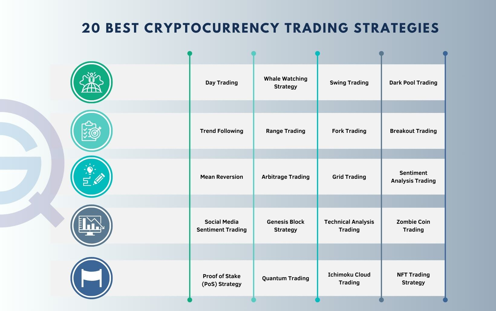

The integration of algorithmic strategies has transformed the landscape of cryptocurrency trading, propelling the activity into new realms of efficiency and precision. This article examines the various investment strategies involved in cryptocurrency algo trading. At its core, algorithmic trading, often referred to as 'algo trading,' employs sophisticated software platforms to automate trades within the rapidly shifting and highly volatile cryptocurrency markets. By harnessing cutting-edge technology, traders are able to enhance their decision-making processes and execute trades with greater speed and efficacy.

Recent advancements in computation and data analysis have made it possible to create algorithms capable of processing vast amounts of market data in real time. These algorithms are designed to identify optimal trading opportunities and respond to them immediately, reducing latency and maximizing the potential for profit. Despite the promise of increased returns, algorithmic trading in cryptocurrencies is not without its challenges and hazards. Understanding the balance between potential rewards and the inherent risks is crucial for any investor contemplating an entry into algorithmic trading.



Technological sophistication demands not just an understanding of the software and coding required to build effective algorithms but also an intimate knowledge of market mechanics and forces. In considering an investment in cryptocurrency algo trading, it is essential for prospective investors to be well-informed about the strategies these algorithms employ and the conditions under which they operate. This understanding can create a foundation for successful engagement in what is undoubtedly one of the most dynamic sectors of the financial markets today.

## Table of Contents

## Understanding Cryptocurrency Algo Trading

Algorithmic trading in the cryptocurrency market leverages sophisticated computer algorithms to execute trades automatically based on predetermined criteria. This automated process is designed to optimize trading efficiency and decision-making in the highly volatile cryptocurrency environment. The criteria guiding these algorithms can be diverse, incorporating technical indicators such as moving averages or relative strength index (RSI), along with market sentiment analysis and AI-powered predictive analytics.

One of the primary advantages of algorithmic trading over traditional manual trading is the ability of algorithms to function continuously and make rapid decisions. These algorithms can process and analyze vast amounts of data instantaneously, which is critical in the fast-paced cryptocurrency markets where price fluctuations can occur in fractions of a second. This analytic capability enables traders to capitalize on opportunities that human traders might miss due to slower reaction times and the physical limitations of processing large datasets.

Furthermore, by automating trades, algorithmic systems minimize emotional involvement—a factor that can significantly impact trading performance. Human traders are often influenced by emotions such as fear and greed, which can lead to impulsive decisions and increased risk of losses. Algorithms, on the other hand, execute trades based solely on the logic and parameters defined by their programming, leading to a more disciplined and consistent trading approach.

The spectrum of strategies employed in [algorithmic trading](/wiki/algorithmic-trading) is broad, ranging from straightforward rule-based systems to advanced approaches driven by [machine learning](/wiki/machine-learning). Simple rule-based systems might involve executing trades when specific criteria are met, such as a crossover of moving averages. In contrast, machine learning-driven strategies utilize data to adapt and improve over time, refining their predictive capabilities and optimizing trading outcomes.

In conclusion, understanding the mechanics of [cryptocurrency](/wiki/cryptocurrency) algorithmic trading is vital for investors seeking to utilize technology for enhanced trading performance. With diverse strategies that leverage significant computational power, this approach represents a modern methodology for engaging with digital asset markets.

## Popular Algo Trading Strategies

Common algorithmic trading strategies in the cryptocurrency market include Trend Following, Mean Reversion, and Arbitrage. Each of these strategies leverages technological tools to exploit specific market behaviors, and each comes with distinct risks and rewards that may be more or less suitable depending on prevailing market conditions.

**Trend Following** is a strategy that leverages algorithms to identify and capitalize on long-term market movements. By primarily focusing on price trends, this strategy involves buying assets when they exhibit an upward trend and selling them when the trend shifts downward. The fundamental principle is based on the belief that prices tend to move in persistent directions. This strategy can be advantageous during high volatility periods, where large market shifts present profitable opportunities. However, the risk lies in sudden trend reversals, which can result in losses if not promptly detected by the algorithm.

**Mean Reversion** is another widely-used strategy, founded on the belief that asset prices tend to revert to their mean over time. This approach allows algorithms to predict that extreme price changes will naturally adjust back to normal levels. In practice, when an asset's price drastically departs from the historical average, the algorithm will buy and sell to capitalize on the anticipated reversion to the mean. While this can be effective in stable markets with identifiable average price levels, it poses risks in volatile markets where prices may not revert as expected.

**Arbitrage** involves exploiting price discrepancies of the same asset across different exchanges or markets. Given the decentralized nature of cryptocurrency exchanges, assets can frequently be bought at a lower price on one platform and sold at a higher price on another. This strategy requires swift execution and precise algorithms capable of detecting and acting on these discrepancies quickly. While arbitrage can be profitable with minimized market risks due to the simultaneous buying and selling of assets, challenges include transaction costs, transfer times, and the potential for missing opportunities due to rapid market movements.

In conclusion, each algo trading strategy carries its own set of risks and rewards, requiring careful consideration of market conditions and individual risk tolerance. While these strategies can be highly effective under the right circumstances, they demand rigorous algorithm design and continuous adjustment to ensure sustainable success.

## Impact of AI and Machine Learning

Artificial Intelligence (AI) and Machine Learning (ML) are increasingly becoming integral components of sophisticated algorithmic trading strategies in cryptocurrency markets. These technologies enable the processing of extensive datasets to unveil patterns and generate trading signals that would be difficult, if not impossible, for human traders to discern manually.

AI systems are particularly proficient in processing and analyzing massive volumes of market data, such as trade volumes, price movements, and [order book](/wiki/order-book-trading-strategies) information, to identify anomalies and predictive patterns. This capability is largely due to AI's efficient algorithms that can manage large-scale data processing tasks at speeds unmatched by traditional computing methods.

Machine Learning models, a subset of AI, are designed to improve their predictive accuracy over time by learning from new market data. These models employ techniques like supervised learning, where historical data is used to train the model, and unsupervised learning, where the model identifies patterns without labeled inputs. For instance, a model might use linear regression to predict future prices based on historical trends:

```python
from sklearn.linear_model import LinearRegression
import numpy as np

# Example dataset
time = np.array([1, 2, 3, 4, 5])
prices = np.array([10, 12, 13, 15, 18])

# Reshape time to fit the model
time = time.reshape(-1, 1)

# Initialize and fit the model
model = LinearRegression()
model.fit(time, prices)

# Predict future price
future_time = np.array([[6]])
predicted_price = model.predict(future_time)

print(predicted_price)
```

Such models enhance the trader's ability to predict market movements with greater precision, thereby offering a competitive edge over traditional trading approaches.

AI and ML also contribute to improved risk management strategies. AI can simulate millions of scenarios to evaluate potential trading outcomes and optimize portfolio diversifications. Likewise, ML algorithms can alert traders to evolving market conditions, enabling timely adjustments to trading strategies.

The integration of AI and ML in trading algorithms epitomizes a significant trend, heralding the future trajectory of automated trading systems. These technologies promise increased efficiency, accuracy, and resilience in rapidly changing markets, making them essential tools for modern traders seeking to capitalize on the opportunities presented by algorithmic trading. As these systems continue to evolve, their impact on trading is expected to be increasingly profound.

## Risks and Challenges

Algorithmic trading in the cryptocurrency market, while offering notable benefits, comes with a range of risks and challenges that traders must be aware of to protect their investments.

Technical failures are a prominent risk in algo trading. Software glitches can occur if the algorithm's code is not meticulously developed and tested, potentially resulting in incorrect trade executions or missed trading opportunities. Connectivity issues, such as internet outages or server downtimes, can also disrupt trading activities. For instance, if an algorithm fails to execute a time-sensitive trade due to connectivity loss, it can lead to unexpected financial losses.

Market [volatility](/wiki/volatility-trading-strategies) introduces both opportunities and significant risks to algorithmic trading. Whilst price fluctuations afford traders the chance to capitalize on profitable trades, they also add a layer of unpredictability. The cryptocurrency market is notorious for its rapid and drastic price shifts, which can overwhelm even the most sophisticated algorithms that may not be able to respond in real-time to sudden changes.

Regulatory changes represent another challenge for algorithmic trading operations in the cryptocurrency sector. As governments and financial authorities around the world adapt to the growing crypto ecosystem, changes in laws and regulations can impact existing trading strategies. Compliance with new regulations can necessitate significant adjustments in the algorithms, and failure to comply might lead to legal repercussions or restrictions in market access.

Investors must also be vigilant against scams and fraudulent trading bots. The allure of algorithmic trading can attract malicious actors who promise unrealistically high returns. Such scams are not uncommon and they involve distributing trading bots that do not operate as promised, potentially causing financial loss. Traders should exercise due diligence by researching the credibility of trading platforms and avoiding "too-good-to-be-true" offers in the crypto market.

To mitigate these risks, robust due diligence, constant algorithm optimization, and vigilant monitoring of regulatory updates are essential practices for cryptocurrency traders engaging in algo trading.

## Best Practices for Successful Algo Trading

To succeed in algorithmic trading, particularly within the cryptocurrency markets, it is essential to focus on the development of robust and reliable trading algorithms. These algorithms must be meticulously tested and validated to ensure their effectiveness in live trading environments. A critical component of this process is [backtesting](/wiki/backtesting), which involves running algorithms against historical data to evaluate their performance under different market conditions. Backtesting provides valuable insights into potential algorithmic strengths and weaknesses, allowing traders to optimize their strategies for better returns. 

Another cornerstone of successful algo trading is the implementation of comprehensive risk management techniques. Setting stop-loss orders is a fundamental strategy to limit potential losses by automatically executing a sale when a certain price threshold is reached. This approach helps to mitigate the impact of adverse market movements. Additionally, diversifying investment strategies can spread risk across multiple assets or trading approaches, thereby reducing exposure to any single point of failure.

The cryptocurrency market is inherently dynamic, and its conditions can change rapidly. Therefore, it's crucial for traders to regularly update and adjust their algorithms to reflect current market trends and data. This ongoing refinement ensures that the trading strategies remain relevant and effective in achieving desired outcomes.

Collaborating with experienced developers or leveraging verified trading platforms can enhance the reliability and success rate of your algorithmic trading system. Verified platforms often provide tools and infrastructures, such as advanced APIs and data analytics, which can streamline the development and deployment process. Moreover, working with knowledgeable developers can offer deeper insights and technical skills essential for creating sophisticated algorithms capable of competing in today's fast-paced trading environments.

By adhering to these best practices, investors can significantly enhance the probability of achieving sustained success in their algorithmic trading endeavors.

## Conclusion

Cryptocurrency algo trading provides a promising avenue for investors to utilize technology for achieving financial success. By automating trading decisions, it offers the potential for greater efficiency and effectiveness in navigating the dynamic cryptocurrency markets. Nonetheless, this endeavor requires a prudent approach, grounded in a thorough understanding of both the technological tools and market intricacies.

A key aspect of successful algo trading is a comprehensive grasp of various strategies, such as Trend Following, Mean Reversion, and Arbitrage, along with the associated risks they entail. For instance, while algorithms can capitalize on market trends or price discrepancies to generate profits, they must be meticulously designed and tested to withstand the unpredictable nature of cryptocurrency markets.

Moreover, as the cryptocurrency landscape continuously transforms, so too do the technologies and methods utilized in trading. Innovations in Artificial Intelligence and Machine Learning are reshaping the ways in which algorithms operate, offering new opportunities for predictive accuracy and sophisticated risk management. Investors who remain informed about these advancements and adapt their strategies accordingly will be well-positioned to seize future opportunities.

In summary, those who strive to continuously enhance their understanding of both the market dynamics and technological advancements will be best equipped to maximize the benefits of cryptocurrency algo trading, while mitigating potential setbacks. Being informed and adaptable are key factors in thriving within the evolving landscape of cryptocurrency investments.

## References & Further Reading

[1]: Bergstra, J., Bardenet, R., Bengio, Y., & Kégl, B. (2011). ["Algorithms for Hyper-Parameter Optimization."](https://dl.acm.org/doi/10.5555/2986459.2986743) Advances in Neural Information Processing Systems 24.

[2]: ["Advances in Financial Machine Learning"](https://www.amazon.com/Advances-Financial-Machine-Learning-Marcos/dp/1119482089) by Marcos Lopez de Prado

[3]: ["Evidence-Based Technical Analysis: Applying the Scientific Method and Statistical Inference to Trading Signals"](https://www.amazon.com/Evidence-Based-Technical-Analysis-Scientific-Statistical/dp/0470008741) by David Aronson

[4]: ["Machine Learning for Algorithmic Trading"](https://github.com/PacktPublishing/Machine-Learning-for-Algorithmic-Trading-Second-Edition) by Stefan Jansen

[5]: ["Quantitative Trading: How to Build Your Own Algorithmic Trading Business"](https://books.google.com/books/about/Quantitative_Trading.html?id=j70yEAAAQBAJ) by Ernest P. Chan