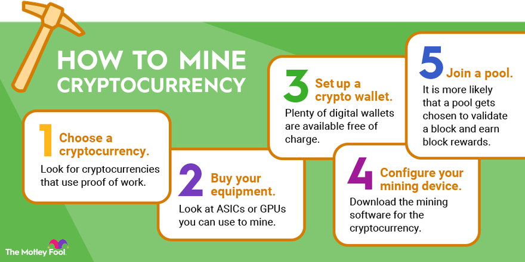

## Table of Contents

## What is cryptocurrency mining and why is it important?

Cryptocurrency mining is the process of using computers to solve complex math problems to add new transactions to a blockchain, which is like a digital ledger. When miners solve these problems, they get to add a new block of transactions to the blockchain and are rewarded with new cryptocurrency. This process helps keep the cryptocurrency network secure and running smoothly.

Mining is important because it helps to verify and secure transactions on the blockchain. Without miners, there would be no one to check if the transactions are valid, and the system could be easily cheated. By solving these math problems, miners make sure that the same cryptocurrency isn't spent twice and that the network stays trustworthy. This is crucial for people to have confidence in using cryptocurrencies for buying things or trading.

## How does the mining process work for different cryptocurrencies?

The mining process can be different for various cryptocurrencies, but the basic idea is the same. For Bitcoin, miners use powerful computers to solve complex math puzzles. When a miner solves a puzzle, they get to add a new block of transactions to the Bitcoin blockchain and are rewarded with new bitcoins. This process is called Proof of Work (PoW). The difficulty of the puzzles adjusts so that a new block is added about every 10 minutes, no matter how many miners are working.

For other cryptocurrencies like Ethereum, the mining process used to be similar to Bitcoin's, using Proof of Work. However, Ethereum is moving to a new system called Proof of Stake (PoS). In PoS, instead of solving puzzles, validators are chosen to add new blocks based on how many coins they hold and are willing to "stake" or lock up as a security deposit. This method uses less energy and can be faster than PoW. Other cryptocurrencies might use different methods, but they all aim to keep their networks secure and running smoothly.

## What hardware is required to start mining cryptocurrencies?

To start mining cryptocurrencies like Bitcoin, you need a powerful computer. The most important part of this computer is the graphics card, also called a GPU. Some people use special computers called ASICs, which are made just for mining and are very good at solving the math problems needed for mining. You also need a good internet connection to stay connected to the blockchain network and a place to keep your computer cool because mining can make it very hot.

For other cryptocurrencies like Ethereum, which used to use Proof of Work but are moving to Proof of Stake, the hardware needs might change. If you want to mine Ethereum before it fully switches to Proof of Stake, you would still need a strong GPU. But once it fully switches, you won't need to mine anymore. Instead, you'll need to stake your Ethereum, which means you'll need a computer to run the Ethereum software and some Ethereum to stake as a deposit.

## What software should beginners use for cryptocurrency mining?

For beginners starting with [cryptocurrency](/wiki/cryptocurrency) mining, a good software to use is CGMiner. It is free and works on many different types of computers, including those with GPUs and ASICs. CGMiner is easy to set up and has a command-line interface, which might look a bit tricky at first but is not too hard to learn. It also lets you connect to different mining pools, which are groups of miners working together to solve problems and share rewards.

Another good choice for beginners is EasyMiner. As the name says, it is made to be easy to use. It has a simple graphical interface, so you don't need to type in commands. EasyMiner works with many cryptocurrencies and can use both GPUs and CPUs for mining. It also supports mining pools and has features that help you keep track of how well your mining is going.

Both CGMiner and EasyMiner are good for people new to mining. They help you get started without needing to know a lot about computers or mining right away. Remember, though, that mining can use a lot of electricity and might not always make you a lot of money, so it's important to learn more and be careful before you start.

## How can one set up a mining rig at home?

Setting up a mining rig at home starts with choosing the right hardware. You'll need a powerful computer with a good graphics card, or GPU, if you're mining cryptocurrencies like Bitcoin or Ethereum. Some people use special computers called ASICs, which are made just for mining and are very good at it. You'll also need a good internet connection to stay connected to the blockchain network and a way to keep your computer cool, like a fan or special cooling system, because mining can make your computer very hot.

Once you have your hardware, you'll need to install mining software. For beginners, CGMiner or EasyMiner are good choices. CGMiner is free and works on many types of computers, but it uses a command-line interface, which might look a bit tricky at first. EasyMiner, on the other hand, is easier to use because it has a simple graphical interface where you don't need to type in commands. After installing the software, you'll need to connect to a mining pool, which is a group of miners working together to solve problems and share rewards. Once everything is set up, you can start mining and see if you can earn some cryptocurrency.

## What are the energy costs associated with mining and how can they be managed?

Mining cryptocurrencies uses a lot of energy because the computers have to work hard to solve math problems. The more powerful the computer, the more energy it uses. This can make your electricity bill go up a lot. For example, mining Bitcoin can use as much electricity as a small country! The exact cost depends on how much you pay for electricity where you live and how powerful your mining rig is.

To manage the energy costs, you can try a few things. First, you can look for a place where electricity is cheaper. Some people move their mining rigs to places with lower electricity costs. Second, you can make your mining rig more efficient. This means using better cooling systems so your computers don't have to work as hard to stay cool. Finally, you can join a mining pool. This way, you share the costs and rewards with other miners, which can help make mining more affordable.

## What are mining pools and should you join one?

Mining pools are groups of miners who work together to solve the math problems needed to mine cryptocurrencies. When they solve a problem, they share the reward based on how much work each miner did. Joining a mining pool can make it easier to earn some cryptocurrency because it's hard for one person to solve the problems alone. It's like working together with friends to finish a big job faster.

You should think about joining a mining pool if you want to mine cryptocurrencies. It can help you earn rewards more often, even if each reward is smaller. But you have to pay a small fee to be part of the pool, and you need to trust the people running the pool to be fair. So, it's a good idea to do some research and find a pool that has a good reputation and low fees.

## How do you calculate the profitability of mining a specific cryptocurrency?

To calculate the profitability of mining a specific cryptocurrency, you need to look at a few things. First, you need to know how much electricity your mining rig uses and how much you pay for electricity. This is important because mining uses a lot of power, and the cost of electricity can eat into your profits. Next, you need to find out how much reward you get for mining a block and how often you can expect to get that reward. You also need to know the current price of the cryptocurrency you're mining. By putting all these numbers together, you can figure out if you're making more money from mining than you're spending on electricity and other costs.

It's also a good idea to think about other costs like the price of your mining rig and any fees you pay to be part of a mining pool. These costs can affect how much profit you make. There are online calculators that can help you figure out all of this. You just put in the details about your mining setup, the cryptocurrency you want to mine, and the current prices, and the calculator will tell you if mining that cryptocurrency is profitable for you. Remember, the cryptocurrency market can change a lot, so what's profitable today might not be profitable tomorrow.

## What are the security risks involved in cryptocurrency mining and how can they be mitigated?

Cryptocurrency mining comes with some security risks. One big risk is that hackers might try to steal your cryptocurrency. They can do this by putting bad software on your computer, called malware, which can take your coins without you knowing. Another risk is that the people running the mining pool you join might not be honest. They could take more of the rewards for themselves or even steal all the cryptocurrency in the pool. Also, if you don't keep your mining software and computer up to date, you might be more likely to get hacked.

To keep safe, you should use strong passwords and keep your mining software and computer updated. It's a good idea to use antivirus software to protect against malware. When choosing a mining pool, do some research to make sure it's run by honest people with a good reputation. You can also use a separate computer just for mining, which can make it harder for hackers to get to your main computer and your other important information. By being careful and taking these steps, you can lower the risks of mining cryptocurrencies.

## How does the blockchain technology affect mining strategies?

Blockchain technology is what makes mining possible, and it changes how miners work. Every cryptocurrency uses its own blockchain, which is like a big list of all the transactions that have happened. Miners add new transactions to this list by solving hard math problems. The way the blockchain works can affect how miners choose to mine. For example, if a blockchain uses Proof of Work, like Bitcoin does, miners need powerful computers to solve the problems and add new blocks. This means they might focus on getting the best hardware they can to mine faster.

But not all blockchains use Proof of Work. Some, like the new version of Ethereum, use Proof of Stake. In this system, miners don't solve math problems. Instead, they put some of their cryptocurrency at risk, called staking, and get chosen to add new blocks based on how much they stake. This changes the mining strategy because miners don't need powerful computers anymore. They need to have a lot of the cryptocurrency to stake. So, miners might focus on buying and holding more of the cryptocurrency instead of spending money on expensive mining rigs.

## What are the regulatory and legal considerations for cryptocurrency miners?

Cryptocurrency miners need to think about the rules and laws in their country or area. Some places have strict rules about mining because it uses a lot of electricity. They might need special permission to mine or have to pay extra taxes. Miners also need to be careful about how they report their earnings to the tax office. In some countries, the money you make from mining is seen as income, and you have to pay taxes on it. It's important to know the rules where you live so you don't get in trouble.

Another thing to consider is that the rules can change. What's okay to do today might not be okay tomorrow. Miners should keep up with the news and changes in the law. They might also want to talk to a lawyer who knows about cryptocurrency to make sure they're doing everything right. By staying informed and following the rules, miners can avoid problems and keep mining safely.

## What advanced techniques can experts use to optimize mining operations?

Experts can optimize mining operations by using better hardware and software. They might use special computers called ASICs, which are made just for mining and are very good at solving the math problems needed to mine cryptocurrencies. They can also use software that helps them mine more efficiently. This software can do things like automatically switch between different cryptocurrencies to mine the one that's most profitable at the moment. Experts might also use cooling systems to keep their computers from getting too hot, which can help them mine faster and use less electricity.

Another way experts optimize mining is by joining the right mining pools. They look for pools with low fees and a good reputation. This helps them get more rewards without spending too much. Experts also keep a close eye on the cryptocurrency market. They know that the prices of cryptocurrencies can change a lot, so they might switch what they're mining based on what's most profitable at the time. By staying up to date and using the best tools, experts can make their mining operations run better and earn more cryptocurrency.

## References & Further Reading

[1]: Antonopoulos, A. M. (2017). ["Mastering Bitcoin: Unlocking Digital Cryptocurrencies"](https://books.google.com/books/about/Mastering_Bitcoin.html?id=IXmrBQAAQBAJ). O'Reilly Media.

[2]: Narayanan, A., Bonneau, J., Felten, E., Miller, A., & Goldfeder, S. (2016). ["Bitcoin and Cryptocurrency Technologies: A Comprehensive Introduction"](https://press.princeton.edu/books/hardcover/9780691171692/bitcoin-and-cryptocurrency-technologies). Princeton University Press.

[3]: Böhme, R., Christin, N., Edelman, B., & Moore, T. (2015). ["Bitcoin: Economics, Technology, and Governance"](https://www.aeaweb.org/articles?id=10.1257/jep.29.2.213). The Journal of Economic Perspectives, 29(2), 213-238.

[4]: Lopez de Prado, M. (2018). ["Advances in Financial Machine Learning"](https://books.google.com/books/about/Advances_in_Financial_Machine_Learning.html?id=oU9KDwAAQBAJ). Wiley.

[5]: Bonneau, J., Miller, A., Clark, J., Narayanan, A., Kroll, J. A., & Felten, E. W. (2015). ["SoK: Research Perspectives and Challenges for Bitcoin and Cryptocurrencies"](https://ieeexplore.ieee.org/document/7163021). IEEE Symposium on Security and Privacy.