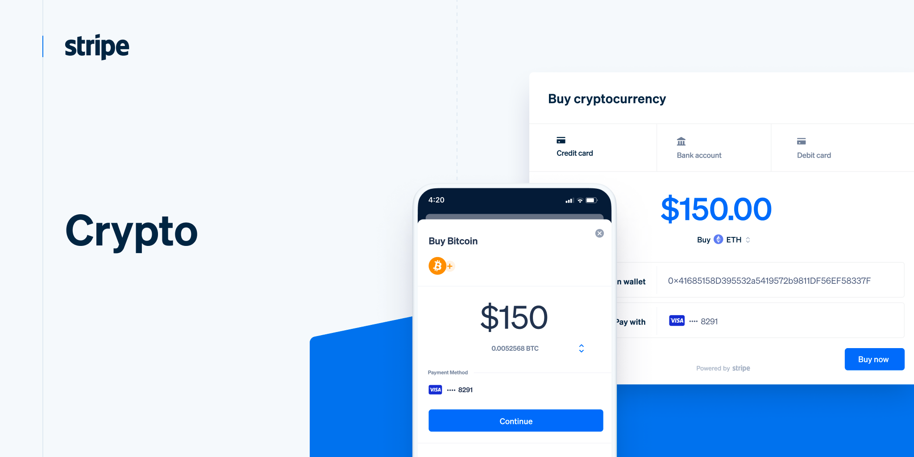

## Table of Contents

## What is cryptocurrency and how does it work as a payment method?

Cryptocurrency is a type of digital money that you can use to buy things online. Unlike regular money, like dollars or euros, which are controlled by banks and governments, cryptocurrencies are managed by computer networks. The most famous cryptocurrency is Bitcoin, but there are many others like Ethereum and Litecoin. You store cryptocurrencies in a digital wallet on your computer or phone, and you can send them to other people's wallets to pay for things.

When you use cryptocurrency to pay for something, you send the money from your digital wallet to the seller's wallet. This happens over the internet, and it's recorded on a public list called a blockchain. The blockchain keeps track of all the transactions, so everyone can see that the payment was made. It's secure because it uses special codes that are hard to break. This way, you can buy things online without needing a bank or a credit card company to help with the transaction.

## What are the most popular cryptocurrencies used for payments?

The most popular cryptocurrency for payments is Bitcoin. It's been around since 2009 and many online shops and services accept it. When you pay with Bitcoin, the payment is quick and you don't need to share your personal information like you do with credit cards. This makes it good for buying things online, especially if you want to keep your identity private.

Another popular one is Ethereum. It's not just a cryptocurrency, but also a platform where you can create and run special programs called smart contracts. These can be used for all sorts of things, like buying and selling digital art or managing agreements. Some shops and services accept Ethereum as payment, and it's growing in popularity because of its extra features.

Litecoin is also used for payments. It's similar to Bitcoin but it processes transactions faster and with lower fees. This makes it a good choice for everyday purchases. While it's not as widely accepted as Bitcoin or Ethereum, it's still used by many online sellers and is a good option for those looking for quick and cheap payments.

## How can someone start accepting cryptocurrency payments?

To start accepting cryptocurrency payments, you first need to choose which cryptocurrencies you want to accept, like Bitcoin, Ethereum, or Litecoin. Then, you'll need a digital wallet to store the payments. You can get a wallet from a cryptocurrency exchange or use a software wallet that you download to your computer or phone. Once you have your wallet set up, you'll need to share your wallet address with your customers so they can send you payments. This address is a long string of letters and numbers that acts like your bank account number for cryptocurrencies.

Next, you'll want to integrate a payment gateway into your website or business. A payment gateway is like a cash register for cryptocurrencies; it helps process the payments from your customers. There are many payment gateways available, like Coinbase Commerce, BitPay, and CoinGate, that support multiple cryptocurrencies and can be easily added to your website. Once set up, your customers can pay you by scanning a QR code or entering your wallet address. The payment gateway will then confirm the transaction on the blockchain and notify you that you've received the payment.

## What are the benefits of using cryptocurrency for payments?

Using cryptocurrency for payments can be really helpful. One big benefit is that it's fast and you can use it anywhere in the world. You don't have to wait for banks to process your payment, which can take days. With cryptocurrency, the payment can be done in minutes. Also, you don't need to worry about different countries having different currencies because cryptocurrency works the same everywhere. This makes it easy for people to buy things from other countries without any trouble.

Another good thing about using cryptocurrency is that it's secure and private. When you pay with cryptocurrency, you don't have to give your name or other personal information. This means your privacy is protected. Also, the transactions are recorded on a blockchain, which is very hard to change or hack. So, you can feel safe knowing that your money is protected and your payments are secure.

## What are the risks and challenges associated with cryptocurrency payments?

Using cryptocurrency for payments can be risky because the value of cryptocurrencies can go up and down a lot. One day your money might be worth a lot, but the next day it could be worth much less. This can make it hard to know how much you're really spending or getting paid. Also, if you make a mistake and send your cryptocurrency to the wrong address, you can't get it back. It's like sending cash through the mail and losing it - there's no way to reverse the payment.

Another challenge is that not many places accept cryptocurrency yet. You might find it hard to use your cryptocurrency to buy everyday things like groceries or clothes. This means you might have to change your cryptocurrency into regular money first, which can cost you extra money and time. Plus, using cryptocurrency can be confusing for some people because it's different from what they're used to with regular money and banks. You have to learn how to keep your digital wallet safe and understand how the blockchain works, which can be a lot to take in.

## How do cryptocurrency transactions work, and what is the role of blockchain?

When you want to pay someone using cryptocurrency, you send the money from your digital wallet to their digital wallet. This is done over the internet. You enter the other person's wallet address, which is a long string of letters and numbers, and then you send the payment. Once you send it, the payment can't be changed or taken back. It's like sending cash through the mail - once it's gone, it's gone. The payment goes through a network of computers that all work together to make sure the payment is real and gets to the right place.

The role of the blockchain is to keep track of all these payments. Think of the blockchain like a big public notebook where every payment is written down. Once a payment is recorded in the blockchain, everyone can see it, and it can't be changed. This makes it very safe and clear. The blockchain is managed by a lot of computers all over the world, so no one person or group can control it. This is why people trust it to keep their payments safe and honest.

## What fees are associated with cryptocurrency payments?

When you use cryptocurrency for payments, you might have to pay some fees. One kind of fee is called a transaction fee. This is a small amount of cryptocurrency that you pay to the people who run the network, like miners, to process your payment and add it to the blockchain. The fee can change depending on how busy the network is. If a lot of people are using the cryptocurrency at the same time, the fee might be higher because miners get to choose which payments to process first, and they usually pick the ones with higher fees.

Another fee you might come across is a service fee if you use a payment gateway or a platform to help you accept cryptocurrency payments. These platforms, like Coinbase Commerce or BitPay, make it easier for you to get paid in cryptocurrency, but they charge a fee for their services. This fee can be a percentage of the payment or a flat amount. It's important to check what fees you might have to pay before you start using cryptocurrency for payments, so you know what to expect.

## How can businesses integrate cryptocurrency payment systems into their operations?

Businesses can start accepting cryptocurrency payments by first choosing which cryptocurrencies they want to accept, like Bitcoin, Ethereum, or Litecoin. They'll need a digital wallet to store these payments. You can get a wallet from a cryptocurrency exchange or use a software wallet that you download to your computer or phone. Once the wallet is set up, businesses need to share their wallet address with customers so they can send payments. This address is a long string of letters and numbers, kind of like a bank account number for cryptocurrencies. 

To make it easier for customers to pay, businesses can use a payment gateway. A payment gateway is like a cash register for cryptocurrencies that helps process payments. There are many payment gateways available, like Coinbase Commerce, BitPay, and CoinGate, that support multiple cryptocurrencies and can be easily added to a business's website. Once the payment gateway is set up, customers can pay by scanning a QR code or entering the wallet address. The payment gateway will then confirm the transaction on the blockchain and notify the business that they've received the payment.

## What are the tax implications of using cryptocurrency for payments?

When you use cryptocurrency to buy things or get paid, you need to think about taxes. In many places, like the United States, using cryptocurrency is treated like trading property. So, if you use Bitcoin to buy something, you might have to pay taxes on any profit you made from the time you got the Bitcoin until you used it. This is called capital gains tax. For example, if you bought Bitcoin when it was worth $10,000 and used it to buy a laptop when it was worth $15,000, you would have to pay tax on the $5,000 gain.

Keeping track of these taxes can be tricky. You need to keep good records of when you got your cryptocurrency, how much you paid for it, and when you used it to buy things. Some countries have different rules about how to report these taxes, so it's a good idea to talk to a tax expert to make sure you're doing everything right. They can help you understand the rules and make sure you're not missing any important details that could cause problems later.

## How does the volatility of cryptocurrencies affect their use as payment methods?

The value of cryptocurrencies can go up and down a lot, and this can make it hard for people to use them to buy things. If you want to buy something with Bitcoin, for example, you might find that the price of Bitcoin changes a lot between the time you decide to buy and the time you actually make the payment. This means you could end up paying more or less than you expected. It's like trying to buy something with a currency that keeps changing its value every day. This can make it risky for both the buyer and the seller because neither knows exactly how much the payment will be worth.

Because of this, some businesses are careful about accepting cryptocurrencies. They might worry that the value of the cryptocurrency they receive could drop a lot before they can change it into regular money. To deal with this, some businesses might change the cryptocurrency into regular money right away, but this can cost extra money in fees. For people who are buying things, the big changes in value can make it hard to plan their spending. They might wait to buy something until the value of their cryptocurrency goes up, or they might rush to buy before it goes down. This can make using cryptocurrencies for everyday payments a bit tricky.

## What are the regulatory considerations for businesses accepting cryptocurrency payments?

When businesses start accepting cryptocurrency payments, they need to think about the rules and laws in their country. Different places have different rules about cryptocurrencies. Some countries might say that businesses need a special license to accept cryptocurrencies, while others might have rules about how to report these payments for taxes. It's important for businesses to learn about these rules so they don't get in trouble. They might need to talk to a lawyer or a tax expert to make sure they're doing everything right.

Also, businesses need to be careful about following rules that help stop things like money laundering and fraud. When people use cryptocurrencies, it can be harder to track where the money is coming from. This means businesses might need to do extra checks to make sure they're not accidentally helping with illegal activities. Keeping good records and following the rules can help businesses stay out of trouble and keep their customers safe.

## What future trends and developments can we expect in cryptocurrency payment methods?

In the future, we might see more and more businesses start to accept cryptocurrencies for payments. As more people learn about cryptocurrencies and how to use them, they might become a normal way to pay for things, just like using a credit card or cash. This could happen because new technology makes it easier and safer to use cryptocurrencies. For example, better digital wallets and payment gateways could make it simpler for businesses to accept cryptocurrencies without worrying about the risks. Also, if more countries start to make clear rules about using cryptocurrencies, businesses might feel more comfortable accepting them.

Another thing we might see is new types of cryptocurrencies that are made just for payments. These new cryptocurrencies could be more stable, meaning their value doesn't go up and down as much. This would make them better for buying things because people would know how much they're spending. Also, we might see more use of smart contracts, which are special programs that can automatically handle payments and agreements. This could make buying and selling things with cryptocurrencies even easier and safer. As these trends grow, cryptocurrencies could become a bigger part of how we pay for things every day.

## References & Further Reading

[1]: Nakamoto, S. (2008). ["Bitcoin: A Peer-to-Peer Electronic Cash System."](https://nakamotoinstitute.org/library/bitcoin/) 

[2]: Peters, G. W., & Panayi, E. (2015). ["Understanding Modern Banking Ledgers through Blockchain Technologies: Future of Transaction Processing and Smart Contracts on the Internet of Money."](https://papers.ssrn.com/sol3/papers.cfm?abstract_id=2692487) SWIFT Institute Working Paper No. 2015-007.

[3]: Treleaven, P., Galas, M., & Lalchand, V. (2013). ["Algorithmic Trading Review."](https://dl.acm.org/doi/10.1145/2500117) Communications of the ACM, 56(11), 76-85.

[4]: López de Prado, M. (2018). ["Advances in Financial Machine Learning"](https://www.amazon.com/Advances-Financial-Machine-Learning-Marcos/dp/1119482089) Wiley.

[5]: Harvey, C. R., & Rattray, S. (2015). ["The Rise of the Machines: Algorithmic Trading in the Foreign Exchange Market."](https://onlinelibrary.wiley.com/doi/abs/10.1111/jofi.12186) 

[6]: Swammy, N. R., & Krishna, V. (2018). ["High-Frequency Trading in Cryptocurrency Markets: Evidence from CoinCheck Trade Data."](https://jfin-swufe.springeropen.com/articles/10.1186/s40854-023-00595-y) 

[7]: Narayanan, A., Bonneau, J., Felten, E., Miller, A., & Goldfeder, S. (2016). ["Bitcoin and Cryptocurrency Technologies: A Comprehensive Introduction"](https://press.princeton.edu/books/hardcover/9780691171692/bitcoin-and-cryptocurrency-technologies) Princeton University Press.