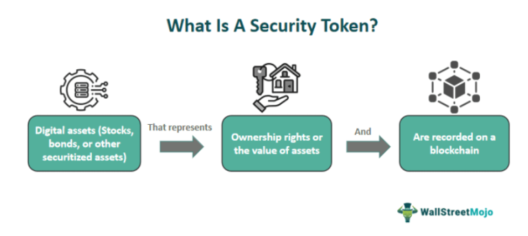

The emerging landscape of financial technology has seen a significant convergence of digital assets and advanced trading strategies. A crucial component in this evolving market is the security token, an innovative financial instrument that merges traditional finance concepts with the revolutionary capabilities of blockchain technology. Security tokens are distinct from conventional cryptocurrencies in their purpose and function. While cryptocurrencies such as Bitcoin and Ethereum primarily serve as digital currencies or mediums of transaction, security tokens represent ownership rights or value in a specific asset, much like conventional stocks or bonds. This integration of traditional financial structures with blockchain offers new transparency, liquidity, and the potential for broadening access to investment opportunities.

Cryptocurrencies, security tokens, and algorithmic trading are transforming modern investment strategies. Algorithmic trading, in particular, plays a crucial role in maximizing investment opportunities in the digital asset markets. By using predefined algorithms to execute trades, investors can enhance their returns while mitigating risks. This approach not only facilitates quicker transactions but also allows for the management of large volumes and complex strategies, vital in the rapidly moving digital markets.



Understanding these concepts is essential for anyone looking to navigate the digital financial markets effectively. Security tokens offer a regulated, secure investment option that blends the reliability of traditional assets with digital innovation. As the digital finance landscape develops, informed investors can leverage these tools to make strategic decisions. Exploring the distinctions between security tokens and cryptocurrencies, and learning the role of algorithmic trading strategies can ensure success in this dynamic financial environment.

## Table of Contents

## What are Security Tokens?

Security tokens are digital representations of ownership or economic interest in a particular asset recorded on a blockchain network. These tokens are generated through a process known as tokenization, which involves encoding ownership details into a blockchain-based token, thus ensuring secure and transparent record-keeping. This process essentially digitizes assets, enabling them to be more easily transferred and traded on digital platforms.

Tokenization transforms traditional assets by ensuring greater transparency and liquidity compared to traditional stock certificates. Traditional stocks are often subject to geographical trading constraints and slower settlement times, but security tokens can be traded 24/7 on global, blockchain-based exchanges. This increases the potential market participants for any given asset, thereby enhancing liquidity.

The regulatory framework surrounding security tokens is a significant difference from cryptocurrencies. In the United States, for instance, security tokens must receive approval from the Securities and Exchange Commission (SEC) before they can be legally sold. This ensures that security tokens comply with regulatory standards, providing investors with a level of protection comparable to traditional securities markets. Other countries have similar regulatory bodies that oversee security tokens to preserve market integrity and investor trust.

With the ability to facilitate fractional ownership, security tokens make it possible for a wider range of investors to participate in both digital and traditional markets. This opens up investment opportunities in assets that might otherwise be financially inaccessible due to high entry costs, such as real estate or fine art.

Moreover, security tokens represent a merging of traditional finance principles with advancements in blockchain technology. They provide a pathway for bridging conventional assets into the digital domain, thereby expanding the scope and reach of digital finance. As regulatory bodies advance in their understanding and adaptation to such technologies, the prominence of security tokens as viable investment vehicles is expected to rise.

## Security Tokens vs. Cryptocurrencies

While security tokens and cryptocurrencies are both digital assets operating on blockchain technology, they serve distinct purposes. Cryptocurrencies, such as Bitcoin (BTC) and Ethereum (ETH), primarily act as digital currencies or mediums of exchange. They are decentralized, enabling peer-to-peer transactions without the need for intermediaries. These assets are often used for payments, value transfer, or as stores of value akin to digital gold.

On the other hand, security tokens are designed as investment instruments. They signify ownership rights or the value of an asset, much like traditional financial securities such as stocks or bonds. Security tokens emerge from tokenization, a process where a real-world asset, like equity, is represented digitally on a blockchain. This allows for greater transparency and [liquidity](/wiki/liquidity-risk-premium) as ownership details are securely recorded on the blockchain.

The distinction between these two types of digital assets is crucial. Cryptocurrencies are not inherently investment instruments, although some investors may treat them as such. This perspective often stems from the notable price [volatility](/wiki/volatility-trading-strategies) and potential for returns associated with cryptocurrencies. However, such a view does not align with their primary function as a payment system.

Understanding these differences helps investors make knowledgeable decisions when allocating resources in digital assets. Security tokens offer a way to participate in financial markets under the guidance of regulatory compliance, given their classification as securities requires adherence to certain legal standards. The approval of security tokens by bodies like the Securities and Exchange Commission (SEC) exemplifies this regulatory scrutiny, providing an added layer of investor protection.

In summary, while both security tokens and cryptocurrencies utilize blockchain, their roles within the digital asset ecosystem are distinct. Recognizing these differences is pivotal for investors to navigate effectively and strategically manage their portfolios.

## Algorithmic Trading in Cryptocurrency Investments

Algorithmic trading is the process of utilizing computer algorithms to automate the execution of trading strategies, thus allowing trades to be executed at speeds and frequencies that are impossible for human traders. In the context of [cryptocurrency](/wiki/cryptocurrency) markets, [algorithmic trading](/wiki/algorithmic-trading) has become increasingly popular due to its ability to manage large volumes of transactions and implement complex strategies efficiently. 

The rise of algorithmic trading in cryptocurrency investments is largely attributed to the volatile and dynamic nature of the crypto markets. These markets operate 24/7, which presents both opportunities and challenges for investors. Algorithms can continuously analyze market conditions, execute trades, and optimize portfolios without the need for human intervention, thus enhancing the efficiency of trading operations.

One of the primary advantages of algorithmic trading is its potential to enhance returns while mitigating risks. Algorithms can be programmed to perform a multitude of tasks, ranging from market analysis and trend identification to executing [arbitrage](/wiki/arbitrage) strategies. This ability to quickly capitalize on market inefficiencies can lead to improved portfolio performance. For example, algorithms can be designed to exploit price differentials between different markets or exchanges, a practice known as arbitrage, which can yield profits with minimal risk exposure.

Moreover, algorithmic trading facilitates diversification and risk management. By employing a range of strategies across various digital assets, investors can spread risk and reduce the impact of adverse price movements on a single asset. Algorithms can be used to implement strategies such as mean reversion, [momentum](/wiki/momentum) trading, and [statistical arbitrage](/wiki/statistical-arbitrage), providing flexibility in investment approaches.

In security tokens, the integration of algorithmic trading offers new avenues for optimizing investment outcomes. Security tokens, with their regulatory compliance and asset-backed nature, present unique opportunities for algo trading strategies tailored to traditional asset classes. Algorithms can be utilized to analyze market sentiment, historical data, and other pertinent information to inform trading decisions within these emerging markets.

Understanding the role and impact of algorithmic trading in cryptocurrency investments is essential for modern investors. As the crypto landscape continues to evolve, the sophistication and adaptability of algorithmic strategies will undoubtedly play a crucial role in shaping investment success. Embracing technological advancements in trading can provide investors with a competitive edge, allowing them to navigate the complexities of digital financial markets more effectively.

## The Future of Security Tokens and Algo Trading

As the blockchain ecosystem continues to progress, the potential impact of security tokens on capital markets is becoming increasingly significant. Security tokens, by bridging the gap between traditional financial instruments and digital assets, offer a unique method to enhance liquidity and accessibility in markets that were traditionally less fluid. Regulatory advancements are crucial for this transformation, as they ensure market participants operate within secure and legal parameters. The introduction of frameworks, such as the Security Token Offering (STO) guidelines, helps legitimize and facilitate the broader adoption of security tokens by both institutional and retail investors.

In conjunction with regulatory progress, technological innovations in blockchain infrastructure are propelling the utilization of security tokens forward. Enhanced blockchain capabilities, including improved security protocols and faster transaction speeds, are essential for the scalability and robustness of security token markets. These advancements enable more complex asset tokenization and the secure transfer of rights and ownership, paving the way for widespread use in diverse financial sectors.

Algorithmic trading is poised to play a pivotal role as these digital financial tools gain traction. The efficiency of algorithmic trading lies in its ability to execute trades based on pre-programmed criteria without the delays that accompany human decision-making. This allows for the processing of vast amounts of market data to identify trends and execute transactions at optimal moments. As financial markets become more data-driven, the reliance on algorithmic trading as a sophisticated solution for managing digital assets is expected to increase.

The convergence of security tokens and algorithmic trading heralds a new era for investors who are ready to leverage these evolving technologies strategically. By integrating algorithmic trading models with security token platforms, investors can explore more dynamic strategies that potentially offer enhanced returns and reduced risks.

Below is a simple example of a Python script that utilizes basic algorithmic trading principles to automate buy/sell decisions based on moving average crossovers, a popular strategy for identifying market trends:

```python
import pandas as pd

class AlgorithmicTrader:
    def __init__(self, data, short_window=40, long_window=100):
        self.data = data
        self.short_window = short_window
        self.long_window = long_window
        self.signals = pd.DataFrame(index=data.index)

    def generate_signals(self):
        self.signals['short_mavg'] = self.data['Close'].rolling(window=self.short_window, min_periods=1).mean()
        self.signals['long_mavg'] = self.data['Close'].rolling(window=self.long_window, min_periods=1).mean()

        self.signals['signal'] = 0.0
        self.signals['signal'][self.short_window:] = \
            (self.signals['short_mavg'][self.short_window:] > self.signals['long_mavg'][self.short_window:]).astype(float)

        self.signals['positions'] = self.signals['signal'].diff()
        return self.signals

# Sample usage with synthetic data
dates = pd.date_range('2023-01-01', '2023-12-31')
data = pd.DataFrame(index=dates)
data['Close'] = pd.Series([i + (i * 0.05) for i in range(len(dates))], index=dates)

trader = AlgorithmicTrader(data)
signals = trader.generate_signals()

print(signals.head())
```

This simple model can be greatly enhanced with the integration of [machine learning](/wiki/machine-learning) techniques, sentiment analysis, and high-frequency data processing, offering sophisticated, adaptable strategies for digital asset trading.

As these trends evolve, maintaining a competitive edge in digital finance will require adapting to both technological and regulatory changes. Security tokens and algorithmic trading represent powerful tools that can redefine investment strategies and outcomes, promising a robust future for investors prepared to navigate this innovative landscape.

## Conclusion

Security tokens, cryptocurrencies, and algorithmic trading are reshaping financial market participation, offering innovative avenues for investment. Each comes with distinct attributes that, when understood, enable investors to leverage strengths and minimize potential pitfalls. The continuously evolving regulatory environment and rapid technological advancements are pivotal factors driving the adoption of these tools.

Investors must remain informed and ready to adapt to these changes, ensuring they maximize the potential benefits of both security tokens and cryptocurrencies. As traditional financial models integrate with blockchain technology, a new landscape for investment emerges, characterized by enhanced transparency, liquidity, and trading efficiency.

In this new era, investors are not just passive participants but active strategists who utilize cutting-edge technologies to optimize their portfolios. By staying abreast of regulatory developments and technological innovations, investors can ensure their strategies are both compliant and competitive.

This fusion of traditional finance with modern technology is not just a trend; it's a fundamental transformation that redefines the essence of investing, offering unprecedented opportunities and challenges. Embracing this paradigm shift will be crucial for investors seeking success in the digital age.

## References & Further Reading

[1]: Tapscott, D., & Tapscott, A. (2016). ["Blockchain Revolution: How the Technology Behind Bitcoin and Other Cryptocurrencies is Changing the World"](https://dl.acm.org/doi/10.5555/3051781). Penguin.

[2]: Buterin, V. (2013). ["Ethereum White Paper: A Next-Generation Smart Contract and Decentralized Application Platform"](https://ethereum.org/en/whitepaper/).

[3]: Zohar, A. (2015). ["Bitcoin: under the hood"](https://dl.acm.org/doi/10.1145/2701411). Peer-to-Peer Networking and Applications.

[4]: Lopez de Prado, M. (2018). ["Advances in Financial Machine Learning"](https://books.google.com/books/about/Advances_in_Financial_Machine_Learning.html?id=oU9KDwAAQBAJ). Wiley.

[5]: Rosic, A. (2020). ["Security Tokens Explained: The Future of Finance?"](https://tokenist.com/investing/security-tokens-explained/). Blockgeeks.

[6]: Petty, J. (2019). ["Tokenization: A Guide to Enterprise Blockchain & Security Tokens"](https://www.nola.com/sports/saints/). Business Expert Press.

[7]: Chan, E. (2009). ["Quantitative Trading: How to Build Your Own Algorithmic Trading Business"](https://github.com/ftvision/quant_trading_echan_book). Wiley.

[8]: Jansen, S. (2018). ["Machine Learning for Algorithmic Trading - Second Edition: Predictive models to extract signals from market and alternative data for systematic trading strategies with Python"](https://www.oreilly.com/library/view/machine-learning-for/9781839217715/Text/Front_Matter.xhtml). Packt Publishing.