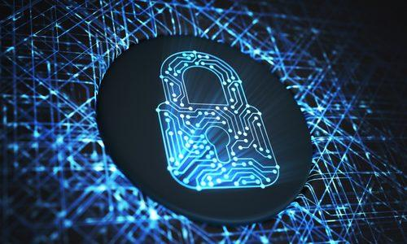

## Table of Contents

## What are cryptocurrency security tokens?

Cryptocurrency security tokens are a type of digital asset that represents ownership in a real-world asset, like a company or a piece of real estate. They are similar to traditional securities like stocks or bonds, but they are issued and managed using blockchain technology. This means they can be bought, sold, and traded on digital platforms, often with more efficiency and transparency than traditional securities.

Security tokens are regulated by financial authorities because they are considered investments. This regulation helps protect investors by ensuring that the tokens are legitimate and that the companies issuing them follow certain rules. Unlike other cryptocurrencies like Bitcoin, which are often used as a form of currency or for speculation, security tokens are mainly used to raise money for businesses and to give investors a stake in those businesses.

## How do security tokens differ from utility tokens and equity tokens?

Security tokens, utility tokens, and equity tokens are all types of cryptocurrencies, but they serve different purposes. Security tokens are like digital versions of traditional investments like stocks or bonds. They represent ownership in a real asset, like a company or a piece of property. Because they are considered investments, security tokens are regulated by financial authorities to protect investors. They are used by companies to raise money and give investors a stake in their business.

Utility tokens, on the other hand, are not meant to be investments. Instead, they are used to access a specific product or service within a company's platform. For example, a utility token might be used to pay for services on a blockchain network. They are not regulated in the same way as security tokens because they don't represent ownership in anything; they are more like a digital voucher or ticket.

Equity tokens are a specific type of security token. They represent actual ownership in a company, similar to traditional stocks. When you buy an equity token, you become a part-owner of the company and may receive dividends or a share of the profits. Like all security tokens, equity tokens are regulated to ensure that investors are protected. The main difference between equity tokens and other security tokens is that equity tokens specifically represent ownership in a company, while other security tokens might represent ownership in different types of assets.

## What are the legal and regulatory considerations for security tokens?

Security tokens are treated like traditional investments, so they have to follow rules set by financial regulators. In the United States, the main rule is the Howey Test, which decides if something is a security. If a token is seen as a security, it must follow rules from the Securities and Exchange Commission (SEC). These rules are meant to protect people who invest money. Companies that want to use security tokens to raise money need to register with the SEC, give investors all the important information, and follow strict rules about how they can sell the tokens.

Different countries have different rules about security tokens. Some places have clear laws that say what security tokens can and can't do, while other places are still figuring it out. It's important for companies and investors to know the rules in their country because breaking them can lead to big fines or legal trouble. Even though security tokens use new technology, the main goal of the rules is still the same: to make sure that people's investments are safe and that companies are honest about what they're selling.

## What are the benefits of investing in security tokens?

Investing in security tokens can be a good idea because they let you own a part of something real, like a company or a building. This is different from other cryptocurrencies, which can be more like gambling because their value can go up and down a lot. With security tokens, you can get money back through dividends or when the value of the asset goes up. Plus, because they use blockchain technology, buying and selling security tokens can be easier and cheaper than traditional investments.

Another benefit is that security tokens can make investing more open to everyone. Usually, investing in things like real estate or private companies is hard because you need a lot of money or special connections. But with security tokens, smaller investors can also get a piece of these opportunities. Also, because everything is recorded on the blockchain, it's easier to see what's going on and trust that the information is correct. This can make investing feel safer and more fair for everyone involved.

## How can one purchase security tokens?

To buy security tokens, you first need to find a platform that sells them. These platforms are called token exchanges or trading platforms. You'll need to sign up for an account on one of these platforms, which usually involves giving some personal information and maybe passing a check to make sure you're allowed to invest. Once your account is set up, you can add money to it, often by linking a bank account or using another type of payment.

After you've added money to your account, you can look at the different security tokens that are for sale on the platform. Each token will have information about what it represents, like a company or a piece of real estate. When you find a token you want to buy, you can place an order for it. The price might change depending on how many people want to buy or sell the token at that time. Once your order is filled, the security tokens will show up in your account, and you'll officially own a part of whatever the token represents.

## What are the risks associated with security tokens?

Security tokens can be risky because their value can go up and down a lot. Just like with stocks or real estate, the value of the asset that the token represents can change based on things like how well the company is doing or what's happening in the economy. If the asset doesn't do well, the value of your security token could go down, and you might lose money. Also, because security tokens are new, there's not as much information available about them as there is for traditional investments, which can make it harder to know if you're making a good choice.

Another risk is that security tokens are regulated by financial authorities, and the rules can be different in different places. If a company doesn't follow the rules, they could get in trouble, and that could hurt the value of the tokens. Plus, because security tokens use new technology like blockchain, there could be technical problems or security issues that could make it hard to buy, sell, or keep track of your tokens. It's important to do a lot of research and understand these risks before you decide to invest in security tokens.

## How are security tokens typically used in fundraising?

Security tokens are a popular way for companies to raise money. Instead of going to a bank or selling traditional stocks, a company can create security tokens that represent ownership in the company or another asset. They then sell these tokens to investors on a special platform called a token exchange. This can be a good way for companies to get money because they can reach more people, including smaller investors who might not usually be able to invest in big companies or real estate.

When a company decides to use security tokens for fundraising, they have to follow rules set by financial regulators. This means they need to tell investors a lot of information about the company and what the tokens represent. This helps make sure that investors know what they're buying and that the company is being honest. Even though it can be a bit complicated to follow all these rules, using security tokens can be a good way for companies to raise money and for investors to get a piece of something they believe in.

## What are the key features to look for in a security token platform?

When choosing a security token platform, it's important to look for one that is safe and easy to use. The platform should have strong security measures to protect your money and personal information. It should also be easy to navigate so you can buy and sell tokens without any trouble. Another important feature is good customer support, so you can get help if you have any problems. Make sure the platform is regulated by financial authorities, which means it follows rules to keep your investments safe.

Another thing to consider is the variety of tokens available on the platform. A good platform will offer a wide range of security tokens from different companies and assets, so you can choose the ones that fit your investment goals. It's also helpful if the platform gives you a lot of information about each token, like how the company is doing and what the token represents. This can help you make smart choices about which tokens to buy. Finally, check if the platform charges reasonable fees for buying and selling tokens, as high fees can eat into your profits.

## How do security tokens ensure compliance with securities laws?

Security tokens make sure they follow securities laws by working with financial regulators. In the United States, the Securities and Exchange Commission (SEC) sets rules that companies must follow when they issue security tokens. These rules are there to protect people who invest their money. Companies have to register their tokens with the SEC and give investors all the important information about the company and what the tokens represent. This helps investors make smart choices and know what they're buying.

Even though security tokens use new technology like blockchain, the main goal of the rules is the same as for traditional investments: to keep things fair and safe for everyone. Companies that issue security tokens have to follow strict rules about how they can sell the tokens and what they have to tell investors. If they don't follow these rules, they could get in big trouble, like fines or legal problems. So, security tokens are designed to follow the same laws that protect investors in traditional securities, making sure that the new technology doesn't mean less protection for people's money.

## What is the role of smart contracts in security tokens?

Smart contracts play a big role in security tokens. They are like special computer programs that run on the blockchain. When someone buys a security token, the smart contract makes sure that the rules are followed. It can automatically check if the person is allowed to buy the token and make sure the right amount of money is paid. This helps keep everything fair and stops people from cheating.

Smart contracts also make it easier to manage security tokens. They can automatically do things like pay dividends to token holders or change the ownership of the token when it's sold. Because everything is done by the computer program, it's hard for anyone to mess with the rules or take money that's not theirs. This makes security tokens safer and more trustworthy for investors.

## How can security tokens be integrated into existing financial systems?

Security tokens can be added to the financial systems we already use by working with banks and other financial companies. These companies can set up special places on their websites or apps where people can buy, sell, and keep track of security tokens. This makes it easier for people who already use these services to start investing in security tokens without having to learn a whole new system. The banks and financial companies need to make sure they follow all the rules set by the government to keep investors safe.

To make this work smoothly, security tokens need to be able to talk to the systems that banks and other financial companies use. This means using special technology that lets the blockchain, where security tokens live, connect with the computers and software that banks use. This connection helps make sure that when someone buys or sells a security token, the information is shared correctly between the blockchain and the bank's system. This way, everything stays up to date and accurate, making it easier for everyone to use security tokens in their everyday financial activities.

## What are the future trends and developments expected in the security token market?

The future of the security token market looks bright with more companies and investors getting interested. We can expect to see more types of assets turned into security tokens, like real estate, art, and even things like loans. This will make it easier for more people to invest in things they couldn't before because they were too expensive or hard to get into. As more people use security tokens, the platforms where they are bought and sold will get better, with more features and easier ways to use them.

Regulations will also play a big role in the future of security tokens. Governments around the world are starting to make clear rules about how security tokens should work. This will help make the market safer and more trustworthy for investors. As these rules become clearer, more big companies and financial institutions might start using security tokens, which could make the market grow even more. Overall, the security token market is likely to keep growing and changing, offering new ways for people to invest and for companies to raise money.

## References & Further Reading

[1]: Tapscott, D., & Tapscott, A. (2016). ["Blockchain Revolution: How the Technology Behind Bitcoin and Other Cryptocurrencies is Changing the World"](https://dl.acm.org/doi/10.5555/3051781). Penguin.

[2]: Buterin, V. (2013). ["Ethereum White Paper: A Next-Generation Smart Contract and Decentralized Application Platform"](https://ethereum.org/en/whitepaper/).

[3]: Zohar, A. (2015). ["Bitcoin: under the hood"](https://dl.acm.org/doi/10.1145/2701411). Peer-to-Peer Networking and Applications.

[4]: Lopez de Prado, M. (2018). ["Advances in Financial Machine Learning"](https://books.google.com/books/about/Advances_in_Financial_Machine_Learning.html?id=oU9KDwAAQBAJ). Wiley.

[5]: Rosic, A. (2020). ["Security Tokens Explained: The Future of Finance?"](https://tokenist.com/investing/security-tokens-explained/). Blockgeeks.

[6]: Petty, J. (2019). ["Tokenization: A Guide to Enterprise Blockchain & Security Tokens"](https://www.nola.com/sports/saints/). Business Expert Press.

[7]: Chan, E. (2009). ["Quantitative Trading: How to Build Your Own Algorithmic Trading Business"](https://github.com/ftvision/quant_trading_echan_book). Wiley.

[8]: Jansen, S. (2018). ["Machine Learning for Algorithmic Trading - Second Edition: Predictive models to extract signals from market and alternative data for systematic trading strategies with Python"](https://www.oreilly.com/library/view/machine-learning-for/9781839217715/Text/Front_Matter.xhtml). Packt Publishing.