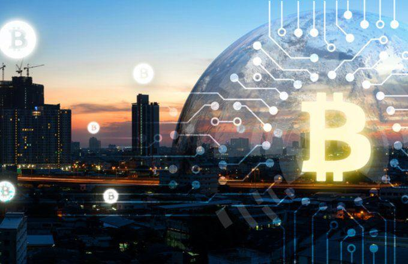

Cryptocurrencies have seen a remarkable rise in the financial sector over the past decade, transforming from niche technological novelties into widely recognized financial instruments. This growth is primarily driven by the promise of decentralized finance (DeFi), which aims to offer transparency, reduced costs, and financial inclusivity. Bitcoin, the first cryptocurrency released in 2009, set the stage for a digital currency revolution, followed by the development of various others like Ethereum, Ripple, and Litecoin.

As cryptocurrencies gained traction, diverse trading strategies and practices also emerged, including the use of automated trading systems. Among these practices, spoofing, market manipulation, and algorithmic trading became more prominent. Spoofing involves placing large orders with no intention of executing them, to create a false impression of demand or supply. This practice can artificially inflate or deflate prices, misleading genuine investors. Market manipulation, a broader term, covers various tactics used to deceive investors and alter the perception of an asset's value, including wash trading and front running. Algorithmic trading refers to the use of computer programs to execute trades based on predetermined conditions, often at speeds and frequencies impossible for human traders.

Concerns regarding market manipulation in cryptocurrency markets are substantial, primarily because these markets are less regulated than traditional financial markets. The anonymity and decentralized nature of cryptocurrencies pose challenges for regulators attempting to curb manipulative practices. The lack of centralized oversight allows malicious actors to exploit these systems, undermining the principles of fair trading and market integrity.

Understanding how spoofing and similar practices impact financial security in cryptocurrency trading is vital for protecting investors and ensuring the sustainability of these markets. Spoofing can lead to significant price volatility, affecting both individual and institutional traders. The influence of such activities raises questions about market integrity and calls for more robust mechanisms to detect and prevent manipulation.

This article will explore the phenomenon of cryptocurrency spoofing, examining its mechanics, the role of algorithmic trading, and the intersection of these elements. We will also discuss strategies to enhance financial security, including regulatory measures and technological advancements. The analysis aims to provide a comprehensive understanding of these dynamics, highlighting the need for balance between innovation and security in this rapidly evolving financial landscape.

## Table of Contents

## What is Cryptocurrency Spoofing?

Cryptocurrency spoofing is a manipulative practice where traders place large orders to buy or sell cryptocurrency without intending to execute them. The primary goal is to create a false impression of demand or supply, thereby influencing the asset's price to the spoofer's advantage.

### How Spoofing is Conducted on Trading Platforms

In [cryptocurrency](/wiki/cryptocurrency) trading platforms, spoofing generally involves the following steps:

1. **Order Placement**: The spoofer places a large buy or sell order at a price level that is unlikely to be met. This creates an illusion of increased market depth.

2. **Market Reaction**: Other traders perceive this large order as a signal of genuine demand or supply and adjust their strategies based on this perceived market sentiment.

3. **Order Cancellation**: Once the market price moves in the desired direction, the spoofer cancels the large order, having never intended to execute it.

4. **Profit Generation**: The spoofer profits by executing real trades on the opposite side of the market movement they helped create.

### Examples of Spoofing Incidents in the Cryptocurrency Market

One of the prominent examples of spoofing occurred on platforms like Bitfinex, where traders manipulated the bitcoin market by placing large orders that they later canceled. Such incidents have led to significant short-term price swings, shaking investor confidence.

### Impact of Spoofing on Crypto Prices and Market Dynamics

Spoofing has several effects on cryptocurrency prices and market dynamics:

- **Price Volatility**: Spoofing can induce significant short-term volatility as other traders alter their positions based on misleading signals.

- **Liquidity Illusion**: It creates a false sense of market liquidity, leading traders to believe there are more buyers or sellers than there truly are.

- **Market Integrity**: Continuous spoofing undermines trust in the market, discouraging new investments and participation.

### Regulatory Perspective on Cryptocurrency Spoofing

Regulatory bodies worldwide, including the Commodity Futures Trading Commission (CFTC) in the United States, have recognized spoofing as illegal in traditional markets and have begun extending these regulations to cryptocurrency markets. However, the decentralized and often anonymous nature of cryptocurrency trading poses challenges for enforcement.

To address spoofing, regulatory agencies advocate for increased transparency on trading platforms and encourage the use of technologies that can detect and prevent such manipulative activities. In the U.S., the Department of Justice has pursued criminal charges against traders involved in spoofing incidents, signaling a severe stance against market manipulation.

Overall, understanding and addressing cryptocurrency spoofing is crucial for maintaining financial security and ensuring the development of more stable, trustworthy markets.

## The Mechanics of Market Manipulation

Market manipulation in financial securities is a practice that involves artificially affecting the price or [volume](/wiki/volume-trading-strategy) of a security to create misleading appearances in the market. This section provides an overview of how such manipulation occurs, its impacts on the market, and the ethical and legal concerns it raises.

### Market Manipulation: Definition and Methods

Market manipulation refers to actions intended to deceive investors by controlling or artificially affecting market prices, ultimately benefiting the manipulator. Traditional forms of market manipulation include *pump and dump* schemes, where manipulators artificially inflate the price of a stock (pump), sell off their holdings at the high prices, and then allow the price to fall (dump). Other methods include wash trading, where a trader sells and buys the same financial instrument to create misleading volumes, and rumor spreading to influence stock prices.

### Spoofing in Cryptocurrency Markets

In the cryptocurrency markets, spoofing is a prevalent form of manipulation. Spoofing involves placing large orders on an exchange with the intention of canceling them before they are executed. The aim is to create an illusion of demand or supply, thereby influencing the price of the asset. When traders see large buy orders, they may believe there is growing demand and buy themselves, driving the price up. Conversely, large sell orders can drive the price down. Once the price moves in the desired direction, spoofers cancel their orders and potentially profit from the artificial price change.

#### Example of Spoofing
Consider a scenario where a spoofer places a large buy order for Bitcoin at a slightly below-market price, creating the appearance of high demand. As the price increases due to panic buying, the spoofer sells their Bitcoin at the elevated price, cancels the buy order, and profits from the scheme.

### Market Manipulation Techniques in Traditional vs. Crypto Markets

While traditional financial markets and crypto markets share common manipulation techniques, differences arise due to the decentralized and unregulated nature of cryptocurrencies. Traditional markets, regulated by bodies like the SEC in the US, have clearer rules and mechanisms to detect and penalize manipulation. In contrast, the anonymity and global reach of crypto markets make it easier to conduct undisclosed manipulative activities and harder for authorities to enforce rules.

Additionally, [algorithmic trading](/wiki/algorithmic-trading) is more prevalent in crypto markets, where high-frequency trading bots can execute spoofing strategies on a scale and at speeds unattainable in traditional markets.

### Effects on Investor Confidence and Market Integrity

Market manipulation undermines trust in financial markets. When prices do not reflect genuine supply and demand, investor confidence erodes, potentially deterring participation from all but the most speculative traders. Market integrity suffers, as prices distorted by manipulative practices fail to fulfill their role as informational signals that underpin investment and economic decisions. Investors may become wary of trading in manipulated markets, leading to decreased [liquidity](/wiki/liquidity-risk-premium) and increased [volatility](/wiki/volatility-trading-strategies).

### Legal and Ethical Considerations

Legally, market manipulation, including spoofing, is prohibited in regulated markets. However, enforcement is challenging, particularly in the global and fragmented crypto markets. Ethical concerns center around fairness and transparency. Markets should offer equal opportunities; manipulation tips the scales, granting undue advantage to those engaged in unethical practices.

Efforts to address these issues range from implementing advanced detection systems using AI and [machine learning](/wiki/machine-learning) to enhancing regulatory frameworks globally. However, the challenge remains significant due to the rapid evolution of market technologies and the global nature of cryptocurrency exchanges.

In summary, market manipulation poses significant threats to financial securities' integrity, with unique challenges in the cryptocurrency market due to its structure and lack of regulation. Addressing these issues requires coordinated regulatory efforts and ongoing technological advancements to safeguard market transparency and protect investors.

## Algorithmic Trading in the Crypto Space

Algorithmic trading has rapidly become a cornerstone of the cryptocurrency market, mirroring its established presence in traditional financial markets. This trading method, propelled by predefined rules implemented through algorithms, automates the decision-making process in purchasing and selling cryptos. The attractiveness of algorithmic trading stems from its ability to execute high-frequency trades with precision, efficiency, and minimal human intervention.

Algorithms serve multiple roles within this domain, from facilitating ethical trading to enabling manipulative practices. Ethical uses of algorithms involve leveraging their capacity for analyzing large datasets and executing trades based on deterministic criteria, like price fluctuations or trading volumes. Conversely, algorithms can also be exploited for manipulative activities, such as spoofing, where large orders are placed and then canceled to mislead market participants about supply and demand.

AI and machine learning are integral in the evolution of these trading algorithms. Machine learning, in particular, allows algorithms to learn from historical data, adapt trading strategies, and optimize decision-making in real-time. Machine learning models can identify patterns and correlations within vast and complex datasets, which human traders might overlook. These insights enable the development of sophisticated trading strategies that can predict market movements with greater accuracy.

Furthermore, algorithms possess the potential to enhance market integrity by detecting spoofing and other manipulative behaviors. By analyzing real-time trading data and historical patterns, algorithms can flag suspicious activities that deviate from normal trading behavior. This capability is essential in maintaining market transparency and protecting investors from fraudulent practices. For instance, algorithms can be programmed to identify anomalous order patterns indicative of spoofing, allowing exchanges and regulators to swiftly address potential manipulation.

Regulating algorithmic trading in cryptocurrencies presents significant challenges. The decentralized and global nature of crypto markets complicates enforcement efforts by regulatory bodies. Furthermore, rapid technological advancements continuously alter trading landscapes, making it difficult for regulations to keep pace. Establishing robust regulatory frameworks requires collaboration among international regulatory bodies to ensure consistent and comprehensive oversight of algorithmic activities.

Balancing innovation with regulatory compliance is crucial for the sustainability of algorithmic trading in cryptocurrencies. Efforts to address these challenges include developing standardized protocols for algorithmic trading, enhancing transparency in algorithmic operations, and establishing clear guidelines for ethical algorithmic practices. As the crypto market evolves, regulatory strategies must adapt to ensure that algorithmic trading contributes positively to market stability and investor protection.

## The Intersection of Spoofing, Market Manipulation, and Algo Trading

The intersection of spoofing, market manipulation, and algorithmic trading in the cryptocurrency market is a complex and evolving concern that has garnered significant attention. Spoofing, a form of market manipulation where traders submit false orders to deceive other market participants about supply and demand, can be particularly disruptive when coupled with algorithmic trading. This intersection poses challenges to market stability and security while highlighting areas for potential regulatory intervention and technological innovation.

One notable case study that exemplifies this intersection involved the exchange Bitfinex, where coordinated spoofing activities manipulated Bitcoin prices. Traders utilized algorithmic scripts to place large buy or sell orders, creating an illusion of market movement that influenced other traders' decisions. This strategy not only facilitated market manipulation but also exploited the speed and efficiency of algorithmic trading systems, which are programmed to respond to market signals instantaneously.

The impact of such interactions on market stability and security is profound. Spoofing, when executed alongside high-frequency trading algorithms, can lead to artificial volatility and distort price discovery processes. This can result in a loss of investor confidence and deter participation from institutional investors who prioritize market integrity. Moreover, the rapid price fluctuations caused by these manipulative practices can trigger stop-loss orders and other automated trading mechanisms, compounding the instability.

Efforts to mitigate the risks associated with this intersection have focused on enhancing regulatory frameworks and deploying advanced technological solutions. Regulatory bodies, such as the U.S. Commodity Futures Trading Commission (CFTC), have begun to impose stricter penalties and more rigorous monitoring of trading activities to deter market manipulation. At the same time, exchanges are increasingly implementing sophisticated surveillance systems that utilize machine learning algorithms to detect and flag suspicious trading patterns indicative of spoofing.

Future trends in cryptocurrency trading will likely feature a continued emphasis on balancing innovation with security. As algorithmic trading becomes more prevalent, there is potential for the development of self-regulating algorithms that not only trade but also monitor and report manipulative behaviors. Additionally, decentralized trading platforms, which offer increased transparency and resistance to single points of failure, may emerge as an appealing alternative for traders seeking a more secure trading environment.

In conclusion, understanding the interaction between spoofing, market manipulation, and algorithmic trading is crucial for maintaining the integrity of cryptocurrency markets. Collaborative efforts among regulators, technology developers, and the trading community will be essential in addressing these challenges and fostering a more secure and equitable trading landscape.

## Enhancing Financial Security in Cryptocurrency Trading

Cryptocurrency trading, with its innovative and decentralized nature, presents unique challenges and opportunities for investors. Ensuring financial security in this dynamic environment requires a multi-faceted approach, incorporating strategies for protection against spoofing and manipulation, leveraging technological advancements, regulatory involvement, and enhancing investor education.

### Strategies for Traders

To protect themselves from spoofing and manipulation, traders can adopt several strategies:

1. **Diversification**: By spreading investments across various cryptocurrencies and assets, traders can mitigate the impact of specific manipulative activities targeted at a single asset.

2. **Utilizing Analytics Tools**: Advanced analytics tools that monitor trading patterns can help detect anomalies and potential spoofing activities. For instance, large orders that are suddenly canceled may indicate spoofing, allowing traders to adjust their strategies accordingly.

3. **Setting Limit Orders**: Using limit orders instead of market orders can shield traders from extreme price movements caused by manipulative practices. This approach ensures that trades are executed only at predetermined prices.

4. **Keeping Abreast of Market News**: Staying informed about developments in the cryptocurrency space, including regulatory changes and technological advancements, can help traders anticipate and respond to market manipulation.

### Technological Advancements

Technology plays a crucial role in enhancing market transparency and security:

- **Blockchain Transparency**: The inherent transparency of blockchain technology allows for the verification of transactions, reducing the potential for fraudulent activities. Tools that provide real-time analysis of the blockchain can further enhance this transparency.

- **Machine Learning Algorithms**: Algorithms developed using machine learning can detect unusual trading patterns that may indicate manipulation. These algorithms can continuously learn and adapt to new tactics used by malicious actors.

- **Decentralized Exchanges (DEXs)**: By their nature, DEXs offer increased security and privacy. They minimize the risks associated with centralized exchanges, such as hacks and outages, thereby providing a safer trading environment.

### The Role of Regulatory Bodies

Regulators are pivotal in safeguarding against market manipulation. They establish and enforce rules that deter manipulative practices and protect investors. Key regulatory measures include:

- **Enforcing Compliance**: Regulatory bodies can impose stringent compliance requirements on exchanges, ensuring they implement best practices for security and transparency.

- **Imposing Penalties**: Sanctions and fines for entities found guilty of market manipulation act as a deterrent against such activities.

- **International Cooperation**: Given the global nature of cryptocurrencies, international regulatory cooperation is essential to address cross-border manipulation and fraud comprehensively.

### Importance of Education and Awareness

Investor education is fundamental in enhancing financial security:

- **Educational Programs**: Initiatives that provide information about the risks associated with cryptocurrency trading and the tactics used by manipulators can empower investors.

- **Awareness Campaigns**: Campaigns highlighting the signs of spoofing and manipulation can help investors recognize and avoid potential scams.

### Conclusion

Balancing innovation with security in the evolving cryptocurrency landscape is crucial. While the sector offers immense opportunities, it also poses risks that require careful management. By implementing robust strategies, leveraging technology, supporting effective regulation, and promoting investor education, the cryptocurrency market can achieve greater security and stability. Ultimately, it is the collective responsibility of traders, technologists, regulators, and educators to foster a secure and transparent cryptocurrency trading environment.

## Conclusion

This article has explored the complexities and challenges of cryptocurrency trading, with a focus on spoofing, market manipulation, and algorithmic trading. A clear understanding of these issues is crucial to ensuring the financial security of crypto markets. Spoofing and manipulation can drastically distort market dynamics, causing significant losses for both individual and institutional investors. Recognizing and addressing these threats is not only vital for investor protection but also for maintaining the integrity and trustworthiness of cryptocurrency markets.

Looking forward, the future of cryptocurrency trading in a regulated environment hinges on effective oversight and adaptive regulatory frameworks that can keep pace with rapid technological advancements. Regulations must be robust enough to deter malicious activities while fostering innovation within the crypto space. Balancing these objectives will be essential in promoting a fair and efficient market that is attractive to a wide range of participants.

Moreover, continued vigilance and adaptation are key to navigating the ever-evolving landscape of cryptocurrency trading. Traders and investors must remain aware of potential manipulation tactics and leverage available tools and knowledge to protect their assets. Meanwhile, technological advancements, particularly in AI and machine learning, offer promising avenues for detecting and mitigating spoofing and manipulation.

Finally, maintaining financial security is paramount as the cryptocurrency market matures. Stakeholders, including traders, developers, and regulators, must collaborate to create an environment that prioritizes transparency and security. By staying informed and proactive, participants can contribute to a resilient cryptocurrency ecosystem capable of supporting sustainable growth and innovation.

## References & Further Reading

[1]: Bergstra, J., Bardenet, R., Bengio, Y., & Kégl, B. (2011). ["Algorithms for Hyper-Parameter Optimization."](https://dl.acm.org/doi/10.5555/2986459.2986743) Advances in Neural Information Processing Systems 24.

[2]: ["Advances in Financial Machine Learning"](https://www.amazon.com/Advances-Financial-Machine-Learning-Marcos/dp/1119482089) by Marcos Lopez de Prado.

[3]: ["Evidence-Based Technical Analysis: Applying the Scientific Method and Statistical Inference to Trading Signals"](https://www.amazon.com/Evidence-Based-Technical-Analysis-Scientific-Statistical/dp/0470008741) by David Aronson.

[4]: ["Machine Learning for Algorithmic Trading"](https://github.com/PacktPublishing/Machine-Learning-for-Algorithmic-Trading-Second-Edition) by Stefan Jansen.

[5]: ["Quantitative Trading: How to Build Your Own Algorithmic Trading Business"](https://books.google.com/books/about/Quantitative_Trading.html?id=j70yEAAAQBAJ) by Ernest P. Chan.

[6]: Commodity Futures Trading Commission. ["Spoofing and Market Manipulation."](https://www.cftc.gov/PressRoom/PressReleases/8260-20)

[7]: Gandal, N., Hamrick, J. T., Moore, T., & Oberman, T. (2018). ["Price Manipulation in the Bitcoin Ecosystem."](https://www.sciencedirect.com/science/article/pii/S0304393217301666) Journal of Monetary Economics.