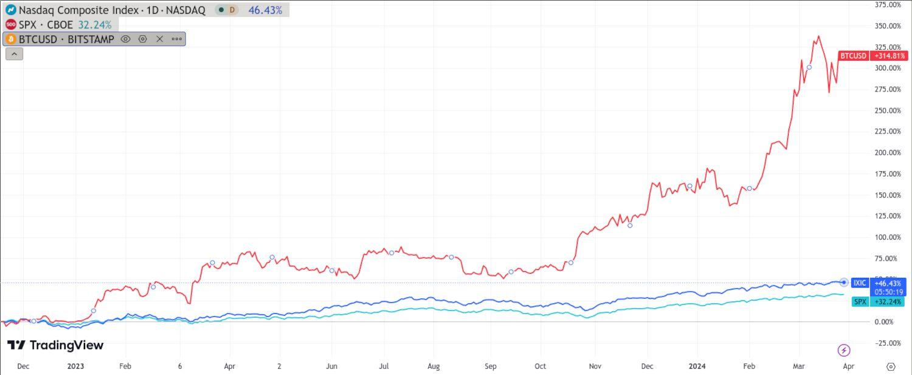

## Table of Contents

## What is cryptocurrency?

Cryptocurrency is a type of digital money that you can use to buy things online. It's different from regular money because it's not controlled by banks or governments. Instead, it uses a technology called blockchain, which is like a big, secure list of all the transactions that have ever happened. This makes it very hard for anyone to cheat or steal.

People use cryptocurrencies like Bitcoin or Ethereum to send money to each other quickly and cheaply, no matter where they are in the world. You can store your cryptocurrency in a digital wallet on your computer or phone. Some people also buy and sell cryptocurrencies hoping to make a profit, but this can be risky because their value can go up and down a lot.

## What is the stock market?

The stock market is a place where people buy and sell pieces of companies called stocks. When you buy a stock, you own a small part of that company. The price of a stock can go up or down based on how well the company is doing and what people think about it. The stock market is like a big store where stocks are traded every day.

People use the stock market to try to make money. If you buy a stock and its price goes up, you can sell it for more than you paid and make a profit. But if the price goes down, you could lose money. Many people also save for the future by investing in the stock market over a long time. It can be risky, but it can also help your money grow if you are patient and make smart choices.

## How do cryptocurrency and stock market prices fluctuate?

Cryptocurrency prices can go up and down a lot. This happens because many things can affect them, like news about the [cryptocurrency](/wiki/cryptocurrency), what people think about it, and how many people want to buy or sell it. For example, if a lot of people suddenly want to buy a certain cryptocurrency, its price will go up. But if people start selling it a lot, the price will go down. Also, because cryptocurrencies are not controlled by banks or governments, they can be more unpredictable than other types of money.

Stock market prices also change all the time. The price of a stock can go up if the company is doing well, making more money, or if people think it will do well in the future. On the other hand, if the company is not doing well or if there is bad news about it, the stock price can go down. The stock market can also be affected by bigger things like the economy or what is happening in the world. For example, if the economy is doing well, stock prices might go up, but if there is a big problem, like a recession, stock prices might go down.

## What are the basic factors that influence cryptocurrency prices?

Cryptocurrency prices can change a lot because of many different things. One big [factor](/wiki/factor-investing) is how many people want to buy or sell the cryptocurrency. If a lot of people want to buy it, the price goes up. But if a lot of people want to sell it, the price goes down. Another thing that can change the price is news about the cryptocurrency. If there is good news, like a new update or more people using it, the price might go up. But if there is bad news, like a security problem, the price might go down.

Also, what people think about the cryptocurrency can make a big difference. If people think it will be worth more in the future, they might buy it now, which makes the price go up. But if people think it will be worth less, they might sell it, which makes the price go down. Because cryptocurrencies are not controlled by banks or governments, they can be more unpredictable than other types of money. This means their prices can change a lot and very quickly.

## What are the basic factors that influence stock market prices?

Stock market prices can change because of many things. One big reason is how well a company is doing. If a company makes more money or does something good, people might want to buy its stock, which makes the price go up. But if the company is not doing well or has bad news, people might want to sell the stock, which makes the price go down. Another thing that can change stock prices is what people think about the future. If people think a company will do well, they might buy its stock now, making the price go up. But if people think the company will not do well, they might sell the stock, making the price go down.

The stock market can also be affected by bigger things like the economy or what is happening in the world. If the economy is doing well, people might feel more confident and buy more stocks, which can make prices go up. But if there is a problem, like a recession, people might be worried and sell their stocks, which can make prices go down. Things like interest rates, inflation, and even big events like elections or natural disasters can also change how people feel about the stock market and affect stock prices.

## Can cryptocurrency prices affect stock market prices, and vice versa?

Yes, cryptocurrency prices can affect stock market prices, and stock market prices can also affect cryptocurrency prices. For example, if a big company that deals with cryptocurrencies, like a crypto exchange, does really well, its stock price might go up. This good news could make more people interested in cryptocurrencies, which might make their prices go up too. On the other hand, if there is bad news about cryptocurrencies, like a big hack or a crash, people might get scared and sell their stocks in companies related to cryptocurrencies, which can make those stock prices go down.

Also, when the stock market is doing really well, people might feel more confident and be willing to take risks on things like cryptocurrencies. This can push cryptocurrency prices up. But if the stock market is not doing well, people might be more cautious and less likely to invest in cryptocurrencies, which could make their prices go down. So, even though they are different, what happens in one can definitely affect the other.

## What historical data shows about the correlation between cryptocurrency and stock market prices?

Historical data shows that there can be times when cryptocurrency prices and stock market prices move together, but it's not always the case. For example, during big events like the global financial crisis in 2008 or the economic effects of the COVID-19 pandemic in 2020, both stock markets and cryptocurrencies could go down because people were scared and selling everything. But cryptocurrencies like Bitcoin were also seen as a safe place to put money during these times because they are not controlled by banks or governments.

On the other hand, there have been times when cryptocurrencies and stocks moved in different ways. For instance, in 2017, Bitcoin's price went up a lot while the stock market was just okay. This shows that cryptocurrencies can be very different from stocks and can have their own ups and downs. So, while there can be some connection between the two, it's not always strong, and each can be affected by different things.

## How do economic indicators impact the correlation between cryptocurrency and stock market?

Economic indicators like inflation rates, employment numbers, and interest rates can affect both cryptocurrency and stock market prices, but they might not always do so in the same way. For example, if inflation goes up, people might move their money into stocks or cryptocurrencies to try to keep up with rising prices. But stocks might be seen as safer because they are tied to real companies, while cryptocurrencies can be more risky because they are new and not controlled by banks or governments. So, the stock market might go up a bit, but cryptocurrencies might go up a lot more because people are looking for big gains.

Also, when interest rates go up, borrowing money becomes more expensive, which can slow down the economy. This might make stock prices go down because people are worried about companies making less money. But cryptocurrencies might not be affected as much by interest rates because they are not tied to the traditional financial system. So, during times when the economy is doing badly because of high interest rates, you might see stock prices going down while cryptocurrency prices stay the same or even go up a little. This shows that economic indicators can create different reactions in the stock market and cryptocurrency markets.

## What are some advanced statistical methods used to analyze the correlation between cryptocurrency and stock market prices?

Advanced statistical methods like time series analysis are often used to look at how cryptocurrency and stock market prices move together over time. Time series analysis helps us see patterns and trends in the prices of stocks and cryptocurrencies. By looking at these patterns, we can understand if the prices tend to go up and down together or if they move in different ways. Another method is the use of regression analysis, which can help us figure out how much one thing affects another. For example, we can use regression to see if changes in the stock market can help predict changes in cryptocurrency prices, or vice versa.

Another useful method is the Granger causality test, which helps us find out if one thing can help us predict another thing. For example, we might use this test to see if knowing what happened to stock prices yesterday can help us guess what will happen to cryptocurrency prices today. Lastly, [machine learning](/wiki/machine-learning) techniques, like neural networks, are also used to find complex patterns that simpler methods might miss. These methods can look at a lot of data at once and find hidden connections between cryptocurrency and stock market prices, helping us understand their relationship better.

## How do global events influence the correlation between cryptocurrency and stock market prices?

Global events like wars, natural disasters, or big changes in politics can shake up both the stock market and cryptocurrency prices. When something big happens, people might get scared and start selling their stocks and cryptocurrencies. This can make both prices go down. For example, during the start of the COVID-19 pandemic, a lot of people were worried about the economy, so they sold their stocks and cryptocurrencies, which made both prices drop a lot. But sometimes, people might see cryptocurrencies as a safe place to put their money because they are not controlled by banks or governments, so their prices might not go down as much as stock prices.

On the other hand, good global events can make people feel more confident and want to buy more stocks and cryptocurrencies. If a country's economy is doing well or if there is good news about a new technology, people might think that companies will make more money, so they buy more stocks, making the prices go up. Cryptocurrencies might also go up because people feel good about taking risks. But because cryptocurrencies are newer and can be more unpredictable, their prices might go up or down more than stock prices. So, global events can make the stock market and cryptocurrencies move together, but they can also make them move in different ways.

## What are the implications of a strong or weak correlation between cryptocurrency and stock market prices for investors?

If there is a strong correlation between cryptocurrency and stock market prices, it means that when one goes up or down, the other one is likely to do the same. This can be good for investors because they can use what they know about the stock market to make guesses about what might happen to cryptocurrencies. For example, if the stock market is doing well, an investor might think that cryptocurrencies will also do well and decide to buy more of them. But it can also be bad because if both markets go down at the same time, an investor could lose money in both places. So, a strong correlation means that investors need to be careful and think about how changes in one market might affect the other.

On the other hand, if there is a weak correlation, it means that cryptocurrencies and the stock market are not moving together as much. This can be good for investors because it gives them a chance to spread out their risk. If the stock market goes down, the prices of cryptocurrencies might stay the same or even go up, which can help balance out any losses. But it can also be hard to predict what will happen because the two markets are not following the same patterns. So, a weak correlation means that investors need to do more research and be ready for surprises, but it can also give them more chances to make money in different ways.

## How might future technological developments affect the correlation between cryptocurrency and stock market prices?

Future technological developments could change how cryptocurrencies and the stock market move together. If new technologies make it easier to use cryptocurrencies, like better ways to pay with them or more secure ways to keep them safe, more people might start using them. This could make cryptocurrency prices go up, and if big companies start using cryptocurrencies a lot, their stock prices might go up too. But if there are problems with the new technology, like a big security hack, it could scare people away from cryptocurrencies and make their prices go down, which might also hurt the stock prices of companies that work with them.

Also, if new technology helps the stock market work better, like faster trading systems or better ways to predict what will happen next, it might make the stock market more stable. This could make people feel more confident about investing in stocks, which might not have as big an effect on cryptocurrencies because they are not tied to the same systems. But if new technology makes it easier to invest in both stocks and cryptocurrencies at the same time, it could make their prices move together more. So, future technology could make the correlation between cryptocurrencies and the stock market stronger or weaker, depending on what the technology does and how people use it.

## What is the understanding of price correlation in financial markets?

Price correlation in financial markets refers to how the prices of two or more assets move in relation to each other. A positive correlation implies that the prices tend to move in the same direction, whereas a negative correlation indicates that they move in opposite directions. Correlation coefficients range between -1 and 1, with 1 suggesting perfect correlation, -1 denoting perfect negative correlation, and 0 indicating no correlation.

Understanding these correlations is crucial for portfolio diversification and risk management. Diversification aims to reduce risk by spreading investments across various financial instruments, sectors, or other categories. By including assets that do not move in perfect harmony, investors can mitigate the impact of adverse price movements in a particular asset class.

Stocks, as traditional financial instruments, have been extensively studied for their correlations. Typically, stock correlations are influenced by common economic factors, such as interest rates and economic growth. The adoption of cryptocurrencies like Bitcoin adds complexity to the correlation landscape. Cryptocurrencies are less mature and can be influenced by factors such as technological changes, regulatory news, and market sentiment, which are often independent of traditional economic indicators.

Combining stocks and cryptocurrencies in a portfolio can offer diversification benefits. The correlation between these asset classes has historically varied, influenced by market conditions. For example, during periods of market stress, correlations across asset classes can increase, reducing the benefits of diversification. Conversely, during calm market conditions, the correlations might be lower, allowing for effective diversification.

The formula for calculating the Pearson correlation coefficient $r$ is given by:

$$
r = \frac{\sum (X_i - \bar{X})(Y_i - \bar{Y})}{\sqrt{\sum (X_i - \bar{X})^2 \sum (Y_i - \bar{Y})^2}}
$$

where $X$ and $Y$ are different sets of asset returns, and $\bar{X}$ and $\bar{Y}$ are their respective means.

Recent studies have examined the time-varying nature of correlations between stocks and cryptocurrencies, finding that these can shift drastically based on market events and broader economic conditions. This dynamic is essential for investors to understand as they seek to adjust their portfolios in response to changing market environments.

In practice, Python can be used to calculate and analyze these correlations. Here is a simple example using the `pandas` and `numpy` libraries:

```python
import pandas as pd
import numpy as np

# Sample data: daily returns of a stock and Bitcoin
data = {
    'Stock_Returns': [0.01, -0.02, 0.015, 0.03, -0.01],
    'Bitcoin_Returns': [0.02, -0.015, 0.01, 0.025, -0.005]
}

df = pd.DataFrame(data)

# Calculate correlation
corr_matrix = df.corr()
stock_bitcoin_corr = corr_matrix.loc['Stock_Returns', 'Bitcoin_Returns']

print(f"Correlation between Stock Returns and Bitcoin Returns: {stock_bitcoin_corr}")
```

By continuously monitoring and analyzing correlations, investors can more effectively manage risk and adapt to the increasingly interconnected financial markets.

## How does Algorithmic Trading bridge the gap between Stocks and Cryptocurrencies?

Algorithmic trading employs sophisticated algorithms to automate trading processes, thereby allowing for rapid execution of trades based on predefined criteria. These algorithms analyze market data, including price correlations, to identify profitable trading opportunities across various asset classes, such as stocks and cryptocurrencies.

One of the primary roles of [algorithmic trading](/wiki/algorithmic-trading) is to exploit statistical [arbitrage](/wiki/arbitrage) opportunities arising from correlations between different financial assets. For instance, if historical data suggests a strong correlation between a particular stock index and Bitcoin, algorithms can be designed to trade these assets simultaneously. The algorithms automatically execute buy or sell orders when the actual correlation deviates from the expected correlation, thereby profiting from the market's inefficiencies.

The formula often used to compute the correlation between two assets is the Pearson correlation coefficient, which is expressed as:

$$
\rho(X, Y) = \frac{\text{cov}(X, Y)}{\sigma_X \sigma_Y}
$$

Here, $\rho(X, Y)$ represents the correlation coefficient between assets $X$ and $Y$, $\text{cov}(X, Y)$ is the covariance of the two assets, and $\sigma_X$ and $\sigma_Y$ are the standard deviations of $X$ and $Y$ respectively.

Algorithmic trading significantly impacts market dynamics and [liquidity](/wiki/liquidity-risk-premium). By enabling high-frequency trading ([HFT](/wiki/high-frequency-trading-strategies)), these algorithms contribute to increased trading volumes and enhanced liquidity, which typically leads to narrower bid-ask spreads and more efficient price discovery. However, this can also exacerbate [volatility](/wiki/volatility-trading-strategies) during market stress, as algorithms may trigger a cascade of buy or sell orders.

Moreover, algorithmic trading presents an opportunity for leveraging market microstructure trends. Market makers, for instance, can use algorithms to manage their orders across different exchanges in a more efficient manner. By analyzing real-time data, these algorithms ensure that market makers can enhance their profit margins by maintaining optimal inventory levels while minimizing risk through hedging.

In addition to [statistical arbitrage](/wiki/statistical-arbitrage), algorithms also capitalize on other strategies like [momentum](/wiki/momentum) trading and mean reversion. These strategies rely on different facets of observable market behavior, such as the tendency of asset prices to continue moving in the same direction (momentum) or to return to a historical average (mean reversion).

In summary, algorithmic trading plays a vital role in bridging stocks and cryptocurrencies by leveraging correlations for potential profit. While it enhances market efficiency by improving liquidity and facilitating rapid trade executions, it also brings challenges such as increased volatility and the need for robust risk management frameworks. As financial markets continue to evolve, the development and deployment of advanced trading algorithms remain critical in shaping the landscape of modern trading.

## What are the implications for investors?

In the ever-evolving financial landscape, correlations between traditional stocks and cryptocurrencies offer a strategic avenue for investors seeking diversification and risk mitigation. By understanding these correlations, investors can optimize their portfolios, balancing risk and potential returns across asset classes.

**Leveraging Correlations for Diversification and Risk Mitigation**

Correlations between stocks and cryptocurrencies can vary significantly over time, influenced by factors such as market sentiment and macroeconomic policies. Typically, a low or negative correlation between asset classes is desirable for diversification. Historically, Bitcoin, the flagship cryptocurrency, has often displayed a low correlation with traditional financial markets, making it a potentially effective tool for diversification. By incorporating both stocks and cryptocurrencies into their portfolios, investors may reduce overall portfolio volatility. Diversification can be expressed mathematically by the formula for portfolio variance, $\sigma^2_p$:

$$
\sigma^2_p = w_1^2\sigma_1^2 + w_2^2\sigma_2^2 + 2w_1w_2\rho_{12}\sigma_1\sigma_2
$$

where $w_1$ and $w_2$ are the weights of the two assets, $\sigma_1$ and $\sigma_2$ their standard deviations, and $\rho_{12}$ the correlation coefficient. Minimizing $\sigma^2_p$ through strategic asset allocation can help achieve optimal diversification.

**Risks and Rewards of Algorithmic Trading with Cryptocurrencies**

Algorithmic trading, driven by complex algorithms, has become increasingly prevalent in cryptocurrency markets. It enables traders to execute high-frequency trades, capitalizing on minute market fluctuations. The primary rewards include the potential for significant profits due to high market volatility and the ability to execute a large [volume](/wiki/volume-trading-strategy) of trades quickly and efficiently.

However, algorithmic trading with cryptocurrencies presents significant risks. The markets are highly volatile and susceptible to sudden, unpredictable events, which can lead to substantial losses. Additionally, the technical complexity of developing and maintaining trading algorithms requires considerable expertise and resources, potentially limiting access to sophisticated strategies for individual investors.

**Recommendations for Investors**

For individual investors, it's crucial to understand the fundamental and technical aspects of both stocks and cryptocurrencies before engaging in trading strategies based on their correlations. Diversification should remain a key strategy. Investors should consider technology-driven platforms offering educational resources and tools to assess market trends.

Institutional investors may capitalize on algorithmic trading by leveraging their access to advanced computational resources and data analytics capabilities. They should ensure robust risk management frameworks are in place, including stress testing models and contingency plans for market anomalies.

Both individual and institutional investors must remain vigilant to regulatory changes, which can impact market dynamics and correlations. Staying informed and adaptable is key to navigating the continuously shifting landscape of stocks and cryptocurrencies.

## References & Further Reading

[1]: Bouri, E., Molnár, P., Azzi, G., Roubaud, D., & Hagfors, L. I. (2017). ["On the hedge and safe haven properties of Bitcoin: Is it really more than a diversifier?"](https://www.sciencedirect.com/science/article/pii/S1544612316301817) Finance Research Letters, 20, 192-198.

[2]: Corbet, S., Lucey, B., & Yarovaya, L. (2018). ["Datestamping the Bitcoin and Ethereum bubbles."](https://www.sciencedirect.com/science/article/pii/S1544612317307419) Finance Research Letters, 26, 81-88.

[3]: Nakamoto, S. (2008). ["Bitcoin: A Peer-to-Peer Electronic Cash System."](https://nakamotoinstitute.org/library/bitcoin/)

[4]: Alexander, C. (2020). ["The Correlation between Cryptocurrencies and Traditional Financial Assets: A Comprehensive Analysis."](https://www.sciencedirect.com/science/article/pii/S1057521918305271) International Review of Financial Analysis, 71, 101513.

[5]: "Algorithmic Trading: Winning Strategies and Their Rationale" by Ernest P. Chan

[6]: "Market Liquidity: Theory, Evidence, and Policy" by Thierry Foucault, Marco Pagano, and Ailsa Roell