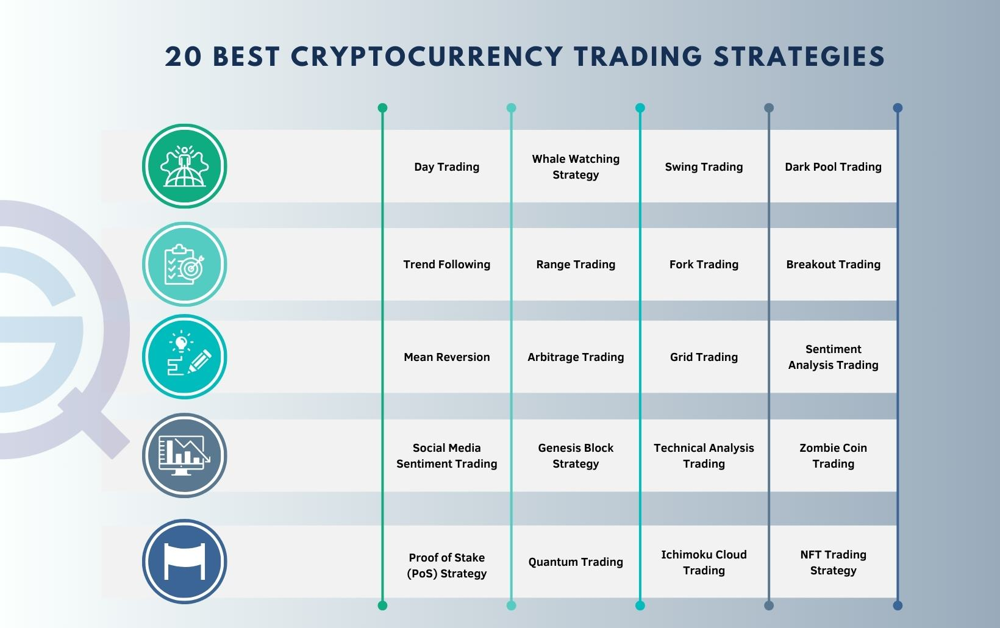

The rise of digital wallets has significantly altered perceptions of cryptocurrency storage and security protocols. Digital wallets serve as the cornerstone for managing and safeguarding digital assets, facilitating seamless transactions and ensuring that users have control over their cryptocurrencies. These wallets have evolved in response to the increasing need for effective and reliable storage solutions that cater to both security and convenience. 

With the proliferation of algorithmic trading, which relies on advanced computational algorithms to execute trades at high speeds, the security of digital assets has become more vital. This trading methodology is designed to capitalize on market efficiencies, allowing investors to execute trades with minimal human intervention. While it presents tremendous profit potential, algorithmic trading simultaneously demands robust security measures to shield sensitive data and prevent unauthorized access.



This article offers an in-depth exploration of digital wallets, discussing various cryptocurrency storage solutions and essential security measures for secure trading. The intricate relationship between algorithmic trading and wallet security is also examined, highlighting how strategic alignment between these elements can optimize both trading outcomes and asset safety.

## Table of Contents

## Understanding Digital Wallets

Digital wallets are vital components for the secure storage of cryptocurrencies. They facilitate the safekeeping and management of digital assets, akin to how traditional wallets hold physical currency and payment cards. Digital wallets are categorized primarily into two distinct types: hot wallets and cold wallets, each designed to meet specific requirements regarding accessibility and security.

Hot wallets are typically connected to the internet, making them suitable for frequent transactions. They offer the convenience of swift access to funds, enabling users to readily buy, sell, or trade cryptocurrencies. Hot wallets are commonly found on cryptocurrency exchanges and mobile devices, ensuring that users can conduct transactions on-the-go. However, the constant internet connectivity of hot wallets introduces potential security vulnerabilities. They are more susceptible to cyber threats such as hacking and phishing attacks, which can compromise the stored assets. Therefore, users should exercise caution when utilizing hot wallets for substantial amounts of cryptocurrency.

Conversely, cold wallets provide enhanced security by maintaining the digital assets offline. These include hardware wallets, paper wallets, and other forms of offline storage, which are inherently insulated from online threats. Cold wallets are ideal for the long-term storage of significant cryptocurrency holdings, offering a robust defense against hacking attempts. The protection afforded by cold wallets stems from their disconnection from the internet, thereby significantly reducing the risk of unauthorized access. However, the increased security comes at the expense of convenience, as accessing and transferring funds from cold wallets typically requires additional steps compared to hot wallets.

In choosing the appropriate digital wallet, individuals must weigh their transaction frequency against their security priorities. For users engaging in regular [cryptocurrency](/wiki/cryptocurrency) transactions, the accessibility of hot wallets might be preferred. On the other hand, investors holding cryptocurrencies as long-term assets might opt for the added security of cold wallets. A balanced approach could involve a combination of both wallet types, optimizing for both ease of transactions and safeguarding of assets. As the landscape of digital wallets continues to evolve, the adaptability and knowledge of users in handling these tools remain fundamental to maintaining secure cryptocurrency holdings.

## The Dynamics of Cryptocurrency Storage

Cryptocurrency storage is a critical aspect of managing digital assets, presenting various solutions that cater to different needs. The storage strategies are primarily categorized into hot and cold storage, each offering distinct characteristics.

Hot wallets are typically provided by cryptocurrency exchanges and are connected to the internet, making them easily accessible for frequent transactions. This connectivity ensures convenience and quick access to funds, which is essential for active traders engaged in regular buying, selling, or transferring of cryptocurrencies. However, the very nature of their online presence poses inherent security risks. Hot wallets are more susceptible to cyber-attacks and hacks, as they are perpetually exposed to internet vulnerabilities. Consequently, they are generally considered less secure than their offline counterparts.

On the other hand, cold storage solutions, such as hardware wallets, prioritize heightened security by remaining offline. These wallets store cryptocurrency keys in a physical device that is not connected to the internet, substantially reducing the risk of unauthorized access or cyber threats. Cold storage is ideal for long-term holding of cryptocurrencies, providing peace of mind for investors who prioritize security over frequent access. While cold wallets mitigate the risk associated with online exposure, they are not as immediately accessible as hot wallets, which may be a limitation for users requiring urgent access to their assets.

An effective strategy for managing cryptocurrency involves integrating both hot and cold storage solutions to balance accessibility and security. By utilizing a combination of hot wallets for day-to-day transactions and cold storage for safeguarding the majority of their assets, users can optimize their cryptocurrency management approach.

For individuals or entities dealing with substantial cryptocurrency investments, such a hybrid storage method can offer an ideal blend of security and convenience. This approach not only helps mitigate the risks associated with storing assets online but also allows for the flexibility needed to engage in regular trading activities. With the diverse nature of digital asset management, choosing the right combination of storage methods can significantly influence both the safety and efficiency of cryptocurrency transactions.

## Cryptocurrency Security Essentials

Security is paramount in the world of cryptocurrency due to the significant risks of hacks and theft. The decentralized and often pseudonymous nature of cryptocurrencies makes them attractive targets for cybercriminals. Consequently, investors and traders must prioritize security measures to safeguard their digital assets.

Multifactor authentication (MFA) is a crucial feature for enhancing wallet security. By requiring multiple forms of verification before granting access, MFA significantly reduces the risk of unauthorized access. Users may need to provide a combination of something they know (a password), something they have (a smartphone for a one-time code), and something they are (biometric verification). The implementation of MFA is a straightforward yet effective barrier against potential security breaches.

Encryption is another essential security measure for cryptocurrency wallets. Encryption ensures that even if a malicious entity gains access to wallet data, the information remains unreadable without the correct decryption key. Modern encryption standards like AES-256 provide robust protection for digital assets by converting data into a secure format that is nearly impossible to decipher without the appropriate cryptographic keys.

The use of decentralized exchanges (DEXs) can further enhance security by eliminating intermediaries associated with centralized exchanges. DEXs conduct trades directly between users through smart contracts that run on the blockchain, thereby reducing the risk of exchange-related hacks. However, users must remain vigilant as the self-custodial nature of DEXs places full responsibility for security on the individual trader.

Regularly updating wallet software is essential to shield against emerging threats. Software updates often contain critical security patches that resolve vulnerabilities identified by developers and the wider cybersecurity community. Failure to update can leave wallets exposed to exploitation by attackers leveraging outdated protocols or exploiting newly discovered weaknesses.

Furthermore, staying informed about new threats and security practices is crucial for crypto investors. The rapidly evolving nature of cyber threats requires continuous learning to apply the latest security innovations effectively. Engaging with recent research indicates that leveraging [artificial intelligence](/wiki/ai-artificial-intelligence) and [machine learning](/wiki/machine-learning) can preemptively identify potential security threats, allowing for more sophisticated defense mechanisms.

In conclusion, maintaining a multifaceted security strategy is vital for anyone involved in cryptocurrency. This involves implementing multifactor authentication, utilizing encryption, choosing decentralized exchanges, and keeping wallet software updated. These measures collectively help in mitigating the high risks associated with cryptocurrency theft and unauthorized access, thereby protecting digital investments.

## Algorithmic Trading in the Cryptocurrency Market

Algorithmic trading in the cryptocurrency market is a sophisticated approach that utilizes complex mathematical models and algorithms to execute trades automatically and rapidly. This method is particularly beneficial in a market characterized by high [volatility](/wiki/volatility-trading-strategies) and rapid price changes, as it enables traders to capitalize on minute price differences across various exchanges and timeframes, often within milliseconds. These algorithms are designed to follow pre-set rules which can involve timing, price, quantity, and other key market metrics, allowing for the execution of trades without the need for human intervention.

The primary advantage of [algorithmic trading](/wiki/algorithmic-trading) is its ability to enhance profit margins by executing trades at optimal times, utilizing strategies such as [arbitrage](/wiki/arbitrage), [market making](/wiki/market-making), and [trend following](/wiki/trend-following). However, the high speeds at which these transactions occur necessitate robust and secure systems to protect sensitive trading data from unauthorized access and cybersecurity threats. Any breach in data security could lead to significant financial losses, making security a crucial component of algorithmic trading platforms.

To maximize efficiency and ensure the security of digital assets, integrating algorithmic trading systems with secure cryptocurrency storage solutions is paramount. By using a combination of hot and cold storage solutions, traders can maintain the [liquidity](/wiki/liquidity-risk-premium) required for rapid transactions while also ensuring that the bulk of their assets remain secure from online threats. For example, storing frequently used funds in hot wallets allows quick access for trading, whereas keeping larger amounts in cold storage enhances security.

Moreover, traders must strike a balance between speed and security when utilizing automated systems. High-frequency trading, while profitable, introduces vulnerabilities that could be exploited if security measures are inadequate. Regular system audits, software updates, and employing multifactor authentication are essential practices to mitigate these risks.

Understanding the technical aspects of algorithmic trading, such as latency optimization and risk management, is also crucial. Python, for instance, is a preferred language for developing trading algorithms due to its simplicity and the wide array of libraries available for machine learning and data analysis. Here's a simple example of how such a strategy might be coded in Python:

```python
import ccxt  # A library for cryptocurrency trading

exchange = ccxt.binance()  # Initialize exchange
exchange.apiKey = 'your_api_key'
exchange.secret = 'your_api_secret'

def fetch_prices(symbol):
    return exchange.fetch_ticker(symbol)['last']

def trading_strategy():
    symbol = 'BTC/USDT'
    threshold = 500  # Arbitrary threshold for trading

    price = fetch_prices(symbol)
    if price < threshold:
        order = exchange.create_market_buy_order(symbol, 0.01)  # Example to buy 0.01 BTC
        return order

    return "No trade executed"

# Execute the trading strategy
trade_result = trading_strategy()
print(trade_result)
```

In conclusion, incorporating secure trading systems with algorithmic strategies requires an astute understanding of both technology and market dynamics. By prioritizing security measures while leveraging the speed of algorithms, traders can enhance their trading efficiency and protect their cryptocurrency investments effectively.

## Best Practices for Combining Crypto Security and Trading

Combining efficient trading with robust security in the cryptocurrency market requires a comprehensive approach to safeguard assets while optimizing trading operations. One crucial practice is conducting regular audits of both security systems and trading algorithms. These audits can help prevent potential breaches by identifying vulnerabilities within the system. Implementing multifactor authentication (MFA) adds an additional layer of protection, making unauthorized access more challenging. Furthermore, the implementation of encryption protocols ensures data integrity and confidentiality, safeguarding sensitive trading information.

Diversification of trading and storage methods is another recommended practice to mitigate risks. Utilizing a mix of hot and cold storage solutions can optimize both accessibility and security for crypto assets. Hot wallets offer quicker access for trading purposes, while cold wallets provide an added layer of security for longer-term storage. Balancing these storage options based on transaction frequency and security needs is crucial for minimizing exposure to potential threats.

Staying informed about emerging security technologies and trading strategies is a continuous process that effectively maintains the safety of investments. Engaging in industry forums, reading the latest reports on cybersecurity trends, and participating in training sessions are valuable activities for investors. By understanding advancements in blockchain technology and cryptographic techniques, investors can enhance their security posture.

Moreover, diversification in trading strategies, such as leveraging algorithmic trading combined with secure storage solutions, can lead to optimized trading performance and asset safety. Algorithmic trading, which uses pre-programmed algorithms to execute trades automatically, requires secure systems to protect trading data. Python is commonly used for developing trading algorithms due to its versatility and ease of use. Here's a simple example illustrating a moving average crossover strategy using Python:

```python
import pandas as pd

# Fetch historical price data
data = pd.read_csv('crypto_prices.csv')
data['Short_MA'] = data['Close'].rolling(window=5).mean()
data['Long_MA'] = data['Close'].rolling(window=20).mean()

# Generate trading signals
data['Signal'] = 0
data.loc[data['Short_MA'] > data['Long_MA'], 'Signal'] = 1
data.loc[data['Short_MA'] < data['Long_MA'], 'Signal'] = -1

# Output signals
print(data[['Close', 'Short_MA', 'Long_MA', 'Signal']].tail())
```

This algorithm calculates short- and long-term moving averages and signals when to buy or sell. Ensuring the code and data are stored securely reinforces the overall security strategy, protecting against potential exploitation.

In summary, the intersection of security and trading in the cryptocurrency domain necessitates a well-rounded approach. By regularly auditing systems, diversifying both trading and storage methods, and staying updated with technological advancements, investors can ensure the protection and performance of their crypto assets.

## Conclusion

Digital wallets are pivotal in the management of cryptocurrencies, effectively balancing the dual demands of accessibility and security. As the integration of algorithmic trading becomes more prevalent, the imperative for secure asset storage grows significantly. This trading paradigm, characterized by rapid, automated transactions, necessitates robust security mechanisms to ensure that assets remain protected. Hence, the selection of the right digital wallet becomes not just a matter of convenience but a critical decision impacting the safety of one's investments.

Investors in the cryptocurrency market must remain vigilant in learning and applying optimal security practices. As threats in the digital landscape evolve, so too must the strategies employed to counteract them. This requires continuous education and engagement with the latest developments in security technologies and methodologies. By embracing regular security audits, implementing multifactor authentication, and leveraging decentralized exchanges, investors can fortify their defenses against potential vulnerabilities.

Moreover, employing a calculated approach to choosing tools and strategies enables cryptocurrency investors to both safeguard their assets and capitalize on trading opportunities. This means not only selecting secure digital wallets but also understanding when and how to employ algorithmic trading strategies without compromising asset security. In essence, by aligning technological advancements with rigorous security protocols, cryptocurrency investors can confidently navigate the market, ensuring their digital assets remain both secure and accessible.

## References & Further Reading

[1]: Koblitz, N., & Menezes, A. (2015). ["The Random Oracle Model: A Twenty-Year Retrospective."](https://eprint.iacr.org/2015/140.pdf) Advances in Cryptology - CRYPTO 1998.

[2]: Narayanan, A., Bonneau, J., Felten, E., Miller, A., & Goldfeder, S. (2016). ["Bitcoin and Cryptocurrency Technologies."](https://press.princeton.edu/books/hardcover/9780691171692/bitcoin-and-cryptocurrency-technologies) Princeton University Press.

[3]: Antonopoulos, A. M. (2017). ["Mastering Bitcoin: Unlocking Digital Cryptocurrencies."](https://books.google.com/books/about/Mastering_Bitcoin.html?id=IXmrBQAAQBAJ) O'Reilly Media.

[4]: Bonneau, J., Miller, A., Clark, J., Narayanan, A., Kroll, J. A., & Felten, E. W. (2015). ["Research Perspectives and Challenges for Bitcoin and Cryptocurrencies."](https://ieeexplore.ieee.org/document/7163021) 2015 IEEE Security and Privacy.

[5]: Nakamoto, S. (2008). ["Bitcoin: A Peer-to-Peer Electronic Cash System."](https://nakamotoinstitute.org/library/bitcoin/) Bitcoin.org. 

[6]: Lopp, J. (2016). ["Secure Your Bitcoin Like A Praxeologist."](https://www.youtube.com/watch?v=uEMyAb6FH-M) CoinDesk. 

[7]: Lopez de Prado, M. (2018). ["Advances in Financial Machine Learning."](https://www.amazon.com/Advances-Financial-Machine-Learning-Marcos/dp/1119482089) Wiley.

[8]: Ober, M., Katzenbeisser, S., & Hamacher, K. (2013). ["Structure and Anonymity of the Bitcoin Transaction Graph."](https://www.semanticscholar.org/paper/Structure-and-Anonymity-of-the-Bitcoin-Transaction-Ober-Katzenbeisser/1652bc872f6dc07d8111de2d74fb9da2e1c7cd12) Future Internet.