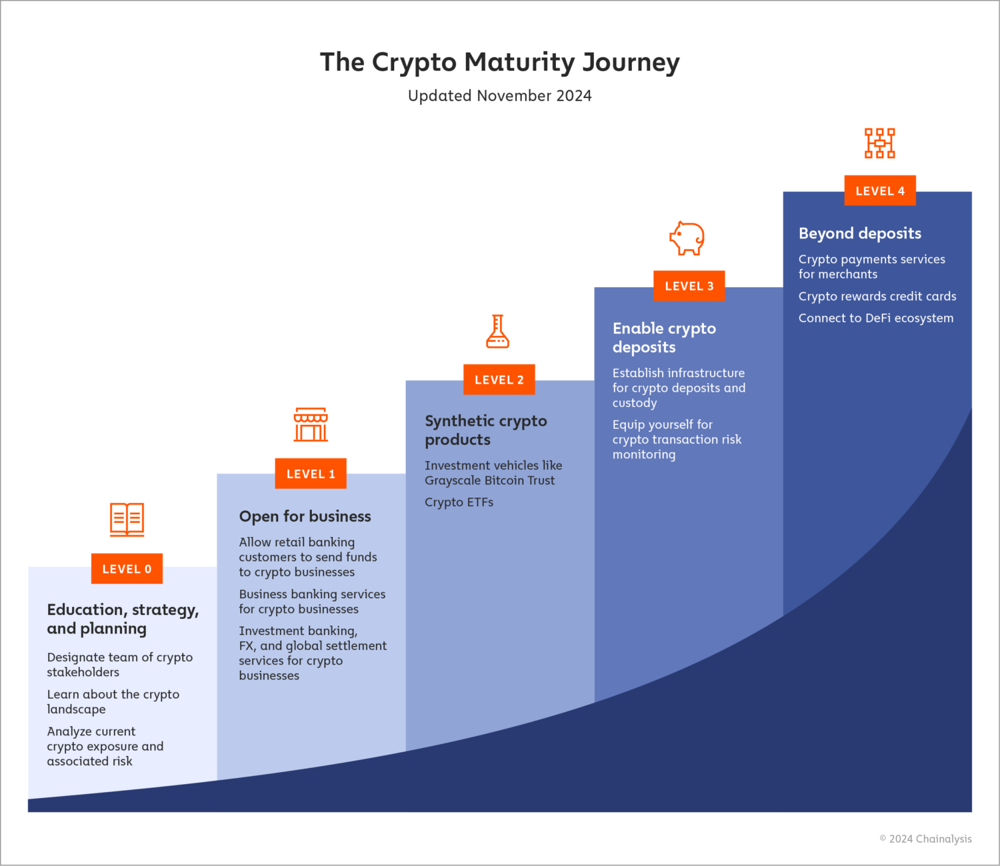

## Table of Contents

## What is cryptocurrency and why is secure storage important?

Cryptocurrency is a type of digital money that you can use to buy things online. It's different from regular money because it's not controlled by banks or governments. Instead, it uses something called blockchain, which is like a digital record book that keeps track of all the transactions. Some popular cryptocurrencies are Bitcoin and Ethereum. You can send and receive cryptocurrency through the internet, and you need a digital wallet to store it.

Secure storage is really important for cryptocurrency because if someone steals it, you can't get it back like you might with a credit card. Since cryptocurrencies are not backed by any bank or government, there's no one to help you if your digital wallet gets hacked. That's why people use special wallets and safety measures, like strong passwords and two-factor authentication, to keep their cryptocurrency safe. If you don't store it securely, you could lose all your money, and that would be a big problem.

## What are the different types of cryptocurrency wallets?

There are several types of cryptocurrency wallets, each with its own way of keeping your digital money safe. One type is the software wallet, which you can use on your computer or phone. These wallets are easy to use and let you quickly send and receive cryptocurrency. But, they can be risky because if your device gets hacked or lost, your money could be in danger. There are also online wallets, which you can access from any device with an internet connection. These are handy but can be less secure because they're on the internet, where hackers might try to break in.

Another type is the hardware wallet, which is like a small device that you plug into your computer. It's considered very safe because it keeps your [cryptocurrency](/wiki/cryptocurrency) offline, away from internet dangers. You can think of it as a USB stick for your digital money. Then there's the paper wallet, which is just a piece of paper with codes that let you access your cryptocurrency. It's safe as long as you keep the paper secure, but it's not very convenient for regular use because you have to type in the codes every time you want to do something with your money.

Each type of wallet has its pros and cons, so it's important to choose one that fits your needs. If you want something easy to use and don't mind a bit more risk, a software or online wallet might be good. But if you want the highest level of security and don't mind a bit more hassle, a hardware or paper wallet could be the best choice.

## How do hardware wallets work and why are they considered secure?

Hardware wallets are small devices that you can plug into your computer or phone. They work by keeping your cryptocurrency safe offline, away from the internet where hackers might try to steal it. When you want to send or receive cryptocurrency, you plug the hardware wallet into your device. It then shows you the transaction details on a small screen, and you can confirm the transaction by pressing buttons on the wallet. This way, your private keys, which are like the secret codes to your money, never leave the hardware wallet and are not exposed to the internet.

Hardware wallets are considered very secure because they keep your private keys offline. Since the keys are not connected to the internet, it's much harder for hackers to get to them. Even if your computer or phone gets hacked, the hacker can't steal your cryptocurrency because the keys are safe on the hardware wallet. Also, many hardware wallets have extra security features, like needing a PIN to unlock them or wiping the data if someone tries to break in. This makes them a good choice for people who want to keep their digital money as safe as possible.

## What are the benefits and risks of using software wallets?

Software wallets are easy to use because you can download them on your computer or phone. They let you quickly send and receive cryptocurrency without needing any special hardware. This makes them convenient for people who use cryptocurrency a lot. Plus, many software wallets have extra features like showing you how much your cryptocurrency is worth or letting you trade different types of digital money.

But software wallets also have some risks. Because they are connected to the internet, they can be hacked. If someone gets into your computer or phone, they might be able to steal your cryptocurrency. Also, if you lose your device or it breaks, you could lose your money if you don't have a backup. So, it's important to use strong passwords and keep your device safe to lower these risks.

## Can you explain cold storage and its role in long-term cryptocurrency protection?

Cold storage is a way to keep your cryptocurrency safe by keeping it offline, away from the internet. It's like putting your money in a safe instead of leaving it in your wallet where someone could steal it. People use cold storage for long-term protection because it's much harder for hackers to get to your money when it's not connected to the internet. Common ways to use cold storage include hardware wallets and paper wallets. With a hardware wallet, your digital money stays on a small device that you only plug in when you need to do something with your cryptocurrency. A paper wallet is even simpler; it's just a piece of paper with codes that let you access your money, and you keep it in a safe place.

The main role of cold storage in long-term cryptocurrency protection is to keep your money safe from online threats. Since the internet is full of hackers trying to steal money, keeping your cryptocurrency offline means they can't reach it. This is especially important if you're planning to hold onto your cryptocurrency for a long time and don't need to move it around often. By using cold storage, you can sleep better at night knowing your digital money is as safe as possible. Just remember, you need to keep your hardware wallet or paper wallet secure because if someone steals it, they could still take your money.

## How does multi-signature technology enhance cryptocurrency security?

Multi-signature technology, often called multi-sig, makes cryptocurrency safer by needing more than one person to agree before any money can be moved. Imagine you have a safe that needs two keys to open it. In the same way, a multi-sig wallet needs several people to sign off on a transaction before it can happen. This means that if one person's computer gets hacked, the hacker can't steal the money because they need more signatures to complete the transaction.

This technology is really helpful for groups or businesses that want to keep their money safe. For example, a company might set up a wallet that needs three out of five people to agree before any money can be sent. This way, even if one or two people do something wrong or get tricked, the money stays safe. Multi-signature technology adds an extra layer of security, making it harder for anyone to steal your cryptocurrency without permission from multiple people.

## What are the best practices for managing private keys?

Managing private keys is super important because they are like the secret codes to your cryptocurrency. You need to keep them safe and secret. One good way to do this is by using a hardware wallet, which keeps your private keys offline and away from hackers. Another way is to write down your private keys on paper and keep them in a safe place, like a locked drawer or a safe. Never share your private keys with anyone, and don't store them on your computer or phone where they could be stolen.

It's also a good idea to make backups of your private keys, but keep them in different safe places. That way, if something happens to one set, you still have another. Use strong passwords to protect your wallets, and think about using two-[factor](/wiki/factor-investing) authentication for extra security. If you're using a software wallet, make sure your device has good security, like up-to-date antivirus software. By following these simple steps, you can help keep your cryptocurrency safe and secure.

## How can one protect their cryptocurrency from online threats like hacking and phishing?

Keeping your cryptocurrency safe from online threats like hacking and phishing starts with using strong, unique passwords for all your accounts and wallets. Make sure you update these passwords regularly and never use the same password for different services. It's also important to use two-factor authentication whenever you can. This adds an extra step to logging in, making it much harder for hackers to get into your accounts. Be careful about where you click and what you download. Hackers often use fake websites and emails to trick people into giving away their private keys or passwords, so always double-check the web addresses and be wary of emails asking for personal information.

Another way to protect your cryptocurrency is by keeping your software and devices up to date. Software updates often fix security holes that hackers could use to steal your money. Using a hardware wallet can also help because it keeps your private keys offline, away from the internet where hackers can't reach them. If you do use a software wallet, make sure your computer or phone has good antivirus software to catch any harmful programs. Finally, always be careful with public Wi-Fi. It's not as safe as your home internet, so try not to do anything with your cryptocurrency when you're connected to public networks. By following these simple steps, you can help keep your digital money safe from online threats.

## What are the considerations for storing large amounts of cryptocurrency?

When you have a lot of cryptocurrency, it's really important to think about how to keep it safe. One big thing to consider is using cold storage, like a hardware wallet or a paper wallet. These keep your money offline, away from hackers who might try to steal it over the internet. It's also a good idea to spread your cryptocurrency across different wallets, so if one gets hacked or lost, you don't lose everything. Using multi-signature wallets can help too, because they need more than one person to agree before any money can be moved, making it harder for someone to steal your money.

Another thing to think about is making sure you have good backups of your private keys. Keep these backups in different safe places, like a safe at home and a safe deposit box at a bank. It's also important to use strong passwords and two-factor authentication to protect your accounts. Be careful about sharing any information about your cryptocurrency online, because hackers might try to trick you with phishing emails or fake websites. By taking these steps, you can help keep your large amount of cryptocurrency as safe as possible.

## How do decentralized storage solutions compare to traditional methods?

Decentralized storage solutions are different from traditional methods because they don't rely on one big company to keep your data. Instead, they use a network of computers all over the world to store your files. This means there's no single point where someone can hack in and steal your stuff. It's like having a bunch of friends each keeping a piece of your puzzle, so if one friend loses their piece, you still have the others. This can be really good for keeping your cryptocurrency safe because it's harder for hackers to find and steal it.

Traditional storage methods, like using a bank or a big cloud company, keep all your data in one place. This can be easier to use because you just go to one spot to get your stuff, but it's also riskier. If that one place gets hacked or has a problem, you could lose everything. Also, these big companies might be able to see and control what you're doing with your data. With decentralized storage, you have more control and privacy because no one company is in charge of your files. So, while traditional methods might be simpler, decentralized storage can offer better security and privacy for your cryptocurrency.

## What advanced security measures can experts implement for cryptocurrency storage?

Experts can use advanced security measures like multi-signature wallets to keep their cryptocurrency safe. A multi-signature wallet needs more than one person to agree before any money can be moved. This makes it much harder for hackers to steal your money because they would need to trick more than one person. Experts can also use something called a cold storage setup, which keeps the private keys offline on hardware wallets or even paper wallets. This means the keys are not connected to the internet, so hackers can't reach them. Another advanced measure is using encrypted communication channels when they need to share sensitive information about their cryptocurrency.

Another way experts can protect their cryptocurrency is by using decentralized storage solutions. These solutions spread your data across many different computers around the world, so there's no single place where a hacker can break in and steal everything. This can be really helpful for keeping large amounts of cryptocurrency safe. Experts might also use advanced encryption techniques to make sure that even if someone does get their hands on their data, they can't read it without the right keys. By combining these advanced security measures, experts can keep their cryptocurrency as safe as possible from online threats.

## What are the emerging trends in cryptocurrency storage for 2024?

In 2024, one big trend in cryptocurrency storage is the use of more advanced hardware wallets. These new wallets are not just safer but also easier to use. They have better screens and buttons, so you can see and confirm your transactions more easily. Some even come with extra features like being able to connect to your phone without wires. This makes them handy for people who want to keep their money safe but also need to use it often. Another trend is the growing use of multi-signature wallets, especially for businesses and groups. These wallets need more than one person to agree before any money can be moved, making them super safe. More people are using them because they offer strong protection against hackers.

Another trend we're seeing is the rise of decentralized storage solutions for cryptocurrency. These solutions spread your money across many different computers around the world, so there's no single place where a hacker can break in and steal everything. This is becoming more popular because it offers better security and privacy. Also, there's more focus on using advanced encryption to keep your data safe. This means even if someone does get your data, they can't read it without the right keys. By using these new trends, people can keep their cryptocurrency safer than ever in 2024.

## References & Further Reading

[1]: Koblitz, N., & Menezes, A. (2015). ["The Random Oracle Model: A Twenty-Year Retrospective."](https://eprint.iacr.org/2015/140.pdf) Advances in Cryptology - CRYPTO 1998.

[2]: Narayanan, A., Bonneau, J., Felten, E., Miller, A., & Goldfeder, S. (2016). ["Bitcoin and Cryptocurrency Technologies."](https://press.princeton.edu/books/hardcover/9780691171692/bitcoin-and-cryptocurrency-technologies) Princeton University Press.

[3]: Antonopoulos, A. M. (2017). ["Mastering Bitcoin: Unlocking Digital Cryptocurrencies."](https://books.google.com/books/about/Mastering_Bitcoin.html?id=IXmrBQAAQBAJ) O'Reilly Media.

[4]: Bonneau, J., Miller, A., Clark, J., Narayanan, A., Kroll, J. A., & Felten, E. W. (2015). ["Research Perspectives and Challenges for Bitcoin and Cryptocurrencies."](https://ieeexplore.ieee.org/document/7163021) 2015 IEEE Security and Privacy.

[5]: Nakamoto, S. (2008). ["Bitcoin: A Peer-to-Peer Electronic Cash System."](https://nakamotoinstitute.org/library/bitcoin/) Bitcoin.org. 

[6]: Lopp, J. (2016). ["Secure Your Bitcoin Like A Praxeologist."](https://www.youtube.com/watch?v=uEMyAb6FH-M) CoinDesk. 

[7]: Lopez de Prado, M. (2018). ["Advances in Financial Machine Learning."](https://www.amazon.com/Advances-Financial-Machine-Learning-Marcos/dp/1119482089) Wiley.

[8]: Ober, M., Katzenbeisser, S., & Hamacher, K. (2013). ["Structure and Anonymity of the Bitcoin Transaction Graph."](https://www.semanticscholar.org/paper/Structure-and-Anonymity-of-the-Bitcoin-Transaction-Ober-Katzenbeisser/1652bc872f6dc07d8111de2d74fb9da2e1c7cd12) Future Internet.