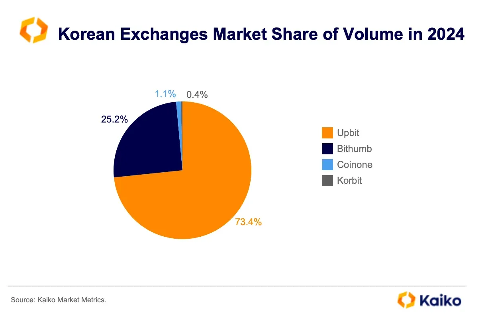

## Table of Contents

## What is cryptocurrency and how does it work?

Cryptocurrency is a type of digital money that you can use to buy things online. It's different from regular money because it's not controlled by banks or governments. Instead, it uses a technology called blockchain, which is like a big, shared notebook that keeps track of all the transactions. This makes it very hard for anyone to cheat or steal the money.

When you want to use cryptocurrency, you need a special app called a digital wallet. This wallet has a unique address, kind of like your email address, that you use to send and receive the digital money. When you make a transaction, it gets recorded on the blockchain, and other people on the network check to make sure it's valid. Once it's confirmed, the transaction is complete, and the money is moved from one wallet to another. It's a bit like sending an email, but instead of words, you're sending money.

## Why has cryptocurrency trading become popular in South Korea?

Cryptocurrency trading has become popular in South Korea for a few reasons. First, many young people in South Korea are very interested in technology and new ways of making money. They see cryptocurrencies as a chance to get in on something new and exciting. Also, South Korea has a lot of people who are good at using the internet and understanding new technology, which makes it easier for them to trade cryptocurrencies.

Another reason is that South Korea has strict rules about how much money people can send out of the country. This makes it harder for people to invest in things outside of South Korea. Cryptocurrencies, on the other hand, are not controlled by these rules, so people can use them to invest in things around the world. This makes cryptocurrencies very attractive to South Koreans who want to invest their money in different ways.

## What are the most commonly traded cryptocurrencies in South Korea?

In South Korea, the most commonly traded cryptocurrencies are Bitcoin, Ethereum, and XRP. Bitcoin is the most popular one because it was the first [cryptocurrency](/wiki/cryptocurrency) and people trust it a lot. It's like the king of cryptocurrencies. Ethereum is also very popular because it's not just a currency, but also a platform where people can build new things, like apps and games. XRP is popular too because it's fast and cheap to use, which makes it good for sending money around the world.

These three cryptocurrencies are the main ones that people in South Korea trade on big exchanges like Upbit, Bithumb, and Coinone. These exchanges make it easy for people to buy and sell cryptocurrencies, and they are very popular in South Korea. People like to trade these cryptocurrencies because they hope to make money if their value goes up. Also, many South Koreans are interested in technology and new ways of investing, so they are excited about trading cryptocurrencies.

## How does the regulatory environment in South Korea affect cryptocurrency trading?

The regulatory environment in South Korea has a big impact on cryptocurrency trading. The government has put in place some strict rules to make sure that people are safe when they trade cryptocurrencies. For example, they require exchanges to follow certain security measures and to report any suspicious activities. This helps to stop fraud and protect people's money. But these rules can also make it harder for people to trade cryptocurrencies because they have to follow a lot of rules and might need to give a lot of personal information.

At the same time, the government has also tried to encourage the growth of the cryptocurrency industry. They have allowed some new types of financial products that use cryptocurrencies, like futures and options. This has made it more interesting for people to trade cryptocurrencies because they can try different ways to make money. But the government is always watching closely and might change the rules if they see any big problems. This means that the rules can change and affect how people trade cryptocurrencies in South Korea.

## What are the key factors driving the popularity of cryptocurrency trading among South Korean youth?

Cryptocurrency trading has become very popular among young people in South Korea because they are interested in new technology and want to try new ways to make money. They see cryptocurrencies as a chance to be part of something new and exciting. Many young people in South Korea are good at using the internet and understanding new technology, which makes it easier for them to trade cryptocurrencies. They like to learn about different cryptocurrencies and how they work, and they enjoy the challenge of trying to make money by trading them.

Another reason why cryptocurrency trading is popular among South Korean youth is that they feel limited by the strict rules about sending money out of the country. These rules make it hard for them to invest in things outside of South Korea. Cryptocurrencies are not controlled by these rules, so young people can use them to invest in things around the world. This makes cryptocurrencies very attractive to them because they want to find different ways to invest their money and try to make it grow.

## How do South Korean cryptocurrency exchanges differ from those in other countries?

South Korean cryptocurrency exchanges are a bit different from those in other countries because they have to follow strict rules set by the government. These rules are there to keep people safe when they trade cryptocurrencies. For example, South Korean exchanges have to use strong security measures and report any suspicious activities to the government. This makes it harder for people to trade cryptocurrencies because they have to give a lot of personal information and follow many rules. But these rules also help to stop fraud and protect people's money, which is very important.

Another difference is that South Korean exchanges are very popular and have a lot of people using them. Exchanges like Upbit, Bithumb, and Coinone are some of the biggest in the world. They make it easy for people to buy and sell cryptocurrencies, and they offer many different types of cryptocurrencies to trade. This makes it exciting for people in South Korea to trade cryptocurrencies because they have a lot of choices and can try different ways to make money. Also, the South Korean government has allowed some new types of financial products that use cryptocurrencies, like futures and options, which you might not find on exchanges in other countries.

## What role do mobile apps play in the growth of cryptocurrency trading in South Korea?

Mobile apps have been very important in helping more people in South Korea trade cryptocurrencies. These apps make it easy for people to buy and sell cryptocurrencies using their phones. They can do this anywhere and at any time, which is great for busy people who don't have time to sit at a computer. The apps are user-friendly, so even people who are new to trading can use them without any trouble. This has made it possible for more people, especially young people, to start trading cryptocurrencies.

Also, these mobile apps often come with special features that help people learn more about cryptocurrencies and how to trade them. They might have tools that show you the prices of different cryptocurrencies and help you make better decisions about when to buy or sell. Some apps even let you practice trading with fake money first, so you can learn without losing any real money. This has made trading cryptocurrencies more fun and less scary for people in South Korea, which is why more and more people are trying it out.

## How has the South Korean government's stance on cryptocurrencies evolved over time?

At first, the South Korean government was very careful about cryptocurrencies. They were worried about people losing money and about criminals using cryptocurrencies to do bad things. So, they made strict rules for cryptocurrency exchanges. These rules said that exchanges had to keep their customers' money safe and report any strange activities to the government. They also thought about banning cryptocurrencies completely, but they didn't do that in the end.

Over time, the government's view on cryptocurrencies changed a bit. They saw that a lot of people in South Korea were interested in trading cryptocurrencies and that it could help the economy grow. So, they started to allow some new types of financial products that use cryptocurrencies, like futures and options. But they still keep a close watch on the cryptocurrency market and might change the rules if they see any big problems. They want to make sure that people are safe when they trade cryptocurrencies, but they also want to let the industry grow.

## What are the risks associated with cryptocurrency trading in South Korea?

Trading cryptocurrencies in South Korea can be risky. One big risk is that the prices of cryptocurrencies can go up and down a lot. This means you could lose money if you buy a cryptocurrency and its price goes down. Also, because cryptocurrencies are not controlled by banks or governments, there's a higher chance that someone could try to cheat or steal your money. If you use a cryptocurrency exchange that doesn't have good security, your money might not be safe.

Another risk is that the rules about cryptocurrencies in South Korea can change. The government might decide to make new rules that make it harder to trade cryptocurrencies, or they might even ban them. This could affect the prices of cryptocurrencies and make it hard for you to get your money out. Also, because cryptocurrencies are new and not everyone understands them well, you might make mistakes when you trade them. It's important to learn as much as you can about cryptocurrencies before you start trading them.

## How do South Korean traders use advanced trading strategies like arbitrage and margin trading?

South Korean traders use advanced trading strategies like [arbitrage](/wiki/arbitrage) to make money from the differences in cryptocurrency prices between different exchanges. For example, if Bitcoin is cheaper on one exchange and more expensive on another, a trader can buy it on the cheaper exchange and sell it on the more expensive one, making a profit from the price difference. This strategy requires quick action and good knowledge of the market because the price differences can disappear fast. Many South Korean traders use special software and tools to help them find these opportunities and act on them quickly.

Margin trading is another advanced strategy that South Korean traders use. With margin trading, traders can borrow money from an exchange to buy more cryptocurrencies than they could with just their own money. This can make their profits bigger if the price of the cryptocurrency goes up, but it can also make their losses bigger if the price goes down. Because of this, margin trading is riskier than regular trading. South Korean exchanges like Upbit and Bithumb offer margin trading services, and many traders use them to try to make more money. But it's important for traders to understand the risks and use this strategy carefully.

## What impact have major global events had on the South Korean cryptocurrency market?

Major global events have had a big effect on the South Korean cryptocurrency market. For example, when there is a lot of uncertainty around the world, like during the COVID-19 pandemic, people often start looking for new ways to invest their money. Cryptocurrencies became more popular because they seemed like a good way to make money when other investments were not doing well. This led to more people in South Korea trading cryptocurrencies, and the prices of many cryptocurrencies went up.

Another example is when big countries make new rules about cryptocurrencies. If a country like the United States or China decides to ban or limit cryptocurrencies, it can make the prices go down everywhere, including in South Korea. Traders in South Korea have to watch what is happening around the world because it can affect their trades. Even though South Korea has its own rules, global events can still cause big changes in the cryptocurrency market there.

## What future trends are expected in the South Korean cryptocurrency trading scene?

In the future, more people in South Korea might start using cryptocurrencies for everyday things like buying groceries or paying bills. This is because the government and businesses are starting to see cryptocurrencies as a good way to do business. Also, more types of cryptocurrencies might become popular, not just Bitcoin and Ethereum. People might start using different cryptocurrencies for different things, like using one for fast payments and another for long-term investments.

Another trend could be that the rules about cryptocurrencies in South Korea might change. The government might make the rules easier so that more people can trade cryptocurrencies without too much trouble. But they might also make the rules stricter if they see any big problems, like people losing money or criminals using cryptocurrencies to do bad things. This means that people who trade cryptocurrencies in South Korea will need to keep an eye on the rules and be ready to change how they trade if the rules change.

## References & Further Reading

[1]: ["Cryptocurrency and Blockchain: Legal, Ethical, and Economic Perspectives"](https://www.researchgate.net/publication/349753192_Blockchain_and_Cryptocurrencies_Legal_and_Ethical_Considerations) by Aries Wanlin Wang

[2]: ["Digital Finance: Big Data, Start-ups, and the Future of Financial Services"](https://www.taylorfrancis.com/books/mono/10.4324/9780429053047/digital-finance-perry-beaumont) by Baxter Hines 

[3]: ["The Future of Finance: The Impact of FinTech, AI, and Crypto on Financial Services"](https://link.springer.com/book/10.1007/978-3-030-14533-0) by Henri Arslanian

[4]: ["Regulating Blockchain: Critical Perspectives in Law and Technology"](https://www.taylorfrancis.com/books/mono/10.4324/9780429489815/regulating-blockchain-robert-herian) by Philipp Hacker, Ioannis Lianos, Georgios Dimitropoulos, and Stefan Eich

[5]: ["The Age of Cryptocurrency: How Bitcoin and Digital Money Are Challenging the Global Economic Order"](https://dl.acm.org/doi/10.5555/2717097) by Paul Vigna and Michael J. Casey