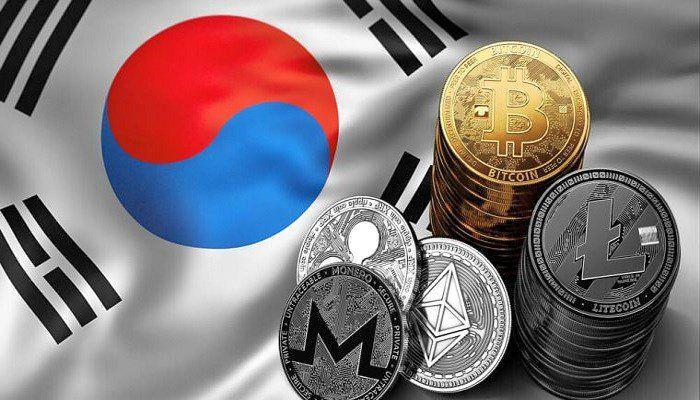

The cryptocurrency market in South Korea has witnessed remarkable growth over the past few years, driven by significant technological innovation and an increasing demand for crypto investments. This surge can be largely attributed to South Korea's younger demographic, who perceive cryptocurrencies as a promising alternative route to financial stability. This perspective is particularly resonant given the prevailing challenge of high youth unemployment in the country. According to recent data, youth unemployment rates have persisted above the national average, prompting the younger generation to explore novel financial instruments like cryptocurrencies to secure their economic futures.

Cryptocurrencies offer an enticing proposition with their decentralized nature and potential for high returns. As decentralized and stateless financial instruments, they align well with the tech-savvy and innovation-driven mindset prevalent among South Korea's youth. The country's robust technological infrastructure, marked by widespread high-speed internet access and extensive use of mobile technologies, further facilitates the seamless adoption and integration of digital assets.



The focus of this article is on illuminating the factors behind the pervasive popularity of cryptocurrencies and algorithmic trading among South Korean investors. It will also shed light on the regulatory environment shaping the market and discuss the prospects for the future of crypto trading in South Korea. In doing so, it aims to provide a comprehensive understanding of South Korea's distinctive position in the global cryptocurrency landscape.

## Table of Contents

## The Rise of Cryptocurrency in South Korea

Cryptocurrencies have swiftly become a favored investment option among South Korea's younger demographic, who are actively seeking alternative means to secure their financial future. A considerable driver behind this trend is the country's high youth unemployment rate, which stood at approximately 8.6% in 2021, significantly higher than the national average. This socio-economic challenge incentivizes young individuals to explore innovative financial avenues, such as digital currencies, which promise potential high returns compared to traditional investments. 

Furthermore, South Korea's population is already well-versed in electronic payment systems, thanks to the rapid digitalization of its economy. This familiarity with electronic transactions lays the groundwork for the seamless integration of cryptocurrencies into daily financial activities. The nation's embrace of decentralized and stateless assets is partly propelled by the desire for investments that transcend governmental and institutional control, offering a sense of financial autonomy and future-proofing against domestic economic instabilities.

Technological infrastructure, notably South Korea's high-speed internet, enhances the accessibility and usability of cryptocurrencies. With one of the fastest internet connections in the world, the nation is poised for rapid digital transformation, allowing for nearly instantaneous cryptocurrency transactions and access to global crypto markets. This digital prowess supports the adoption of cutting-edge crypto trading practices, including sophisticated algorithmic trading strategies, further entrenching cryptocurrencies as a staple of South Korea's financial landscape. The enthusiasm and readiness of the tech-savvy youth for adopting such technologies accentuate the country's role as a significant player in the global cryptocurrency market.

## Algorithmic Trading: Transforming the Crypto Market

Algorithmic trading, commonly referred to as algo trading, has significantly transformed the [cryptocurrency](/wiki/cryptocurrency) market in South Korea. By leveraging complex algorithms, this method automates trading processes, thus optimizing the execution of trades with increased speed and precision while eliminating the need for human intervention. 

Algo trading systems utilize advanced mathematical models and statistical analyses to forecast market trends and identify lucrative trading opportunities. These algorithms are coded to execute predetermined strategies based on market conditions, such as price fluctuations and [volume](/wiki/volume-trading-strategy) changes. An example of a simple algorithm might involve setting triggers to buy or sell a cryptocurrency when its price crosses a specific moving average. Python, being a versatile programming language, is widely used for developing such trading algorithms due to its comprehensive libraries, such as NumPy, pandas, and scikit-learn, which facilitate data analysis and [machine learning](/wiki/machine-learning).

```python
import pandas as pd
import numpy as np

# Example of a simple moving average (SMA) strategy for algo trading

def simple_moving_average_strategy(prices, window=20):
    # Calculate the moving average
    sma = prices.rolling(window=window).mean()

    # Generate buy signals
    buy_signals = prices > sma  # Buy when price crosses above SMA
    sell_signals = prices < sma  # Sell when price crosses below SMA

    return buy_signals, sell_signals

# Example usage
prices = pd.Series(np.random.random(100) * 100)  # Simulate random price data
buy, sell = simple_moving_average_strategy(prices)
```

In South Korea, high-speed internet and robust technological infrastructure facilitate the widespread adoption of [algorithmic trading](/wiki/algorithmic-trading). Many South Korean investors, recognizing the volatile nature of cryptocurrencies, employ algo trading strategies to exploit rapid price swings and maximize their returns. These strategies enable traders to implement and monitor their investments around the clock, capitalizing on opportunities in a market that operates continuously.

Moreover, algorithmic trading mitigates the emotional component commonly associated with trading. By sticking to predefined algorithms, traders avoid psychological pitfalls such as panic selling during market downturns or excessive optimism during bullish trends. This discipline is particularly advantageous in the crypto markets, where extreme [volatility](/wiki/volatility-trading-strategies) can trigger strong emotional reactions.

As algorithmic trading continues to gain traction among South Korean traders, the development of more sophisticated strategies and tools is anticipated. Innovations such as machine learning algorithms that can self-adapt to changing market conditions and real-time sentiment analysis are paving the way for more nuanced and effective trading approaches. The widespread use of these advanced techniques underscores the pivotal role algorithmic trading plays in the evolution of cryptocurrency trading practices in South Korea.

## South Korean Crypto Trading Platforms

South Korea is home to several prominent cryptocurrency trading platforms that have been instrumental in facilitating both retail and institutional crypto investments. Among these platforms, Upbit, Bithumb, and KuCoin stand out due to their advanced features tailored for a robust trading experience.

These exchanges have distinguished themselves in the market through a combination of low trading fees and high [liquidity](/wiki/liquidity-risk-premium), making it easier for traders to execute transactions efficiently. For instance, low transaction fees are an attractive proposition for frequent traders as lower costs directly help in maximizing net returns on trades. The high liquidity on these platforms ensures that there is a constant flow of transactions, which minimizes price slippage and allows for smooth entry and [exit](/wiki/exit-strategy) from trades. This high liquidity is crucial for large-volume traders or institutional investors who need to move significant sums of money without affecting market prices drastically.

Furthermore, these platforms offer a diverse range of Korean Won (KRW) deposit methods, accommodating different user preferences and enhancing their accessibility. This flexibility supports a wider user base, as traders who wish to deposit in local currency can do so with convenience, circumventing the exchange rate risks associated with transferring foreign currencies.

Security is another pivotal aspect where South Korean exchanges excel, with robust measures put in place to protect user funds and data. These security protocols often include multi-[factor](/wiki/factor-investing) authentication (MFA), encryption technologies, and cold storage solutions to safeguard assets against hacking attempts. Such comprehensive security features build trust among users, an essential factor given the high-profile security breaches that have previously plagued the cryptocurrency sector globally.

South Korean exchanges have not only gained popularity domestically but have also made a mark on the international stage. Their comprehensive trading tools, including algorithmic trading options, attract both local and international traders aiming to leverage automated strategies for trading cryptocurrencies. These platforms cater to a global audience by providing intuitive interfaces and support in multiple languages, further broadening their appeal.

The combination of advanced trading technologies, user-friendly interfaces, and a strong security framework has cemented the reputation of South Korean cryptocurrency exchanges as leaders in the digital asset marketplace. They continue to play a vital role in the expansion of crypto trading activities worldwide.

## Regulatory Landscape

South Korea has been instrumental in advancing regulatory measures to bolster the transparency and security of cryptocurrency trading. The Financial Services Commission (FSC), the primary financial regulatory body in the nation, has spearheaded efforts to create a robust framework for the burgeoning crypto market. One of the key measures introduced by the FSC is the real-name account system, which mandates that cryptocurrency trading can only be conducted through bank accounts linked to the trader’s real identity. This approach is aimed at curtailing anonymity, thereby reducing the risk of illegal activities such as fraud and money laundering. According to reports, this system has substantially increased market trust among both local and international investors.

In addition to the real-name account requirement, South Korea has implemented stringent anti-money laundering (AML) policies. These policies necessitate that cryptocurrency exchanges adhere to rigorous guidelines for monitoring transactions and reporting suspicious activities to the authorities. This comprehensive AML framework aligns with global standards, further enhancing the credibility of South Korean crypto platforms.

Looking forward, the enactment of the Virtual Asset User Protection Act in July 2024 marks a significant milestone in the regulation of digital assets within the country. This legislation offers explicit guidelines aimed at safeguarding users from unfair practices, ensuring that trading activities remain secure and transparent. The Act also establishes mechanisms for dispute resolution, ensuring that traders have recourse in instances of misconduct or discrepancies in trading practices.

By establishing these regulatory measures, South Korea not only prioritizes the protection of investors but also positions itself as a global leader in the adoption of digital asset regulations. The proactive stance taken by the FSC and related authorities exemplifies a balanced approach to fostering innovation while ensuring that the growth of the cryptocurrency market does not come at the expense of financial integrity and security.

## Future Prospects

The South Korean government is making significant strides in refining its regulatory framework to better manage the evolving landscape of cryptocurrency trading while supporting technological innovation. This proactive approach aims to strike a balance between ensuring investor protection and encouraging the growth of the digital asset market. The government recognizes the importance of accommodating new developments within the industry, such as decentralized finance (DeFi) platforms and blockchain-based applications, which offer innovative financial solutions.

As the popularity of cryptocurrency trading surges, South Korea is positioning itself to remain a global leader in digital asset adoption. To maintain this status, the regulatory bodies are focusing on policies that provide both security and flexibility. This includes implementing measures that enhance the transparency and integrity of crypto transactions, thereby building trust within the market.

A significant trend contributing to the future prospects of crypto trading in South Korea is the rapid expansion of DeFi. DeFi platforms are transforming traditional financial systems by enabling peer-to-peer financial transactions without intermediaries. This transformation is appealing to South Korean investors who are increasingly participating in DeFi projects due to their potential for high returns and innovative solutions. As a result, the South Korean government is monitoring DeFi growth to ensure that its regulatory framework encompasses these developments, thereby supporting sustainable market growth.

Blockchain-based applications are another factor expected to attract more participants to the South Korean crypto space. These applications are not only enhancing the efficiency and security of financial transactions but also driving the development of new business models within various sectors. South Korea's robust technological infrastructure provides a conducive environment for the proliferation of these applications, which contribute to the overall maturity and sophistication of the crypto ecosystem.

In conclusion, the future prospects of cryptocurrency trading in South Korea are promising, largely due to strong governmental support and an adaptive regulatory framework. As South Korea continues to foster innovation while ensuring market safety, it is likely to attract a growing number of crypto enthusiasts and investors. The government's commitment to integrating emerging technologies into its financial landscape demonstrates its determination to lead in the global cryptocurrency arena.

## Conclusion

South Korea's robust technological infrastructure and proactive regulatory advancements have established a conducive environment for the proliferation of cryptocurrency and algorithmic trading. The nation's investment in high-speed internet, digital payment systems, and innovation hubs supports an agile ecosystem where digital assets can flourish. Complementing this infrastructure, the government's regulatory framework, which includes real-name verification systems and anti-money laundering policies, enhances transparency, security, and trust in the cryptocurrency market.

The country's leadership in digital asset adoption signifies the significant shift of cryptocurrencies from fringe financial instruments to critical components of the global financial ecosystem. By integrating these digital solutions with traditional financial systems, South Korea is demonstrating how to effectively blend technological innovation with financial stability.

As South Korea addresses the dynamic challenges and prospects within the crypto market, it becomes a benchmark for other nations aspiring to integrate digital assets. The ongoing development of a clear regulatory path coupled with a commitment to fostering innovation underscores South Korea's potential to not only sustain but lead the future trajectory of cryptocurrency and blockchain adoption worldwide.

## References & Further Reading

[1]: ["Cryptocurrency and Blockchain: Legal, Ethical, and Economic Perspectives"](https://www.researchgate.net/publication/349753192_Blockchain_and_Cryptocurrencies_Legal_and_Ethical_Considerations) by Aries Wanlin Wang

[2]: ["Digital Finance: Big Data, Start-ups, and the Future of Financial Services"](https://www.taylorfrancis.com/books/mono/10.4324/9780429053047/digital-finance-perry-beaumont) by Baxter Hines 

[3]: ["The Future of Finance: The Impact of FinTech, AI, and Crypto on Financial Services"](https://link.springer.com/book/10.1007/978-3-030-14533-0) by Henri Arslanian

[4]: ["Regulating Blockchain: Critical Perspectives in Law and Technology"](https://www.taylorfrancis.com/books/mono/10.4324/9780429489815/regulating-blockchain-robert-herian) by Philipp Hacker, Ioannis Lianos, Georgios Dimitropoulos, and Stefan Eich

[5]: ["The Age of Cryptocurrency: How Bitcoin and Digital Money Are Challenging the Global Economic Order"](https://dl.acm.org/doi/10.5555/2717097) by Paul Vigna and Michael J. Casey