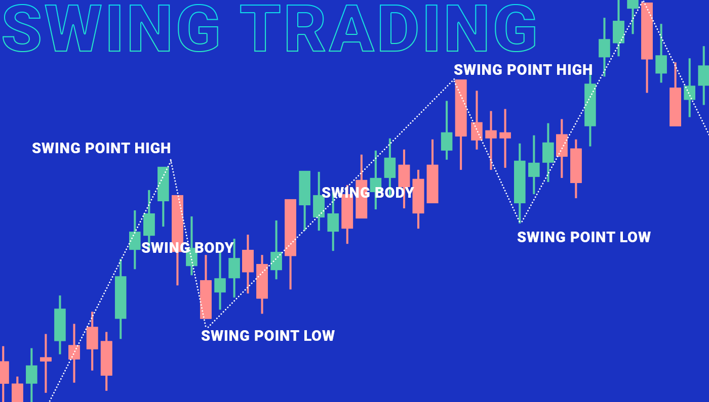

## Table of Contents

## What is cryptocurrency trading?

Cryptocurrency trading is when people buy and sell digital money, like Bitcoin or Ethereum, on special websites called exchanges. These digital currencies use fancy math to keep them safe and don't need banks to work. People trade them hoping their value will go up so they can sell them for more money later. It's a bit like trading stocks, but instead of company shares, you're trading digital coins.

Trading cryptocurrencies can be exciting, but it can also be risky. The prices of these digital coins can change a lot in a short time, sometimes going up or down by a lot in just one day. This means you could make money quickly, but you could also lose money just as fast. It's important to learn about the different cryptocurrencies and how trading works before you start, and only use money you can afford to lose.

## Why is it important to have a trading strategy?

Having a trading strategy is really important because it helps you make smart choices when you're buying and selling cryptocurrencies. Without a plan, you might make decisions based on your feelings instead of thinking things through. This can lead to big losses if the market goes down and you panic. A good strategy tells you when to buy, when to sell, and how much money to risk. It's like having a map when you're on a trip; it keeps you from getting lost and helps you reach your goals.

A trading strategy also helps you stay calm during the ups and downs of the market. When prices start to change a lot, it's easy to get scared or too excited. But if you have a plan, you can stick to it and not let your emotions take over. This can make your trading more successful over time. Plus, having a strategy means you can look back at your trades and see what worked and what didn't, so you can get better at trading.

## What are the basic principles of a good trading strategy?

A good trading strategy starts with setting clear goals. You need to know what you want to achieve, whether it's making a certain amount of money, learning how to trade better, or just having fun. Once you have your goals, you can make rules for when to buy and sell. These rules should be based on things like the price of the [cryptocurrency](/wiki/cryptocurrency), how much it's going up or down, and news that might affect it. It's also important to decide how much money you're willing to risk on each trade. This helps you avoid losing too much if things don't go your way.

Another key part of a good trading strategy is managing your emotions. The cryptocurrency market can be a wild ride, with prices changing a lot in a short time. It's easy to get scared and sell when prices drop or get too excited and buy more when prices go up. But a good strategy helps you stick to your plan and not let your feelings take over. It's also a good idea to keep learning and adjusting your strategy. As you trade more, you'll see what works and what doesn't, so you can make your strategy better over time.

## How can beginners start with simple trading strategies like 'buy and hold'?

For beginners, a simple trading strategy like 'buy and hold' is a great way to start. This strategy means you buy a cryptocurrency and keep it for a long time, hoping its value will go up. You don't need to watch the market every day or make quick decisions. Just pick a cryptocurrency you believe in, like Bitcoin or Ethereum, and hold onto it. This way, you can avoid the stress of trying to guess when to buy and sell every day.

To start with 'buy and hold,' first, do some research to find a cryptocurrency you think will do well in the future. Look at things like the technology behind it, the team working on it, and what people are saying about it. Once you've chosen, decide how much money you can afford to invest. Remember, the value of cryptocurrencies can go up and down a lot, so only use money you're okay with losing. After you buy, just hold onto your cryptocurrency and check on it every now and then. Over time, if the value goes up, you could make a nice profit.

## What are some common technical analysis tools used in cryptocurrency trading?

Technical analysis tools help traders look at past price data to guess where the price might go next. One common tool is the moving average, which smooths out price changes over time to show a clearer trend. Traders often use two moving averages, one short-term and one long-term, to see when they cross each other. This can signal good times to buy or sell. Another tool is the Relative Strength Index (RSI), which tells you if a cryptocurrency is overbought or oversold. If the RSI is above 70, it might mean the price is too high and could go down soon. If it's below 30, it might mean the price is too low and could go up.

Another popular tool is the candlestick chart, which shows the price movement of a cryptocurrency over a set time. Each candlestick tells you the opening, closing, highest, and lowest prices for that time period. Traders look at patterns in these candlesticks to predict future price movements. For example, a 'bullish engulfing' pattern might mean the price will go up, while a 'bearish engulfing' pattern might mean it will go down. Lastly, support and resistance levels are also important. Support is a price level where the cryptocurrency often stops falling, and resistance is where it often stops rising. Traders use these levels to decide when to buy or sell.

## How does fundamental analysis apply to cryptocurrency trading?

Fundamental analysis in cryptocurrency trading means looking at the basic things that can affect the value of a digital coin. Instead of just watching price charts, you study the technology behind the cryptocurrency, the team working on it, and how people use it. For example, you might look at how fast and secure the blockchain is, or if there are big companies using the cryptocurrency for their business. You also pay attention to news and events that could change how people feel about the cryptocurrency, like new laws or big partnerships.

By doing [fundamental analysis](/wiki/fundamental-analysis), you can decide if a cryptocurrency is a good long-term investment. If the technology is strong and more people are starting to use it, the value might go up over time. But if the team behind the cryptocurrency is not doing a good job or if there are big problems with the technology, the value might go down. So, fundamental analysis helps you make smarter choices about which cryptocurrencies to buy and hold for the future.

## What is the difference between day trading and swing trading in the context of cryptocurrencies?

Day trading and swing trading are two different ways to trade cryptocurrencies. Day trading means buying and selling cryptocurrencies within the same day. People who do this are trying to make money from small changes in the price during the day. They need to watch the market closely and make quick decisions. Day trading can be exciting but also stressful because the prices can change a lot in a short time.

Swing trading, on the other hand, is a bit slower. Instead of trading within a day, swing traders hold onto their cryptocurrencies for a few days or even weeks. They look for bigger price changes over time and try to make money from these swings. Swing trading doesn't need as much time watching the market every minute, but you still need to keep an eye on things and be ready to make moves when the time is right. Both ways of trading can work, but they need different skills and patience levels.

## Can you explain advanced strategies like scalping and arbitrage in cryptocurrency markets?

Scalping is a fast-paced trading strategy where you try to make small profits from tiny price changes in cryptocurrencies. People who scalp might buy and sell the same cryptocurrency many times in a single day, sometimes holding it for just a few seconds or minutes. The idea is to do this over and over again, adding up those small profits to make more money overall. Scalping needs you to watch the market very closely and react quickly, so it can be stressful. You also need to pay attention to the fees you pay for each trade, because if the fees are too high, they can eat into your profits.

Arbitrage is another strategy where you try to make money by taking advantage of price differences for the same cryptocurrency on different exchanges. For example, if Bitcoin is selling for $10,000 on one exchange but $10,100 on another, you could buy it on the first exchange and quickly sell it on the second one to make a $100 profit. This sounds easy, but it can be tricky because the price differences might not last long, and you need to move fast. Also, you have to think about the fees for moving your money between exchanges, because these can cut into your profits. Arbitrage needs good timing and a bit of luck to work well.

## How do automated trading bots work and what strategies do they typically employ?

Automated trading bots are computer programs that buy and sell cryptocurrencies for you, based on rules you set up. These bots can watch the market all the time, even when you're sleeping or busy with other things. They use special math formulas, called algorithms, to decide when to make trades. You tell the bot things like how much money to spend, when to buy, and when to sell. The bot then follows your instructions, trying to make money for you without you having to do the work.

Most trading bots use strategies like [scalping](/wiki/gamma-scalping) or [arbitrage](/wiki/arbitrage). With scalping, the bot makes lots of small trades to take advantage of tiny price changes, trying to add up small profits over time. For arbitrage, the bot looks for price differences of the same cryptocurrency on different exchanges. If it finds a good opportunity, it quickly buys on one exchange and sells on another to make a profit. These bots can help you trade more often and more accurately, but they also come with risks, like technical problems or sudden market changes that the bot might not handle well.

## What risk management techniques should be used in cryptocurrency trading?

One important risk management technique in cryptocurrency trading is setting stop-loss orders. A stop-loss order is like a safety net that automatically sells your cryptocurrency if its price drops to a certain level. This helps you limit how much money you could lose on a trade. Another technique is only using money you can afford to lose. Cryptocurrency prices can go up and down a lot, so it's smart to only trade with money that won't hurt you if it's gone. It's also a good idea to spread out your money across different cryptocurrencies, instead of putting it all into one. This way, if one cryptocurrency goes down, you won't lose everything.

Another key part of managing risk is keeping your emotions in check. It's easy to get excited when prices go up or scared when they go down, but making decisions based on feelings can lead to big losses. Stick to your trading plan and don't let the ups and downs of the market make you do something you might regret later. Finally, always keep learning and adjusting your strategies. The cryptocurrency market changes all the time, so what worked yesterday might not work tomorrow. By staying informed and being ready to change your approach, you can better handle the risks of trading.

## How can traders adapt their strategies to different market conditions in the cryptocurrency space?

Traders need to change their strategies based on what's happening in the cryptocurrency market. If the market is going up a lot, it might be a good time to use strategies like buying and holding or swing trading. These strategies work well when prices are rising because you can make money by holding onto your cryptocurrencies for a longer time. On the other hand, if the market is going down, you might want to use strategies like scalping or [day trading](/wiki/day-trading-spy). These can help you make small profits even when prices are falling, by quickly buying and selling.

It's also important to pay attention to news and events that can change the market. For example, if there's big news about a new law that could affect cryptocurrencies, you might want to be more careful and use strategies that protect your money, like setting stop-loss orders. By keeping an eye on what's happening and being ready to switch strategies, you can do better in the ever-changing world of cryptocurrency trading.

## What are some of the latest trends and future predictions for cryptocurrency trading strategies?

One of the latest trends in cryptocurrency trading is the increasing use of [artificial intelligence](/wiki/ai-artificial-intelligence) (AI) and [machine learning](/wiki/machine-learning). These technologies help traders make better decisions by analyzing huge amounts of data quickly. AI can spot patterns and trends that humans might miss, making it easier to predict what might happen next in the market. More and more traders are using AI-powered bots to do their trading for them, which can save time and help them make money even when they're not watching the market.

Another trend is the growing interest in decentralized finance (DeFi). DeFi is a way of using cryptocurrencies to do things like lending, borrowing, and [earning](/wiki/earning-announcement) interest without banks. Traders are coming up with new strategies to take advantage of these opportunities. For example, they might use something called yield farming, where they move their cryptocurrencies around to earn the highest returns. In the future, we might see even more new strategies as DeFi keeps growing and more people start using it.

Looking ahead, experts think that trading strategies will keep getting smarter and more complex. As more data becomes available and technology improves, traders will have even better tools to help them. We might also see more regulation of cryptocurrencies, which could change how people trade them. But no matter what happens, the key to success will still be staying flexible and ready to adapt to new trends and technologies.

## What is algo trading?

Algorithmic trading, commonly known as algo trading, refers to the use of computer programs to execute trading orders based on a set of predetermined rules. These algorithms are designed to identify opportunities and execute trades at speeds far beyond human capabilities. One of the primary advantages of algo trading is its ability to process vast amounts of financial data quickly and make decisions based on this analysis, which facilitates high-frequency trading and helps eliminate emotional biases that typically affect manual trading.

High-frequency trading, a subset of algo trading, leverages algorithms to submit a large number of orders at extremely rapid speeds, often in fractions of a second. This efficiency involves parsing market data, identifying trading signals, and executing trades in real-time. These capabilities are crucial in volatile markets like cryptocurrency, where prices can fluctuate dramatically within short periods.

Several key strategies are employed in algo trading, each targeting different aspects of the market:

1. **Volume Weighted Average Price (VWAP)**: This strategy aims to execute an order across the trading day at the average price weighted by volume. The formula for VWAP is:
$$
   \text{VWAP} = \frac{\sum (\text{Price}_i \times \text{Volume}_i)}{\sum \text{Volume}_i}

$$

   By executing trades at the VWAP, traders aim to achieve a price that's more representative of the entire trading day's range, minimizing market impact.

2. **Time Weighted Average Price (TWAP)**: Similar to VWAP, TWAP focuses on executing the order over a specific time period to achieve an average price. It's beneficial in mitigating market impact by spreading trades over time.

3. **Percentage of Volume (POV)**: This strategy adjusts the trading volume to a set percentage of the market's total volume, ensuring that trades occur in proportion to the market activity. It allows traders to execute their orders without significantly affecting the market price.

Despite its efficiency, algo trading is not without challenges. The technical complexity of creating and maintaining these algorithms requires expertise in both programming and financial markets. Moreover, the reliance on technology introduces risks such as system failures, network connectivity issues, and software bugs, all of which can lead to significant financial losses if not properly managed.

In summary, [algorithmic trading](/wiki/algorithmic-trading) offers substantial advantages in terms of speed and efficiency, particularly in fast-moving markets like cryptocurrencies. However, the technical demands and potential risks necessitate careful planning and ongoing management to harness its full potential safely.

## References & Further Reading

[1]: Bergstra, J., Bardenet, R., Bengio, Y., & Kégl, B. (2011). ["Algorithms for Hyper-Parameter Optimization."](https://papers.nips.cc/paper/4443-algorithms-for-hyper-parameter-optimization) Advances in Neural Information Processing Systems 24.

[2]: ["Advances in Financial Machine Learning"](https://www.amazon.com/Advances-Financial-Machine-Learning-Marcos/dp/1119482089) by Marcos Lopez de Prado

[3]: ["Evidence-Based Technical Analysis: Applying the Scientific Method and Statistical Inference to Trading Signals"](https://www.amazon.com/Evidence-Based-Technical-Analysis-Scientific-Statistical/dp/0470008741) by David Aronson

[4]: ["Machine Learning for Algorithmic Trading"](https://github.com/stefan-jansen/machine-learning-for-trading) by Stefan Jansen

[5]: ["Quantitative Trading: How to Build Your Own Algorithmic Trading Business"](https://books.google.com/books/about/Quantitative_Trading.html?id=j70yEAAAQBAJ) by Ernest P. Chan