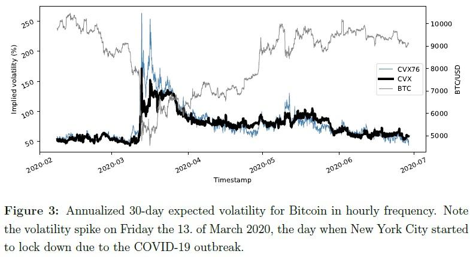

## Table of Contents

## What is cryptocurrency?

Cryptocurrency is a type of digital money that you can use to buy things online. It is different from regular money because it is not controlled by banks or governments. Instead, it uses a technology called blockchain, which is like a big, shared record book that keeps track of all the transactions. People can send and receive cryptocurrency directly with each other without needing a middleman.

There are many different kinds of cryptocurrencies, but the most famous one is Bitcoin. Other popular ones include Ethereum and Litecoin. You can buy cryptocurrencies with regular money, and then you can use them to buy things from places that accept them. Some people also buy cryptocurrencies hoping that their value will go up, so they can sell them later for a profit. However, the value of cryptocurrencies can go up and down a lot, so it can be risky.

## What is volatility in the context of financial markets?

Volatility in financial markets means how much and how quickly the prices of things like stocks, bonds, or cryptocurrencies go up and down. If something is very volatile, its price can change a lot in a short time. This can be exciting but also risky because you might lose money if the price goes down suddenly.

For example, if you own a stock and its price jumps around a lot every day, that stock is volatile. People often watch [volatility](/wiki/volatility-trading-strategies) to decide if they want to buy or sell something. High volatility can mean more chances to make money, but it also means more chances to lose money. So, it's important to understand volatility when you're thinking about investing.

## How is the Cryptocurrency Volatility Index defined?

The Cryptocurrency Volatility Index is a measure that shows how much the prices of cryptocurrencies go up and down over time. It's like a thermometer for how calm or wild the crypto market is. If the index is high, it means the prices are changing a lot and the market is very unpredictable. If it's low, the prices are more stable and the market is calmer.

This index is important for people who invest in cryptocurrencies because it helps them understand the risks. When the index shows high volatility, it means there's a bigger chance that the value of their investments could drop suddenly. On the other hand, a low volatility index might suggest a safer time to buy or sell. By keeping an eye on this index, investors can make better decisions about when to trade.

## What factors contribute to the volatility of cryptocurrencies?

One big reason why cryptocurrencies can be so up and down is because they are still new and not as many people use them as regular money. Since there aren't as many people buying and selling them, even small changes can make their prices jump around a lot. Also, because cryptocurrencies are not controlled by banks or governments, they can be affected by what people think and say about them. If a famous person says something good or bad about a [cryptocurrency](/wiki/cryptocurrency), its price can change a lot very quickly.

Another [factor](/wiki/factor-investing) is that cryptocurrencies are traded all over the world, all the time. This means they can be affected by news and events happening anywhere, at any time. For example, if a country decides to make new rules about cryptocurrencies, it can cause their prices to go up or down. Plus, since cryptocurrencies are digital, they can be affected by things like hacking or technical problems, which can also make their prices more volatile.

## How is the Cryptocurrency Volatility Index calculated?

The Cryptocurrency Volatility Index is figured out by looking at how much the price of a cryptocurrency goes up and down over a certain time. People who want to know this index usually take the daily prices of a cryptocurrency and find out how much they change from one day to the next. They do this over a period of time, like 30 days or 90 days, and then use a special math formula to turn these changes into a number that shows how volatile the cryptocurrency is.

This math formula is called the standard deviation. It measures how spread out the price changes are. If the price changes are all over the place, the standard deviation will be high, meaning the cryptocurrency is very volatile. If the price changes are more steady, the standard deviation will be low, showing that the cryptocurrency is less volatile. By using this method, people can get a good idea of how risky a cryptocurrency might be to invest in.

## What are the most commonly used Cryptocurrency Volatility Indices?

The most commonly used Cryptocurrency Volatility Index is the Bitcoin Volatility Index, often called the BVOL. This index measures how much the price of Bitcoin goes up and down over time. It's important because Bitcoin is the biggest and most well-known cryptocurrency, so its volatility affects the whole crypto market. People use the BVOL to understand how risky it might be to buy or sell Bitcoin at any given time.

Another popular index is the Ethereum Volatility Index, or EVZ. This index does the same thing but for Ethereum, which is the second biggest cryptocurrency. Ethereum is used a lot for things like smart contracts and decentralized apps, so its volatility can affect many different parts of the crypto world. By watching the EVZ, people can get a sense of how stable or unstable Ethereum's price is, helping them make smarter investment choices.

## How does the Cryptocurrency Volatility Index compare to traditional market volatility indices like the VIX?

The Cryptocurrency Volatility Index, like the Bitcoin Volatility Index (BVOL) or Ethereum Volatility Index (EVZ), works a lot like the VIX, which is the Volatility Index for the stock market. Both of these indices measure how much prices go up and down. The VIX looks at the S&P 500, which is a big group of stocks, while the Cryptocurrency Volatility Indices focus on specific cryptocurrencies like Bitcoin or Ethereum. They both use a math formula called standard deviation to figure out how much the prices change over time. This helps people see how risky it might be to buy or sell stocks or cryptocurrencies.

However, there are some big differences. The VIX is based on a more stable and well-understood market, the stock market, which has been around for a long time. Cryptocurrencies, on the other hand, are newer and can be much more unpredictable. This means the Cryptocurrency Volatility Indices can show much higher numbers than the VIX, because crypto prices can jump around a lot more. Also, the VIX is used to predict future volatility based on options, while the Cryptocurrency Volatility Indices often look at past price changes to show what's been happening. So, while both indices help measure risk, they do it in slightly different ways and for very different markets.

## What are the implications of a high Cryptocurrency Volatility Index for investors?

A high Cryptocurrency Volatility Index means that the prices of cryptocurrencies like Bitcoin or Ethereum are changing a lot. This can be risky for investors because it means the value of their investments could go up or down very quickly. If an investor buys a cryptocurrency when the index is high, they might make a lot of money if the price goes up. But they could also lose a lot if the price suddenly drops. This kind of uncertainty can make investing in cryptocurrencies feel like a roller coaster ride.

Because of this high volatility, many investors might decide to be more careful. They might choose to invest smaller amounts of money or wait for the market to calm down before buying. Some might even sell their cryptocurrencies to avoid losing money. On the other hand, some investors might see high volatility as a chance to make big profits. They might buy and sell cryptocurrencies more often, trying to take advantage of the big price swings. Either way, a high Cryptocurrency Volatility Index means investors need to think carefully about their choices and be ready for a lot of ups and downs.

## How can traders use the Cryptocurrency Volatility Index to make informed decisions?

Traders can use the Cryptocurrency Volatility Index to understand how risky the market is at any given time. If the index is high, it means the prices of cryptocurrencies like Bitcoin or Ethereum are changing a lot. This tells traders that it's a risky time to buy or sell. They might decide to wait until the market calms down before making any big moves. Or, they might choose to invest smaller amounts of money to avoid losing too much if the price suddenly drops. By keeping an eye on the index, traders can get a better sense of when it might be safer to trade.

On the other hand, some traders might see a high Cryptocurrency Volatility Index as a good opportunity. They know that when prices are jumping around a lot, there's a chance to make quick profits. These traders might buy and sell cryptocurrencies more often, trying to take advantage of the big price swings. They need to be ready for a lot of ups and downs and have a good plan for when to buy and sell. By using the index, traders can make smarter choices about when to jump into the market and when to stay out.

## What historical trends can be observed in the Cryptocurrency Volatility Index?

Looking back at the history of the Cryptocurrency Volatility Index, we can see that it has often been very high, especially in the early days of cryptocurrencies like Bitcoin. When Bitcoin first started, not many people knew about it, and its price could change a lot from one day to the next. This made the index shoot up, showing how risky it was to invest in it. Over time, as more people began to use and understand cryptocurrencies, the index started to show some calmer periods. But even then, big events like new regulations or big news stories could still make the index jump up again, showing that the crypto market can still be very unpredictable.

In more recent years, the Cryptocurrency Volatility Index has shown that the market can have periods of both high and low volatility. For example, during times when the overall economy is doing well, the index might go down a bit, suggesting that the market is more stable. But if something big happens, like a major hack or a change in government policy, the index can quickly go back up. This shows that even though cryptocurrencies have become more popular, they can still be very volatile. Traders and investors need to keep watching the index to understand how the market is doing and make smart choices about when to buy or sell.

## How do regulatory changes impact the Cryptocurrency Volatility Index?

When governments make new rules about cryptocurrencies, it can make the Cryptocurrency Volatility Index go up a lot. If a country says it's going to start controlling cryptocurrencies more tightly, people might get worried and start selling their cryptocurrencies. This can make the prices go down very quickly, which makes the index show that the market is very volatile. On the other hand, if a country decides to make it easier for people to use cryptocurrencies, this can make more people want to buy them. This can make the prices go up, but it can also make the market more unpredictable as everyone tries to buy at the same time.

Over time, we've seen that big changes in rules can cause the Cryptocurrency Volatility Index to jump up and down. For example, when China banned cryptocurrency trading a few years ago, the index went up because everyone was selling their cryptocurrencies and the prices were falling fast. But when places like El Salvador said they would start using Bitcoin as real money, the index also went up because the prices started to go up and down a lot as people tried to figure out what this would mean for the future. So, whenever there's news about new rules, traders and investors need to watch the index closely to see how the market is reacting.

## What advanced statistical models are used to predict future movements in the Cryptocurrency Volatility Index?

To predict how the Cryptocurrency Volatility Index might move in the future, people use some pretty smart math models. One popular model is called the GARCH model, which stands for Generalized Autoregressive Conditional Heteroskedasticity. This model looks at how the volatility of cryptocurrencies has changed in the past and uses that information to guess what might happen next. It's like trying to predict the weather by looking at past weather patterns. Another model that's often used is the ARIMA model, which stands for Autoregressive Integrated Moving Average. This model looks at the patterns in the past data of the Cryptocurrency Volatility Index and tries to see if those patterns will keep happening in the future.

These models are really helpful because they can take a lot of information into account, like how the index has moved in the past, how much it has gone up and down, and even other things that might affect it, like news about new rules or big changes in the economy. By using these models, people can get a better idea of whether the Cryptocurrency Volatility Index is likely to go up or down in the future. This can help traders and investors decide when it might be a good time to buy or sell cryptocurrencies. But it's important to remember that these models are not perfect, and the crypto market can still surprise everyone sometimes.

## References & Further Reading

[1]: Poon, S.-H., & Granger, C. W. J. (2003). ["Forecasting Volatility in Financial Markets: A Review."](https://www.aeaweb.org/articles?id=10.1257/002205103765762743) Journal of Economic Literature.

[2]: Schwert, G. W. (1989). ["Why Does Stock Market Volatility Change Over Time?"](https://onlinelibrary.wiley.com/doi/full/10.1111/j.1540-6261.1989.tb02647.x) The Journal of Finance.

[3]: Black, F., & Scholes, M. (1973). ["The Pricing of Options and Corporate Liabilities."](https://www.cs.princeton.edu/courses/archive/fall09/cos323/papers/black_scholes73.pdf) Journal of Political Economy.

[4]: Woebbeking, F. (2020). ["The Cryptocurrency Volatility Index (CVX): A New Measure for the Volatility of Bitcoin."](https://papers.ssrn.com/sol3/papers.cfm?abstract_id=3639098) SSRN Electronic Journal.

[5]: Hull, J. (2017). ["Options, Futures, and Other Derivatives."](https://www.amazon.com/Options-Futures-Other-Derivatives-9th/dp/0133456315) Pearson.