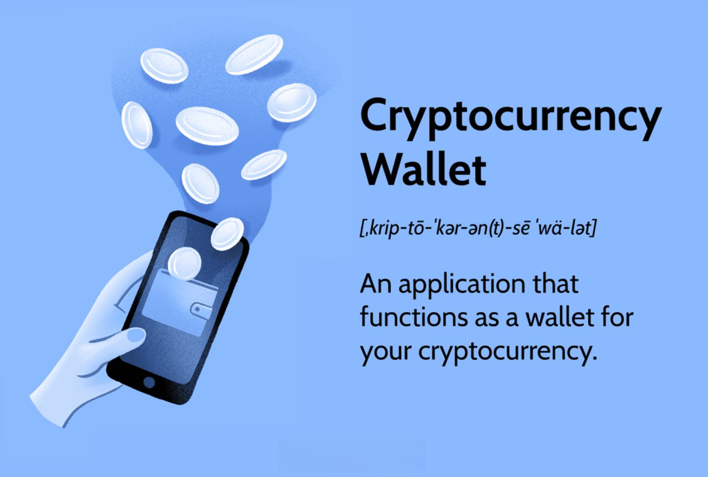

## Table of Contents

## What is a cryptocurrency wallet?

A cryptocurrency wallet is a tool that lets you store, send, and receive digital currencies like Bitcoin and Ethereum. Think of it like a digital bank account, but instead of keeping regular money, it keeps cryptocurrencies. You can have it on your computer, phone, or even a special hardware device.

There are different types of wallets, like software wallets that you download on your device, hardware wallets that are like USB drives, and even paper wallets where you write down your codes on paper. Each type has its own way of keeping your digital money safe. It's important to choose the right one based on how much security you need and how easy you want it to be to use.

To use a cryptocurrency wallet, you need a special set of codes called a private key and a public key. The public key is like your account number that you can share with others to receive money. The private key is like your secret password that you must keep safe. If someone else gets your private key, they can take your cryptocurrencies. So, always make sure to protect your private key!

## What are the basic functionalities of a cryptocurrency wallet?

A [cryptocurrency](/wiki/cryptocurrency) wallet lets you do a few main things with your digital money. You can store different kinds of cryptocurrencies in it, like Bitcoin or Ethereum. It's like having a digital piggy bank where you keep your coins safe. You can also send cryptocurrencies to other people. When you want to pay someone, you just need their wallet address, and you can transfer the money easily.

Another important function is receiving cryptocurrencies. If someone wants to send you digital money, they need your wallet's public address. It's like giving someone your bank account number so they can deposit money into it. Your wallet will show you when you get new money, so you can keep track of it. All these functions make it easy to use cryptocurrencies for everyday things.

## What are the different types of cryptocurrency wallets?

There are several types of cryptocurrency wallets, each with its own way of keeping your digital money safe. Software wallets are one type that you can download on your computer or phone. They are easy to use and let you quickly send and receive cryptocurrencies. But, they can be less secure because if your device gets hacked, someone might steal your money. Another type is hardware wallets, which are like small USB drives that you can plug into your computer. They are much safer because they keep your private keys offline, away from internet hackers. But, they can be a bit harder to use and cost money to buy.

Paper wallets are another option where you print out your private and public keys on paper. They are very secure because they aren't connected to the internet at all. But, if you lose the paper or it gets damaged, you could lose your money forever. There are also online wallets, or web wallets, which you can access through a website. They are convenient because you can use them from any device with internet, but they can be risky because the website could get hacked. Each type of wallet has its own pros and cons, so you need to pick the one that fits your needs best.

## How does a software wallet differ from a hardware wallet?

A software wallet is a program you download on your computer or phone. It's easy to use because you can quickly send and receive cryptocurrencies right from your device. But, it can be less safe because if someone hacks your device, they might steal your money. Software wallets are free to use, which is good, but you need to be careful and keep your device secure.

A hardware wallet, on the other hand, is like a small USB drive that you plug into your computer. It's much safer because it keeps your private keys offline, away from internet hackers. This makes it harder for someone to steal your money. But, hardware wallets can be a bit harder to use because you need to plug them in every time you want to do something with your cryptocurrencies. Also, you have to buy them, so there's a cost involved.

## What is a hot wallet and what is a cold wallet?

A hot wallet is a type of cryptocurrency wallet that is connected to the internet. It's easy to use because you can quickly send and receive digital money. You can find hot wallets on your computer, phone, or even on websites. They are great for everyday use because you can access your money anytime you want. But, because they are online, they can be less safe. If someone hacks the website or your device, they might be able to steal your cryptocurrencies.

A cold wallet, on the other hand, is not connected to the internet. This makes it much safer because hackers can't get to it online. Cold wallets include things like hardware wallets, which are like USB drives, and paper wallets, where you write down your codes on paper. They are good for keeping your cryptocurrencies safe for a long time. But, they can be a bit harder to use because you need to connect them to a device or enter the codes manually when you want to spend your money.

## How do you set up and use a cryptocurrency wallet?

Setting up a cryptocurrency wallet is pretty easy. First, decide what type of wallet you want, like a software wallet on your phone or computer, a hardware wallet, or even a paper wallet. For a software wallet, you can go to the app store on your phone or download it from a website on your computer. Follow the instructions to install it. You'll be asked to create a new wallet, and you'll get a set of words called a recovery phrase. Write this down and keep it safe because it's like a master key to your wallet. If you choose a hardware wallet, you'll need to buy one and then set it up by following the instructions that come with it. For a paper wallet, you can use a website that generates the codes for you, then print them out and keep them safe.

Once your wallet is set up, using it is simple. To receive cryptocurrencies, you'll need to give the person sending you money your wallet's public address. This is like giving someone your bank account number. They'll use this to send you the digital money, and you'll see it show up in your wallet. To send cryptocurrencies, you'll need the public address of the person you're sending to. Enter that address into your wallet, along with the amount you want to send, and confirm the transaction. Your wallet will handle the rest, and the money will be on its way. Always make sure to double-check the addresses and amounts to avoid mistakes.

## What are the security features of cryptocurrency wallets?

Cryptocurrency wallets have different ways to keep your digital money safe. One common way is using a private key and a public key. The private key is like a secret password that you should keep hidden from everyone. It lets you control your money and sign off on transactions. The public key is like your account number that you can share with others to receive money. Wallets also often use encryption to make sure your private key stays safe. Some wallets have extra features like two-[factor](/wiki/factor-investing) authentication, where you need to enter a code sent to your phone before you can do anything with your money. This adds another layer of security to make sure it's really you using the wallet.

Hardware wallets have special security features because they keep your private keys offline. This means they are not connected to the internet, so hackers can't get to them easily. They also have a secure chip inside that makes it hard for anyone to tamper with the wallet. When you want to do something with your money, you plug the hardware wallet into your computer, and it does the work without showing your private key to the internet. Paper wallets are another secure option because they are not connected to the internet at all. You just need to keep the paper safe and not lose it. If you do, you could lose your money forever.

## How can you protect your cryptocurrency wallet from hacks and theft?

Keeping your cryptocurrency wallet safe from hacks and theft is really important. One big way to do this is by keeping your private key secret. Your private key is like a secret password that lets you control your money. If someone else gets it, they can take your cryptocurrencies. So, never share your private key with anyone, and store it in a safe place. If you're using a software wallet, make sure your computer or phone is protected with strong passwords and up-to-date antivirus software. Using two-factor authentication can also help. This means you need to enter a special code sent to your phone before you can do anything with your wallet, making it harder for thieves to get in.

Another way to protect your wallet is by choosing the right type of wallet for your needs. Hardware wallets are very secure because they keep your private keys offline, away from internet hackers. They are great for keeping your money safe over the long term. If you use a software wallet, be careful about where you download it from, and always check if the website is the real one. Scammers can make fake websites that look real but are designed to steal your information. If you use a paper wallet, keep the paper in a safe place, like a locked drawer or a safe. And always, always back up your wallet's recovery phrase and keep it in a different safe place. This way, if something happens to your wallet, you can still get your money back.

## What are the advanced security measures for high-value cryptocurrency storage?

For high-value cryptocurrency storage, using a hardware wallet is a smart choice. These wallets keep your private keys offline, which means they are not connected to the internet. This makes it much harder for hackers to steal your money. Hardware wallets also have a special chip inside that makes them even safer. When you want to move your money, you plug the wallet into your computer, and it does the work without showing your private key to the internet. This way, even if your computer gets hacked, your cryptocurrencies are still safe.

Another good idea is to use multi-signature wallets. These wallets need more than one private key to approve a transaction. You can set it up so that you and someone you trust both have to sign off before you can send your money. This makes it much harder for someone to steal your cryptocurrencies because they would need to get both keys. Also, keeping most of your money in cold storage, like a hardware or paper wallet, and only a small amount in a hot wallet for everyday use can help. This way, even if your hot wallet gets hacked, the thief can only take a little bit of your money.

## How do different types of wallets compare in terms of security and convenience?

Software wallets are easy to use because you can download them on your computer or phone and quickly send and receive cryptocurrencies. They are good for everyday use because you can access your money anytime you want. But, they are not as safe as other types of wallets because they are connected to the internet. If your device gets hacked, someone might be able to steal your money. So, you need to keep your device secure with strong passwords and antivirus software.

Hardware wallets are much safer than software wallets because they keep your private keys offline, away from internet hackers. They are like small USB drives that you plug into your computer when you want to do something with your money. This makes them great for keeping your cryptocurrencies safe over the long term. But, they can be a bit harder to use because you need to plug them in every time, and you have to buy them, so there's a cost involved.

Paper wallets are also very secure because they are not connected to the internet at all. You just print out your private and public keys on paper and keep it safe. If you lose the paper or it gets damaged, you could lose your money forever. They are not as convenient as software or hardware wallets because you have to enter the codes manually when you want to spend your money. Each type of wallet has its own pros and cons, so you need to pick the one that fits your needs best.

## What are the future trends in cryptocurrency wallet technology?

In the future, cryptocurrency wallets might become even easier to use and safer. One trend we might see is more wallets that work on different devices, like your phone, computer, and even smart watches. This means you can use your wallet wherever you are, without needing to [carry](/wiki/carry-trading) anything extra. Also, wallets might start using new ways to keep your money safe, like special codes that only work for a short time or needing more than one person to agree before you can send money. These ideas could make it harder for thieves to steal your cryptocurrencies.

Another thing we might see is wallets that can handle more types of digital money. Right now, some wallets only work with certain cryptocurrencies, but in the future, they might be able to hold all kinds of digital money in one place. This would make it simpler for people to use different cryptocurrencies without needing lots of different wallets. Plus, as more people use cryptocurrencies, wallets might get better at working with regular money and other financial services, making it easier to use your digital money for everyday things.

## How do regulatory environments affect the use and development of cryptocurrency wallets?

Regulatory environments can have a big impact on how people use and develop cryptocurrency wallets. Different countries have different rules about cryptocurrencies, and these rules can make it easier or harder to use them. For example, some countries have strict rules that might make it hard for people to buy and sell cryptocurrencies. This can make people less likely to use cryptocurrency wallets because they might be worried about breaking the law. On the other hand, countries with clear and fair rules can make people feel safer using wallets, which can help more people start using cryptocurrencies.

The way regulations affect wallet development is also important. Developers need to make sure their wallets follow the rules in different countries. This can be hard because the rules can change a lot, and they are different everywhere. Sometimes, strict rules can slow down the development of new wallet features because developers have to spend a lot of time making sure everything is legal. But, when the rules are clear and support cryptocurrencies, it can help developers create better and safer wallets that more people want to use.

## References & Further Reading

[1]: Antonopoulos, A. M. (2017). ["Mastering Bitcoin: Unlocking Digital Cryptocurrencies."](https://books.google.com/books/about/Mastering_Bitcoin.html?id=IXmrBQAAQBAJ) O'Reilly Media.

[2]: Antonopoulos, A. M., & Wood, G. (2018). ["Mastering Ethereum: Building Smart Contracts and DApps."](https://www.amazon.com/Mastering-Ethereum-Building-Smart-Contracts/dp/1491971940) O'Reilly Media.

[3]: Llinares, M., & Lopez de Prado, M. (2018). ["The 10 Reasons Most Machine Learning Funds Fail."](https://papers.ssrn.com/sol3/papers.cfm?abstract_id=3104816) Quantitative Finance, 18(5), 663-673.

[4]: Nakamoto, S. (2008). ["Bitcoin: A Peer-to-Peer Electronic Cash System."](https://nakamotoinstitute.org/library/bitcoin/)

[5]: ["Cryptoassets: The Innovative Investor's Guide to Bitcoin and Beyond"](https://www.amazon.com/Cryptoassets-Innovative-Investors-Bitcoin-Beyond/dp/1260026671) by Chris Burniske and Jack Tatar

[6]: Kharpal, A. (2021). ["Bitcoin Plunges Below $30,000 as China Intensifies Crypto Mining Crackdown."](https://coinmarketcap.com/academy/article/bitcoin-in-2021-the-highs-and-lows) CNBC.

[7]: Narayanan, A., Bonneau, J., Felten, E., Miller, A., & Goldfeder, S. (2016). ["Bitcoin and Cryptocurrency Technologies."](https://press.princeton.edu/books/hardcover/9780691171692/bitcoin-and-cryptocurrency-technologies) Princeton University Press.