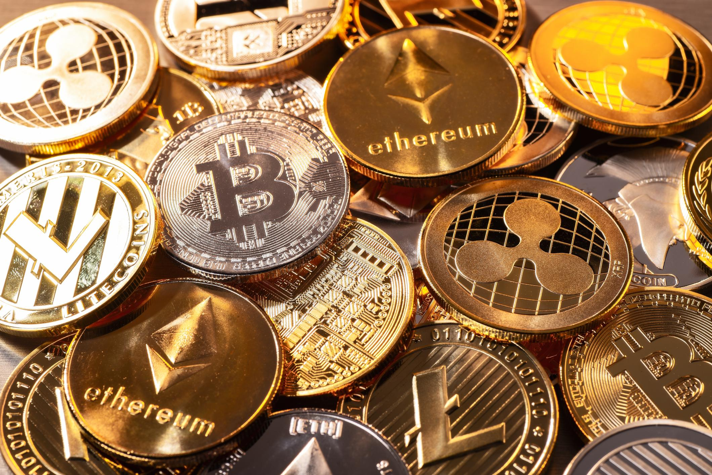

## Table of Contents

## What is a cryptocurrency?

A cryptocurrency is a type of digital money that you can use to buy things online. It is different from regular money because it is not controlled by banks or governments. Instead, it uses a technology called blockchain, which is like a big, secure list of all the transactions that have ever happened. This makes it very hard for anyone to cheat or steal the money.

People can use cryptocurrencies to send money to each other quickly and easily, no matter where they are in the world. Some popular cryptocurrencies include Bitcoin, Ethereum, and Dogecoin. You can buy them on special websites called exchanges, and then you can use them to buy things or trade them for other cryptocurrencies or regular money. While they can be a good way to pay for things, they can also be risky because their value can go up and down a lot.

## How does cryptocurrency work?

Cryptocurrency works using a special technology called blockchain. Imagine a blockchain like a big notebook where every page is a record of money moving from one person to another. Each page is connected to the next one, making a long chain. This notebook is kept safe by lots of computers around the world that all have a copy of it. They work together to make sure nobody can change the records or cheat. When someone wants to send cryptocurrency, their computer tells the other computers, and if everything looks right, the transaction gets added to the notebook.

To use [cryptocurrency](/wiki/cryptocurrency), people need a special kind of wallet, which is like a digital bank account. This wallet has a secret code called a private key, which only the owner knows. When someone wants to send cryptocurrency, they use their private key to sign the transaction, which proves it's really them sending the money. People can get cryptocurrency by buying it on websites called exchanges, where they trade regular money for it. They can then use it to buy things from places that accept it, or they can trade it with other people.

## What was the first cryptocurrency and when was it created?

The first cryptocurrency was Bitcoin. It was created in 2009 by someone using the name Satoshi Nakamoto. Nobody knows for sure who Satoshi Nakamoto really is, but they wrote a special paper explaining how Bitcoin could work.

Bitcoin was made to be a new kind of money that people could use without banks or governments controlling it. It uses a technology called blockchain to keep track of all the money moving around. This makes it very safe and hard to cheat. Since Bitcoin started, many other cryptocurrencies have been created, but Bitcoin is still the most famous one.

## What are the most popular cryptocurrencies?

The most popular cryptocurrencies are Bitcoin, Ethereum, and Dogecoin. Bitcoin is the first and most well-known cryptocurrency. It was created in 2009 and is often called digital gold because people see it as a safe way to store value. Ethereum is another big cryptocurrency that started in 2015. It's special because it lets people build apps and smart contracts on its blockchain. Dogecoin began as a joke in 2013, but it became very popular because it's fun and easy to use.

These three cryptocurrencies are popular for different reasons. Bitcoin is seen as a serious investment and a way to pay for things without using banks. Ethereum is popular because it helps people create new kinds of apps and businesses. Dogecoin became famous partly because of support from famous people like Elon Musk. All three can be bought and sold on special websites called exchanges, and they can be used to buy things from places that accept them.

## How can someone buy cryptocurrencies?

To buy cryptocurrencies, you need to use a special website called an exchange. First, you sign up for an account on the exchange. Then, you add regular money to your account using a bank transfer or a credit card. Once your money is in your exchange account, you can use it to buy cryptocurrencies like Bitcoin, Ethereum, or Dogecoin. You choose which cryptocurrency you want and how much you want to buy, then you place an order. The exchange will match your order with someone who wants to sell, and soon you'll have the cryptocurrency in your exchange account.

After buying the cryptocurrency, you can keep it in your exchange account, but it's safer to move it to a special kind of wallet that only you control. There are different types of wallets, like software wallets on your computer or phone, and hardware wallets that are like little USB drives. To move your cryptocurrency to your wallet, you'll need to send it from your exchange account to your wallet's address, which is like an email address for your cryptocurrency. Once it's in your wallet, you can use it to buy things or trade it with other people.

## What are cryptocurrency wallets and why are they important?

A cryptocurrency wallet is like a digital bank account where you keep your cryptocurrencies safe. It has a special code called a private key, which only you know. This private key is very important because it lets you send your cryptocurrencies to other people. There are different types of wallets, like software wallets that you can use on your computer or phone, and hardware wallets that are like little USB drives. Each wallet has a unique address, which is like an email address for your cryptocurrency. When you want to receive cryptocurrency, you give this address to the person sending it to you.

Wallets are important because they help keep your cryptocurrencies secure. If you keep your cryptocurrencies on an exchange, it's like leaving your money in a bank. While this can be convenient, it can also be risky because exchanges can be hacked or go out of business. By moving your cryptocurrencies to your own wallet, you have more control over them. This is especially important because if you lose your private key or someone else gets it, you could lose all your cryptocurrencies. So, using a wallet is a good way to make sure your digital money stays safe and under your control.

## What is blockchain technology and how is it related to cryptocurrencies?

Blockchain technology is like a big, secure notebook where all the transactions of a cryptocurrency are recorded. Imagine this notebook as a chain of pages, where each page is a record of money moving from one person to another. Every page is connected to the next one, and once something is written on a page, it can't be changed. Lots of computers around the world keep a copy of this notebook and work together to make sure everything is correct. This makes it very hard for anyone to cheat or steal the money because they would need to change the records on all those computers at the same time.

Blockchain is very important for cryptocurrencies because it's what makes them work. When someone wants to send cryptocurrency, their computer tells all the other computers on the blockchain about the transaction. If everything looks right, the transaction gets added to the notebook. This way, everyone can see that the money has moved from one person to another, and no one can spend the same money twice. Without blockchain, cryptocurrencies wouldn't be able to keep track of all the money moving around, and they wouldn't be safe and reliable.

## What are the risks associated with investing in cryptocurrencies?

Investing in cryptocurrencies can be risky because their value can go up and down a lot. One day, a cryptocurrency might be worth a lot of money, and the next day, it could be worth much less. This can happen because of many things, like news about the cryptocurrency, what people think about it, or even what famous people say. If you invest in cryptocurrencies, you could lose money if their value goes down.

Another risk is that cryptocurrencies can be stolen. If someone gets your private key, which is like a secret code to your wallet, they can take all your cryptocurrencies. Also, the websites where you buy and sell cryptocurrencies, called exchanges, can be hacked. If an exchange gets hacked, you could lose the cryptocurrencies you have there. It's important to be careful and use safe ways to keep your cryptocurrencies, like using a hardware wallet.

Lastly, the rules about cryptocurrencies can change. Different countries have different laws about them, and these laws can change over time. If a country decides to make new rules that make it harder to use or own cryptocurrencies, it could affect their value. So, it's good to know about the rules in your country and be ready for them to change.

## How are cryptocurrencies taxed?

When you make money from cryptocurrencies, you might have to pay taxes on it. In many countries, if you sell your cryptocurrencies for more money than you paid for them, you have to pay a tax on the profit you made. This is called capital gains tax. For example, if you bought some Bitcoin for $1,000 and then sold it for $2,000, you would have to pay tax on the $1,000 profit. The rules can be different depending on where you live, so it's a good idea to check the tax laws in your country.

Another way you might have to pay taxes is if you get paid in cryptocurrencies for work or if you get them as a gift. In some places, if you get paid in cryptocurrencies, it's treated like regular money, and you have to pay income tax on it. If someone gives you cryptocurrencies as a gift, you might also have to pay tax on it, but this can depend on the value of the gift and the rules in your country. It's important to keep good records of all your cryptocurrency transactions so you can report them correctly when you do your taxes.

## What is cryptocurrency mining and how does it work?

Cryptocurrency mining is like solving a puzzle to help keep the blockchain safe and working. When someone wants to add a new page to the blockchain notebook, miners use their computers to solve a hard math problem. The first miner to solve the problem gets to add the new page to the notebook and gets some new cryptocurrency as a reward. This process is called mining because it's a bit like digging for gold – you have to work hard to find something valuable.

Mining helps keep the blockchain secure because it makes it very hard for anyone to cheat. If someone wanted to change a transaction on the blockchain, they would have to solve the math problem again for that page and all the pages that come after it. This would take a lot of computer power and time, so it's not easy to do. Miners all over the world work together to keep the blockchain safe, and they get paid in cryptocurrency for their work.

## What are decentralized finance (DeFi) platforms and how do they use cryptocurrencies?

Decentralized finance, or DeFi, platforms are like online banks that use cryptocurrencies instead of regular money. They let people do things like borrow, lend, and trade money without using a regular bank. Instead of a bank controlling everything, DeFi platforms use special computer programs called smart contracts. These smart contracts run on a blockchain, which makes sure everything is safe and fair. Anyone can use DeFi platforms from anywhere in the world, as long as they have some cryptocurrency.

DeFi platforms use cryptocurrencies in many ways. For example, if you want to lend money on a DeFi platform, you put your cryptocurrency into a smart contract. Someone else can then borrow that cryptocurrency from the smart contract, and they pay you back with interest. If you want to trade cryptocurrencies, you can use a DeFi platform to swap one kind of cryptocurrency for another without needing an exchange. Because DeFi platforms are built on blockchains, they can work without anyone being in charge, which can make them more open and fair than regular banks.

## What are the future prospects and potential developments in the field of cryptocurrencies?

The future of cryptocurrencies looks very exciting and full of possibilities. More and more people are starting to use them, and big companies are beginning to accept them as payment. This means that cryptocurrencies might become a normal way to buy things in the future. Also, new kinds of cryptocurrencies and technologies are being created all the time. For example, some people are working on making cryptocurrencies that are better for the environment, because the computers that run the blockchain can use a lot of energy. Others are trying to make it easier and cheaper to use cryptocurrencies, so more people can join in.

Another big thing that could happen is that governments might start making their own cryptocurrencies. Some countries are already thinking about this, and it could change how we think about money. Also, the technology behind cryptocurrencies, called blockchain, could be used for more than just money. It could help keep important records safe and make it easier for people to do business with each other without needing a middleman. As more people learn about cryptocurrencies and how they work, they might become a bigger part of our everyday lives, making the world of finance more open and fair for everyone.

## How does algo trading work?

Algorithmic trading, often referred to as algo trading, involves using computer programs to automate the process of buying and selling financial instruments based on a set of predefined criteria. In the world of cryptocurrencies, [algorithmic trading](/wiki/algorithmic-trading) has become increasingly important due to the high [volatility](/wiki/volatility-trading-strategies) and 24/7 nature of the market. Understanding how algo trading works requires an exploration of its fundamental components: mathematical models, historical data, and the execution of trading strategies.

At the heart of algorithmic trading are mathematical models and statistical analysis. By examining historical data, traders develop statistical models to predict future price movements of cryptocurrencies. This involves analyzing price patterns, market trends, and various indicators. For instance, a simple moving average (SMA) crossover strategy might be used, where a buy signal is generated when a short-term SMA crosses above a long-term SMA. This can be expressed mathematically as:

$$
\text{Buy Signal: } \text{SMA}_{\text{short-term}} > \text{SMA}_{\text{long-term}}
$$

Utilizing these models, algorithms make decisions based on predefined rules without human intervention. Traders often leverage Python libraries like pandas, NumPy, and scikit-learn to develop and test these models. For instance, using historical price data, one can backtest a strategy by writing Python code that simulates trades based on the given model:

```python
import pandas as pd

def moving_average_strategy(data, short_window, long_window):
    signals = pd.DataFrame(index=data.index)
    signals['price'] = data['close']
    signals['short_mavg'] = signals['price'].rolling(window=short_window, min_periods=1).mean()
    signals['long_mavg'] = signals['price'].rolling(window=long_window, min_periods=1).mean()
    signals['signal'] = 0.0
    signals['signal'][short_window:] = np.where(signals['short_mavg'][short_window:] > signals['long_mavg'][short_window:], 1.0, 0.0)
    signals['positions'] = signals['signal'].diff()

    return signals

# Example usage with historical data
data = pd.read_csv('crypto_prices.csv', index_col='Date', parse_dates=True)
signals = moving_average_strategy(data, short_window=40, long_window=100)
```

Trading algorithms can perform various functions, including order execution, [arbitrage](/wiki/arbitrage), and trend trading. Order execution algorithms optimize the timing of trades to minimize market impact and reduce costs. They can execute trades at the optimal time by breaking large orders into smaller, strategically timed quantities.

Arbitrage strategies seek to exploit price discrepancies between different markets or exchanges. For example, if Bitcoin is priced lower on one exchange compared to another, an algorithm can simultaneously buy it on the cheaper exchange and sell it on the pricier one, capitalizing on the price difference.

Trend trading algorithms follow existing market trends, buying when prices are rising and selling when they start to fall. These algorithms use indicators such as moving averages or the Relative Strength Index (RSI) to identify the prevailing direction of the market.

In summary, algo trading in cryptocurrencies is driven by sophisticated mathematical models and statistical analyses. By utilizing historical data and developing precise trading strategies, algorithms can execute trades efficiently and with precision. This automation reduces the likelihood of human error, providing a significant advantage in the fast-paced world of cryptocurrency trading.

## References & Further Reading

[1]: Bergstra, J., Bardenet, R., Bengio, Y., & Kégl, B. (2011). ["Algorithms for Hyper-Parameter Optimization."](https://papers.nips.cc/paper_files/paper/2011/hash/86e8f7ab32cfd12577bc2619bc635690-Abstract.html) Advances in Neural Information Processing Systems 24.

[2]: ["Advances in Financial Machine Learning"](https://www.amazon.com/Advances-Financial-Machine-Learning-Marcos/dp/1119482089) by Marcos Lopez de Prado

[3]: ["Evidence-Based Technical Analysis: Applying the Scientific Method and Statistical Inference to Trading Signals"](https://www.wiley.com/en-gb/Evidence+Based+Technical+Analysis:+Applying+the+Scientific+Method+and+Statistical+Inference+to+Trading+Signals-p-9780470008744) by David Aronson

[4]: ["Machine Learning for Algorithmic Trading"](https://www.amazon.com/Machine-Learning-Algorithmic-Trading-intelligence/dp/9918608013) by Stefan Jansen

[5]: ["Quantitative Trading: How to Build Your Own Algorithmic Trading Business"](https://www.amazon.com/Quantitative-Trading-Build-Algorithmic-Business/dp/0470284889) by Ernest P. Chan