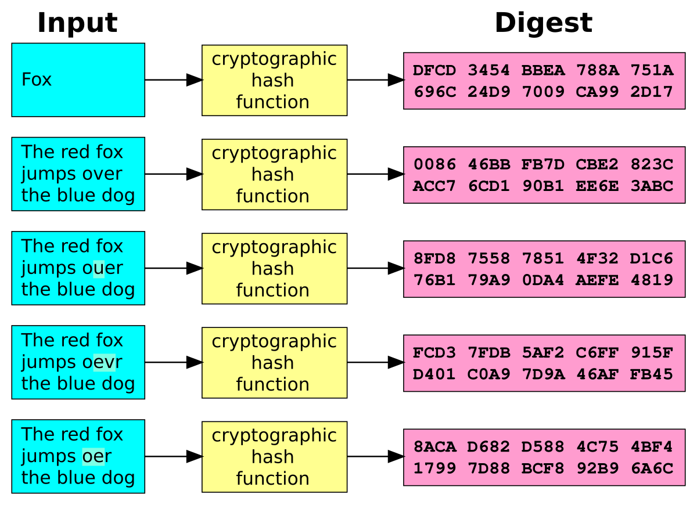

In the fast-evolving world of digital finance and cybersecurity, understanding cryptographic hash functions is crucial. These mathematical algorithms transform input data into a fixed-length string, known as a hash, serving as a fingerprint for the data. This is essential in preserving data integrity and ensuring that information remains secure from unauthorized alterations, particularly significant in trading algorithms where accuracy and reliability are paramount.

Cryptographic hash functions underpin the security infrastructure of digital finance. By verifying the integrity of data, these functions prevent tampering and unauthorized transactions, fostering trust within financial markets. When implementing algorithmic trading systems, the need for fast, secure, and efficient hash algorithms becomes critical. The application of these functions contributes to constructing secure environments in which high-frequency trading can thrive, assuring market participants through reliable verification processes.

In financial markets, hash algorithms are pivotal, building an efficient and trustworthy trading ecosystem. The assurance provided by these algorithms not only strengthens the integrity of transactions but also enhances the overall efficiency of trading platforms. This underscores the importance of cryptographic hash functions in contemporary financial systems, establishing them as vital components in the digital transformation of trading operations. As you explore further, the nuances and profound impact of these algorithms on trading and security in the financial sector become increasingly evident.

## Table of Contents

## What are Cryptographic Hash Functions?

A cryptographic hash function is a mathematical algorithm designed to convert input data into a fixed-length string of characters, commonly referred to as a hash or digest. The primary function is to produce a unique representation of the original data, ensuring that any alteration in the input will lead to a significantly different output, commonly known as the avalanche effect.

The concept of a hash function is predicated on several key properties that enhance its utility in various applications:

1. **Determinism**: For any given input, the hash function must consistently produce the same output. This property is essential for verification processes, as it allows for the repeated generation of the same hash from identical data inputs.

2. **Irreversibility**: A cryptographic hash function is constructed to be a one-way function. This implies that for a given hash output, it should be computationally infeasible to reverse-engineer the original input. This is critical in secure password storage and digital signatures, as the original sensitive data cannot be easily reconstructed from the hash.

3. **Collision Resistance**: Collision resistance ensures that it is infeasible to find two distinct inputs that produce the same hash output. This property is vital for avoiding conflicts in data integrity applications, preventing different data sets from being interpreted as identical.

4. **Pre-image Resistance**: This property ensures that, given a hash output, it should be computationally difficult to find any input that hashes to it. While slightly less stringent than collision resistance, pre-image resistance contributes to the overall security by protecting the original data's confidentiality.

5. **Second Pre-image Resistance**: This property dictates that, given an input and its hash, it should be difficult to find a different input that has the same hash. This feature provides security against certain types of forgery attacks in digital systems.

These inherent properties render cryptographic hash functions highly effective for a multitude of applications, from ensuring data integrity and secure password hashing to verifying information authenticity. They are indispensable in safeguarding information in both traditional cybersecurity contexts and rapidly evolving tech-driven environments, including [algorithmic trading](/wiki/algorithmic-trading) platforms where data accuracy and transaction integrity are paramount.

## Role of Hash Algorithms in Algo Trading

Algorithmic trading, characterized by rapid execution of orders, benefits substantially from the use of cryptographic hash functions to ensure data integrity and enhance security. Cryptographic hashes are crucial in maintaining the integrity of trading data. A hash function transforms financial data into a fixed-length hash value, which acts as a digital fingerprint. If even a single bit of the input data changes, the resulting hash will be drastically different. This property ensures that any alteration in transaction data, whether accidental or malicious, can be quickly detected.

In high-frequency trading ([HFT](/wiki/high-frequency-trading-strategies)) environments, where milliseconds can mean significant financial gains or losses, secure data transfer is paramount. Hash functions facilitate the secure transmission of trades across networks by providing a mechanism to quickly verify data integrity. Traders use hash functions to guarantee that transaction details have not been altered during transmission. Each trade's data packet can be hashed, and by independently computing the hash of the received data, the recipient can verify its authenticity and integrity.

Moreover, cryptographic hash functions play a key role in maintaining accurate audit trails in algorithmic trading. Each transaction's hash can be stored in a ledger, providing a verifiable history of trades. This creates a transparent and accountable system, which is critical for regulatory compliance and resolving disputes. The immutability property of hashes ensures that once a trade is logged, it cannot be altered without detection, thus maintaining the integrity of financial records.

Additionally, by efficiently managing data, hash functions contribute to optimizing the speed and security of trading mechanisms. They allow for quick verification processes, enabling traders to devote more computational resources to executing and analyzing trades rather than solely securing transactional data. This efficiency is particularly beneficial given the sheer [volume](/wiki/volume-trading-strategy) and velocity of trades in modern markets.

Overall, while the primary purpose of hash functions in algorithmic trading is to provide integrity and security, their impact extends to improving auditability and operational efficiency, thereby fostering trust and expedience in financial markets.

## Popular Cryptographic Hash Algorithms

Various cryptographic hash algorithms have been developed, each offering specific features and applications tailored to different security needs. Among these, SHA-256 and SHA-3 stand out due to their robustness and widespread use in the industry.

**SHA-256** is a member of the SHA-2 family of cryptographic hash functions designed by the National Security Agency (NSA). It generates a 256-bit hash value, making it a critical tool in security applications such as digital signatures, certificate authorities, and blockchain technologies. Its design incorporates a series of 64 iterations of bitwise operations, modular additions, and compression functions to achieve a secure and irreversible output. Due to its proven security strength, SHA-256 is a preferred choice in environments where both security and efficiency are paramount.

**SHA-3**, defined by the National Institute of Standards and Technology (NIST) in 2015, serves as an alternative to SHA-2. Its development followed an open competition to address potential vulnerabilities in SHA-2 against future quantum attacks. SHA-3 is based on the Keccak algorithm, which employs a sponge construction. This design provides flexibility in output length and enhances resistance to certain types of attacks, making SHA-3 a strong candidate for future-proof security solutions.

**MD5**, another hash algorithm, was widely used in the past. However, due to identified vulnerabilities that allow for collision attacks—where two distinct inputs produce the same hash output—MD5 is now considered insecure for cryptographic purposes. Despite this, it remains in use for checksums and data verification in non-critical systems where security is not a primary concern.

When selecting a cryptographic hash algorithm for algorithmic trading, the decision must account for the specific security needs and constraints of the trading platform. For instance, while SHA-256 offers a good balance of speed and security, SHA-3 provides additional layers of protection that might be necessary for systems planning for long-term security against evolving threats like quantum computing. Meanwhile, MD5 might still be of use for non-sensitive data verification due to its speed and simplicity, provided the security risk is acceptable.

In conclusion, the appropriate choice of a cryptographic hash algorithm significantly influences the reliability and security of algorithmic trading systems. The decision should reflect a careful consideration of the system's performance requirements and the evolving landscape of cybersecurity threats.

## Challenges of Implementing Cryptographic Hashes in Trading

Integrating cryptographic hash functions into trading systems, particularly in high-frequency trading (HFT) environments, involves navigating several challenges related to performance and security. These challenges stem from the intrinsic nature of cryptographic processes and their interaction with the fast-paced demands of financial markets.

One of the primary challenges is the performance overhead introduced by cryptographic algorithms. High-frequency trading requires the rapid execution of transactions, often measured in microseconds. Cryptographic hash functions, while essential for ensuring data integrity and security, can add significant computational load, potentially slowing down transaction processing. This delay is problematic in HFT, where even nanoseconds can impact profitability. Therefore, striking a balance between implementing robust cryptographic measures and maintaining speed is crucial.

Security and performance must be balanced carefully, as more secure algorithms tend to require greater computational resources. Advanced cryptographic hash functions like SHA-256 are secure but can be computationally expensive to implement, particularly when applied to large data sets typical in trading contexts. Although less secure, faster algorithms might not provide the necessary level of protection against sophisticated cyber threats. Financial institutions must thus determine the most appropriate hash function based on a thorough risk assessment, considering both performance constraints and security requirements.

Regular updates and audits are vital to ensuring the continued effectiveness of cryptographic hashes. The dynamic nature of cybersecurity threats means that what is considered secure today may not be secure tomorrow. This necessitates continuous monitoring and updating of cryptographic practices to fend off new vulnerabilities. Audits help verify that the implemented hash functions remain effective against current threats, thereby maintaining the integrity of trading operations.

Ultimately, financial institutions need strategic evaluation and planning when implementing cryptographic solutions. This includes assessing the scalability of cryptographic measures to support evolving operational needs and ensuring interoperability with existing systems. Institutions should also consider the potential impact of future technological advancements, such as quantum computing, which could render current cryptographic standards obsolete. Therefore, forward-thinking strategies and investments in research and development of quantum-resistant algorithms are recommended to safeguard against these emerging threats.

In conclusion, while cryptographic hash functions are indispensable for securing trading systems, their integration presents challenges that require meticulous planning and balanced implementation strategies.

## Future Trends and Developments

The field of cryptographic hash functions is experiencing rapid evolution, driven by the need for enhanced security and efficiency in digital transactions. As the landscape of cybersecurity changes, particularly in algorithmic trading, these functions are being adapted and developed to meet emerging demands. One of the most significant drivers of change in cryptography is the anticipated impact of quantum computing. Current cryptographic standards, many of which rely on the difficulty of certain mathematical problems for security, may become vulnerable with the advent of quantum computing. Quantum computers have the potential to efficiently solve problems that are currently considered intractable, posing a threat to traditional cryptographic algorithms.

To counteract this threat, research into quantum-resistant hash functions is underway. These are cryptographic primitives designed to remain secure against attacks from quantum computers. Quantum-resistant hashes leverage mathematical problems believed to be hard even for quantum computers, ensuring their continued validity as secure tools in algorithmic trading. For instance, hash-based signatures, lattice-based cryptography, and multivariate polynomial cryptography are some areas explored for quantum resilience.

Beyond quantum resistance, technological advancements are likely to enhance the speed and security of cryptographic hash algorithms used in trading. The development of more efficient hash computation techniques could reduce latency in high-frequency trading environments, where speed is critical. Additionally, algorithms are being optimized for parallel processing capabilities of modern hardware, enabling faster and more secure data handling processes.

For financial markets, understanding and anticipating advancements in cryptography is essential. As cybersecurity threats evolve and computational capabilities increase, staying informed of technological progress allows institutions to proactively adopt more robust cryptographic measures. The integration of sophisticated cryptographic solutions into future trading algorithms is expected to address new challenges. These solutions will likely capitalize on the strengths of several emerging cryptographic paradigms to ensure data integrity, confidentiality, and authenticity in financial transactions.

In summary, the future of cryptographic hash functions is closely tied to emerging technologies and the evolving threat landscape. As the financial sector seeks to maintain secure systems amidst these changes, cryptographic innovation will be a cornerstone of effective risk management.

## Conclusion

Cryptographic hash functions are essential in ensuring secure digital transactions and efficient algorithmic trading. These functions, through their inherent properties of data integrity and authenticity, enable the verification and processing of trading data, thereby safeguarding sensitive financial information. By comprehensively understanding and effectively utilizing cryptographic hashes, trading systems can achieve enhanced security and operational efficiency.

As financial technology continues to progress, the dependence on robust cryptographic solutions is expected to grow. This ongoing evolution in cryptographic algorithms requires continued vigilance and adaptability within financial institutions. By staying abreast of these advancements, market participants can maintain both the security and success of their trading operations in an ever-changing landscape.

## References & Further Reading

[1]: Menezes, A. J., van Oorschot, P. C., & Vanstone, S. A. (1996). ["Handbook of Applied Cryptography."](https://www.taylorfrancis.com/books/mono/10.1201/9780429466335/handbook-applied-cryptography-alfred-menezes-kenneth-rosen-scott-vanstone-paul-van-oorschot) CRC Press.

[2]: Bellare, M., & Rogaway, P. (1993). ["Random Oracles are Practical: A Paradigm for Designing Efficient Protocols."](https://dl.acm.org/doi/10.1145/168588.168596) Proceedings of the First Annual Conference on Computer and Communications Security.

[3]: Rivest, R. L. (1992). ["The MD5 Message-Digest Algorithm."](https://archive.org/details/rfc1321) IETF RFC 1321.

[4]: Preneel, B. (1998). ["The State of Cryptographic Hash Functions."](https://link.springer.com/chapter/10.1007/3-540-48969-X_8) Lecture Notes in Computer Science, 1423.

[5]: Bertoni, G., Daemen, J., Peeters, M., & Van Assche, G. (2011). ["Keccak."](https://link.springer.com/content/pdf/10.1007/978-3-642-38348-9_19.pdf) Available at: https://keccak.team/keccak_specs_summary.html