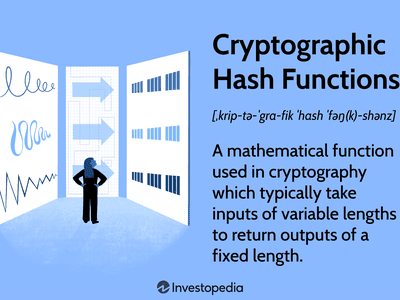

Cryptography, blockchain, and cryptocurrency are integral components that have significantly reshaped the landscape of the digital world. These interconnected technologies provide the foundational backbone for a new era of secure, decentralized, and transparent transactions. Cryptography ensures the confidentiality and integrity of information, playing a pivotal role in safeguarding data across various digital platforms. As the science of encoding and decoding information, it is essential for maintaining the security protocols that underpin blockchain and cryptocurrency technologies.

Blockchain technology itself, a decentralized distributed ledger, enables secure and immutable record-keeping. This innovation supports cryptocurrencies like Bitcoin, allowing for peer-to-peer transactions without intermediaries. It has expanded beyond financial transactions, now being utilized in areas such as supply chain management, healthcare, and beyond, due to its ability to provide transparency and enhance operational efficiencies.



Cryptocurrency, a digital asset leveraging cryptography for security, presents a novel financial paradigm distinct from traditional banking systems. Its decentralized nature facilitates global transactions at reduced costs and increased speeds, offering an alternative method of financial inclusion. The rapid rise of various cryptocurrencies has not only impacted financial markets but also prompted discussions on regulation and market volatility.

Algorithmic trading, a modern approach in the financial markets, harnesses the power of complex algorithms and high-speed data processing to execute trades quickly and efficiently. This form of trading leverages advancements in cryptographic techniques and blockchain technology to improve market liquidity and enhance the precision of trading strategies.

The synergies between these technologies are significant in today’s financial landscape, offering new avenues for innovation, efficiency, and inclusiveness. As cryptography provides the security framework, blockchain assures transparency and reliability, while cryptocurrencies redefine value exchange. Together with algorithmic trading, they form a dynamic ecosystem that is shaping the future of finance and other industries. Understanding these interconnections and their implications is crucial as they continue to disrupt traditional paradigms and offer new possibilities in multiple sectors worldwide.

## Table of Contents

## Understanding Cryptography

Cryptography is the discipline centered on securing communications and protecting information through the use of codes. This function is critical in the digital age to safeguard data integrity and confidentiality. Historically, cryptography dates back several centuries, with its roots in techniques like manual cipher systems used by ancient civilizations. The evolution from simple encryption practices to complex digital encryption marks a significant chapter in its history. Modern cryptography emerged with the development of algorithms enabling secure digital communications and transactions.

In contemporary applications, cryptography serves as a fundamental component of blockchain technology. Blockchain relies on cryptographic protocols to ensure that records remain secure and tamper-proof. Specifically, this technology uses cryptographic hash functions to link blocks of data securely. A hash function takes an input and produces a fixed-size string of bytes, independent of the size of the input. For example, the SHA-256 algorithm, frequently used in blockchain, produces a 32-byte hash value from any input length, ensuring data integrity and consistency across the blockchain ledger.

Cryptographic techniques integral to cryptocurrencies include asymmetric key cryptography and digital signatures, which facilitate secure financial transactions. Asymmetric key cryptography, or public-key cryptography, uses a pair of keys – a public key and a private key – for encryption and decryption. In Bitcoin, for example, this system allows users to receive payments through their public key, while the corresponding private key enables them to authorize spending.

Digital signatures, another core cryptographic feature, ensure the authenticity and non-repudiation of transactions. By mathematically linking a message or transaction to a user's private key, digital signatures provide proof that the transaction has not been altered since signing. Cryptocurrencies leverage these signatures within consensus protocols to validate transaction authenticity before updating their distributed ledgers.

Cryptography's role in blockchain networks extends further by providing mechanisms for secure network participation and transaction verification. Consensus algorithms, such as Proof of Work (PoW) and Proof of Stake (PoS), use cryptographic methods to achieve distributed consensus without a central authority. This decentralization enhances security by reducing single points of failure and vulnerability to attacks.

Overall, cryptography's ability to protect information and ensure trust has made it an indispensable part of digital currency frameworks and blockchain systems. As advancements in cryptographic techniques continue, their integration into these technologies promises to offer increasingly robust security measures essential for the ongoing evolution and adoption of digital financial systems.

## Blockchain Technology Explained

Blockchain is a decentralized distributed ledger technology that enables secure and transparent record-keeping by creating immutable records. At its core, blockchain operates as a chain of blocks that store data chronologically, each block containing a list of transactions. This mechanism is foundational to cryptocurrencies like Bitcoin, offering a secure way to track transactions without the need for intermediaries. The decentralized nature of blockchain ensures that no single entity has control over the entire network, thus enhancing the security and trustworthiness of the data.

## Components and Functioning of Blockchain
A typical blockchain consists of several key components:

1. **Block**: Each block holds a collection of transactions and a unique identifier called a hash. It also contains the hash of the previous block, ensuring all blocks are linked.

2. **Nodes**: These are the individual computers that participate in the blockchain network. Each node maintains a copy of the entire blockchain, contributing to its decentralization.

3. **Consensus Mechanism**: To ensure all copies of the blockchain are the same, the network uses consensus algorithms like Proof of Work (PoW) or Proof of Stake (PoS). These mechanisms validate new transactions and add them to the blockchain.

4. **Smart Contracts**: These are self-executing contracts with the terms directly written into code. They automate processes and facilitate transactions without intermediaries.

The blockchain always verifies new transactions through these components before adding them to a block. Once validated, the block is added to the chain in a manner that secures it against modification. The chain's length continues to grow, encompassing every block validated since the genesis block.

## Applications Beyond Cryptocurrency
While blockchain technology is synonymous with cryptocurrencies, it has applications far beyond digital currencies:

- **Supply Chain Management**: Blockchain provides an immutable ledger, enhancing transparency and traceability across complex supply chains. For instance, it allows tracking the journey of food products from farm to table, ensuring safety and quality.

- **Healthcare**: Patient records can be securely stored and shared among authorized healthcare providers, improving data privacy and treatment efficiency.

- **Financial Services**: Blockchain enables instant cross-border transactions without banks, reducing time and costs associated with traditional banking methods.

- **Voting Systems**: Blockchain can ensure transparent and tamper-proof elections by recording votes on an immutable ledger.

## Security and Efficiency
Blockchain's security comes from its decentralized nature and cryptographic techniques. As no single point of failure exists, the network is resilient to attacks. Additionally, as each transaction is encrypted and linked to the preceding transaction, tampering becomes impractically difficult.

Moreover, blockchain enhances efficiency by eliminating intermediaries and automating processes. This reduction in manual oversight not only speeds up transactions but also significantly lowers operational costs.

In summary, blockchain technology is a transformative force with applications spanning numerous industries. Its ability to provide secure, transparent, and tamper-proof solutions is paving the way for innovations that extend well beyond finance, into sectors like supply chain management, healthcare, and beyond.

## The Rise of Cryptocurrency

Cryptocurrency represents a transformative shift in the landscape of finance, primarily characterized by its virtual form and reliance on cryptographic techniques for security. Bitcoin, introduced in 2009 by the pseudonymous entity Satoshi Nakamoto, stands as the pioneering [cryptocurrency](/wiki/cryptocurrency), setting a precedent for a multitude of digital currencies that followed. Unlike traditional fiat currencies regulated by centralized banks and governments, cryptocurrencies operate on decentralized networks, usually built on blockchain technology. This decentralization removes intermediaries, allowing for peer-to-peer transactions that promise increased financial inclusivity and autonomy.

The emergence of cryptocurrencies introduced a novel economic model that challenges conventional banking systems. With no central authority governing them, cryptocurrencies offer an alternative to the fiat currency system, cultivating a growing ecosystem of decentralized finance (DeFi) applications. These decentralized platforms enable individuals to engage in lending, borrowing, and trading without traditional banks, fostering a more accessible financial environment.

The rise of cryptocurrencies can be attributed not only to technological innovation but also to their growing adoption across various sectors. During the late 2010s and early 2020s, several major companies began accepting Bitcoin as a form of payment, legitimizing its use in everyday transactions. Additionally, institutional interest surged, with leading financial entities including cryptocurrencies in their investment portfolios. This growing acceptance underscores cryptocurrencies' potential to integrate more deeply into the financial fabric of society.

However, the path to mainstream adoption is fraught with challenges. Volatility remains a significant concern, with cryptocurrency markets experiencing rapid price swings that can deter both individual and institutional investors. Regulatory uncertainty also poses a hurdle, as governments worldwide navigate creating frameworks that will safeguard investors without stifling innovation. The debate over environmental impacts, primarily concerning the energy consumption of proof-of-work mining processes like those used by Bitcoin, further complicates their acceptance.

Looking ahead, the future of cryptocurrency is replete with possibilities and innovations. Projects exploring proof-of-stake mechanisms, which vary in energy efficiency and network security, are gaining traction as more sustainable alternatives to proof-of-work. The evolution of Layer 2 solutions aims to address scalability issues by enabling faster and cheaper transactions. Moreover, the integration of smart contracts and interoperability between blockchains continues to expand the utility of cryptocurrencies beyond simple value transfer to a realm comprising comprehensive decentralized applications.

As technological advancements unfold and regulatory landscapes stabilize, cryptocurrencies are poised to play an integral role in the future of global finance. They represent not only a shift in the way transactions are conducted but also in how financial systems are structured, encouraging a move towards transparency, efficiency, and democratization in financial dealings.

## Algorithmic Trading: An Overview

Algorithmic trading, often referred to as algo trading, employs computer algorithms to automate the process of trading financial instruments, executing trades at the most opportune times to maximize profits or minimize costs. The essential purpose of [algorithmic trading](/wiki/algorithmic-trading) is to enhance trading efficiency and market [liquidity](/wiki/liquidity-risk-premium). This form of trading has gained significant traction in modern financial markets due to its ability to handle large volumes of trades with precision and speed, attributes highly valued in today's fast-paced trading environments.

The surge in algorithmic trading is largely attributed to technological advancements that have transformed financial markets. The continuous evolution of computers and telecommunications technology has facilitated the rapid analysis and execution of trading strategies. High-frequency trading ([HFT](/wiki/high-frequency-trading-strategies)), a subset of algorithmic trading, exemplifies the need for speed, carrying out trades within fractions of a second to exploit minute market inefficiencies.

Various algorithmic trading strategies range from simple to highly complex. Basic strategies might include implementing rules for [arbitrage](/wiki/arbitrage) or [trend following](/wiki/trend-following), while more sophisticated quantitative models incorporate statistical analysis, [machine learning](/wiki/machine-learning), and computational finance techniques to predict price movements and optimize trading decisions. For example, [statistical arbitrage](/wiki/statistical-arbitrage) models use historical price correlations to construct portfolios aimed at achieving alpha (excess returns) by betting that prices will revert to their historical mean.

The incorporation of big data and [artificial intelligence](/wiki/ai-artificial-intelligence) (AI) further refines algorithmic trading. By leveraging vast data sets, algorithms identify patterns and predict future price movements with increasing accuracy. Machine learning models, such as neural networks, are trained on historical data to forecast asset price trends. These models continually learn and adapt, improving their predictive performance over time. For instance, a basic machine learning model in Python might involve:

```python
from sklearn.model_selection import train_test_split
from sklearn.ensemble import RandomForestClassifier
import pandas as pd

# Load and prepare data
data = pd.read_csv('market_data.csv')
X = data.drop('target', axis=1)
y = data['target']

# Divide data into training and testing set
X_train, X_test, y_train, y_test = train_test_split(X, y, test_size=0.2, random_state=42)

# Initialize and train model
model = RandomForestClassifier(n_estimators=100, random_state=42)
model.fit(X_train, y_train)

# Model evaluation
accuracy = model.score(X_test, y_test)
print(f"Model Accuracy: {accuracy}")
```

Despite its advantages, algorithmic trading is not without risks, particularly in volatile markets. The speed and [volume](/wiki/volume-trading-strategy) of trades can exacerbate market fluctuations, potentially leading to flash crashes—sudden and severe market price declines. Additionally, reliance on algorithms raises concerns about systemic risks, should the models fail or behave unpredictably due to unforeseen market conditions.

Moreover, algorithms programmed with biased data or flawed logic can perpetuate or amplify market inefficiencies. Therefore, thorough [backtesting](/wiki/backtesting) and continuous monitoring are crucial to mitigate these risks and ensure robustness under various market conditions.

In conclusion, algorithmic trading represents a paradigm shift in how modern financial markets operate, driven by technological innovations and the demand for rapid, data-driven decision-making. While offering numerous benefits, it requires careful consideration of the associated risks, underscoring the importance of rigorous design and oversight in its implementation.

## Integration of Blockchain and Cryptocurrency in Algo Trading

Combining blockchain technology and cryptocurrencies with algorithmic trading has introduced new possibilities and challenges, enhancing the efficiency and security of trading systems while also paving the way for innovative financial products.

Smart contracts and decentralized finance (DeFi) are key components transforming trade execution and settlement processes. Smart contracts are self-executing contracts with terms directly written into code, which automatically enforce and facilitate agreements once conditions are met. These eliminate the need for intermediaries, reducing costs and increasing transaction speed. DeFi extends these benefits by creating decentralized financial systems on blockchain networks, offering services such as lending, borrowing, and trading without traditional financial institutions. This shift allows for enhanced liquidity and access to financial markets, democratizing trading activities for a broader audience.

Crypto trading bots represent another advancement. These automated programs execute trades based on predefined strategies and market conditions, leveraging the 24/7 nature of cryptocurrency markets. By analyzing vast amounts of data and employing machine learning algorithms, these bots offer traders the ability to react swiftly to market changes, potentially increasing profitability. However, they also amplify market [volatility](/wiki/volatility-trading-strategies) as they execute large volumes of trades in a short time, sometimes leading to significant price swings.

Blockchain technology offers notable security benefits to algorithmic trading platforms, minimizing fraud risks and enhancing trust. The immutability and transparency of blockchain transactions provide a verifiable audit trail, making it difficult for malicious activities to occur undetected. This security is augmented by the decentralized nature of blockchain, reducing the vulnerability to single points of failure and cyber-attacks.

Looking ahead, potential future developments in this integration include more sophisticated AI-driven trading systems that fully leverage the decentralized nature and security features of blockchain. These systems may incorporate advanced predictive analytics and quantum computing capabilities, optimizing trading strategies beyond current limits. Additionally, the increasing adoption of DeFi could lead to the creation of more complex financial instruments, further blurring the lines between traditional finance and digital assets.

As these technologies converge, they promise to reshape the financial landscape, offering increased accessibility, efficiency, and security while posing regulatory challenges and necessitating adaptive strategies from market participants.

## The Future of Cryptography, Blockchain, Cryptocurrency, and Algo Trading

As the digital landscape continues to evolve, the future of cryptography, blockchain, cryptocurrency, and algorithmic trading promises significant transformations and innovations. 

A crucial aspect of this future is the regulatory environment, which will play a pivotal role in shaping the adoption and innovation of these technologies. Governments and regulatory bodies are increasingly interested in developing frameworks to govern the use of cryptocurrencies and blockchain technology. Balanced regulations could stimulate innovation by providing a secure environment for investments while protecting consumers from potential risks associated with these emerging technologies. However, overly stringent regulations might stifle creativity and discourage companies from exploring blockchain-based solutions.

Quantum computing stands as another influential [factor](/wiki/factor-investing) with the potential to redefine the security landscape of cryptography and blockchain. Quantum computers, by leveraging principles of quantum mechanics, could theoretically solve complex mathematical problems that underpin current cryptographic systems at unprecedented speeds. This capability threatens to render many existing encryption methods obsolete. To counteract this, research into quantum-resistant cryptographic algorithms is gaining [momentum](/wiki/momentum). These efforts aim to ensure that data confidentiality and integrity are maintained, even in a post-quantum computing era.

The integration of decentralized applications in finance, often referred to as decentralized finance (DeFi), is likely to become more pervasive. DeFi platforms leverage smart contracts on blockchain networks to facilitate peer-to-peer financial interactions without traditional intermediaries. This evolution could democratize access to financial services, making them more inclusive and efficient. As more decentralized applications emerge, they could potentially disrupt traditional financial infrastructures, providing users with greater control over their assets and a wider array of financial instruments.

Algorithmic trading is poised to benefit from these advancements through enhanced security features enabled by blockchain technology, such as tamper-proof records and transparent audit trails. The use of blockchain in trading systems can reduce the risk of fraud and enhance trust among market participants. Meanwhile, the development of crypto trading bots and AI-driven algorithms could significantly impact the cryptocurrency markets, providing more sophisticated tools for managing trades.

Overall, the confluence of cryptography, blockchain, cryptocurrency, and algorithmic trading holds the potential to dramatically reshape industries globally. We anticipate continued innovation and disruption across various sectors, driven by advances in technology and changing regulatory landscapes. This transformative journey emphasizes the need for stakeholders to stay informed and adapt to leverage these technologies effectively. As we embrace these changes, the promise of enhanced security, transparency, and efficiency becomes an attainable reality, underpinning a new era of digital and financial revolution.

## Conclusion

Cryptography, blockchain, cryptocurrency, and algorithmic trading are at the forefront of technological advancements reshaping digital and financial ecosystems. These technologies, individually and synergistically, are poised to redefine economic structures both locally and globally. As they develop, they promise unprecedented levels of security, efficiency, and transparency, fundamentally altering how industries operate and interact.

The integration of cryptography with blockchain technology provides robust security frameworks that protect data integrity and user privacy. This is crucial in financial transactions, where cryptographic algorithms ensure that sensitive information remains confidential and tamper-proof. Blockchains' decentralized nature eliminates dependence on central authorities, enabling peer-to-peer networks that are resilient against single points of failure and manipulation.

Cryptocurrencies, born out of this secure and decentralized foundation, offer a new financial paradigm. As adoption increases, they facilitate global transactions unhindered by traditional banking constraints. The decentralized finance (DeFi) movement further exemplifies the utility of these digital currencies, allowing for innovative financial services like lending, borrowing, and trading without conventional intermediaries.

Algorithmic trading benefits significantly from these technologies by leveraging blockchain's transparency and cryptocurrencies' rapid transaction capabilities. Algorithms can execute trades with precision and speed, navigating market fluctuations with enhanced data analysis. The inclusion of blockchain in these systems ensures greater security and reduces instances of fraud, fostering trust among market participants.

As these technologies continue their progressive trajectory, staying informed and adaptable is essential for individuals and enterprises aiming to capitalize on their benefits. They are no longer nascent elements of the future; rather, they form a critical part of our present reality, continuously reshaping industries and setting new standards for innovation and efficiency.

## References & Further Reading

[1]: Antonopoulos, A. M. (2017). ["Mastering Bitcoin: Unlocking Digital Cryptocurrencies."](https://books.google.com/books/about/Mastering_Bitcoin.html?id=IXmrBQAAQBAJ) O'Reilly Media.

[2]: Narayanan, A., Bonneau, J., Felten, E., Miller, A., & Goldfeder, S. (2016). ["Bitcoin and Cryptocurrency Technologies: A Comprehensive Introduction."](https://press.princeton.edu/books/hardcover/9780691171692/bitcoin-and-cryptocurrency-technologies) Princeton University Press.

[3]: Mougayar, W. (2016). ["The Business Blockchain: Promise, Practice, and Application of the Next Internet Technology."](https://books.google.com/books/about/The_Business_Blockchain.html?id=CEsPDAAAQBAJ) Wiley.

[4]: Tapscott, D., & Tapscott, A. (2016). ["Blockchain Revolution: How the Technology Behind Bitcoin Is Changing Money, Business, and the World."](https://archive.org/details/blockchainrevolu0000taps) Penguin.

[5]: Lewis, M. (2014). ["Flash Boys: A Wall Street Revolt."](https://en.wikipedia.org/wiki/Flash_Boys) W. W. Norton & Company.