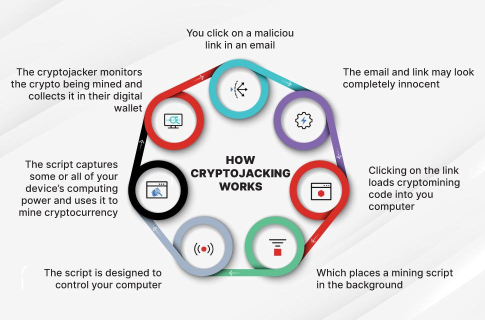

## Table of Contents

## What is cryptojacking?

Cryptojacking is when hackers secretly use your computer or phone to make digital money called cryptocurrency. They do this without you knowing, by putting special software on your device. This software uses your device's power to solve math problems that create cryptocurrency, which the hackers can then take for themselves.

This can slow down your device and use up a lot of electricity. It's a problem because it's like someone borrowing your things without asking and using them for their own benefit. To avoid cryptojacking, it's important to keep your device safe with good security software and be careful about what you click on or download from the internet.

## How does cryptojacking work?

Cryptojacking happens when bad people put a special program on your computer or phone without you knowing. This program uses your device's power to solve hard math problems. When these problems are solved, they create a type of digital money called cryptocurrency. The bad people who put the program on your device get to keep this money, not you.

This special program can get onto your device in different ways. It might come from a website you visit, an email you open, or something you download. Once it's on your device, it works quietly in the background, using your computer's energy to make money for the hackers. This can make your device run slower and use more electricity, but you might not even notice it's happening.

## What are the common methods used to spread cryptojacking malware?

Bad people use different tricks to put cryptojacking malware on your computer or phone. One common way is through websites. They might hide the malware in the code of a website, so when you visit, it starts using your device to make money without you knowing. Another way is through emails. They might send you an email with a link or an attachment that looks safe, but when you click or open it, the malware gets onto your device.

They also use fake software downloads to spread cryptojacking malware. You might think you're downloading a useful program, but it actually contains the bad software. Sometimes, they even take over real websites and add the malware to them without the website owners knowing. This makes it hard to tell which websites are safe and which ones are not.

To protect yourself, it's important to be careful online. Don't click on links or download things from emails you don't trust, and make sure your computer has good security software that can find and stop these bad programs.

## What are the signs that a device might be infected with cryptojacking malware?

If your device is slower than usual, it might be a sign that it's infected with cryptojacking malware. This malware uses your computer's power to make money, which can make everything you do on your device take longer. You might notice that it takes a long time to open programs, switch between tabs, or even just to move your mouse.

Another sign is if your device is getting hot or if your fans are running more than usual. When the malware is working hard to make money, it makes your device work harder too, which can cause it to heat up. Also, if you see your battery draining faster than normal, it could be because the malware is using up a lot of power. If you notice any of these things, it's a good idea to check your device for malware and take steps to protect it.

## How can individuals protect themselves from cryptojacking?

To protect yourself from cryptojacking, make sure your computer or phone has good security software. This software can find and stop bad programs that try to use your device to make money. It's also important to keep your security software updated so it can catch the newest tricks that bad people use. Be careful when you're online. Don't click on links or download things from emails you don't trust, and be careful about the websites you visit.

Another way to stay safe is to keep your device's software up to date. When companies find problems in their software, they fix them with updates. If you don't update, your device might be easier for bad people to trick. You can also use special browser extensions that stop websites from using your device's power without asking. By being careful and using the right tools, you can help keep your device safe from cryptojacking.

## What are the legal implications of cryptojacking?

Cryptojacking is against the law because it's like stealing. When someone uses your computer or phone to make money without asking, they're taking something that belongs to you—your device's power and your electricity. In many places around the world, this is considered a crime. People who get caught doing cryptojacking can face big punishments, like fines or even going to jail.

The laws about cryptojacking can be different depending on where you live. Some countries have special laws that say you can't use someone else's computer without their permission. Other places might not have specific laws about cryptojacking, but they still have rules against stealing and hacking that can be used to punish people who do it. If you think your device has been used for cryptojacking, you should tell the police or another group that helps with computer crimes.

## How does cryptojacking impact the performance of a device?

Cryptojacking can slow down your device a lot. When bad people use your computer or phone to make money, they make it do extra work. This extra work can make everything you do on your device take longer. You might notice that it takes more time to open programs, switch between tabs, or even just to move your mouse. It's like your device is trying to do two jobs at once, and it can't keep up.

Your device might also get hot or the fans might run more than usual. When the bad software is working hard to make money, it makes your device work harder too. This can cause it to heat up. You might also see your battery draining faster than normal because the software is using up a lot of power. All these things can make your device less fun and useful to use.

## What are the differences between cryptojacking and other types of malware?

Cryptojacking is different from other types of malware because it uses your computer's power to make digital money called [cryptocurrency](/wiki/cryptocurrency). Other malware, like viruses or ransomware, might steal your information, lock your files, or mess up your computer in other ways. Cryptojacking works quietly in the background, trying not to get noticed, while other malware might show you scary messages or make big changes to your computer.

Another difference is that cryptojacking doesn't usually aim to harm your device or steal your personal information directly. Its main goal is to use your device's power to solve math problems and make money for the bad people who put it there. On the other hand, other types of malware often have more harmful goals, like stealing your passwords, spying on you, or demanding money to unlock your files. While cryptojacking can slow down your device and use more electricity, it's less likely to cause direct damage or steal your data compared to other malware.

## How can businesses detect and mitigate cryptojacking attacks?

Businesses can detect cryptojacking attacks by using special software that watches for signs of the bad programs. This software can look for strange activity on their computers and networks, like when a device starts using a lot more power or runs slower than usual. It's important for businesses to keep this software updated so it can find the newest tricks that bad people use. They can also use tools that check the websites their employees visit to make sure they're not going to places that might have cryptojacking malware.

To stop cryptojacking attacks, businesses need to keep their computer systems safe. They should make sure all their devices have the latest security updates and use strong passwords. It's also a good idea to teach their employees about the dangers of clicking on unknown links or downloading things from emails they don't trust. By being careful and using the right tools, businesses can help protect their devices from being used to make money for bad people without their knowledge.

## What are the most effective tools and technologies for preventing cryptojacking?

The most effective tools for preventing cryptojacking include antivirus and anti-malware software. These programs can scan your device for bad software and stop it from working. It's important to choose a good antivirus program and keep it updated so it can find the newest tricks that bad people use. Another useful tool is a browser extension that stops websites from using your device's power without asking. These extensions can block scripts that try to do cryptojacking, keeping your device safe while you're online.

In addition to software, businesses and individuals can use network monitoring tools to watch for strange activity on their computers and networks. These tools can alert you if a device starts using a lot more power or runs slower than usual, which might be a sign of cryptojacking. Keeping all your devices updated with the latest security patches is also crucial. Bad people often take advantage of old software to sneak in their bad programs, so updating regularly helps close these gaps. By using these tools and staying careful online, you can better protect yourself from cryptojacking.

## How has the prevalence of cryptojacking evolved over time?

Cryptojacking became more common a few years ago when people started making more digital money called cryptocurrency. It was easier for bad people to use other people's computers to make this money without them knowing. Around 2017 and 2018, there was a big increase in cryptojacking because it was a new way for hackers to make money without stealing personal information or locking files.

Over time, as more people learned about cryptojacking and started using better security software, the number of attacks went down a bit. But it's still a problem because bad people keep finding new ways to trick people. Companies and individuals need to keep their computer systems safe and be careful online to stop cryptojacking from happening.

## What future trends might we expect in the field of cryptojacking and cybersecurity?

In the future, we might see more clever ways that bad people try to use our computers to make digital money without us knowing. As more people use the internet and new types of digital money come out, the tricks to do cryptojacking might get harder to spot. Bad people could use new technology like [artificial intelligence](/wiki/ai-artificial-intelligence) to make their attacks even sneakier. They might also find new ways to hide their bad software so it's harder for our security programs to find it.

On the other hand, the people who make security software will keep working to stay one step ahead. They'll make better tools to find and stop cryptojacking faster. We might see new types of security that watch our devices more closely and can tell when something strange is happening. It will be important for everyone to keep learning about these new dangers and use the latest security tools to stay safe. By staying careful and keeping our devices updated, we can help stop bad people from using our computers to make money.

## References & Further Reading

[1]: Conti, M., Kumar, S., Lal, C., & Ruj, S. (2018). ["A Survey on Security and Privacy Issues of Bitcoin."](https://ieeexplore.ieee.org/document/8369416) IEEE Communications Surveys & Tutorials, 20(4), 3416-3452.

[2]: Conti, M., Gangwal, A., & Ruj, S. (2018). ["On the Economic Significance of Ransomware Campaigns: A Bitcoin Transactions Perspective."](https://arxiv.org/abs/1804.01341) Journal of Internet Services and Applications, 9(1).

[3]: Moubarak, G., Chamoun, M., Zaharia, G., & Sokhn, M. (2019). ["Cybersecurity Challenges in Smart Cities: Safety, Security, and Privacy—A Systematic Review."](https://www.sciencedirect.com/science/article/abs/pii/S0360835219303729) IEEE Access, 7, 75808-75824.

[4]: Eskandari, S., Clark, J., Barrera, D., & Stobert, E. (2018). ["A First Look at Browser-Based Cryptojacking."](https://arxiv.org/abs/1802.04351) In Proceedings of the 28th USENIX Security Symposium.

[5]: Lopez de Prado, M. (2018). ["Advances in Financial Machine Learning."](https://www.amazon.com/Advances-Financial-Machine-Learning-Marcos/dp/1119482089) Wiley.

[6]: Bonneau, J., Miller, A., Clark, J., Narayanan, A., Kroll, J. A., & Felten, E. W. (2015). ["Research Perspectives and Challenges for Bitcoin and Cryptocurrencies."](https://ieeexplore.ieee.org/document/7163021) In 2015 IEEE Symposium on Security and Privacy.