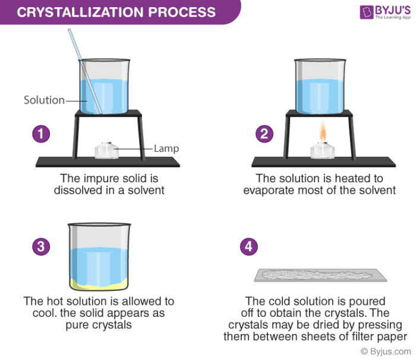

## Table of Contents

## What is crystallization?

Crystallization is a process where a solid forms from a solution, melt, or gas. It happens when the material's molecules or atoms come together and arrange themselves into a repeating pattern, creating a crystal. This can occur naturally, like when salt forms from seawater, or it can be done in a lab or industry to make things like sugar or pharmaceuticals.

In simple terms, crystallization is like making a solid out of a liquid. Imagine you have a glass of warm water with sugar dissolved in it. If you cool the water down, the sugar might start to come out of the water and form sugar crystals at the bottom of the glass. This happens because the cooler water can't hold as much sugar, so the sugar molecules start to stick together and form a solid crystal.

## Why is crystallization important in various industries?

Crystallization is really important in many industries because it helps make things pure and in the right shape. For example, in the food industry, they use crystallization to make sugar and chocolate. When they make sugar, they need to get the water out of the sugar solution, so they use crystallization to turn the liquid sugar into solid sugar crystals. This way, they can make sure the sugar is clean and ready to use in candies or drinks. In the chocolate industry, they control how the cocoa butter crystallizes to make the chocolate smooth and shiny.

In the pharmaceutical industry, crystallization is super important too. It helps make medicines pure and effective. When they make drugs, they often start with a solution that has the medicine mixed in. By using crystallization, they can turn this solution into solid medicine crystals. This process helps get rid of any impurities, so the medicine works better and is safer for people to use. It's like cleaning the medicine to make sure it's just right.

Crystallization also plays a big role in the chemical industry. They use it to separate and purify different chemicals. For instance, when making fertilizers or plastics, they need to get the right chemicals in the right form. Crystallization helps them do this by turning liquid chemicals into solid crystals that are easier to handle and use. This makes the whole process more efficient and helps make better products.

## What are the basic steps involved in the crystallization process?

Crystallization starts with a solution that has a lot of the stuff you want to turn into crystals. This solution is usually heated up so that more of the stuff can dissolve in it. Once it's all mixed up, you slowly cool it down. As it gets cooler, the solution can't hold as much of the stuff anymore, so it starts to come out of the solution and form tiny crystals. This is called nucleation, and it's when the crystals first start to grow.

After nucleation, the tiny crystals keep growing as more of the stuff from the solution sticks to them. This part is called crystal growth. You have to be careful during this time because if the solution cools down too fast, you might end up with a lot of small crystals instead of a few big ones. Once the crystals are big enough, you separate them from the solution. This is usually done by filtering or centrifuging, where the liquid goes through a filter and leaves the solid crystals behind. After that, you might need to dry the crystals to get rid of any leftover liquid, and then you have your final product.

## What types of solvents are commonly used in crystallization?

In crystallization, the choice of solvent is really important because it affects how well the crystals form. Common solvents used are water, ethanol, and acetone. Water is often used because it's cheap and safe, and it works well for a lot of substances like salts and sugars. Ethanol is another popular choice because it can dissolve many organic compounds, and it's easy to evaporate, which helps in the crystallization process. Acetone is used too, especially for things that don't dissolve well in water or ethanol, because it's a strong solvent that can handle a lot of different chemicals.

Sometimes, people use a mix of solvents to make crystallization work better. For example, they might use a mix of water and ethanol to dissolve a substance that doesn't work well with just one solvent. This mix can help control how fast the crystals grow and make them purer. The key is to choose a solvent or a mix of solvents that can dissolve the substance at high temperatures but let it come out of the solution as crystals when it cools down.

## How does temperature affect the crystallization process?

Temperature plays a big role in crystallization. When you heat up a solution, it can hold more of the stuff you want to turn into crystals. This is because the heat makes the molecules move faster, so they can mix better with the solvent. When you start to cool the solution down, it can't hold as much of the stuff anymore, and that's when the crystals start to form. If you cool it down slowly, you get bigger and better crystals because the molecules have more time to arrange themselves nicely.

If you cool the solution too fast, you might end up with a lot of small crystals instead of a few big ones. This happens because the molecules don't have enough time to find each other and form big crystals, so they just make a bunch of tiny ones. So, controlling the temperature carefully is really important in crystallization. It helps make sure you get the right size and quality of crystals for whatever you're trying to make, like sugar, medicine, or chemicals.

## What is supersaturation and why is it crucial for crystallization?

Supersaturation is when you have more stuff dissolved in a liquid than it can normally hold. Imagine you keep adding sugar to a glass of water until no more can dissolve. If you heat the water, you can add even more sugar because hot water can hold more. When you cool it down, the water can't hold all that sugar anymore, but for a little while, it does. That's supersaturation. It's like the water is holding onto extra sugar that it shouldn't be able to.

Supersaturation is super important for crystallization because it's what makes the crystals start to form. When the solution is supersaturated, it's kind of unstable. The extra stuff in the solution wants to come out, and that's when tiny crystals start to grow. This is called nucleation. Without supersaturation, the solution would stay liquid, and you wouldn't get any crystals. So, by making the solution supersaturated, you give it the push it needs to start turning into solid crystals.

## Can you explain the difference between nucleation and crystal growth?

Nucleation is when tiny crystals first start to form in a solution. Imagine you have a supersaturated solution, which means it has more stuff dissolved in it than it can normally hold. When this happens, the extra stuff wants to come out of the solution. This is when tiny crystals begin to appear. These tiny crystals are like seeds that start the whole process. Nucleation can happen in two ways: either tiny bits of the stuff come together on their own, which is called homogeneous nucleation, or they start to form around tiny impurities or dust in the solution, which is called heterogeneous nucleation.

Crystal growth is what happens after nucleation. Once those tiny crystal seeds are formed, more of the stuff from the solution starts to stick to them and make them bigger. This is like building on the seeds to make bigger crystals. The speed at which the crystals grow depends on things like how fast you cool the solution and how much stuff is still dissolved in it. If you cool it slowly, the crystals have more time to grow bigger and better. If you cool it too fast, you might end up with a lot of small crystals instead. So, crystal growth is all about making those tiny seeds into the big, solid crystals you want.

## What are some common techniques used to induce crystallization?

One common way to make crystals form is by cooling down a solution. When you heat up a liquid and dissolve a lot of stuff in it, it can hold more than usual. But when you cool it down slowly, the liquid can't hold all that stuff anymore, and tiny crystals start to form. This is called nucleation. By cooling the solution at just the right speed, you can help the crystals grow bigger and better. This method is used a lot in making things like sugar and medicine.

Another way to get crystals to form is by evaporating the solvent. If you have a solution and you let some of the liquid part evaporate, the stuff left behind gets more concentrated. When it gets concentrated enough, it can't stay dissolved and starts to form crystals. This is often done by leaving the solution out in the open air or using a machine to speed up the evaporation. This technique is useful when you want to separate out the stuff you need from the solution.

Sometimes, people use a method called seeding to help crystals form. This means adding tiny crystals, called seeds, into the solution. These seeds give the stuff in the solution something to start growing on, which can make the crystallization process happen faster and more reliably. Seeding is helpful when it's hard to get the crystals to start forming on their own.

## How do impurities affect the crystallization process?

Impurities can mess up the crystallization process in a big way. When there are impurities in the solution, they can stop the crystals from forming the way they should. Instead of making nice, clean crystals, the impurities can get stuck in the crystals and make them impure. This can happen because the impurities might stick to the tiny crystal seeds and stop them from growing properly. If the crystals are impure, they might not work as well as they should, especially if you're making things like medicine or chemicals where purity is really important.

But impurities aren't always bad. Sometimes, they can actually help the crystallization process. For example, tiny bits of dust or other stuff in the solution can act as places where the crystals can start to grow. This is called heterogeneous nucleation, and it can make the crystals form faster. So, while impurities can cause problems by making crystals impure, they can also be useful in getting the crystallization process started. It's all about finding the right balance to make sure the crystals come out the way you want them to.

## What are the advanced methods for controlling crystal size and shape?

One advanced way to control crystal size and shape is by using something called "anti-solvent crystallization." This is when you add another liquid to the solution that doesn't mix well with the stuff you want to turn into crystals. When you add this other liquid, it makes the stuff come out of the solution and form crystals. By carefully choosing the right anti-solvent and adding it at the right speed, you can make the crystals grow in a certain way. This helps you get the size and shape you want, which is really important for things like making medicine or chemicals.

Another method is called "sonocrystallization," which uses sound waves to help control the crystals. When you send sound waves through the solution, they create tiny bubbles that pop and make the solution move around a lot. This movement can help the tiny crystal seeds form and grow in a controlled way. By changing how strong the sound waves are and how long you use them, you can make the crystals bigger or smaller, or even change their shape. This method is useful when you need very specific crystal sizes and shapes for high-tech applications.

There's also a technique called "temperature cycling," where you change the temperature of the solution up and down in a controlled way. This helps the crystals grow slowly and evenly, which can make them bigger and more uniform. By carefully controlling the temperature changes, you can make sure the crystals grow just the way you want them to. This method is often used in industries where the exact size and shape of the crystals are really important, like in making high-quality pharmaceuticals or electronic materials.

## How is crystallization applied in the pharmaceutical industry?

In the pharmaceutical industry, crystallization is a key step in making medicines. It helps make the drugs pure and effective. When they make medicine, they start with a solution that has the drug mixed in. By using crystallization, they can turn this solution into solid medicine crystals. This process helps get rid of any impurities, so the medicine works better and is safer for people to use. It's like cleaning the medicine to make sure it's just right. Controlling the size and shape of the crystals is also important because it can affect how the medicine dissolves in the body and how well it works.

Crystallization is also used to make different forms of the same drug, called polymorphs. These different forms can have different properties, like how fast they dissolve or how stable they are. By choosing the right polymorph, drug makers can make sure the medicine works the way it should. They use advanced methods like anti-solvent crystallization, sonocrystallization, and temperature cycling to control the crystals. These methods help them get the right size, shape, and type of crystals they need for the medicine to be effective.

## What are the current challenges and future trends in crystallization research?

One big challenge in crystallization research is making crystals that are pure and the right size and shape. This is really hard because even tiny impurities can mess up the crystals. Scientists are working on new ways to control the crystallization process better. They're trying to understand how different conditions, like temperature and the type of solvent used, affect the crystals. This is important because in industries like pharmaceuticals, the size and shape of the crystals can change how well the medicine works. So, researchers are looking for better ways to make sure the crystals come out just right every time.

Another challenge is figuring out how to make crystallization work faster and use less energy. Right now, crystallization can take a long time and use a lot of resources. Scientists are trying to find new methods that can speed up the process and make it more efficient. One future trend might be using more advanced technology, like [machine learning](/wiki/machine-learning), to help predict and control crystallization. By using computers to analyze data, researchers can find the best conditions for making crystals without having to do a lot of trial and error. This could save time and money and make crystallization easier and more reliable in the future.

## What is the process of understanding solidification in chemistry?

Solidification is a fundamental process in materials science, involving the transition of matter from a liquid to a solid state. This transformation is pivotal in the crystallization of metals and other materials, underpinning many industrial applications such as casting, welding, and additive manufacturing.

During solidification, a liquid material cools and begins to form a solid phase. This transition is driven by the reduction in free energy as the liquid cools below its melting point, prompting atoms to organize into a structured lattice, thereby forming a crystal. The process can be remarkably swift, often occurring in milliseconds, yet the intricacies at the molecular level are complex and governed by several parameters including temperature, pressure, and composition of the material.

The crystallization of metals during solidification involves nucleation and growth. Nucleation is the initial stage where small clusters of atoms form within the liquid. These clusters can be stable if they surpass a critical size, allowing them to grow by the addition of more atoms from the liquid. The growth stage sees these nuclei expanding into larger crystals, a process influenced by diffusion and the rate of cooling. Metals solidifying at slower rates tend to have larger grains, while rapid cooling usually results in smaller, finer structures with different mechanical properties.

Molecular dynamics during solidification involve the movement and arrangement of atoms as they transition into a crystalline structure. The crystallization process can be described using molecular dynamics simulations which model the interactions between particles. The Lennard-Jones potential, for example, is often used to simulate these interactions:

$$
V(r) = 4\epsilon \left[ \left( \frac{\sigma}{r} \right)^{12} - \left( \frac{\sigma}{r} \right)^{6} \right]
$$

Here, $V(r)$ is the potential energy as a function of distance $r$, $\epsilon$ is the depth of the potential well, and $\sigma$ the finite distance at which the inter-particle potential is zero. These simulations help predict how atoms will arrange themselves over time and under varying conditions, offering insights into the kinetics of crystal growth and the eventual microstructure of the solidified metal.

Understanding solidification at the molecular level provides valuable insights for tailoring the properties of metals and alloys through controlled cooling and heat treatment processes. This knowledge plays a crucial role in enhancing mechanical properties such as strength, toughness, and resistance to wear and corrosion, which are critically important in engineering and materials science.

## References & Further Reading

[1]: Bergstra, J., Bardenet, R., Bengio, Y., & Kégl, B. (2011). ["Algorithms for Hyper-Parameter Optimization."](https://dl.acm.org/doi/10.5555/2986459.2986743) Advances in Neural Information Processing Systems 24.

[2]: ["Advances in Financial Machine Learning"](https://www.amazon.com/Advances-Financial-Machine-Learning-Marcos/dp/1119482089) by Marcos Lopez de Prado

[3]: ["Evidence-Based Technical Analysis: Applying the Scientific Method and Statistical Inference to Trading Signals"](https://www.amazon.com/Evidence-Based-Technical-Analysis-Scientific-Statistical/dp/0470008741) by David Aronson

[4]: ["Machine Learning for Algorithmic Trading"](https://github.com/PacktPublishing/Machine-Learning-for-Algorithmic-Trading-Second-Edition) by Stefan Jansen

[5]: ["Quantitative Trading: How to Build Your Own Algorithmic Trading Business"](https://books.google.com/books/about/Quantitative_Trading.html?id=j70yEAAAQBAJ) by Ernest P. Chan