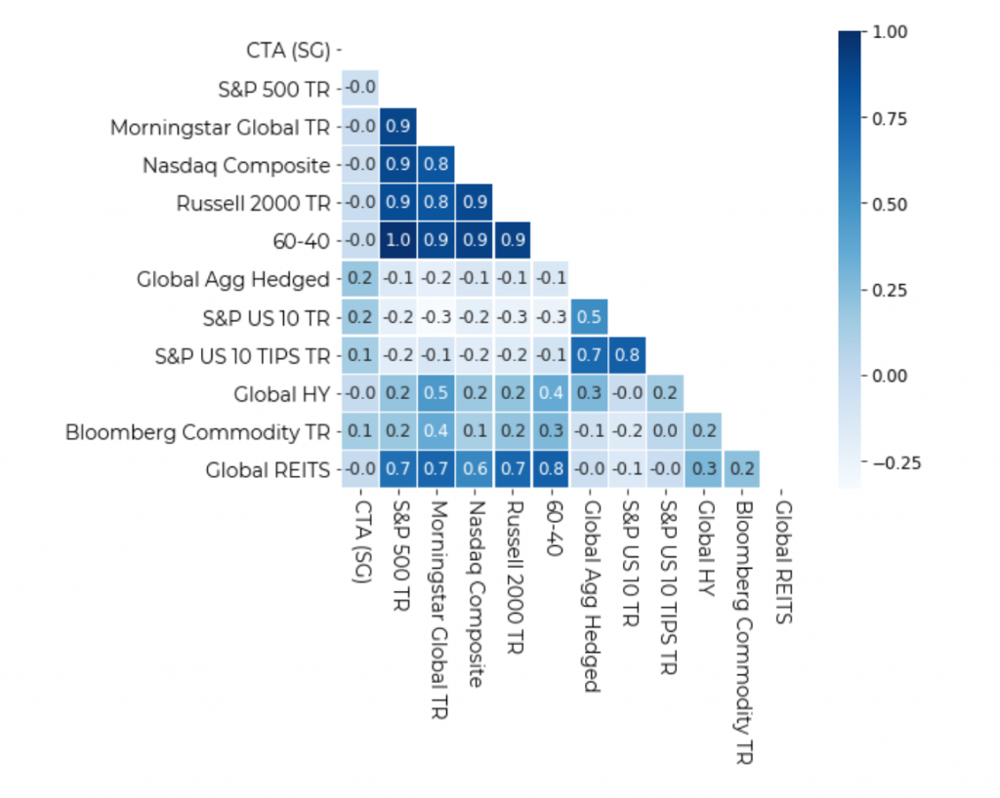

A Commodity Trading Advisor (CTA) is a professional who provides personalized advice regarding the buying and selling of futures contracts, options on futures, or certain foreign exchange contracts. Over the past decades, CTA strategies have risen to prominence due to their ability to navigate complex market landscapes and offer diversification benefits, particularly in volatile market environments. As we deep dive into this comprehensive guide, we'll unpack the intricacies of CTA strategies, explore their historical evolution, and understand their pivotal role in shaping modern trading decisions.

This guide aims to furnish readers with a holistic [understanding of CTA strategies](https://paperswithbacktest.com/paper/two-centuries-of-trend-following), touching on the foundational concepts and progressively diving into advanced topics. By journey's end, you will have gained insights into the various CTA strategies employed in today's market, their risks, rewards, and the forward-looking trends that might redefine their application in the future.

## Table of Contents

## A Deep Dive into CTA: The Basics

A Commodity Trading Advisor (CTA) is an individual or organization that provides advice regarding the buying and selling of futures contracts, options on futures, or specific foreign exchange contracts. While some CTAs manage assets directly and make trading decisions on behalf of their clients, others strictly offer advisory services, allowing the client to retain the decision-making power[1].

Tracing back the roots of CTAs, their emergence can be linked to the Commodity Futures Trading Commission (CFTC) and the establishment of the Commodity Exchange Act in the 1970s. This legislation was pivotal in ensuring that individuals providing advice on commodities investments were registered and met specific competency standards. Since then, CTAs have evolved from mere advisories to sophisticated trading entities, leveraging technology and quantitative techniques to enhance their strategies.

In today's globalized economy, the significance of CTA strategies cannot be understated. These strategies provide a means to [diversify a portfolio and can be especially valuable during times of economic stress or market volatility](https://paperswithbacktest.com/paper/the-volatility-effect-lower-risk-without-lower-return). CTAs, with their forward-looking approaches, have the potential to capitalize on both rising and falling markets, making them uniquely positioned to navigate various market scenarios. Moreover, their strategies often encompass a global perspective, trading in diverse commodities, interest rates, and foreign exchange markets, highlighting their critical role in the broader trading ecosystem.

## CTA Fundamentals

Futures contracts, integral to the commodities market, are standardized agreements to buy or sell a specific quantity of a commodity at a predetermined price on a set date in the future. These contracts are traded on futures exchanges and can encompass a diverse range of commodities from agricultural products to energy resources and financial instruments. The primary allure of futures contracts is their ability to hedge against price risks. By locking in prices today for future transactions, businesses and investors can achieve a measure of financial stability and predictability.

Commodity Trading Advisors (CTAs) heavily rely on futures contracts within their strategies. These contracts allow CTAs to take both long (buy) and short (sell) positions in the market, providing them with the flexibility to potentially profit from both rising and falling markets. Moreover, the standardized nature of these contracts facilitates liquidity, ensuring that traders can enter and exit positions with ease. It's also noteworthy that futures contracts, due to their inherent leverage, enable traders to control large positions with relatively small amounts of capital, amplifying both potential gains and losses.

Ensuring the integrity of this sophisticated trading ecosystem is the National Futures Association (NFA). Established in 1982, the NFA is the self-regulatory organization for the U.S. derivatives industry, including futures trading[2]. Its primary role is to formulate rules, programs, and services to safeguard market integrity, protect investors, and ensure that members meet their regulatory responsibilities. Membership in the NFA is mandatory for all futures professionals, including CTAs. As a regulatory body, the NFA conducts audits, investigates potential misconduct, and enforces disciplinary actions when necessary, all in a bid to maintain a transparent and trustworthy trading environment.

CTAs, in their pursuit of generating returns for their clients, navigate a complex landscape. While futures contracts provide them with the tools to enact their strategies, bodies like the NFA ensure that the game is played fairly, establishing a foundation of trust in the world of commodity trading.

## The Two Main Types of CTAs

### Systematic CTAs

Systematic Commodity Trading Advisors (CTAs) utilize pre-defined algorithms and quantitative models to make trading decisions. Unlike discretionary CTAs, which rely more on human judgment, [systematic CTAs are rooted in rigorous data analysis](https://paperswithbacktest.com/datasets), ensuring consistency in trading actions.

The characteristics of systematic CTAs are predominantly shaped by their reliance on technology and data. These [CTAs often employ complex mathematical models that analyze various market factors, from price trends to volume changes](https://paperswithbacktest.com/paper/two-centuries-of-trend-following). The automation enables them to process vast amounts of data rapidly, identifying patterns and signals that might be difficult or time-consuming for human traders to spot.

Algorithmic trading stands as a cornerstone for systematic CTAs. Algorithms are sets of defined rules based on which trading decisions are made. The advantages of such a method are multifold:

1. **Speed**: Algorithms can process and act on data faster than humans, allowing for swift trade execution.
2. **Consistency**: Trading decisions are made based on pre-set rules, eliminating emotional biases that can affect human judgment.
3. **Efficiency**: Systematic CTAs can monitor multiple markets simultaneously, identifying and acting on trading opportunities that might be overlooked in manual trading.
4. **Back-testing**: Algorithms allow CTAs to [test their strategies on historical data, helping refine the strategy before deploying it in live markets](https://blog.paperswithbacktest.com/p/how-to-collect-data-for-backtesting).

Distinguishing features of systematic CTAs include their ability to scale and adapt. As markets evolve, these CTAs can refine and update their algorithms to better align with the changing dynamics. Operational procedures for systematic CTAs involve rigorous back-testing, real-time monitoring of algorithms, and periodic refinements to the trading strategy.

In essence, systematic CTAs represent a fusion of technology and finance, harnessing the power of data to navigate the complexities of the trading world.

### Discretionary CTAs

Discretionary Commodity Trading Advisors (CTAs) employ a trading approach where decisions are made based on the expertise, judgment, and intuition of the trader rather than strictly predefined algorithms. While they might [use data and research](https://paperswithbacktest.com/course) to inform their choices, they aren't bound to a specific set of automated rules as systematic CTAs are.

Characteristics that define discretionary CTAs include:

1. **Flexibility**: Discretionary CTAs can adapt quickly to market changes based on their insights, even if such changes are sudden and unforeseen.
2. **Intuition & Experience**: These CTAs often rely on years of market experience and knowledge, honing their instincts over time.
3. **Holistic Analysis**: They tend to factor in a broader range of information, including macroeconomic indicators, geopolitical events, and [market sentiment](https://paperswithbacktest.com/paper/market-sentiment-and-an-overnight-anomaly), which might not be easily quantified for algorithmic strategies.

The role of discretion in trading decisions is paramount for these CTAs. For instance, while a systematic approach might strictly follow a sell signal from an algorithm, a discretionary trader might choose to hold onto the position based on an anticipated central bank announcement or an emerging geopolitical event that they believe will impact the market favorably. This ability to deviate from the 'script' allows for a nuanced approach to trading but also introduces an element of subjectivity that can be both an asset and a liability.

It's worth noting that while discretion offers flexibility, it also introduces the possibility of human biases and emotional influences, which can sometimes lead to less than optimal decisions. Hence, a blend of informed judgment and disciplined trading practices is vital for success in discretionary CTA strategies.

## Diverse CTA Trading Strategies

### Trend Following Strategy

Trend following is a trading strategy predicated on the belief that securities will continue to move in the direction of their current trend, whether bullish (upward) or bearish (downward)[^8^]. This strategy does not aim to forecast specific price levels; instead, it focuses on capturing the middle, or the "meat," of a market trend, regardless of its duration or magnitude.

At its core, trend following seeks to [leverage the momentum of a market](https://paperswithbacktest.com/paper/do-momentum-and-reversals-coexist). It operates on the principle that once a trend is in motion, it is more likely to continue than to reverse. The logic is straightforward: market prices often reflect a collective response to new information, and as that information diffuses, it influences the buying and selling decisions of market participants, reinforcing the trend[3].

In the realm of Commodity Trading Advisors (CTAs), trend following holds a particular significance. Here's why:

1. **Diversification Benefits**: Trend following strategies can be applied across a range of markets, including equities, bonds, currencies, and commodities, providing diversification to a portfolio[4].
2. **Adaptability**: Unlike strategies that are based on fundamental analysis, trend following relies purely on price data, making it adaptive to any market situation.
3. **Profit Potential in Various Market Conditions**: This strategy can profit from both rising and falling markets, as it can take both long and short positions.
4. **Risk Management**: The strategy often incorporates strict risk management rules to determine position sizes and exit points, ensuring losses are cut short while letting profits run.

In 2013, CFM , a CTA, wrote an [article that used 200 years of data](https://www.cfm.fr/assets/ResearchPapers/2014-Two-centuries-of-trend-following.pdf) to backtest a trend following P&L. The conclusion of this article was that a TF strategy applied to a diversified pool of instruments delivered a modest Sharpe ratio. But that this Sharpe ratio was nevertheless statistically very significant.

What does this mean in simple terms? Quite simply, that the resulting P&L is highly unlikely to be the result of mere luck. The Sharpe ratio presented in the paper was of the order of 0.7. Admittedly, it was purely indicative, since no transaction costs were taken into account, no management fees were included, and the instruments dealt with in the past were not as tradable as they are today. But despite all this, the article's evidence is solid and cannot be easily dismissed.

The P&L of trend following provides risk-adjusted returns that are of the same order of magnitude as those of traditional investments. Correlations with benchmark equity indices are low.

This means that trend following provides diversification. And it mechanically delivers better risk-adjusted returns when combined with traditional portfolios.

Trend following has historically been one of the predominant strategies among CTAs, and its enduring popularity stems from its ability to capture significant market moves and deliver uncorrelated returns to traditional investment portfolios.

### Momentum Strategy

[Momentum strategy is predicated on the idea that assets which have performed well in the past are likely to continue doing so in the near future](https://paperswithbacktest.com/paper/do-momentum-and-reversals-coexist), while those that have underperformed are likely to continue underperforming. It’s a classic exemplification of the adage "the trend is your friend."

In practice, momentum can be categorized in various time horizons, from short-term (months) to intermediate-term (several months) and long-term (several years). The strategy often involves periodically rebalancing a portfolio to favor high-performing assets and exclude or underweight the underperformers.

For a hands-on understanding, consider these practical examples:

1. **Relative Strength**: One of the most popular momentum indicators is relative strength, which compares the performance of a particular asset or security to the market as a whole. If a commodity, for instance, has outperformed the broader commodities index over the past 12 months, it might be considered to have positive momentum and thus a buy candidate.
2. **Moving Averages**: [Traders often use moving averages to capture momentum trends](https://paperswithbacktest.com/paper/two-centuries-of-trend-following). If an asset's price is above its 50-day moving average and also above its 200-day moving average, it’s often considered to be in a strong upward momentum. Conversely, if the price dips below these averages, it may indicate a potential shift in momentum.
3. **Rate of Change (ROC)**: The ROC is a technical metric that measures the percentage change in price over a specified time frame. A rising ROC might indicate an increasing momentum, while a declining ROC can signal a decrease. For instance, if the ROC for a particular stock over the past 20 days is higher than it was over the past 60 days, it might suggest an acceleration in that stock's upward movement.

Momentum strategy, when applied judiciously, can be a powerful tool in a trader's arsenal, helping to identify potential breakout or breakdown scenarios based on historical performance patterns. However, like all strategies, it's vital to use it in conjunction with other indicators and sound risk management practices.

### Hedge Fund Strategy

Hedge funds are investment vehicles that pool together funds from investors to employ a variety of strategies to earn active returns for their investors. Unlike mutual funds, they are less regulated, allowing them a wider strategic latitude.

Commodity Trading Advisors (CTAs) and hedge funds are not mutually exclusive. In fact, many CTAs operate within the hedge fund framework, utilizing futures contracts and other derivatives to achieve their investment objectives. The distinguishing factor between a typical hedge fund and a CTA-based hedge fund is often the strategy employed and the instruments used.

CTAs generally focus on futures markets and commodities, leveraging trends and market inefficiencies using systematic or discretionary strategies. Hedge funds, on the other hand, have a broader mandate. They can invest in equities, fixed income, currencies, derivatives, real estate, and even unlisted securities.

Key integrations and differentiations between CTAs and hedge fund operations are:

1. **Instrument Focus**: While hedge funds may operate across various instruments, CTAs specifically emphasize futures contracts. This focus allows CTAs to take advantage of unique market characteristics, like contango and backwardation in futures curves[5].
2. **Liquidity and Transparency**: CTAs, given their futures market focus, usually offer more liquidity and transparency compared to some hedge fund strategies which might invest in illiquid assets or employ complex strategies that are harder to understand for the average investor.
3. **Strategy Breadth**: Hedge funds have the flexibility to engage in a wide range of strategies, from merger arbitrage to distressed asset acquisition. CTAs, while diverse within their domain, primarily capitalize on trends and price movements in futures markets.
4. **Risk and Return Profile**: The risk and return dynamics of a CTA can be significantly different from other hedge fund strategies. For instance, during stock market downturns, trend-following CTAs might generate positive returns when equities are falling, offering potential diversification benefits.
5. **Capital Requirements**: Engaging in futures trading might require different capital allocations compared to traditional stock or bond trading. CTAs need to manage margin requirements, which can impact the leverage and risk they can take.
6. **Regulatory Framework**: While both hedge funds and CTAs face regulatory oversight, the specifics differ. CTAs, for example, are often required to register with the Commodity Futures Trading Commission (CFTC) and adhere to its regulations.

In essence, while there's overlap in the operational worlds of hedge funds and CTAs, the delineation lies in their strategic focus, risk management, and investment tools. Understanding these nuances can help investors and traders make more informed decisions about where to allocate their capital.

### Correlation Analysis in CTA

Correlation analysis is a crucial component of Commodity Trading Advisor (CTA) strategies. In finance, correlation refers to the statistical measure of how two securities move in relation to each other. The correlation coefficient can range between -1 and 1. A value of 1 implies a perfect positive correlation, meaning both securities move in the same direction together. A value of -1 implies a perfect negative correlation, meaning the securities move in opposite directions. A value of 0 suggests no correlation[6].

Understanding correlations is imperative for CTAs for several reasons:

1. **Diversification**: By holding assets that are not perfectly correlated, CTAs can reduce portfolio risk. If one asset underperforms, the negative impact on the portfolio might be offset by the performance of another, less correlated asset.
2. **Identifying Market Anomalies**: Correlations aren’t static; they change over time. A sudden shift in correlation between two assets can signal a potential market anomaly or a structural change in the markets.
3. **Risk Management**: Understanding correlations helps CTAs gauge the aggregate risk of a portfolio. If all assets in a portfolio are highly correlated, the collective risk could be higher than anticipated, leading to larger-than-expected losses during market downturns.
4. **Strategy Formulation**: For CTAs employing multi-asset strategies, assessing correlations can aid in strategy development. If two commodities typically move in tandem but suddenly diverge, it might present a trading opportunity.
5. **Portfolio Optimization**: Correlation analysis can help in constructing a portfolio that maximizes return for a given level of risk. By incorporating assets with varying degrees of correlations, CTAs can optimize the risk-return profile of the portfolio.
6. **Stress Testing and Scenario Analysis**: Recognizing potential correlation breakdowns can be essential when conducting stress tests or scenario analyses. During significant market upheavals, assets that were traditionally uncorrelated can suddenly become correlated, leading to unexpected portfolio behaviors.

Incorporating correlation analysis into CTA strategies is not just a mathematical exercise; it's a real-world tool for better decision-making. While correlations provide valuable insights, it's essential to be aware of the 'correlation trap.' Relying solely on historical correlation data can be misleading, as correlations can and do change. As the saying goes, "correlation does not imply causation," and while it's a valuable tool, it should be used in conjunction with other analytical methods for effective trading and risk management.

### Real-life Implementations and Backtest Examples

CTA strategies, with their analytical rigor, have made notable impacts on real-world trading scenarios. Here are a few examples:

1. **Trend Following in Energy Markets (2014-2015)**: During the period between mid-2014 and 2015, the world experienced a significant drop in oil prices. CTAs, employing trend-following strategies, captured this downward momentum. Many shorted oil futures contracts, capitalizing on a nearly 50% drop in prices, showcasing the strength of systematic trend-following in rapidly changing market conditions.
2. **Brexit Referendum (2016)**: The unexpected outcome of the Brexit vote caught many market participants off guard, leading to sharp drops in the British Pound and equities. Discretionary CTAs, with their ability to interpret qualitative data and adapt more fluidly than systematic models, managed to quickly reposition their portfolios and navigate the turbulence more effectively than many passive strategies.
3. **Gold Trading During Global Economic Uncertainties (2011 and 2019)**: With growing economic uncertainties in 2011 and again in 2019, gold, a classic safe-haven asset, witnessed sharp upticks in its price. Momentum-based CTAs, noting the shift in price dynamics, increased their long exposure to gold futures, reaping substantial benefits.
4. **Backtesting a Mean Reversion Strategy with Agricultural Commodities**: When backtested over a period of 10 years (2005-2015), a hypothetical CTA strategy focusing on mean reversion within the agricultural commodity sector, including crops like wheat and soybeans, demonstrated consistent returns. Especially during periods when prices deviated significantly from historical norms, the strategy capitalized on price reversions to the mean.
5. **Correlation Analysis During the COVID-19 Pandemic (2020)**: The early months of 2020 saw the global spread of COVID-19 and the subsequent market crash. During this period, many asset correlations, traditionally negative or low, shifted to become highly correlated. CTAs employing correlation analysis strategies identified these shifts early on, making strategic reallocations to minimize risk and capture potential upside.

In each of these instances, the application of CTA strategies proved invaluable in navigating complex market situations. Whether utilizing systematic algorithms, relying on human discretion, or a mix of both, CTAs have demonstrated their adaptability and relevance in diverse market conditions.

## Comparing CTA with Other Trading Entities

CTAs and hedge funds are two prominent players in the investment world. While they both operate within the alternative investment landscape and can employ similar trading strategies, there are essential differences that distinguish the two.

**CTA vs. Hedge Fund: Key Differences and Similarities**

1. **Investment Mandate**:
    - **CTAs**: Typically, CTAs specialize in futures and commodities trading. Their primary focus is often on liquid, exchange-traded instruments.
    - **Hedge Funds**: These funds have a broader investment mandate, encompassing equities, bonds, currencies, derivatives, and more. Their flexibility allows them to employ a wide range of strategies, including long-short, global macro, and arbitrage.
2. **Regulatory Environment**:
    - **CTAs**: Generally, CTAs are required to register with the Commodity Futures Trading Commission (CFTC) and are members of the National Futures Association (NFA). Their activities and reporting requirements are closely overseen.
    - **Hedge Funds**: These entities might be regulated by the Securities and Exchange Commission (SEC) or other financial regulators, depending on their structure and jurisdiction.
3. **Fee Structure**:
    - **CTAs**: The fee structure usually involves a management fee and a performance fee. The performance fee often operates as an incentive fee based on new profit highs.
    - **Hedge Funds**: They traditionally follow the “2 and 20” model — 2% of assets as a management fee and 20% of profits as a performance fee. However, this model has seen variations in recent years.
4. **Transparency and Liquidity**:
    - **CTAs**: Given their focus on futures and commodities, CTAs generally offer higher transparency and liquidity. Monthly or even daily reporting is not uncommon.
    - **Hedge Funds**: These can be less transparent due to the diverse nature of their investments. Liquidity terms can vary, with some funds offering quarterly redemptions, while others might have longer lock-up periods.

**Practical Implications for Traders and Investors**:

- **Diversification**: Including both CTAs and hedge funds in a portfolio can offer diversification benefits. CTAs can provide non-correlated returns, especially during turbulent market conditions, while hedge funds might deliver alpha through their varied strategies.
- **Risk Tolerance and Investment Horizon**: Investors need to consider their risk tolerance and investment horizons. While CTAs can provide quick liquidity, hedge funds might require a more extended commitment.
- **Due Diligence**: Given the different regulatory environments, investors should undertake rigorous due diligence. Understanding the underlying strategies, risk management practices, and historical performance is crucial.

In conclusion, while CTAs and hedge funds may seem similar on the surface, they serve different purposes within a portfolio. Understanding these differences can help traders and investors make informed decisions.

## Understanding the Risks and Rewards

Trading and investing, as with any financial endeavors, come with inherent risks and rewards. When specifically focusing on CTA strategies, these potential risks and rewards can vary based on market dynamics, strategies employed, and other influencing factors.

**Associated Risks with CTA Strategies**:

1. **Market Risk**: All investments carry the risk of adverse price movements due to macroeconomic or industry-specific events[7]. In futures trading, unexpected market events or significant news can lead to rapid and substantial price changes.
2. **Liquidity Risk**: Not all futures contracts are highly liquid, especially those with longer maturity dates or in less popular commodities[8]. Illiquidity can lead to larger bid-ask spreads or even situations where a position cannot be closed at the desired price.
3. **Leverage Risk**: Futures trading inherently uses leverage, allowing traders to control large positions with a relatively small amount of capital. While leverage can amplify gains, it can equally amplify losses, sometimes leading to losses greater than the initial investment.
4. **Operational Risk**: This refers to risks from internal inadequacies, system failures, or external events that impact trading operations. Even algorithmically-driven systematic CTAs are not immune, as software bugs or system outages can disrupt trading.
5. **Model and Strategy Risk**: CTAs, especially systematic ones, rely heavily on models. If a model is based on flawed assumptions or fails to adapt to changing market conditions, it can result in losses.

**Measures to Mitigate Risks**:

1. **Diversification**: Diversifying trading strategies or commodities can spread risk. A setback in one market might be offset by gains in another.
2. **Risk Management Protocols**: Implementing strict stop-loss orders, using option-based strategies for protection, and regularly reviewing and adjusting portfolio exposures can limit potential losses.
3. **Continuous Model Backtesting and Adaptation**: For systematic CTAs, it's crucial to continuously backtest and adapt their models to align with current market conditions.
4. **Due Diligence**: Before committing to any strategy or investment, conducting thorough research and due diligence can prevent potential pitfalls.

**Potential Rewards and Their Realization**:

1. **Non-Correlated Returns**: One of the significant rewards of CTA strategies is the potential for non-correlated returns, offering diversification benefits to investors when traditional markets are underperforming.
2. **Capital Appreciation**: Given the leverage in futures trading, there's a potential for substantial capital appreciation with CTAs.
3. **Flexibility**: Futures markets operate nearly 24 hours, providing CTAs with flexibility in trading and the ability to react to global events as they happen.
4. **Adaptability**: CTAs, especially those with systematic strategies, can quickly adapt to changing market conditions, positioning themselves to profit from both rising and falling markets.

In the dynamic world of futures trading, understanding the balance between risks and rewards is paramount. While the potential for high returns is attractive, the associated risks underline the importance of robust risk management and continuous strategy adaptation.

## Is Now the Right Time for CTA Strategies?

Navigating the global financial markets is a complex endeavor, influenced by a myriad of constantly changing factors. In this constantly evolving landscape, Commodity Trading Advisor (CTA) strategies have historically been utilized to harness market trends and provide non-correlated returns. The question arises, with current market dynamics, is it an opportune time for CTAs?

**Analysis of the Current Market Landscape**:

1. **Increased Market Volatility**: Recent years have witnessed significant market volatility, driven by geopolitical tensions, trade wars, and global economic uncertainties. Such conditions often present trend-following CTAs with opportunities, as they capitalize on pronounced market movements.
2. **Technological Advancements**: The surge in technology, particularly in artificial intelligence and machine learning, has enabled more sophisticated trading algorithms. These advancements have allowed systematic CTAs to process vast amounts of data, identify patterns, and refine their strategies with higher precision.
3. **Global Interest Rate Environment**: With major economies experiencing historically low-interest rates, traditional bond strategies have faced challenges. CTAs can provide an alternative source of returns, not necessarily linked to interest rate movements.
4. **Diversification Need**: As equity markets have reached all-time highs in several regions, investors are searching for diversification to hedge potential downturns. CTAs, with their non-correlated returns, can serve as a valuable portfolio diversification tool.

**Predictive Insights on Future Relevance of CTA Strategies**:

1. **Growing Complexity in Markets**: As markets become more interconnected and complex, the ability of CTAs to analyze multiple data points and adapt swiftly is likely to be even more valuable.
2. **Further Technological Integration**: The integration of newer technologies like quantum computing in trading can further enhance the decision-making capabilities of CTAs, making their strategies more robust and adaptive.
3. **Environmental, Social, and Governance (ESG) Trends**: As the global focus shifts towards sustainability, there will be significant market adjustments. CTAs can potentially capitalize on these shifts, providing investors with strategies that align with global sustainability goals.

In conclusion, while there are no certainties in the financial markets, the inherent adaptability and diverse strategies employed by CTAs position them well in the current market landscape. Their relevance is poised to grow, given the increasing market complexities and technological advancements that align seamlessly with CTA methodologies.

## The Registration and Regulation Aspect

Navigating the regulatory landscape is crucial for anyone considering becoming a Commodity Trading Advisor (CTA). The regulatory framework ensures that CTAs maintain high ethical standards, safeguarding the interests of their clients and promoting integrity in the futures market.

In the U.S., CTAs are primarily regulated by the Commodity Futures Trading Commission (CFTC) and must be registered with the National Futures Association (NFA). Registration ensures that the CTA meets specific proficiency requirements and undergoes rigorous background checks.

However, there are exemptions from CTA registration. One notable exemption applies to CTAs that have provided commodity trading advice to 15 or fewer persons in the past 12 months and do not generally hold themselves out to the public as CTAs. Another exemption is for those CTAs whose clients are limited to specific institutional investors, such as banks or insurance companies. But remember, even if exempted from CFTC registration, these CTAs might still be subjected to other state or federal regulatory requirements.

To become a registered CTA, a series of steps must be followed:

1. **Proficiency Requirements:** The individual must pass the Series 3 National Commodity Futures Examination, which assesses one's knowledge of futures trading concepts, terminology, and regulations[9].
2. **Membership with the NFA:** After passing the required exams, the CTA must apply for NFA membership. This membership holds the CTA accountable to NFA's strict regulatory standards.
3. **Background Checks:** The NFA conducts a thorough background check on all registration applicants. This process ensures that individuals with histories of unethical or fraudulent behavior are prevented from becoming CTAs.
4. **Disclosure Documents:** CTAs are required to provide prospective clients with a disclosure document detailing their trading program, associated risks, fees, and potential conflicts of interest. This document must be updated annually and promptly after any significant change to the CTA's operations.
5. **Reporting and Record Keeping:** Once registered, CTAs must maintain detailed records of all trading activities and submit regular reports to the NFA. This transparency ensures ongoing oversight and keeps the CTA accountable to regulatory standards.

While the path to becoming a registered CTA is rigorous, it's essential for maintaining the industry's integrity and protecting investors. Those considering this career path should familiarize themselves with the comprehensive regulatory environment and remain updated on any changes to registration and compliance requirements.

## The Way Forward: Predictions and Emerging Trends

The domain of Commodity Trading Advisors (CTAs) has witnessed significant evolutions since its inception, especially with the surge of technological advancements in the finance and trading sector. As we gaze into the foreseeable future, technology's role in shaping CTA strategies becomes undeniably evident.

Artificial Intelligence (AI) and Machine Learning (ML) are at the forefront of this transformation. With the capability to analyze vast amounts of data in real-time, these technologies provide CTAs with unparalleled insights into market trends and predictive analytics. As a result, systematic CTAs can develop more accurate and adaptive algorithmic trading models. The evolution of deep learning, a subset of ML, further refines predictive models by recognizing intricate patterns and relationships in data that were previously overlooked.

Quantum computing is another horizon-expanding field. Its potential to solve complex computational problems exponentially faster than today's computers could revolutionize risk analysis and real-time trading adjustments.

Moreover, the growth in Big Data analytics tools has empowered CTAs to extract meaningful insights from unstructured data sources, such as global news, social media sentiments, and geopolitical events. These insights, when merged with traditional quantitative data, offer a more holistic view of market dynamics.

## Conclusion

Commodity Trading Advisors (CTAs) have cemented their significance in the modern trading landscape, providing specialized strategies to navigate the ever-evolving futures markets. Their expertise in identifying market trends, implementing algorithmic approaches, and ensuring risk management positions them uniquely to assist investors in achieving their financial objectives.

As the global trading ecosystem undergoes rapid transformations, it's paramount that CTAs, and indeed all stakeholders, engage in ongoing education. The integration of cutting-edge technology, understanding new trading paradigms, and adapting to regulatory changes will be vital. It's this continuous learning and evolution that will enable CTAs to remain effective, ensuring they offer the best possible guidance in an unpredictable market.

In a world where market dynamics shift swiftly, CTAs stand as beacons of insight and direction, reflecting both the challenges and opportunities presented by modern futures trading.

💡 **Read more:**

- Trading strategies papers with code on [Equities](https://wiki.paperswithbacktest.com/trading-strategies/equities), [Cryptocurrencies](https://wiki.paperswithbacktest.com/trading-strategies/cryptocurrencies), [Commodities](https://wiki.paperswithbacktest.com/trading-strategies/commodities), [Currencies](https://wiki.paperswithbacktest.com/trading-strategies/currencies), [Bonds](https://wiki.paperswithbacktest.com/trading-strategies/bonds), [Options](https://wiki.paperswithbacktest.com/trading-strategies/options)
- [A curated list](https://github.com/paperswithbacktest/awesome-systematic-trading) of awesome libraries, packages, strategies, books, blogs, and tutorials for systematic trading
- [A bunch of datasets](https://huggingface.co/paperswithbacktest) for quantitative trading
- [A website to help you](https://paperswithbacktest.com/) become a quant trader and achieve financial independence

## Frequently Asked Questions

**How does technological advancement impact CTA strategies?**

Technological advancements play a pivotal role in the evolution of CTA strategies. The introduction of sophisticated data analytics, artificial intelligence, and machine learning has enabled CTAs to process vast datasets at unprecedented speeds, refining their algorithms for better market predictions. High-frequency trading, backed by technology, allows CTAs to execute trades within milliseconds, capitalizing on minute market inefficiencies. Furthermore, cloud computing and advancements in data storage have given CTAs the ability to analyze decades of market data, strengthening their trend predictions and strategies.

**How do geopolitical events influence CTA trend predictions?**

Geopolitical events, such as elections, trade wars, and international conflicts, can lead to significant market volatility. Such events impact global trade, currency values, and commodity prices. CTAs, especially those employing trend-following strategies, can capitalize on these pronounced market movements resulting from geopolitical shifts. The key for CTAs is to have timely and accurate data on geopolitical events and to quickly assimilate how these events might influence global markets. Incorporating this information into their models allows them to adjust strategies and manage risks effectively.

**What distinguishes CTA strategies from other trading strategies?**

CTA strategies primarily revolve around futures and commodities markets, whereas other trading strategies might focus on equities, bonds, or other asset classes. CTAs offer potential benefits of diversification, as their returns often exhibit low correlation with traditional asset classes. Additionally, CTAs, particularly systematic ones, rely heavily on models and algorithms, giving them a unique edge in identifying and capitalizing on market trends.

**Are CTA strategies only relevant for commodities?**

While the term "Commodity Trading Advisor" suggests a focus on commodities, CTAs often trade a diversified portfolio that includes financial instruments like currency futures, interest rates, and stock indices. Their strategies are not limited to commodities; they aim to exploit trends across various asset classes.

**How do CTAs manage periods of flat or "sideways" markets?**

Sideways markets, where there's limited upward or downward movement, can be challenging for trend-following CTAs. However, many CTAs diversify their strategies to include counter-trend or mean-reversion tactics during such periods. Additionally, some CTAs might reduce their market exposure or employ other risk management techniques to preserve capital.

**How frequently do CTAs adjust their strategies?**

The frequency of adjustments depends on the CTA's approach. Systematic CTAs, reliant on algorithms, might adjust their strategies whenever their models dictate, which could be daily or even intraday. Discretionary CTAs, on the other hand, might make adjustments based on their market analysis and judgment, which could be less frequent.

## References & Further Reading

[1]: [Investopedia - Commodity Trading Advisor (CTA)](https://www.investopedia.com/terms/c/cta.asp)

[2]: [National Futures Association - About NFA](https://www.nfa.futures.org/about/index.html)

[3]: [Trend Following: Learn to Make Millions in Up or Down Markets](https://www.amazon.com/Trend-Following-Learn-Millions-Markets/dp/013702018X) by Michael W. Covel

[4]: [Trend Following with Managed Futures: The Search for Crisis Alpha](https://www.wiley.com/en-us/Trend+Following+with+Managed+Futures%3A+The+Search+for+Crisis+Alpha-p-9781118890974) by Alex Greyserman and Kathryn M. Kaminski

[5]: [Contango and Backwardation Explained](https://www.investopedia.com/terms/c/contango.asp)

[6]: [Investopedia - Correlation Definition](https://www.investopedia.com/terms/c/correlation.asp)

[7]: [Market Risk – Its Types and Management Strategies](https://corporatefinanceinstitute.com/resources/knowledge/finance/market-risk/)

[8]: [The Basics of Liquidity Risk](https://www.investopedia.com/terms/l/liquidityrisk.asp)

[9]: [Series 3 National Commodity Futures Examination](https://www.finra.org/registration-exams-ce/qualification-exams/series3)