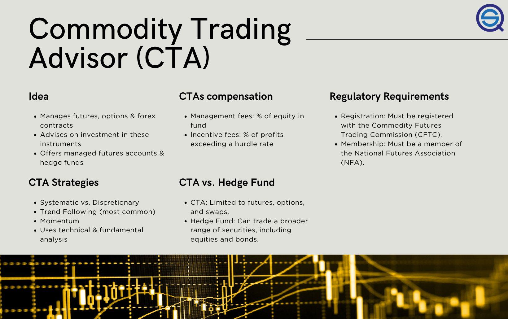

## Table of Contents

## What is a CTA trading strategy?

A CTA trading strategy, or Commodity Trading Advisor strategy, is a type of investment approach where professional money managers, known as CTAs, make decisions about buying and selling various financial instruments. These instruments can include commodities, stocks, bonds, and currencies. CTAs use different methods to analyze markets, such as looking at trends and using computer programs to help them decide when to trade. Their main goal is to make profits for their clients by taking advantage of price movements in the markets.

CTAs often use a systematic approach, which means they follow a set of rules to make their trading decisions. This can help remove emotions from trading, which can sometimes lead to better results. For example, a CTA might use a trend-following strategy, where they buy assets that are going up in price and sell assets that are going down. This strategy tries to ride the momentum of the market. CTAs are popular because they can offer diversification to an investment portfolio, as their strategies can be different from traditional stock and bond investments.

## How does a CTA trading strategy differ from other trading strategies?

A CTA trading strategy is different from other trading strategies because it is managed by professional money managers called Commodity Trading Advisors. These CTAs often use a systematic approach, which means they follow strict rules and computer programs to decide when to buy or sell. This is different from many other trading strategies where decisions might be based more on the trader's own feelings or guesses about the market. For example, a CTA might use a trend-following strategy, where they buy assets that are going up in price and sell assets that are going down, trying to ride the market's momentum.

Another way CTA strategies differ is that they can trade a wide range of financial instruments, like commodities, stocks, bonds, and currencies. This is broader than many other strategies that might focus only on one type of asset. Because of this, CTA strategies can help spread out risk in an investment portfolio, which is something many investors like. This diversification can make CTA strategies a good choice for people looking to balance their investments and possibly reduce the ups and downs of their overall returns.

## What are the key components of a CTA trading strategy?

A CTA trading strategy has a few main parts that help it work well. One big part is using a systematic approach. This means the CTA follows a set of rules to decide when to buy or sell. They often use computer programs to help them make these choices. This way, they can take emotions out of trading, which can help them make better decisions. Another important part is using different ways to look at the market. For example, many CTAs use trend-following, where they buy things that are going up in price and sell things that are going down. This helps them catch the big moves in the market.

Another key part of a CTA trading strategy is trading a lot of different things. CTAs can trade commodities, stocks, bonds, and currencies. This is different from many other strategies that might only focus on one type of thing. By trading many different things, CTAs can spread out the risk. This is good because it can help protect the money they are managing. Also, CTAs often use something called leverage, which means they can control a lot of money with a little bit of their own. This can make their profits bigger, but it can also make their losses bigger if things go wrong.

## Who typically uses CTA trading strategies?

People who typically use CTA trading strategies are often investors looking to add something different to their investment mix. These investors might be individuals or big groups like pension funds or endowments. They like CTA strategies because they can help spread out risk. This is because CTAs trade a lot of different things like commodities, stocks, bonds, and currencies. By doing this, they can help balance out the ups and downs of other investments in a portfolio.

Another group that uses CTA strategies are those who want a more hands-off approach to their investments. Since CTAs use a systematic approach and follow set rules, investors don't have to worry about making trading decisions themselves. This can be good for people who don't have the time or knowledge to trade on their own. Also, some investors are drawn to CTA strategies because they can sometimes make money even when the stock market is going down, which can be a big plus.

## What are the benefits of using a CTA trading strategy?

Using a CTA trading strategy can help spread out risk in your investments. CTAs trade many different things like commodities, stocks, bonds, and currencies. This means they are not just focused on one type of investment. By doing this, they can help balance out the ups and downs of other parts of your investment portfolio. This is good because it can protect your money if one part of the market is not doing well.

Another benefit is that CTA strategies can make money even when the stock market is going down. This is because CTAs often use trend-following methods, where they buy things that are going up and sell things that are going down. This can help you make profits no matter which way the market is moving. Also, since CTAs use a systematic approach and follow set rules, you don't have to worry about making trading decisions yourself. This can be a big help if you don't have the time or knowledge to trade on your own.

## What are the risks associated with CTA trading strategies?

Using a CTA trading strategy can be risky because it often involves using leverage. Leverage means using a little bit of money to control a lot more money. This can make your profits bigger, but it can also make your losses bigger if things go wrong. If the market moves against what the CTA expected, the losses can be a lot more than what was invested.

Another risk is that CTA strategies can have periods where they don't make money. Even though they use a systematic approach and follow set rules, the market can be unpredictable. Sometimes, the trends that CTAs follow might not work out, and they might lose money for a while. This can be hard for investors who need to see steady returns.

Also, because CTAs trade many different things, there's a risk that they might not understand all the markets they are trading in as well as they should. This can lead to mistakes and losses. It's important for investors to know that while CTA strategies can help spread out risk, they are not a sure thing and can still lose money.

## How can someone start implementing a CTA trading strategy?

To start using a CTA trading strategy, you first need to find a good Commodity Trading Advisor. These are the professionals who manage the strategy. You can search for CTAs online, look at lists from financial groups, or ask for advice from other investors. Once you find some CTAs you like, check their past performance and how much they charge. It's important to pick a CTA that matches your goals and how much risk you're okay with.

After choosing a CTA, you'll need to open an account with them. This usually means filling out some forms and putting money into the account. The CTA will then start trading based on their strategy. They'll use computer programs and follow set rules to decide when to buy and sell different things like commodities, stocks, bonds, and currencies. Make sure to keep an eye on how your investment is doing and talk to your CTA if you have any questions or if you want to change anything about your investment.

## What types of markets are best suited for CTA trading strategies?

CTA trading strategies work well in markets that have clear trends. This means markets where prices are going up or down in a steady way. CTAs often use trend-following methods, so they do better when they can see and follow these trends. Markets like commodities, currencies, and futures are good for CTA strategies because they often have these clear trends. For example, the price of oil might go up over time because of demand, or the value of a currency might go down because of changes in a country's economy.

CTA strategies can also be good in markets that are not too tied to the stock market. This is because CTAs trade many different things, and they want to spread out the risk. So, if the stock market goes down, the other markets they trade in might not go down at the same time. This helps balance out the ups and downs in an investment portfolio. Markets like bonds, commodities, and currencies can be less connected to stocks, making them a good fit for CTA strategies.

## How do CTA trading strategies adapt to different market conditions?

CTA trading strategies are good at changing with the market because they use a systematic approach. This means they follow set rules and use computer programs to decide when to buy or sell. If the market is going up, CTAs can follow the trend and buy things that are going up in price. If the market is going down, they can sell things that are going down. This way, they can make money no matter which way the market is moving. They also look at many different markets like commodities, stocks, bonds, and currencies. This helps them spread out the risk and find the best opportunities no matter what is happening in one part of the market.

Another way CTA strategies adapt is by using different methods to look at the market. For example, some CTAs might use trend-following, while others might use other ways to predict where prices are going. This mix of methods helps them be ready for different market conditions. If one method is not working well, they can switch to another one. Also, because they trade many different things, they can move their money around to where the best chances are. This flexibility helps them keep making money even when the market changes a lot.

## What advanced techniques can enhance a CTA trading strategy?

One advanced technique to make a CTA trading strategy better is using machine learning. This means using computers to learn from past market data and find patterns that might be hard for people to see. By doing this, CTAs can make smarter choices about when to buy or sell. Machine learning can also help CTAs change their strategies quickly when the market changes. This can help them stay ahead and make more money.

Another technique is using more data from different places. CTAs usually look at things like price and volume, but they can also use data from news, social media, and other sources to get a better picture of what's happening in the market. This can help them predict where prices are going next. By using all this extra information, CTAs can make their trading decisions more accurate and find new ways to make money.

## How can performance of a CTA trading strategy be measured and evaluated?

To measure and evaluate the performance of a CTA trading strategy, you can look at a few key things. One important thing is the return on investment, which tells you how much money the strategy made compared to how much was put in. Another thing to check is the risk-adjusted return, like the Sharpe Ratio. This tells you how much return you got for the risk you took. If the Sharpe Ratio is high, it means the strategy did well for the amount of risk it took. You can also look at the drawdown, which is the biggest drop in value the strategy had. A smaller drawdown means the strategy was less risky.

Another way to evaluate a CTA trading strategy is by comparing it to other things. You can see how it did compared to the stock market or other trading strategies. This helps you understand if the CTA strategy was better or worse than other ways to invest your money. It's also good to look at how consistent the strategy was over time. If it made money steadily, that's a good sign. But if it had big ups and downs, that might mean it's riskier. By looking at all these things, you can get a full picture of how well the CTA trading strategy is doing.

## What are the latest trends and developments in CTA trading strategies?

One big trend in CTA trading strategies is using more computer programs and machine learning. These tools help CTAs find patterns in the market that are hard for people to see. By using machine learning, CTAs can make smarter choices about when to buy or sell. This can help them make more money and change their strategies quickly when the market changes. More and more CTAs are using these advanced tools to stay ahead in the market.

Another trend is that CTAs are looking at more kinds of data. They used to just look at price and how many people were trading, but now they also use data from news, social media, and other places. This extra information helps them understand what's happening in the market better and predict where prices might go next. By using all this data, CTAs can make their trading decisions more accurate and find new ways to make money.

## How do CTAs manage diversification and correlation in their trading strategies?

Diversification is a fundamental principle of Commodity Trading Advisor (CTA) strategies, designed to mitigate risk by employing investments across a spectrum of uncorrelated markets. CTAs aim to manage risk and enhance returns by constructing diversified portfolios that integrate a multitude of asset classes, including equities, bonds, commodities, and currencies. By doing so, CTAs can lessen the exposure to market-specific risks and increase the overall portfolio stability.

The utilization of diverse instruments, such as equity, bond, commodity, and currency futures, is crucial in cushioning portfolios against specific market [volatility](/wiki/volatility-trading-strategies). This approach not only spreads risk across different asset classes but also ensures that an adverse movement in one market does not uniformly affect the entire portfolio.

Correlation analysis plays a pivotal role in diversification, as it helps identify the degree to which two or more strategies or assets move in relation to each other. Low or negative correlation between assets is desirable, as it indicates that they are less likely to experience losses simultaneously. In mathematical terms, the correlation coefficient $\rho$ between two assets $X$ and $Y$ is given by:

$$

\rho(X, Y) = \frac{\text{Cov}(X, Y)}{\sigma_X \sigma_Y} 
$$

where $\text{Cov}(X, Y)$ is the covariance between assets $X$ and $Y$, and $\sigma_X$ and $\sigma_Y$ are the standard deviations of $X$ and $Y$, respectively. A correlation coefficient close to zero or negative suggests low or inverse correlation, ideal for diversification purposes.

Incorporating uncorrelated strategies or assets can significantly stabilize returns and mitigate the impacts of market volatility. This is because uncorrelated assets provide a buffer against market fluctuations, ensuring that while some assets in the portfolio may decline in value, others may remain stable or increase, thus preserving the portfolio's overall value. In practice, this could involve a systematic inclusion of assets exhibiting historically low correlation, monitored and adjusted continuously to reflect changing market conditions.

To illustrate this, a Python script can be employed to compute correlation matrices, facilitating the identification of diversification opportunities:

```python
import numpy as np
import pandas as pd

# Sample data for asset returns
data = {
    'Equity': [0.05, 0.02, -0.01, 0.04, -0.02],
    'Bond': [0.02, 0.01, 0.00, 0.03, 0.01],
    'Commodity': [-0.01, 0.02, 0.03, -0.02, 0.04],
    'Currency': [0.00, -0.01, 0.01, 0.02, -0.01]
}

df = pd.DataFrame(data)
correlation_matrix = df.corr()

print(correlation_matrix)
```

The output correlation matrix provides a clear view of the relationships between different asset classes, guiding the allocation decisions within CTA strategies. By employing such analytical tools, CTAs can ensure that their diversification efforts are both effective and informed by quantitative insights.

## References & Further Reading

[1]: Carver, R. (2019). ["Systematic Trading: A unique new method for designing trading and investing systems."](https://www.amazon.com/Systematic-Trading-designing-trading-investing/dp/0857194453) Harriman House.

[2]: Covel, M. (2017). ["Trend Following: How to Make a Fortune in Bull, Bear, and Black Swan Markets."](https://www.amazon.com/Trend-Following-5th-Fortune-Markets/dp/1119371872) Wiley.

[3]: Katz, J. O., & McCormick, D. L. (2000). ["The Encyclopedia of Trading Strategies."](https://www.amazon.com/Encyclopedia-Trading-Strategies-Jeffrey-Ph-D/dp/0070580995) McGraw-Hill.

[4]: Pardo, R. (2008). ["The Evaluation and Optimization of Trading Strategies."](https://onlinelibrary.wiley.com/doi/book/10.1002/9781119196969) Wiley Finance.

[5]: Schwager, J. (2017). ["Hedge Fund Market Wizards."](https://books.google.com/books/about/Hedge_Fund_Market_Wizards.html?id=eAR5mPSK9voC) Wiley.

[6]: [Comparing CTA Strategies CME Group](https://www.cmegroup.com/education/courses/managed-futures/comparing-cta-strategies.html)

[7]: [CTA Trading Strategy QuantifiedStrategies.com](https://www.quantifiedstrategies.com/cta-trading-strategy/)

[8]: [Introduction to CTAs EurekaHedge](https://www.eurekahedge.com/Research/News/1388/Introduction-to-CTAs-and-their-Role-in-Portfolio-Allocations)

[9]: [A Guide to Trend Following Strategies SSRN](https://papers.ssrn.com/sol3/papers.cfm?abstract_id=4438260)

[10]: [A Century of Evidence on Trend-Following Investing AQR](https://www.aqr.com/Insights/Research/Journal-Article/A-Century-of-Evidence-on-Trend-Following-Investing)

[11]: [AQR Trend-Following Strategies Return Bloomberg](https://www.bloomberg.com/news/articles/2022-10-06/aqr-trend-following-strategies-return-as-much-as-70-in-big-year)

[12]: [Position sizing methods for a trend following CTA Semantic Scholar](https://www.semanticscholar.org/paper/Position-sizing-methods-for-a-trend-following-CTA-Sandberg-%C3%96hman/2b95598e0a78ff4c50e52f620192cd229cd980b4)

[13]: [Exploration of CTA Momentum Strategies Using ETFs QuantPedia](https://quantpedia.com/exploration-of-cta-momentum-strategies-using-etfs/)

[14]: [CTA Strategies and Algo Trading PapersWithBacktest](https://wiki.paperswithbacktest.com/glossary/cta-strategies)

[15]: [Revisiting Trend-Following CTAs HedgeNordic](https://hedgenordic.com/2020/06/revisiting-trend-following-ctas/)

[16]: [Trend-Following Primer Graham Capital Management](https://www.grahamcapital.com/blog/trend-following-primer/)

[17]: [What is a CTA? Strategic Investment Solutions RJOasis](https://www.rjoasis.com/what-is-a-cta/)

[18]: [Commodity Trading Advisor (CTA) Definition Investopedia](https://www.investopedia.com/terms/c/cta.asp)

[19]: [CTA Trading Strategy – The Only System You Need To Use TradingStrategyGuides](https://tradingstrategyguides.com/cta-trading-strategy/)