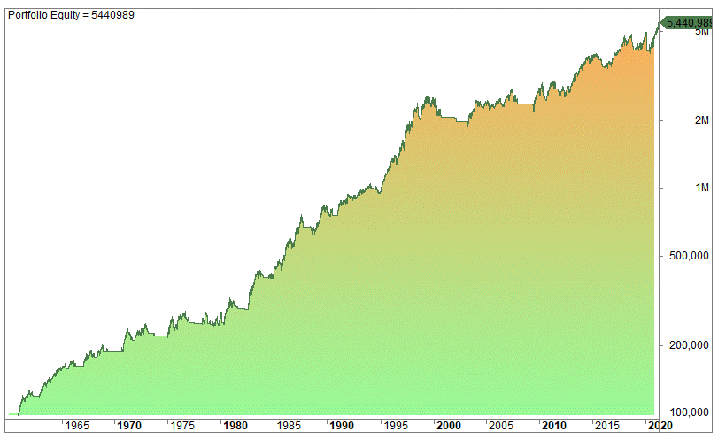

## Table of Contents

## What is a CTA Trading Strategy?

A CTA trading strategy refers to the approach used by Commodity Trading Advisors (CTAs), who are professional money managers or firms that specialize in trading futures, options, and other derivatives, typically in commodity markets but also across financial instruments like currencies, interest rates, and stock indices. These strategies are designed to generate returns for investors by capitalizing on market trends, price movements, or specific patterns, often in managed futures accounts.

The most common type of CTA strategy is **trend-following**, where the advisor uses technical analysis—think moving averages, breakouts, or momentum indicators—to identify and ride sustained price trends, whether upward or downward. For example, if crude oil prices start climbing consistently, a trend-following CTA might go long on futures contracts, aiming to profit as the trend continues. These strategies thrive in volatile markets with clear directional moves but can struggle during choppy, range-bound periods.

Other CTA strategies might include **systematic trading**, which relies on algorithms and predefined rules to execute trades without much human discretion—fast, data-driven, and emotion-free. There’s also **discretionary trading**, where the CTA leans on their experience and judgment, sometimes blending fundamentals like supply-demand shifts with technical signals. Some CTAs even dabble in **counter-trend** or **mean-reversion** plays, betting against prevailing trends or expecting prices to snap back to an average.

Performance-wise, CTAs often aim to deliver returns uncorrelated with traditional stocks and bonds, making them a hedge in diversified portfolios. They’re regulated in places like the U.S. by the CFTC and often registered with the NFA, so there’s a layer of oversight. Fees typically follow a “2 and 20” structure—2% management fee, 20% of profits—though that can vary.

## How does a CTA differ from other trading strategies?

I’ll assume you’re asking for a fresh angle since we’ve covered this before—let’s zoom in on some practical distinctions and nuances that set CTA trading strategies apart from others, avoiding overlap where we can.

A CTA strategy, rooted in the world of Commodity Trading Advisors, isn’t just about the trades—it’s about the ecosystem. Unlike a **swing trader** flipping stocks over a few days based on chart patterns, a CTA often wields futures contracts across diverse markets—think corn, [crude oil](/wiki/crude-oil), or the yen. They’re playing a broader field, where the leverage in futures (sometimes 10:1 or more) amplifies both wins and losses compared to the cash-based trades of a typical equity trader.

Take **options trading** as another contrast. An options trader might buy calls on Tesla, betting on a stock price surge, with risk capped at the premium paid. A CTA, though, might short S&P 500 futures if their system flags a downtrend, facing unlimited risk if the market reverses. The CTA’s game is less about [picking](/wiki/asset-class-picking) winners and more about riding momentum, often systematically. Options folks thrive on volatility and time decay; CTAs don’t sweat expiration dates as much since futures roll over.

Then there’s the **[forex](/wiki/forex-system) scalper**, pinging pips all day on EUR/USD with razor-thin margins. They’re in and out in minutes, glued to spreads. A CTA, by contrast, might hold a currency futures position for weeks, chasing a macro trend like a weakening dollar, guided by a model rather than gut instinct. The scalper’s frenetic pace clashes with the CTA’s patience.

What about **crypto trading**? A crypto trader might hodl Bitcoin or chase altcoin pumps on Binance, often driven by sentiment or news (Elon tweets, anyone?). CTAs rarely touch spot crypto—instead, they’d trade CME Bitcoin futures, sticking to regulated exchanges and structured strategies. Crypto’s wild swings might tempt a CTA’s trend-following algo, but the unregulated chaos? Not their vibe.

And here’s a big one: **portfolio allocation**. A traditional mutual fund manager balances stocks and bonds, chasing long-term growth tied to GDP or earnings. A CTA doesn’t care about “owning” assets—they’re agnostic, going long or short based on signals, aiming for absolute returns. When stocks crash, the mutual fund eats the loss; a CTA might profit from the chaos.

The kicker? CTAs are pros managing other people’s money, often with a “2 and 20” fee setup, under regulators’ watchful eyes. That’s miles from the lone wolf day trader or the [hedge fund](/wiki/hedge-fund-trading-strategies) guru betting billions on a single thesis. Their strategies—often trend-driven, futures-focused, and systematic—reflect that client-first, risk-managed DNA.

## Who uses CTA Trading Strategies?

CTA trading strategies are used by a mix of players, primarily tied to the world of managed futures and institutional investing, but their reach extends further. Here’s who’s typically in the game:

1. **Commodity Trading Advisors (CTAs) Themselves**: These are the core users—professional money managers or firms registered with bodies like the CFTC in the U.S. They deploy these strategies to manage client funds, often in pooled vehicles like commodity pools or separately managed accounts. Think firms like Winton Capital or Man AHL—big names with systematic, trend-following DNA.

2. **Institutional Investors**: Pension funds, endowments, and sovereign wealth funds tap CTAs to diversify their portfolios. Why? CTA returns often zig when stocks zag, offering a hedge against equity meltdowns. For example, a university endowment might allocate 5-10% to a CTA fund to smooth out returns during a market crash.

3. **Hedge Funds**: Some hedge funds either operate as CTAs or hire them as sub-advisors. Multi-strategy funds, especially, might weave CTA-style trend-following into their playbook alongside equity long-short or global macro bets. They’re chasing that uncorrelated alpha—profits not tied to the S&P 500’s mood swings.

4. **High-Net-Worth Individuals**: Wealthy folks with millions to invest often park money with CTAs through private placements or funds. They’re drawn by the promise of steady returns in choppy markets, plus the prestige of saying their cash is with a “sophisticated” manager. Minimum investments can start at $100,000 or more, so it’s not for the average Joe.

5. **Fund of Funds**: These outfits bundle multiple strategies, including CTAs, into one package for investors. They might mix a trend-following CTA with a distressed debt specialist, spreading risk. It’s a one-stop shop for diversification, and CTAs fit neatly into their “alternative investments” bucket.

6. **Sophisticated Retail Investors (Rarely)**: While CTAs cater to institutions and the ultra-rich, some retail traders with deep pockets or access to futures markets might mimic CTA strategies—like trend-following with moving averages—using their own capital. But they’re not “clients” of a CTA; they’re just borrowing the playbook. Think a DIY trader on Interactive Brokers with a knack for coding algos.

Who doesn’t use them? Your typical stock picker, day trader, or Robinhood newbie—they’re either too small-scale or focused on equities, not futures. CTAs thrive in a niche where scale, leverage, and market breadth matter, so their users are usually well-resourced and risk-savvy. Want me to zoom in on any of these groups?

## What markets do CTAs typically trade in?

Commodity Trading Advisors (CTAs) typically trade in a variety of markets, focusing primarily on futures and sometimes options contracts. These markets often include:

1. **Commodities**: This is a big one for CTAs—think agricultural products (like wheat, corn, or soybeans), energy (crude oil, natural gas), and metals (gold, silver, copper). Historically, this is where the "commodity" in their name comes from, though their scope has broadened over time.

2. **Financial Futures**: CTAs frequently trade futures on stock indices (like the S&P 500 or Nasdaq), bonds (government treasuries), and interest rates (short-term rates like Eurodollar futures). These markets offer liquidity and volatility, which suit their strategies.

3. **Currencies**: Foreign exchange futures (e.g., Euro, Yen, or British Pound against the Dollar) are another staple. CTAs often exploit trends in currency movements driven by macroeconomic shifts.

4. **Equity Indices**: Beyond commodities, many CTAs trade futures tied to global equity markets, such as the Dow Jones, FTSE, or Nikkei, capitalizing on broad market trends.

5. **Occasionally Options**: While futures are their bread and butter, some CTAs use options on these same markets to manage risk or enhance returns, though this is less common.

They tend to stick to highly liquid markets where they can execute large trades efficiently. Most CTAs use systematic, trend-following strategies—meaning they rely on algorithms to spot price momentum across these asset classes—though some employ discretionary or hybrid approaches. The diversity of markets helps them spread risk and chase opportunities wherever trends emerge.

## What are the main types of CTA Trading Strategies?

Commodity Trading Advisor (CTA) strategies are typically used by managed futures funds or hedge funds to generate returns by trading in futures markets, often focusing on commodities, currencies, interest rates, and equity indices. Here’s a breakdown of the main types of CTA trading strategies, explained in a straightforward way:

1. **Trend Following**  
   This is the most common CTA strategy. It involves identifying and riding price trends in futures markets, whether they’re going up (long positions) or down (short positions). Trend followers use technical indicators like moving averages or breakouts to spot momentum and stay in the trade until the trend reverses. It’s all about catching the big moves and ignoring the noise.

2. **Mean Reversion**  
   This strategy bets on prices returning to their historical average after moving too far in one direction. If a commodity’s price spikes or crashes beyond what’s typical, a mean-reversion trader might take the opposite position, expecting it to "snap back." It’s less about chasing trends and more about exploiting overreactions.

3. **Arbitrage**  
   Here, traders look for price differences between related markets or contracts—like a futures contract and its underlying asset—and profit from the gap. For example, they might trade the spread between two similar futures contracts (say, different expiration dates) when the pricing gets out of whack. It’s low-risk but requires precision and speed.

4. **Discretionary**  
   Unlike the systematic, rules-based approaches above, discretionary CTAs rely on human judgment. Managers analyze market conditions, economic data, or geopolitical events to make trading calls. It’s more flexible but depends heavily on the trader’s experience and intuition.

5. **Systematic Global Macro**  
   This blends automated trading with big-picture economic views. It uses algorithms to trade based on macroeconomic factors—like [interest rate](/wiki/interest-rate-trading-strategies) changes, currency fluctuations, or commodity supply shocks—across global markets. Think of it as trend following with an economic brain.

6. **Short-Term Trading**  
   Some CTAs focus on quick, intraday, or week-long trades rather than holding positions for months. They might use high-frequency data or volatility spikes to scalp small profits repeatedly. It’s fast-paced and requires tight risk controls.

Each of these strategies has its own risk-return profile. Trend following, for instance, can deliver big wins during volatile markets but might sit idle during choppy, trendless periods. Mean reversion shines when markets overreact but can get crushed if a trend keeps running. CTAs often mix these approaches to diversify and adapt to changing conditions.

## How do trend-following strategies work in CTA trading?

Trend-following strategies in CTA (Commodity Trading Advisor) trading are all about riding the momentum of price movements in financial markets. The core idea is simple: identify when an asset—whether it’s a commodity, currency, stock, or bond—is moving consistently in one direction, then jump on that wave and ride it until it shows signs of reversing. These strategies don’t try to predict why prices are moving; they just react to what’s happening.

Here’s how they typically work. Traders use systematic tools, often rooted in technical analysis, to spot trends. Think moving averages, breakouts, or momentum indicators. For example, if a 50-day moving average crosses above a 200-day moving average, that might signal an uptrend, prompting a buy. The strategy stays agnostic about the asset’s fundamentals—whether it’s oil spiking due to a supply shock or wheat dropping because of a bumper crop doesn’t matter. It’s all about the price action.

CTAs, which often manage futures contracts, thrive on this approach because futures markets are liquid and volatile, perfect for capturing big swings. They’ll go long (buy) in an uptrend or short (sell) in a downtrend, aiming to profit from persistence in the movement. Risk management is key, though—stops or trailing stops get used to cut losses if the trend fizzles out or reverses unexpectedly.

The beauty of trend-following is its simplicity, but it’s not foolproof. Markets can be choppy, with lots of false starts, leading to “whipsaw” losses where you buy high and sell low repeatedly. That’s why diversification across assets and timeframes (short-term, medium-term, or long-term trends) is common—smooths out the ride. Data backs this up: studies like those from AQR or Man Group show trend-following CTAs often shine during big market dislocations (think 2008 or 2020), when trends are strong, but they can lag in sideways markets.

In short, it’s a disciplined, reactive game. Spot the trend, ride it, get out when it’s done. No crystal ball required—just a good system and stomach for the occasional turbulence.

## What role does risk management play in CTA trading?

Risk management is the backbone of CTA trading—without it, even the best trend-following strategy would blow up eventually. Markets are unpredictable, and CTAs, dealing heavily in leveraged instruments like futures, face amplified gains *and* losses. Risk management keeps them in the game by limiting the damage when trades go south.

First off, it’s about controlling position size. CTAs don’t just bet the farm on one trade. They calculate how much capital to risk based on volatility—higher volatility means smaller positions, and vice versa. This often ties into something like the Kelly Criterion or a fixed fractional approach, where only a small percentage (say, 1-2%) of the portfolio is risked per trade. The idea is to survive a string of losses without wiping out.

Stops are another big piece. A stop-loss order automatically exits a position if the price moves against you by a set amount. For trend-followers, this might be a trailing stop that locks in profits as the trend progresses but cuts you out if it reverses. It’s a trade-off—too tight, and you’re kicked out by normal market noise; too loose, and you bleed unnecessarily. Getting this right is more art than science, often tuned by [backtesting](/wiki/backtesting) historical data.

Diversification plays a huge role too. CTAs spread bets across uncorrelated assets—say, gold, currencies, equities, and agricultural futures. If one market tanks, others might hold up or even profit, especially in crisis periods when trends diverge (like 2008, when bonds rallied as stocks crashed). This cuts portfolio-level risk without killing return potential.

Then there’s leverage control. Futures let you control big positions with little capital, but that’s a double-edged sword. CTAs monitor margin-to-equity ratios and adjust exposure to avoid margin calls or forced liquidations. Some even use dynamic risk models, like Value at Risk (VaR), to estimate worst-case scenarios and keep leverage in check.

Finally, it’s about staying disciplined. Emotional trading kills CTAs—risk management enforces the system. If a trend dies, you take the loss, not double down hoping for a miracle. Historical performance shows this pays off: trend-following CTAs often have low correlation to stocks, offering “crisis alpha” during meltdowns, but only because strict risk rules keep them solvent long enough to catch those tailwinds.

In essence, risk management in CTA trading isn’t just a safety net—it’s what turns a speculative strategy into a sustainable one. It’s less about avoiding risk entirely and more about knowing how much you can afford to lose while still playing the game.

## How do CTAs use leverage in their trades?

CTAs use leverage in their trades to amplify returns without tying up a ton of capital, and futures contracts—their bread and butter—make it possible. Leverage is like borrowing power: you control a large position with a small upfront investment, called margin. In CTA trading, this is a core mechanic that lets them punch above their weight, but it’s a tool they wield carefully because it magnifies both wins and losses.

Here’s how it works. When a CTA trades futures, they don’t pay the full value of the contract—just a fraction, typically 5-20% of the notional amount, deposited as margin with the broker. For example, if a crude oil futures contract controls 1,000 barrels at \$70 each (\$70,000 total), the margin might be \$5,000. With \$5,000, they’re leveraging \$70,000 worth of oil—a 14:1 ratio. If oil jumps to \$75, the contract’s now worth \$75,000, and they’ve made \$5,000 on a \$5,000 investment. That’s a 100% return on their margin, while the oil price only moved 7%. That’s leverage doing its thing.

CTAs lean on this to scale their trend-following strategies. Since they’re chasing price momentum across many markets—commodities, currencies, bonds, whatever’s trending—they can deploy capital efficiently. A \$100 million fund might control \$500 million in notional exposure, spreading it across dozens of assets. This diversification helps, because not every trade will pop, but the winners can outweigh the losers when amplified by leverage.

The catch? It’s a tightrope. If that oil price drops to \$65, the contract’s worth \$65,000, and they’re down \$5,000—wiping out the margin entirely if they don’t have extra cushion. That’s where risk management kicks in. CTAs adjust leverage dynamically, often using volatility measures like the Average True Range (ATR) to size positions. If a market’s wild, they dial back exposure; if it’s calm, they might crank it up. They also monitor margin-to-equity ratios to ensure they’re not overextended—too much leverage, and a bad move triggers a margin call, forcing them to liquidate at the worst time.

Some CTAs even layer on portfolio-level leverage, borrowing cash to boost overall exposure, but futures’ built-in leverage usually does the trick. The goal isn’t to max out—they’re not gamblers—but to optimize returns within a risk budget. Data from firms like Winton or AQR shows leverage is why CTAs can deliver outsized returns in trending markets, like during the 2020 commodity swings, but it’s also why discipline and stops are non-negotiable. Leverage is their rocket fuel; risk management keeps the ship from exploding.

## How do systematic CTAs differ from discretionary CTAs?

In [algorithmic trading](/wiki/algorithmic-trading), Commodity Trading Advisors (CTAs) employ two primary types of strategies: systematic and discretionary. Each plays a vital role in executing trades and managing investments across various futures and commodity markets.

**Systematic CTA Strategies**

Systematic [CTA](/wiki/cta-strategy) strategies rely heavily on algorithm-driven models that employ quantitative analysis and technical indicators to automate trading decisions. These strategies reduce emotional bias by creating a rigorous, rule-based framework for executing trades. A fundamental component of systematic strategies includes the use of algorithms to evaluate historical market data, identify patterns, and generate trading signals. Common techniques involve moving average crossovers, Bollinger Bands, and other technical indicators that quantify market trends and price movements.

For example, a simple moving average (SMA) crossover strategy might look like this in Python:

```python
import pandas as pd

# Assuming df is a pandas DataFrame with 'Close' as one of the columns
df['SMA_short'] = df['Close'].rolling(window=20).mean()
df['SMA_long'] = df['Close'].rolling(window=50).mean()

# Buying when short SMA crosses above the long SMA
df['Signal'] = 0
df.loc[df['SMA_short'] > df['SMA_long'], 'Signal'] = 1
```

By minimizing human intervention, systematic strategies provide consistency and scalability, making them particularly suited for large, diversified portfolios. However, these strategies can be rigid, as they rely solely on historical data and predefined rules. They might struggle in volatile or rapidly changing market conditions where human judgment could be advantageous.

**Discretionary CTA Strategies**

Discretionary strategies, contrasting with systematic ones, allow for human intervention in the trading process. These strategies benefit from the trader's expertise, intuition, and insights into market conditions, offering flexibility and adaptability. Traders can interpret qualitative information such as economic news, geopolitical events, and behavioral finance cues, which are typically out of reach for purely systematic approaches.

The discretionary approach can be particularly useful in scenarios where markets are reacting to unprecedented events, as experienced traders can adjust their strategies based on perceived opportunities or risks. However, this method is subject to the practitioner's biases and emotional influences, which can sometimes lead to inconsistent decision-making.

**Choice Between Systematic and Discretionary Strategies**

The decision to employ systematic or discretionary strategies often depends on the CTAs' objectives, risk tolerance, and market conditions. Systematic strategies might be preferable for those seeking a methodical and less emotional approach, while discretionary strategies could appeal to those who value flexibility and human insight.

Understanding the strengths and weaknesses of each strategy type is critical for CTAs looking to optimize their performance. A well-rounded CTA might integrate both approaches, leveraging the systematic models' consistency alongside the discretionary strategies' adaptability to achieve a robust and diversified trading operation.

## What are the key performance metrics for evaluating a CTA strategy?

Evaluating a CTA strategy boils down to a handful of key performance metrics that tell you how well it’s making money, handling risk, and staying consistent. These metrics are practical yardsticks, not just academic fluff, and they’re what investors and managers obsess over to separate the winners from the washouts.

First up is **absolute return**—how much the strategy earns over a set period, usually annualized. It’s the raw score: a CTA returning 10% a year sounds nice, but it’s meaningless without context. That’s where **Sharpe Ratio** comes in, probably the most cited metric. It’s the return above a risk-free rate (like T-bills) divided by the standard deviation of returns. A Sharpe of 1.0 or higher is solid—it means you’re getting decent reward per unit of volatility. Trend-followers often target this, since their returns can be bumpy but payoff big in trending markets.

Next, **drawdowns** are critical—how much the strategy loses from peak to trough. Max drawdown (the worst drop ever) gets the most attention; if it’s -25%, you’re asking investors to stomach a big hole. Average drawdown and recovery time matter too—how often do you dip, and how fast do you climb back? CTAs with max drawdowns under 15-20% and quick recoveries tend to keep clients happier, especially since leverage can make losses sting harder.

**Volatility** (standard deviation of returns) is another must-watch. Low volatility might mean steady gains, but CTAs often embrace higher volatility for bigger payoffs—think 15-20% annualized vol versus a stock market’s 10-15%. It’s a trade-off: too smooth, and you’re not capturing enough trends; too wild, and you scare off investors.

**Win/loss ratio** and **profit factor** dig into trade-level performance. Win/loss is just the percentage of winning trades—trend-followers might hover around 40-50% since they cut losers fast and ride winners long. Profit factor (total profits divided by total losses) drills deeper; above 1.5 is strong, showing winners outweigh losers by a good margin.

**Correlation** to broader markets, like the S&P 500, is a big deal too. CTAs often pitch low or negative correlation (0.2 or less, ideally), especially trend-followers who shine when stocks tank—like in 2008. It’s their “crisis alpha” calling card, proving they’re not just riding the equity wave.

Finally, **alpha** (excess return over a benchmark) and **beta** (market sensitivity) round it out. Positive alpha says the strategy’s skill, not just market luck, is driving returns. Low beta ties back to that uncorrelated promise.

Put it together, and a good CTA might show a Sharpe above 1, max drawdown under 20%, low stock correlation, and a profit [factor](/wiki/factor-investing) over 1.5. No single metric rules, though—it’s the mix that matters, balancing profit, risk, and reliability. Historical data from the SG CTA Index or BarclayHedge backs this: top performers consistently hit these marks, especially in volatile years.

## How do CTAs adapt to changing market conditions?

CTAs adapt to changing market conditions by leaning on their systematic nature, tweaking their models, and staying flexible without abandoning their core principles. Since most CTAs, especially trend-followers, rely on rules-based strategies, they’re built to react to what the market throws at them rather than predict it. The trick is in how they adjust their approach when trends shift, volatility spikes, or correlations flip.

One big way they adapt is through **dynamic signal adjustments**. Their algorithms—often based on moving averages, breakouts, or momentum—aren’t static. They use adaptive parameters, like shortening the lookback period (say, from 200 days to 50 days) when markets get choppy, to catch shorter, faster trends. In quiet markets, they might stretch it out to filter noise and snag longer moves. Some even use [machine learning](/wiki/machine-learning) to weigh which indicators work best in real time, though most stick to simpler, battle-tested tweaks.

**Volatility scaling** is another key lever. When markets go haywire—like during a 2020 pandemic crash—CTAs don’t just plow ahead with the same leverage. They adjust position sizes based on current volatility, often using metrics like ATR (Average True Range). If volatility doubles, they might halve their exposure to keep risk steady. This keeps them from getting wiped out when swings get wild and lets them ramp up when things calm down.

**Diversification** across assets and strategies helps too. CTAs don’t just trade one market—they spread bets across commodities, currencies, bonds, and equities. When stocks tank but bonds rally (think 2008), or when oil spikes while grains flatline (like 2022), they’re positioned to catch whichever trend fires. Some blend trend-following with mean-reversion or carry trades, so if trending dries up, other signals can pick up the slack.

**Timeframe flexibility** is a quieter weapon. CTAs often run models across short-term (days), medium-term (weeks), and long-term (months) horizons. In choppy, trendless markets, short-term trades might dominate; in sustained bull or bear runs, long-term takes over. This mix lets them pivot without overhauling everything.

They also **monitor correlations** closely. Markets can flip from fragmented to lockstep—like when everything crashed together in March 2020. CTAs adjust by dialing back on crowded trades or overweighting uncorrelated assets (say, gold or yen) to maintain that low-beta edge they’re known for.

Finally, **stress testing and backtesting** keep them sharp. They constantly rerun models against historical crises—1970s oil shocks, 1987’s Black Monday, 2008’s meltdown—to tune risk controls and ensure the system holds up. If a new regime emerges (like persistent inflation post-2021), they’ll tweak parameters or add filters, but rarely ditch the trend-following DNA.

In practice, this adaptability shines in big shifts. Look at 2022: rising rates and commodity spikes handed trend-following CTAs double-digit gains while stocks bled. They didn’t “predict” inflation—they rode the price action with disciplined adjustments. It’s less about outsmarting the market and more about staying nimble, systematic, and unemotional when conditions turn. That’s their edge.

## What impact do fees and costs have on CTA trading profitability?

Fees and costs can take a hefty bite out of CTA trading profitability, especially since these strategies often rely on high turnover and leverage to generate returns. They’re not just a minor annoyance—they directly erode the net performance investors see, and in a game where edges are thin, they can make or break a strategy’s viability.

The big hitters are **management fees** and **performance fees**, the classic “2 and 20” model many CTAs charge: 2% of assets under management annually, plus 20% of profits. On a \$100 million fund, that’s \$2 million off the top, regardless of performance, and \$2 million more if returns hit 10% (\$10 million gross). If gross returns are only 5%, the performance fee drops to \$1 million, but the management fee still stings. For smaller funds or leaner years, this can shrink net returns to investors dramatically—say, turning a 10% gross return into 6-7% net.

Then there’s **trading costs**, which pile up fast in CTA land. Futures trading racks up commissions—maybe \$1-5 per contract, depending on the broker and [volume](/wiki/volume-trading-strategy). For a CTA executing hundreds or thousands of trades monthly, that’s real money—\$50,000 or more a year on a modest scale. Add in **bid-ask spreads**, which widen in volatile or illiquid markets (think lean hogs versus S&P 500 futures). A trend-follower chasing breakouts might pay a few basis points per trade, and with leverage amplifying position sizes, those slivers compound. Slippage—when your order fills at a worse price than expected—kicks in too, especially in fast markets or with big positions.

**Leverage costs** creep in via margin interest or funding. While futures have built-in leverage, holding positions ties up capital, and some CTAs borrow to juice exposure further. Borrowing at, say, 4-5% in a high-rate environment like 2023 eats into returns if the strategy doesn’t outpace it. Even without explicit borrowing, opportunity cost matters—cash stuck in margin isn’t earning elsewhere.

**Taxes** can nick profitability too, though this hits investors more than the CTA itself. Futures gains in the U.S. get a 60/40 long-term/short-term capital gains split, which is tax-efficient compared to stocks, but it’s still a drag on net returns, especially for high-frequency strategies.

The impact? It’s all about the margin. A CTA targeting 10-15% gross annualized returns—common for trend-followers—might see 3-5% shaved off by fees and costs, leaving 5-10% net. In a banner year like 2022, when some CTAs posted 20-30% gross, fees hurt less relatively. But in flat years, like parts of the 2010s when trend signals were weak, a 3-5% gross return could turn negative net. Historical data from the SG CTA Index shows this: net returns often lag gross by 4-6% annually, reflecting the fee grind.

Smart CTAs fight back by optimizing—negotiating lower commissions, scaling trades to minimize slippage, or passing costs to clients via pass-through fees. But there’s no escaping it entirely: fees and costs are a structural headwind. For investors, it’s why picking a CTA with a strong gross return edge—and reasonable fee terms—matters so much. A few percent sounds small, but over time, it’s the difference between thriving and treading water.

## What is the difference between Trend Following and Momentum-Based CTA strategies?

Trend following strategies are a fundamental component of Commodity Trading Advisors (CTAs) approaches, focusing on capturing profits from prolonged directional market movements. This strategy involves entering trades in the same direction as the existing market trend, either through long positions—anticipating upward movements—or short positions for downward trends. The key to [trend following](/wiki/trend-following) is identifying trends early on and holding positions as long as the trend persists.

Momentum-based strategies, by contrast, target short-term price fluctuations to exploit temporary market inefficiencies. These strategies seek to gain from assets that are exhibiting continued movement in a specific direction, often over shorter time frames compared to trend following.

Both trend following and [momentum](/wiki/momentum)-based strategies rely heavily on technical indicators to inform decision-making regarding entry and [exit](/wiki/exit-strategy) points. Common indicators include moving averages, which help determine the direction of the trend; momentum oscillators, which measure the speed and change of price movements; and specific price patterns that may signal upcoming shifts or continuations in market trends.

For example, a simple moving average crossover system—where a short-term moving average crosses above a long-term moving average—may be used in trend following to generate buy signals. In Python, this could be implemented as follows:

```python
import pandas as pd

def moving_average_crossover(data, short_window=40, long_window=100):
    data['Short_MA'] = data['Close'].rolling(window=short_window, min_periods=1).mean()
    data['Long_MA'] = data['Close'].rolling(window=long_window, min_periods=1).mean()

    data['Signal'] = 0
    data['Signal'][short_window:] = \
        np.where(data['Short_MA'][short_window:] > data['Long_MA'][short_window:], 1, 0)

    data['Position'] = data['Signal'].diff()
    return data

# Example usage
price_data = pd.DataFrame({'Close': [/* list of closing prices */]})
signals = moving_average_crossover(price_data)
```

The success of both trend following and momentum strategies largely depends on generating accurate signals and employing robust risk management techniques. Signal generation is critical to identifying profitable entry and exit points, while effective risk management helps to protect against adverse market movements and maintain the overall health of the trading portfolio. Techniques such as position sizing, stop-loss orders, and portfolio diversification are commonly employed to manage risk effectively.

Ultimately, the efficacy of trend following and momentum strategies in CTA operations is a balance between leveraging past price behavior to predict future movements and managing potential risks through strategic forethought and technology.

## How do CTAs manage diversification and correlation in their trading strategies?

Diversification is a fundamental principle of Commodity Trading Advisor (CTA) strategies, designed to mitigate risk by employing investments across a spectrum of uncorrelated markets. CTAs aim to manage risk and enhance returns by constructing diversified portfolios that integrate a multitude of asset classes, including equities, bonds, commodities, and currencies. By doing so, CTAs can lessen the exposure to market-specific risks and increase the overall portfolio stability.

The utilization of diverse instruments, such as equity, bond, commodity, and currency futures, is crucial in cushioning portfolios against specific market [volatility](/wiki/volatility-trading-strategies). This approach not only spreads risk across different asset classes but also ensures that an adverse movement in one market does not uniformly affect the entire portfolio.

Correlation analysis plays a pivotal role in diversification, as it helps identify the degree to which two or more strategies or assets move in relation to each other. Low or negative correlation between assets is desirable, as it indicates that they are less likely to experience losses simultaneously. In mathematical terms, the correlation coefficient $\rho$ between two assets $X$ and $Y$ is given by:

$$

\rho(X, Y) = \frac{\text{Cov}(X, Y)}{\sigma_X \sigma_Y} 
$$

where $\text{Cov}(X, Y)$ is the covariance between assets $X$ and $Y$, and $\sigma_X$ and $\sigma_Y$ are the standard deviations of $X$ and $Y$, respectively. A correlation coefficient close to zero or negative suggests low or inverse correlation, ideal for diversification purposes.

Incorporating uncorrelated strategies or assets can significantly stabilize returns and mitigate the impacts of market volatility. This is because uncorrelated assets provide a buffer against market fluctuations, ensuring that while some assets in the portfolio may decline in value, others may remain stable or increase, thus preserving the portfolio's overall value. In practice, this could involve a systematic inclusion of assets exhibiting historically low correlation, monitored and adjusted continuously to reflect changing market conditions.

To illustrate this, a Python script can be employed to compute correlation matrices, facilitating the identification of diversification opportunities:

```python
import numpy as np
import pandas as pd

# Sample data for asset returns
data = {
    'Equity': [0.05, 0.02, -0.01, 0.04, -0.02],
    'Bond': [0.02, 0.01, 0.00, 0.03, 0.01],
    'Commodity': [-0.01, 0.02, 0.03, -0.02, 0.04],
    'Currency': [0.00, -0.01, 0.01, 0.02, -0.01]
}

df = pd.DataFrame(data)
correlation_matrix = df.corr()

print(correlation_matrix)
```

The output correlation matrix provides a clear view of the relationships between different asset classes, guiding the allocation decisions within CTA strategies. By employing such analytical tools, CTAs can ensure that their diversification efforts are both effective and informed by quantitative insights.


## References & Further Reading

[1]: Carver, R. (2019). ["Systematic Trading: A unique new method for designing trading and investing systems."](https://www.amazon.com/Systematic-Trading-designing-trading-investing/dp/0857194453) Harriman House.

[2]: Covel, M. (2017). ["Trend Following: How to Make a Fortune in Bull, Bear, and Black Swan Markets."](https://www.amazon.com/Trend-Following-5th-Fortune-Markets/dp/1119371872) Wiley.

[3]: Katz, J. O., & McCormick, D. L. (2000). ["The Encyclopedia of Trading Strategies."](https://www.amazon.com/Encyclopedia-Trading-Strategies-Jeffrey-Ph-D/dp/0070580995) McGraw-Hill.

[4]: Pardo, R. (2008). ["The Evaluation and Optimization of Trading Strategies."](https://onlinelibrary.wiley.com/doi/book/10.1002/9781119196969) Wiley Finance.

[5]: Schwager, J. (2017). ["Hedge Fund Market Wizards."](https://books.google.com/books/about/Hedge_Fund_Market_Wizards.html?id=eAR5mPSK9voC) Wiley.

[6]: [Comparing CTA Strategies CME Group](https://www.cmegroup.com/education/courses/managed-futures/comparing-cta-strategies.html)

[7]: [CTA Trading Strategy QuantifiedStrategies.com](https://www.quantifiedstrategies.com/cta-trading-strategy/)

[8]: [Introduction to CTAs EurekaHedge](https://www.eurekahedge.com/Research/News/1388/Introduction-to-CTAs-and-their-Role-in-Portfolio-Allocations)

[9]: [A Guide to Trend Following Strategies SSRN](https://papers.ssrn.com/sol3/papers.cfm?abstract_id=4438260)

[10]: [A Century of Evidence on Trend-Following Investing AQR](https://www.aqr.com/Insights/Research/Journal-Article/A-Century-of-Evidence-on-Trend-Following-Investing)

[11]: [AQR Trend-Following Strategies Return Bloomberg](https://www.bloomberg.com/news/articles/2022-10-06/aqr-trend-following-strategies-return-as-much-as-70-in-big-year)

[12]: [Position sizing methods for a trend following CTA Semantic Scholar](https://www.semanticscholar.org/paper/Position-sizing-methods-for-a-trend-following-CTA-Sandberg-%C3%96hman/2b95598e0a78ff4c50e52f620192cd229cd980b4)

[13]: [Exploration of CTA Momentum Strategies Using ETFs QuantPedia](https://quantpedia.com/exploration-of-cta-momentum-strategies-using-etfs/)

[14]: [CTA Strategies and Algo Trading PapersWithBacktest](https://wiki.paperswithbacktest.com/glossary/cta-strategies)

[15]: [Revisiting Trend-Following CTAs HedgeNordic](https://hedgenordic.com/2020/06/revisiting-trend-following-ctas/)

[16]: [Trend-Following Primer Graham Capital Management](https://www.grahamcapital.com/blog/trend-following-primer/)

[17]: [What is a CTA? Strategic Investment Solutions RJOasis](https://www.rjoasis.com/what-is-a-cta/)

[18]: [Commodity Trading Advisor (CTA) Definition Investopedia](https://www.investopedia.com/terms/c/cta.asp)

[19]: [CTA Trading Strategy – The Only System You Need To Use TradingStrategyGuides](https://tradingstrategyguides.com/cta-trading-strategy/)