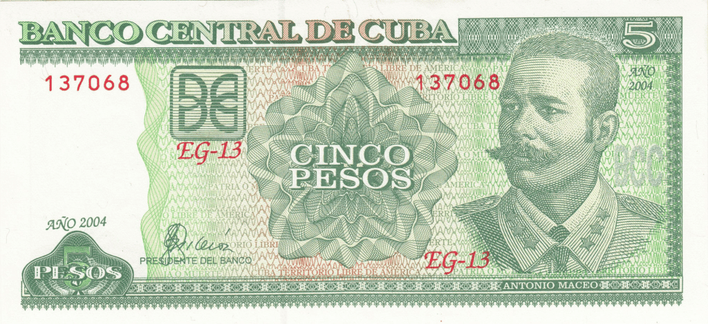

## Table of Contents

## What is the Cuban Peso?

The Cuban Peso is the official money used in Cuba. It is also called CUP. People in Cuba use this money to buy things like food, clothes, and other stuff they need. The symbol for the Cuban Peso is "$" or "CUP". Just like other countries have their own money, Cuba has the Cuban Peso.

There are coins and paper money in Cuban Pesos. The coins come in different amounts like 1, 3, 5, 20, and 40 centavos, and 1 peso. The paper money comes in bigger amounts like 1, 3, 5, 10, 20, 50, 100, 200, 500, and 1000 pesos. When people visit Cuba, they need to change their money into Cuban Pesos to use it there.

## What is the symbol and code for the Cuban Peso?

The symbol for the Cuban Peso is "$" or sometimes "₱". This symbol is used on coins and paper money in Cuba to show the amount of money.

The code for the Cuban Peso is "CUP". This code is used around the world to talk about the Cuban Peso in a way that everyone understands. It helps when people need to change their money into Cuban Pesos or when they are talking about money in Cuba.

## How is the Cuban Peso used in daily transactions in Cuba?

In Cuba, people use the Cuban Peso for everyday things like buying food, clothes, and paying for services. When someone goes to a store, they might buy bread, milk, or fruits and pay with Cuban Pesos. The shopkeeper will give them change in Cuban Pesos too. If someone needs to take a taxi or a bus, they use Cuban Pesos to pay for the ride. People also use Cuban Pesos to pay for things like electricity and water bills.

Sometimes, people in Cuba might use another kind of money called the Cuban Convertible Peso (CUC), but the regular Cuban Peso is what most people use every day. The government and businesses in Cuba set prices in Cuban Pesos, so it's important for everyone to have some. When tourists visit Cuba, they need to change their money into Cuban Pesos to buy things. This way, both locals and visitors can use the Cuban Peso to get what they need.

## What is the history of the Cuban Peso?

The Cuban Peso has a long history that goes back to when Cuba was a Spanish colony. In the 1800s, Cuba used Spanish coins, but in 1857, they started making their own money. The first Cuban Pesos had pictures of famous people and important places on them. After Cuba became independent from Spain in 1898, they kept using the Cuban Peso. Over time, the money changed a lot because of different governments and economic changes.

In 1961, after the Cuban Revolution, the government made big changes to the money. They introduced a new kind of money called the Cuban Convertible Peso (CUC) in 1994 to help with the country's economy. The regular Cuban Peso (CUP) stayed the same, but now there were two kinds of money in Cuba. This made things a bit confusing, but people still used the Cuban Peso every day. The government is now working on making the money system simpler by getting rid of the CUC and using only the Cuban Peso.

## When was the Cuban Peso first introduced?

The Cuban Peso was first introduced in 1857, when Cuba was still a colony of Spain. Before that, Cuba used Spanish coins. The first Cuban Pesos had pictures of important people and places on them. This was a big step for Cuba because it meant they were starting to make their own money, even though they were still part of Spain.

After Cuba became independent from Spain in 1898, they kept using the Cuban Peso. Over the years, the money changed a lot because of different governments and economic changes. In 1961, after the Cuban Revolution, the government made big changes to the money. They introduced a new kind of money called the Cuban Convertible Peso (CUC) in 1994, but the regular Cuban Peso (CUP) stayed the same and was still used every day by the people of Cuba.

## What major events have affected the value of the Cuban Peso?

The value of the Cuban Peso has been affected by many big events. One important event was the Cuban Revolution in 1959. After the revolution, the new government made big changes to the economy and the money. They wanted to control the economy better, so they changed how the Cuban Peso worked. This made the value of the Cuban Peso go up and down a lot over the years. Another event was the fall of the Soviet Union in 1991. Cuba used to get a lot of help from the Soviet Union, but when it fell, Cuba's economy got really bad. This made the Cuban Peso lose a lot of its value.

In 1994, the government introduced a new kind of money called the Cuban Convertible Peso (CUC). They did this to try and fix the economy, but it made things more confusing because now there were two kinds of money in Cuba. The CUC was worth more than the regular Cuban Peso (CUP), and this made the value of the CUP go down even more. In recent years, the government has been trying to get rid of the CUC and use only the Cuban Peso again. They hope this will make the economy stronger and the value of the Cuban Peso more stable.

## What is the difference between the Cuban Peso (CUP) and the Cuban Convertible Peso (CUC)?

The Cuban Peso (CUP) and the Cuban Convertible Peso (CUC) are two types of money used in Cuba. The CUP is the regular money that most people in Cuba use every day. It is used to buy things like food, clothes, and to pay for services like bus rides and electricity bills. The symbol for the CUP is "$" or "₱", and its code is "CUP". On the other hand, the CUC was introduced in 1994 to help the economy. It was meant for tourists and for buying things that were hard to find in Cuba. The symbol for the CUC is "$" with a different design, and its code is "CUC".

The main difference between the two is their value and how they are used. The CUC is worth a lot more than the CUP. When it was first introduced, 1 CUC was equal to 1 US dollar, while 1 CUC was equal to 25 CUP. This made the CUC more valuable and it was used in special shops and for some services that needed foreign money. The CUP, being less valuable, was used for everyday things that most people could afford. The government is now trying to get rid of the CUC and use only the CUP to make things simpler and to help the economy.

## How has the Cuban government managed the exchange rate of the Cuban Peso?

The Cuban government has managed the exchange rate of the Cuban Peso by controlling how much it is worth compared to other money. They do this because they want to keep the economy stable. For a long time, the government set a fixed rate for the Cuban Peso, which means they decided how many Cuban Pesos you could get for one US dollar or other foreign money. This helped them control the economy but sometimes made it hard for people to get foreign money.

In 1994, the government introduced the Cuban Convertible Peso (CUC) to help with the economy. They set the exchange rate so that 1 CUC was equal to 1 US dollar, but 1 CUC was worth 25 regular Cuban Pesos (CUP). This made things complicated because there were two kinds of money in Cuba. The government is now trying to make the money system simpler by getting rid of the CUC and using only the CUP. They hope this will make the exchange rate easier to manage and help the economy grow.

## What are the current economic policies affecting the Cuban Peso?

The Cuban government is working on making the money system simpler by getting rid of the Cuban Convertible Peso (CUC) and using only the Cuban Peso (CUP). This big change started in January 2021. They hope that using just one kind of money will make the economy stronger and the value of the Cuban Peso more stable. To do this, they are changing how much the Cuban Peso is worth compared to other money. They are also trying to make it easier for people to buy things they need.

Another important policy is about controlling prices. The government wants to stop prices from going up too fast, so they are watching how much things cost and setting rules for businesses. They are also trying to make more things in Cuba instead of buying them from other countries. This is hard because Cuba does not have a lot of money to spend on new factories or machines. The government is also trying to get more tourists to come to Cuba because they bring in money that helps the economy.

## How does the Cuban Peso compare to other Caribbean currencies?

The Cuban Peso (CUP) is different from other Caribbean currencies because Cuba has its own money system. Many Caribbean countries use the US dollar or have their money linked to the US dollar, but Cuba uses the CUP and used to use the Cuban Convertible Peso (CUC) too. The CUP is not as strong as some other Caribbean currencies like the Bahamian Dollar or the Barbados Dollar. This means that 1 CUP is worth less than 1 of these other currencies. For example, if you want to change your CUP into Bahamian Dollars, you will get fewer Bahamian Dollars than if you started with US dollars.

In some Caribbean countries, like Jamaica, the money is worth less than the US dollar, but it is still stronger than the CUP. The Jamaican Dollar is used a lot in Jamaica, and it is worth more than the CUP. This means that if someone from Cuba goes to Jamaica, they will need more CUP to buy the same things they would buy in Cuba. Other Caribbean countries, like the Dominican Republic, use the Dominican Peso, which is also worth more than the CUP. So, when people compare the Cuban Peso to other Caribbean currencies, they see that the CUP is usually worth less, making it harder for Cubans to buy things from other countries in the Caribbean.

## What are the future projections for the Cuban Peso's stability and value?

The future of the Cuban Peso's stability and value depends a lot on the changes the Cuban government is making. They are trying to make the money system simpler by getting rid of the Cuban Convertible Peso (CUC) and using only the Cuban Peso (CUP). This big change started in January 2021. They hope that using just one kind of money will make the economy stronger and the value of the Cuban Peso more stable. If the government can control prices and make more things in Cuba, the Cuban Peso might become more valuable. But it will take time and a lot of work.

It is hard to say exactly what will happen to the Cuban Peso because Cuba's economy faces many challenges. The country does not have a lot of money to spend on new factories or machines, and they need to buy things from other countries. The government is also trying to get more tourists to come to Cuba because they bring in money that helps the economy. If more tourists come and the government can make the economy grow, the Cuban Peso might become more stable and worth more. But if things do not go well, the value of the Cuban Peso could stay low or even go down.

## How do international trade and sanctions impact the Cuban Peso?

International trade and sanctions have a big impact on the Cuban Peso. Cuba needs to buy things from other countries, like food and medicine, but the US and other countries have put sanctions on Cuba. This makes it hard for Cuba to trade with other countries and get the money it needs. When Cuba cannot trade easily, it has less money coming in, which makes the Cuban Peso weaker. The sanctions also make it hard for Cuba to get loans or help from other countries, which adds to the problem.

The Cuban government tries to manage the Cuban Peso's value by controlling how much it is worth compared to other money. But the sanctions and limited trade make it hard for them to do this well. When Cuba cannot sell things like sugar or tobacco to other countries, it loses money that could help keep the Cuban Peso strong. The government is trying to make more things in Cuba and get more tourists to come, but the sanctions make these things harder to do. So, the value of the Cuban Peso stays low because of these international problems.

## References & Further Reading

[1]: Ritter, Arch. (2010). "[The Cuban Economy: Historical Trajectories and Current Trends](https://studylib.net/doc/6940537/archibald-ritter-%E2%80%9Cthe-cuban-economy--revolution--1959-1990)." University of Pittsburgh Press.

[2]: Mesa-Lago, Carmelo. (2000). "[Market, Socialist, and Mixed Economies: Comparative Policy and Performance -- Chile, Cuba, and Costa Rica](https://archive.org/details/marketsocialistm0000carm)." Johns Hopkins University Press.

[3]: Feinberg, Richard E. (2016). "[Open for Business: Building the New Cuban Economy](https://www.amazon.com/Open-Business-Building-Cuban-Economy/dp/0815727674)." Brookings Institution Press.

[4]: Vilariño, Sixto and Leandro, Raul M. (2020). "[Cuba: Detailed Assessment Report on Anti-Money Laundering and Combating Financing of Terrorism](https://www.imf.org/en/Publications/CR/Issues/2016/12/31/Rwanda-Detailed-Assessment-Report-Anti-Money-Laundering-and-Combating-the-Financing-of-43158)." International Monetary Fund Country Report.

[5]: Zhang, Albert. (2018). "[Algorithmic Trading: Winning Strategies and Their Rationale](https://github.com/zazhang/ep-chan-book-algo-trading)." Wiley Trading.