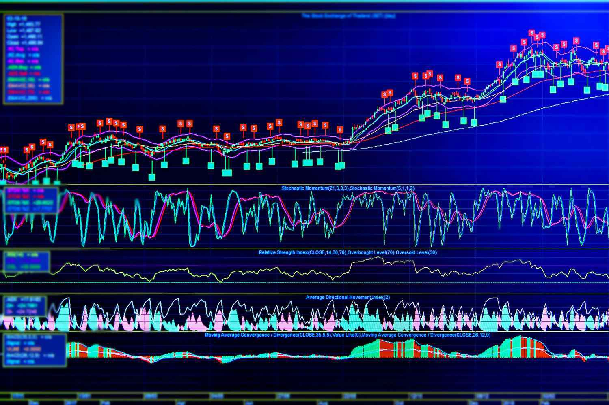

In the fast-paced world of financial markets, being well-versed in bond investments and algorithmic trading is crucial for constructing a diversified investment portfolio. Bonds, as a staple of financial markets, offer varying investment opportunities through their coupon structures—specifically, the distinction between cum coupon and ex-coupon bonds. A cum coupon bond includes the accrued interest in its price, making it an attractive option for investors looking to maximize returns by purchasing the bond before the coupon payment is made. This characteristic significantly affects bond pricing and informs trading strategies across different markets.

Algorithmic trading, meanwhile, has become an indispensable tool for investors seeking to enhance the precision and speed of their trading decisions. The integration of advanced computation and real-time data analysis allows for optimized execution of trades and strategic investment management. This article will clarify the meaning of cum coupon in the context of bond markets and address the impact of algorithmic trading on bond investments. As financial markets continue to evolve digitally, understanding these components is essential for traders and investors aiming to improve portfolio performance and achieve superior returns.



## Table of Contents

## Understanding Cum Coupon in Bond Investments

The cum coupon term is a fundamental concept in the secondary market for bonds, signifying that a bond is sold with the upcoming coupon payment attached. This characteristic results from the bondholder of record at the next coupon payment date being entitled to receive the interest payment. Consequently, when a bond is traded cum coupon, its price reflects the inclusion of this interest, typically resulting in a higher price than that of an ex-coupon bond, which does not include the upcoming interest payment.

In the United States, bonds are predominantly traded on a cum coupon basis. This practice contrasts with Europe, where the ex-coupon basis is more common. The distinction between these pricing conventions is crucial for international investors who must navigate varying practices in different markets. Trading on a cum coupon basis in the U.S. means that buyers must compensate sellers for the accrued interest since the last coupon payment, which can add complexity to the investment process.

From a valuation perspective, understanding cum coupon dynamics is essential as it aids investors in assessing the true comparative value and profitability of specific bonds. The adjusted price includes not just the principal and interest accrued but must be calculated accurately to establish a fair market value.

### Formula for Cum Coupon Pricing

The price of a cum coupon bond can be calculated as follows:

$$

P_{\text{cum coupon}} = P_0 + \text{Accrued Interest} 
$$

Where:
- $P_0$ is the clean price of the bond (price excluding accrued interest).
- $\text{Accrued Interest} = \frac{C \times (t)}{T}$
  - $C$ is the annual coupon payment.
  - $t$ is the number of days from the last coupon payment to the settlement date.
  - $T$ is the total number of days in the coupon period.

This calculation accounts for the interest the seller has earned up to the point of sale, ensuring a fair transaction price.

### Implications for Investors

Investors, particularly those active in multiple international markets, benefit from understanding these conventions. A thorough grasp of cum coupon versus ex-coupon pricing can offer strategic advantages. For instance, buying ex-coupon bonds may be advantageous if the investor believes bond prices will rise, as they are initially less expensive due to not including pending interest payments.

In essence, recognizing when a bond trades cum coupon can facilitate more informed investment choices, allowing investors to sharpen their trading strategies and potentially maximize returns by accurately pricing bonds to reflect the total value offered, including the immediate income from accrued interest payments.

## Bond Valuation and Coupon Calculation

A bond's valuation is a multifaceted process influenced predominantly by its coupon rate, the creditworthiness of the issuing entity, and the prevailing market interest rates. The coupon rate represents the annual [interest rate](/wiki/interest-rate-trading-strategies) paid by the bond's issuer on the bond's face value. For instance, a bond with a face value of $1,000 and a coupon rate of 5% would pay $50 annually. This rate serves as a fixed return to investors, typically distributed in semi-annual payments.

### Factors Influencing Bond Valuation

1. **Coupon Rate**: The coupon rate directly impacts the bond's price when considered alongside current market interest rates. In a scenario where the bond's coupon rate is higher than prevailing interest rates, the bond typically trades at a premium. Conversely, if the coupon rate is lower, the bond may trade at a discount.

2. **Issuer's Creditworthiness**: This metric plays a pivotal role in bond valuation. Bonds issued by entities with high credit ratings are usually deemed safer, which may lead to lower yields compared to bonds issued by entities with lower credit ratings due to the higher risk factor.

3. **Market Interest Rates**: The bond's price is inversely related to interest rates. When interest rates rise, existing bonds with lower coupon rates become less attractive, causing their prices to fall. Conversely, if interest rates decline, these bonds increase in price.

### Calculating Bond Coupons

Calculating bond coupons involves assessing the bond’s annual coupon payment using the formula:
$$
\text{Annual Coupon Payment} = \text{Coupon Rate} \times \text{Face Value}
$$

For example, consider a bond with a face value of $1,000 and a coupon rate of 4%. The annual coupon payment would be:
$$
0.04 \times 1000 = \$40
$$

#### Example Calculation
Let’s calculate the coupon payment for a bond with a face value of $2,000 and a 6% coupon rate:
$$
0.06 \times 2000 = \$120 \, \text{annually}
$$

### Common Pitfalls

- **Ignoring Market Interest Changes**: Neglecting shifts in market interest rates can lead to overvaluation or undervaluation of bond prices.
- **Overlooking Credit Ratings**: A failure to consider changes in the credit rating of the bond issuer may result in an inaccurate assessment of the bond's risk and value.

### Time Value of Money and Total Returns

The time value of money is a fundamental aspect of bond valuation. It encompasses the concept that a dollar received today is worth more than a dollar received in the future due to the potential [earning](/wiki/earning-announcement) capacity. This principle is vital in calculating the present value of a bond's future cash flows, encompassing both coupon payments and the principal repayment at maturity.

The formula to determine the present value of a bond's cash flows is:
$$
\text{PV} = \sum \frac{C}{(1 + r)^t} + \frac{M}{(1 + r)^n}
$$

Where:
- $C$ is the annual coupon payment,
- $r$ is the discount rate (current market interest rate),
- $t$ is the time period (in years),
- $M$ is the maturity value.

For example, using Python to compute the present value of a bond could be as follows:
```python
def bond_valuation(face_value, coupon_rate, market_rate, years):
    PV_coupons = sum([(face_value * coupon_rate) / (1 + market_rate)**t for t in range(1, years + 1)])
    PV_maturity = face_value / (1 + market_rate)**years
    return PV_coupons + PV_maturity

# Example Parameters
face_value = 1000
coupon_rate = 0.05
market_rate = 0.04
years = 5

bond_price = bond_valuation(face_value, coupon_rate, market_rate, years)
print(f"Present Value of Bond: ${bond_price:.2f}")
```

Understanding these factors and calculations is indispensable for investors. By accurately assessing bond prices and yields, they can make informed decisions, optimize returns, and manage their investment portfolio more effectively.

## The Role of Algorithmic Trading in Bond Markets

Algorithmic trading, propelled by technological advancements, has not only increased the efficiency of financial markets but also redefined trading strategies in the bond sector. Through the application of algorithms, trading processes that previously required substantial human intervention have become more streamlined. Algorithmic trading systems facilitate the execution of complex strategies with remarkable speed and precision, crucial in the fast-moving bond markets.

One predominant strategy in [algorithmic trading](/wiki/algorithmic-trading) is statistical [arbitrage](/wiki/arbitrage), which involves the identification of price inefficiencies between bond instruments. This strategy uses mathematical models to predict the future price relationship between bonds, taking advantage of temporary pricing discrepancies. For instance, algorithms can analyze historical bond price data to uncover patterns that suggest over- or under-valuation relative to other similar securities. By executing trades based on these insights, traders can lock in profits as the market corrects itself.

Another vital strategy is [trend following](/wiki/trend-following). This approach seeks to capitalize on the [momentum](/wiki/momentum) of bond price movements. Algorithms assess price trends using technical indicators such as moving averages or the relative strength index (RSI) to determine optimal entry and [exit](/wiki/exit-strategy) points. For trend-following strategies, the timing of trades is critical, and algorithms are essential for reacting to market changes swiftly and without emotional bias.

These strategies heavily depend on precise coupon calculations. In bond markets, the coupon rate significantly impacts price and yield, forming a vital input for algorithmic models. Accurately calculating bond coupons ensures that algorithms provide reliable signals, enabling traders to make informed decisions. For example, if a bond is trading cum coupon, the upcoming coupon payment is factored into the algorithm's valuation model, affecting both the buy and sell decisions. 

The integration of real-time data is another transformative element of algorithmic trading in bond markets. By using advanced data feeds, algorithms can access up-to-the-minute information on bond prices, yields, and market conditions. This data integration allows for immediate response to market shifts, optimizing trade executions for maximum profitability. As a result, algorithms can continuously recalibrate trading strategies based on live market dynamics without requiring human intervention.

In conclusion, algorithmic trading continues to transform the bond market landscape through improved efficiency and sophisticated strategy execution. By leveraging statistical models and real-time data, traders can harness algorithmic systems to optimize bond trading strategies, maximizing their investment returns in a rapidly evolving marketplace.

## Incorporating Bond Coupon Calculations into Algorithmic Strategies

Accurate data feeds on bond prices and yields form the backbone of effective algorithmic trading strategies. These feeds ensure that traders have immediate access to reliable market information, which is crucial for making timely decisions. Bond valuation and coupon calculations are integral to these strategies. Real-time bond valuation involves quantifying the present value of future cash flows, a process that hinges on precise coupon payment computations. This approach helps traders evaluate the true worth of a bond at any given time, considering its current yield compared to prevailing market rates.

Programming tools are essential for automating and integrating these bond coupon calculations into trading algorithms. Python stands out as a preferred language due to its vast ecosystem of libraries and ease of use in financial modeling. Libraries such as NumPy and pandas facilitate the manipulation and analysis of large datasets, while financial-focused tools like QuantLib enable the modeling of intricate bond market dynamics.

A simple Python example can demonstrate the calculation of bond coupon payments:

```python
import numpy as np

def calculate_coupon_payment(face_value, coupon_rate, frequency):
    return (face_value * (coupon_rate / 100)) / frequency

face_value = 1000  # Bond's face value
coupon_rate = 5.0  # Annual coupon rate in percentage
frequency = 2      # Number of payments per year (semi-annual)

coupon_payment = calculate_coupon_payment(face_value, coupon_rate, frequency)
print(f'Coupon Payment: ${coupon_payment}')
```

This script calculates and prints the semi-annual coupon payment for a bond with given parameters. Automating these calculations allows for the seamless integration into larger trading algorithms, which can then react swiftly to market changes.

Demonstrating the effective use of bond coupon data involves case studies where traders have capitalized on price movements. For example, an algorithm that predicts bond price shifts by analyzing historical coupon data alongside interest rate trends can identify trading opportunities ahead of the broader market. By [backtesting](/wiki/backtesting) such strategies, traders can refine their models to maximize returns. A backtest might reveal that certain bonds, when nearing a coupon payment, consistently show predictively profitable price adjustments due to anticipated demand surges.

The integration of real-time data and automated calculations empowers traders to enhance their strategic frameworks, improving both speed and accuracy in execution. As technology advances, the sophistication of these strategies will likewise evolve, continuing to shape the future of bond trading.

## Future Trends in Bond Trading

Emerging technologies are increasingly influencing bond trading, particularly through the adoption of big data, [artificial intelligence](/wiki/ai-artificial-intelligence) (AI), and [machine learning](/wiki/machine-learning). These advancements are significantly enhancing trading strategies by providing deeper insights and enabling more precise predictions of market movements.

Big data analytics allow traders to process vast amounts of financial data in real time, enhancing the speed and accuracy of trading decisions. For instance, machine learning algorithms can analyze historical trade data and identify patterns that may predict future price movements. This capability offers a competitive edge to traders by enabling them to anticipate market trends and make informed decisions more quickly than ever before.

AI applications in bond trading extend beyond data analysis to include automated decision-making processes. Algorithmic models powered by AI can execute trades based on predefined criteria without human intervention, thereby reducing the potential for human error and increasing the efficiency of trade executions. Such models can also adapt to changing market conditions by learning from new data, thus improving their accuracy over time.

Machine learning further enhances bond trading strategies by facilitating credit risk assessments. By processing non-traditional data sources—such as news reports, social media sentiment, and macroeconomic indicators—machine learning models can predict changes in issuers' creditworthiness with greater precision. This adds an additional layer of risk management by helping traders better assess the potential impacts of credit events on bond prices.

In addition to technological innovations, regulatory developments play a crucial role in shaping the future of algorithmic trading. Compliance with regulations such as the Markets in Financial Instruments Directive (MiFID II) and the Dodd-Frank Act is essential for traders to remain competitive. These regulations are designed to increase transparency and reduce systemic risks in financial markets. Traders must therefore develop strategies that not only harness technological advancements but also ensure adherence to evolving regulatory requirements.

To maintain competitiveness while complying with regulatory standards, traders can leverage technology to automate compliance processes. For example, AI-driven compliance tools can automatically monitor trading activities, detect potential violations, and generate reports for regulatory submissions. This reduces the administrative burden and allows traders to focus on optimizing their strategies.

Looking ahead, as technologies continue to advance, traders have the opportunity to refine their strategies and maximize returns. By integrating emerging technologies like AI and machine learning with robust regulatory compliance practices, traders can remain agile and responsive to market changes. This will ultimately enable them to capitalize on new opportunities in the evolving bond markets while mitigating associated risks.

## Conclusion

The complexities and nuances of cum coupon bonds and algorithmic trading play a critical role in modern financial markets. Investors and traders who grasp these concepts can better navigate the volatile landscape of bond investments. By understanding cum coupon bonds, investors can make more informed purchasing decisions, particularly when distinguishing between different pricing conventions such as cum coupon and ex-coupon, which influence a bond's perceived value and profitability potential.

Accurate bond coupon calculations form the backbone of evaluating investment returns. These calculations allow investors to estimate the cash flows from their bond investments precisely, thus playing a vital role in determining the overall yield and attractiveness of a bond. The crucial step of integrating these calculations into algorithmic trading models offers traders a substantial competitive advantage. By leveraging precise and real-time bond valuation and coupon data within algorithmic systems, traders can enhance the speed and accuracy of their operations, optimizing returns while minimizing risks.

As technological advancements continue to reshape bond trading, from big data analytics to artificial intelligence and machine learning, the ability to incorporate robust computational strategies becomes ever more essential. Navigating this evolving technological landscape will demand that investors remain well-informed and adaptable. The successful integration of technology in bond trading does not only promise improved efficiency but also ensures that traders remain at the forefront of market innovations, poised to capitalize on emerging opportunities while effectively managing inherent risks.

## References & Further Reading

[1]: Bergstra, J., Bardenet, R., Bengio, Y., & Kégl, B. (2011). ["Algorithms for Hyper-Parameter Optimization."](https://dl.acm.org/doi/10.5555/2986459.2986743) Advances in Neural Information Processing Systems 24.

[2]: ["Advances in Financial Machine Learning"](https://www.amazon.com/Advances-Financial-Machine-Learning-Marcos/dp/1119482089) by Marcos Lopez de Prado

[3]: ["Evidence-Based Technical Analysis: Applying the Scientific Method and Statistical Inference to Trading Signals"](https://www.amazon.com/Evidence-Based-Technical-Analysis-Scientific-Statistical/dp/0470008741) by David Aronson

[4]: ["Machine Learning for Algorithmic Trading"](https://github.com/stefan-jansen/machine-learning-for-trading) by Stefan Jansen

[5]: ["Quantitative Trading: How to Build Your Own Algorithmic Trading Business"](https://www.amazon.com/Quantitative-Trading-Build-Algorithmic-Business/dp/1119800064) by Ernest P. Chan