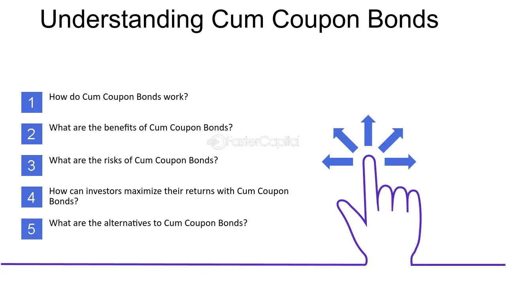

## Table of Contents

## What is a cum coupon?

A cum coupon is a term used in finance that refers to a bond or stock that is bought with the next interest payment or dividend still attached. When you buy a cum coupon security, you are entitled to receive the next scheduled payment. This is different from an "ex-coupon" security, where the buyer does not receive the next payment.

For example, if you buy a bond that pays interest every six months, and you buy it "cum coupon," you will get the interest payment that is due in the next six months. This can be important for investors because it affects the total return they can expect from their investment. Understanding whether a security is being sold cum coupon or ex-coupon helps investors make better decisions about when to buy and sell.

## How does a cum coupon differ from an ex-coupon?

When you buy a cum coupon bond or stock, you get the next interest or dividend payment that's coming up. It's like buying a ticket that includes the next show. This is good for buyers because they get a bit more money back from their investment sooner.

On the other hand, an ex-coupon bond or stock means you won't get the next payment. It's like buying a ticket after the show has already happened. This can be less appealing for buyers because they have to wait longer to get any money back from their investment.

## What is the primary function of a cum coupon in financial markets?

The main job of a cum coupon in financial markets is to make sure that the buyer of a bond or stock gets the next interest or dividend payment. This is important because it can affect how much money an investor makes from their investment. When someone buys a bond or stock that is cum coupon, they know they will get the next payment, which can make the investment more attractive.

This system helps keep things fair and clear in the market. It lets investors know exactly what they are buying and when they will get their money. This can help them plan better and make smarter choices about when to buy or sell their investments.

## Can you explain the process of buying a bond with a cum coupon?

When you want to buy a bond with a cum coupon, you are looking to get the next interest payment that comes with it. This means you need to buy the bond before the date when it goes ex-coupon. The ex-coupon date is important because it's the day after which anyone buying the bond won't get the next interest payment. So, if you buy the bond before this date, you will get the interest that's due next.

For example, let's say a bond pays interest every six months, and the next payment is due in two months. If you buy the bond now, before it goes ex-coupon, you will get that interest payment in two months. This can be a good deal because you don't have to wait as long to get some money back from your investment. It's like getting a little bonus for buying at the right time.

## What are the advantages of purchasing securities with cum coupons?

Buying securities with cum coupons can be a good choice because you get the next interest or dividend payment. This means you don't have to wait as long to start earning money from your investment. It's like getting a little extra reward for buying at the right time. This can make the investment more appealing, especially if you need the money sooner rather than later.

Another advantage is that it can help you plan your finances better. Knowing that you will get the next payment gives you a clear idea of when you will see some returns. This can be helpful for managing your money and making sure you have cash coming in when you need it. It's a simple way to make your investment work a bit harder for you right away.

## How do cum coupons affect the yield of a bond?

Buying a bond with a cum coupon can make the yield, or the return on your investment, look better. When you buy a bond cum coupon, you get the next interest payment. This means you start earning money from the bond sooner than if you bought it ex-coupon. Since the yield is calculated based on the interest you receive, getting that first payment quickly can make the bond's yield seem higher for the time you hold it.

For example, if you buy a bond that pays $50 every six months, and you get that payment right away because you bought it cum coupon, the money you earn starts adding up sooner. This can make the bond look like a better deal because you see returns faster. But remember, after you get that first payment, the yield will go back to normal until the next payment comes. So, cum coupons can make the yield look better at first, but it's important to think about the long-term yield too.

## What should investors consider when deciding between cum coupon and ex-coupon bonds?

When deciding between cum coupon and ex-coupon bonds, investors should think about when they need their money. If you want to get the next interest payment soon, buying a cum coupon bond is a good choice because you'll get that money faster. This can be helpful if you need cash sooner or if you want to see your investment start earning money right away. On the other hand, if you don't mind waiting longer for the next payment, an ex-coupon bond might be okay. This could be a good choice if you're planning to hold the bond for a long time and the timing of the first payment isn't as important to you.

Another thing to consider is how the timing of the payments affects the bond's yield. Buying a cum coupon bond can make the yield look better at first because you get that first interest payment quickly. This might make the bond seem like a better deal right away. But remember, after that first payment, the yield will be the same as it would be with an ex-coupon bond until the next payment comes. So, think about what you want from your investment – quick returns or a steady, long-term yield – and choose the bond that fits your needs.

## How do cum coupons impact the pricing of bonds?

When you buy a bond with a cum coupon, you are paying for the next interest payment that's coming up. This means the price of the bond might be a bit higher because you're getting that extra money soon. It's like buying a ticket that includes the next show, so you might have to pay a bit more for it. The seller knows they're giving you the next payment, so they might ask for a higher price to make up for it.

On the other hand, if you buy a bond that's ex-coupon, you won't get the next interest payment. This can make the bond cheaper because the seller doesn't have to give you that money. It's like buying a ticket after the show has already happened, so it costs less. Investors need to think about whether they want to pay more for a bond to get the next payment or save money and wait longer for their first interest.

## What are the tax implications of investing in cum coupon bonds?

When you buy a cum coupon bond, you get the next interest payment. This means you have to pay taxes on that interest. The tax you pay depends on your income and the tax laws where you live. If you get a big interest payment, you might have to pay more in taxes. It's important to think about this when you're deciding if a cum coupon bond is a good choice for you.

On the other hand, if you buy an ex-coupon bond, you won't get the next interest payment. This means you won't have to pay taxes on that payment because you didn't get it. But you will still have to pay taxes on the interest payments you do get later on. So, think about how soon you want to start paying taxes on your bond's interest when you're choosing between cum coupon and ex-coupon bonds.

## How do market conditions influence the choice between cum and ex-coupon securities?

Market conditions can make a big difference when you're choosing between cum and ex-coupon securities. If the market is doing well and interest rates are going up, buying a cum coupon bond might be a good idea. This is because you get the next interest payment right away, which can be helpful if you think rates will keep going up. On the other hand, if the market is not doing so well and interest rates are going down, you might want to buy an ex-coupon bond. This way, you can wait a bit longer for your first payment, and if rates keep dropping, you might be able to buy another bond later at a lower rate.

Another thing to think about is how quickly you need your money. If you need cash soon, a cum coupon bond can help because you get that first interest payment faster. This can be really important if the market is a bit shaky and you want to have some money coming in soon. But if you can wait and the market is stable, an ex-coupon bond might be okay because you won't miss out on much, and you can still get good returns over time. So, it's all about what's happening in the market and what you need from your investment.

## What role do cum coupons play in the overall strategy of bond portfolio management?

In bond portfolio management, cum coupons can be a key part of your strategy. If you want to get money from your bonds faster, buying bonds with cum coupons can help. This is because you get the next interest payment right away. This can be good if you need cash soon or if you think interest rates might go up. It's like getting a little bonus for buying at the right time, which can make your portfolio more flexible and help you manage your money better.

On the other hand, if you don't need the money right away and you're planning for the long term, you might not care as much about cum coupons. In this case, you might choose ex-coupon bonds because they can be cheaper, and you can still get good returns over time. It's all about what you want from your bond portfolio. Whether you're looking for quick returns or steady, long-term growth, understanding cum coupons can help you make smarter choices and build a portfolio that fits your needs.

## Can you discuss any recent trends or changes in the use of cum coupons in financial markets?

In recent years, there hasn't been a big change in how cum coupons are used in financial markets. They still work the same way, helping investors get the next interest or dividend payment when they buy a bond or stock. But with technology making trading easier and faster, more people are paying attention to the timing of these payments. This means cum coupons are still important, but now investors can use them in their strategies more easily because they can buy and sell at the right times more quickly.

One trend that might affect cum coupons is the change in interest rates. When interest rates go up or down, it can change how much people want to buy cum coupon bonds. If rates are going up, more investors might want to buy cum coupon bonds to get that first interest payment quickly. But if rates are going down, they might wait and buy ex-coupon bonds, hoping to get a better deal later. So, while cum coupons haven't changed much, the way investors use them can shift with the market.

## What is the meaning of Cum Coupon in Bond Investments?

The cum coupon term is a fundamental concept in the secondary market for bonds, signifying that a bond is sold with the upcoming coupon payment attached. This characteristic results from the bondholder of record at the next coupon payment date being entitled to receive the interest payment. Consequently, when a bond is traded cum coupon, its price reflects the inclusion of this interest, typically resulting in a higher price than that of an ex-coupon bond, which does not include the upcoming interest payment.

In the United States, bonds are predominantly traded on a cum coupon basis. This practice contrasts with Europe, where the ex-coupon basis is more common. The distinction between these pricing conventions is crucial for international investors who must navigate varying practices in different markets. Trading on a cum coupon basis in the U.S. means that buyers must compensate sellers for the accrued interest since the last coupon payment, which can add complexity to the investment process.

From a valuation perspective, understanding cum coupon dynamics is essential as it aids investors in assessing the true comparative value and profitability of specific bonds. The adjusted price includes not just the principal and interest accrued but must be calculated accurately to establish a fair market value.

### Formula for Cum Coupon Pricing

The price of a cum coupon bond can be calculated as follows:

$$

P_{\text{cum coupon}} = P_0 + \text{Accrued Interest} 
$$

Where:
- $P_0$ is the clean price of the bond (price excluding accrued interest).
- $\text{Accrued Interest} = \frac{C \times (t)}{T}$
  - $C$ is the annual coupon payment.
  - $t$ is the number of days from the last coupon payment to the settlement date.
  - $T$ is the total number of days in the coupon period.

This calculation accounts for the interest the seller has earned up to the point of sale, ensuring a fair transaction price.

### Implications for Investors

Investors, particularly those active in multiple international markets, benefit from understanding these conventions. A thorough grasp of cum coupon versus ex-coupon pricing can offer strategic advantages. For instance, buying ex-coupon bonds may be advantageous if the investor believes bond prices will rise, as they are initially less expensive due to not including pending interest payments.

In essence, recognizing when a bond trades cum coupon can facilitate more informed investment choices, allowing investors to sharpen their trading strategies and potentially maximize returns by accurately pricing bonds to reflect the total value offered, including the immediate income from accrued interest payments.

## References & Further Reading

[1]: Bergstra, J., Bardenet, R., Bengio, Y., & Kégl, B. (2011). ["Algorithms for Hyper-Parameter Optimization."](https://dl.acm.org/doi/10.5555/2986459.2986743) Advances in Neural Information Processing Systems 24.

[2]: ["Advances in Financial Machine Learning"](https://www.amazon.com/Advances-Financial-Machine-Learning-Marcos/dp/1119482089) by Marcos Lopez de Prado

[3]: ["Evidence-Based Technical Analysis: Applying the Scientific Method and Statistical Inference to Trading Signals"](https://www.amazon.com/Evidence-Based-Technical-Analysis-Scientific-Statistical/dp/0470008741) by David Aronson

[4]: ["Machine Learning for Algorithmic Trading"](https://github.com/stefan-jansen/machine-learning-for-trading) by Stefan Jansen

[5]: ["Quantitative Trading: How to Build Your Own Algorithmic Trading Business"](https://www.amazon.com/Quantitative-Trading-Build-Algorithmic-Business/dp/1119800064) by Ernest P. Chan