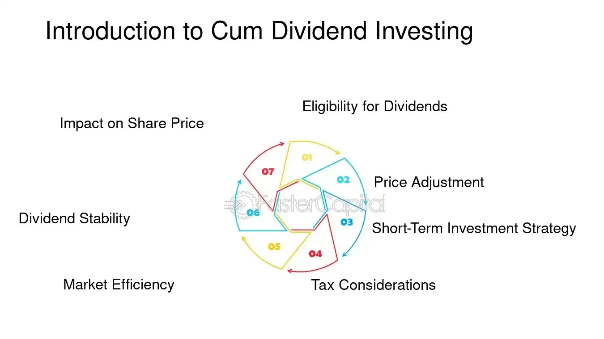

## Table of Contents

## What is cum dividend?

Cum dividend is a term used in stock trading that means a stock is being sold with the right to receive the next dividend payment. When you buy a stock cum dividend, you will get the upcoming dividend if you buy the stock before the ex-dividend date. The ex-dividend date is the cutoff date set by the company, and if you buy the stock on or after this date, you won't get the next dividend.

This is important for investors because dividends are a way companies share their profits with shareholders. If you're planning to invest in a stock for its dividend, buying it cum dividend ensures you don't miss out on the next payout. It's a simple concept but crucial for timing your investments correctly around dividend dates.

## How does the cum dividend status affect stock purchases?

When you buy a stock that is cum dividend, it means you will get the next dividend the company pays out. This is important because if you want the dividend money, you need to buy the stock before a certain date, called the ex-dividend date. If you buy the stock on or after this date, you won't get the next dividend.

Knowing if a stock is cum dividend helps you decide when to buy it. If getting the dividend is important to you, you'll want to buy the stock before the ex-dividend date. This way, you make sure you get the extra money from the dividend. If you don't care about the dividend, you can buy the stock anytime, but you might get it a bit cheaper after the ex-dividend date because the price usually drops a bit when the dividend is paid out.

## What is the difference between cum dividend and ex-dividend?

Cum dividend and ex-dividend are terms that tell you about the timing of buying a stock in relation to its dividend payments. When a stock is cum dividend, it means if you buy it, you will get the next dividend the company pays out. This is important because dividends are like extra money the company gives to its shareholders. So, if you want this extra money, you need to buy the stock before a certain date, which is called the ex-dividend date.

The ex-dividend date is when the stock switches from being cum dividend to ex-dividend. If you buy the stock on or after this date, you won't get the next dividend. The reason for this is that the company needs to know who gets the dividend, and they use the ex-dividend date to figure this out. So, if you're thinking about buying a stock for its dividend, you need to know these dates to make sure you get the extra money.

## When is the cum dividend period for a stock?

The cum dividend period for a stock is the time when you can buy the stock and still get the next dividend. It starts from the day after the last dividend was paid and goes up to the day before the ex-dividend date. If you buy the stock during this time, you will get the next dividend that the company pays out.

The ex-dividend date is important because it marks the end of the cum dividend period. If you buy the stock on or after this date, you won't get the next dividend. So, if you want the extra money from the dividend, you need to buy the stock before the ex-dividend date, during the cum dividend period.

## How can investors benefit from buying stocks cum dividend?

Investors can benefit from buying stocks cum dividend because it means they will get the next dividend payment. Dividends are like extra money that companies give to their shareholders, so if an investor buys a stock before the ex-dividend date, they make sure they get this extra money. This can be important for people who rely on dividend income as part of their investment strategy.

Another way investors can benefit is by timing their purchases well. If they know when a stock is cum dividend, they can buy it just before the ex-dividend date to get the dividend. This can help them maximize their returns, especially if they are looking to build a steady stream of income from their investments. Knowing about the cum dividend period helps investors make smarter decisions about when to buy stocks.

## What are the key dates investors should know regarding cum dividend?

The first key date investors should know is the ex-dividend date. This is the day when the stock switches from being cum dividend to ex-dividend. If you buy the stock on or after this date, you won't get the next dividend. So, if you want the extra money from the dividend, you need to buy the stock before this date.

The second important date is the record date. This is the date the company uses to figure out who gets the dividend. If you own the stock on the record date, you'll get the dividend. The record date is usually one business day after the ex-dividend date. Knowing these dates helps investors plan their stock purchases to make sure they get the dividends they want.

## How does the cum dividend mechanism work in practice?

When a company decides to pay a dividend, it sets a few important dates. One of these dates is the ex-dividend date. If you buy the stock before this date, you will get the next dividend. This period before the ex-dividend date is called the cum dividend period. So, if you want the extra money from the dividend, you need to buy the stock during this time. For example, if a company announces a dividend and sets the ex-dividend date as March 15th, you need to buy the stock on or before March 14th to get that dividend.

The next important date is the record date, which is usually one business day after the ex-dividend date. The company uses this date to see who owns the stock and who gets the dividend. If you own the stock on the record date, you'll get the dividend. So, if the ex-dividend date is March 15th, the record date might be March 16th. This means if you buy the stock on March 15th or later, you won't get the dividend because you won't be on the company's list of shareholders on the record date. Knowing these dates helps investors make sure they get the dividends they want.

## What are the tax implications of buying stocks cum dividend?

When you buy stocks cum dividend, you need to know about taxes. Dividends are extra money you get from the company, and you usually have to pay taxes on them. The tax rate can be different depending on where you live and how much money you make. In the United States, for example, dividends can be taxed at a lower rate if they are qualified dividends, which means the company has to meet certain rules. If the dividends are not qualified, they might be taxed as regular income, which could be a higher rate.

It's also important to think about the timing of buying stocks cum dividend because it can affect your taxes. If you buy a stock right before the ex-dividend date, you'll get the next dividend, but you'll also have to pay taxes on it. This might mean you owe more taxes that year. So, it's a good idea to talk to a tax advisor to understand how buying stocks cum dividend will affect your taxes and to plan your investments in a way that helps you save money on taxes.

## Can you explain the impact of cum dividend on stock prices?

When a stock is cum dividend, it means if you buy it before the ex-dividend date, you'll get the next dividend. This can make the stock more attractive to investors who want the extra money from the dividend. So, right before the ex-dividend date, the stock price might go up a bit because more people want to buy it to get the dividend.

But after the ex-dividend date, the stock price usually drops by about the amount of the dividend. This happens because the people who buy the stock after this date won't get the next dividend, so the stock is worth a bit less to them. It's like the dividend money is taken out of the stock price. Knowing this can help investors decide when to buy or sell stocks around dividend dates.

## How do companies decide on the cum dividend date?

Companies decide on the cum dividend date by setting the ex-dividend date first. The cum dividend date is then the day before the ex-dividend date. When a company wants to pay a dividend, they pick an ex-dividend date, which is when the stock stops being cum dividend. This date is important because it helps the company figure out who gets the dividend. If you buy the stock before this date, you'll get the dividend, so the cum dividend date is the last day you can buy the stock and still get the next dividend.

The company also thinks about other important dates like the record date and the payment date when deciding on the cum dividend date. The record date is usually one business day after the ex-dividend date, and it's when the company checks who owns the stock to see who gets the dividend. The payment date is when the company actually sends out the dividend money. By setting these dates, the company makes sure everyone knows when they need to buy the stock to get the dividend, which helps keep things fair and clear for investors.

## What are some strategies for trading around the cum dividend date?

One strategy for trading around the cum dividend date is to buy the stock just before the ex-dividend date. This way, you get the next dividend. Investors who want extra income might do this because dividends are like extra money from the company. But you need to think about taxes too. The dividend money you get might be taxed, so it's good to talk to a tax advisor to understand how this will affect your taxes.

Another strategy is to sell the stock right after the ex-dividend date. After this date, the stock price usually drops by about the amount of the dividend. So, if you bought the stock before the ex-dividend date, got the dividend, and then sold it right after, you might still make some money. But you need to be careful because the stock price might not always drop exactly by the dividend amount, and other things can affect the stock price too.

Some investors might also try to time their trades to take advantage of the small price movements around the cum dividend date. They might buy the stock a few days before the ex-dividend date, hoping the price will go up a bit because more people want to buy it to get the dividend. Then, they might sell it right after the ex-dividend date when the price drops. This can be risky though, and it's not always a sure thing, so it's important to understand the risks and do your research.

## How does cum dividend play into long-term investment strategies?

When you're thinking about long-term investment strategies, knowing about cum dividend can help you a lot. If you want to get regular income from your investments, buying stocks cum dividend can be a good idea. This means you buy the stock before the ex-dividend date, so you get the next dividend the company pays out. Over time, these dividends can add up and give you extra money, which can be really helpful if you're planning for things like retirement. It's like getting a little bonus from your investments regularly.

But it's not just about the extra money. Buying stocks cum dividend can also be part of a bigger plan to grow your investments. If you keep the stocks after getting the dividend, you might see the stock price go up over time. Plus, you can use the dividend money to buy more stocks, which can help your investment grow even more. It's all about using the dividends smartly to make your long-term investments stronger. Just remember, taxes on dividends can affect how much money you keep, so it's good to talk to a tax advisor to plan everything out.

## References & Further Reading

[1]: ["Advances in Financial Machine Learning"](https://www.amazon.com/Advances-Financial-Machine-Learning-Marcos/dp/1119482089) by Marcos Lopez de Prado

[2]: ["Machine Learning for Algorithmic Trading"](https://github.com/stefan-jansen/machine-learning-for-trading) by Stefan Jansen

[3]: ["Quantitative Trading: How to Build Your Own Algorithmic Trading Business"](https://www.amazon.com/Quantitative-Trading-Build-Algorithmic-Business/dp/1119800064) by Ernest P. Chan

[4]: ["Evidence-Based Technical Analysis: Applying the Scientific Method and Statistical Inference to Trading Signals"](https://www.amazon.com/Evidence-Based-Technical-Analysis-Scientific-Statistical/dp/0470008741) by David Aronson

[5]: ["Algorithmic Trading and DMA: An introduction to direct access trading strategies"](https://www.amazon.com/Algorithmic-Trading-DMA-introduction-strategies/dp/0956399207) by Barry Johnson