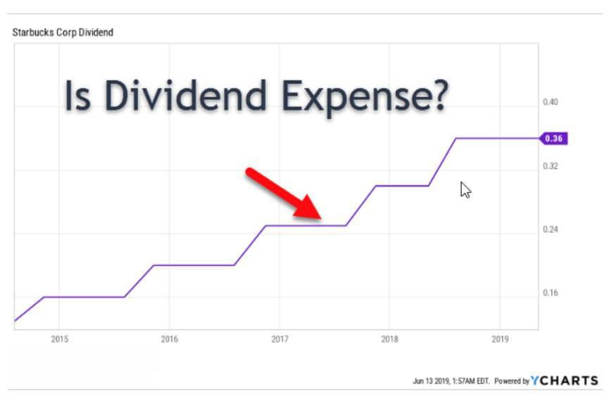

Dividend stocks are an integral component of investment portfolios, providing investors with regular income in the form of dividends. These payments represent a portion of a company's earnings distributed to shareholders. Within this context, the concept of cum dividend becomes critical for investors who wish to maximize their returns. Cum dividend, meaning "with dividend," refers to the period during which a stock is trading with the rights to its forthcoming dividend payment. This status persists until the stock reaches its ex-dividend date, after which it trades without the dividend rights.

For investors, understanding the timing and implications of cum dividend status is essential. When a stock is purchased on or before the cum dividend date, the investor is entitled to receive the declared dividend. This timing can significantly influence their trading strategies, as buying stocks before the ex-dividend date can ensure eligibility for dividend payouts.



Incorporating algorithmic trading into the dividend process presents an opportunity to enhance decision-making and potentially increase profits. Algorithmic trading utilizes advanced computational methods and data analytics to optimize trading decisions around key dividend dates. By analyzing historical data and market trends, algorithms can predict stock movements associated with dividend announcements, allowing investors to strategically time their trades.

This article provides a comprehensive examination of the cum dividend concept, its impact on stock trading dynamics, and how algorithmic trading can optimize investments in dividend stocks. By understanding these elements, investors can refine their strategies to capitalize on dividend opportunities and potentially enhance their investment returns.

## Table of Contents

## What is Cum Dividend?

Cum dividend refers to a period when a stock is trading with the entitlement to its forthcoming dividend payment. During this period, investors purchasing the stock are qualified to receive the dividend that has been declared by the company. This status persists until the stock reaches its ex-dividend date. The ex-dividend date marks the transition point where the stock starts trading without the rights to the upcoming dividend, thus being labeled as ex-dividend.

The concept of cum dividend plays a significant role in investor decision-making as it directly affects the profitability of the investment. Before the ex-dividend date, stock prices might reflect the value of the impending dividend, making them potentially more attractive to investors seeking immediate income. Consequently, an investor who purchases a stock just before its ex-dividend date will still be eligible to receive the dividend payout, subsequently influencing short-term trading strategies and decisions.

Two critical dates within this concept are the record date and the ex-dividend date. The record date is the cutoff day that determines which shareholders qualify for the dividend. To be eligible for the dividend, an investor must purchase the stock cum dividend before the ex-dividend date, ensuring their inclusion on the company's record by this decisive date. 

This eligibility significantly shapes trading strategies, as acquiring stocks during the cum dividend period guarantees the impending dividend, thereby adding another dimension of value to the stock purchase. Understanding this mechanism allows investors to optimize their portfolios by strategically timing their acquisitions based on the dividend calendar, thus maximizing potential returns.

## Understanding the Cum Dividend Process

Dividend investing involves understanding crucial dates that determine eligibility for dividend payouts. Three key dates form the framework of the cum dividend process: the declaration date, the record date, and the payment date. These dates are essential for investors to consider when strategizing on dividend acquisitions.

### Declaration Date

The declaration date is when a company's board of directors announces its intention to pay a dividend. This announcement includes critical information such as the amount of the dividend, the record date, and the payment date. The declaration date marks the beginning of the timeline for dividend distribution, providing investors with knowledge of upcoming financial distributions, which can impact trading decisions.

### Record Date

The record date is the deadline set by the company to determine which shareholders are eligible to receive the upcoming dividend. To qualify for the dividend, an investor must be listed as a shareholder by this date. This delineation is crucial as it separates cum dividend from ex-dividend status. Stocks continue to trade cum dividend until the business day before the ex-dividend date, allowing those who purchase up until this point to receive the declared dividend.

### Ex-Dividend Date

The ex-dividend date is typically set one business day before the record date due to the T+2 settlement period – the time it takes for a trade to complete. On and after this date, the stock trades without the right to the declared dividend, and investors buying on the ex-dividend date or later will not receive the dividend. Stock prices often adjust downward by approximately the dividend amount to reflect the change in value due to the dividend exclusion.

### Payment Date

The payment date is when the dividend is actually distributed to the shareholders on record. This date follows the record date, and shareholders receive their dividends as either cash or additional shares, depending on the company's dividend disbursement policy.

Understanding these dates is vital for traders seeking to capitalize on dividend earnings. Effective dividend investing requires a detailed comprehension of this timeline to optimize purchase and sales decisions. By acquiring stocks prior to the ex-dividend date, investors ensure eligibility for dividends while aligning their strategies with their financial goals.

## The Role of Algorithmic Trading in Dividends

Algorithmic trading employs sophisticated computational techniques to refine buy and sell decisions, particularly concerning key dividend dates, such as the cum and ex-dividend dates. These algorithms use a blend of historical data, statistical models, and real-time market information to ascertain the optimal points at which to execute trades. This process enhances the precision of trading strategies and allows for the maximization of returns by leveraging the predictable fluctuations in stock prices around dividend announcements.

Algorithms are designed to process large volumes of data quickly and identify patterns or trends that may indicate future price movements related to dividend declarations. For example, a common strategy involves purchasing stocks just before they go ex-dividend. This is when the dividend rights are still attached (cum dividend), securing the right to the declared dividend, and subsequently selling them post the ex-dividend date to capture potential price adjustments. The algorithm's ability to rapidly assess market conditions and execute trades positions it as a crucial tool for traders aiming to capitalize on these time-sensitive market opportunities.

Python is often used for developing [algorithmic trading](/wiki/algorithmic-trading) models due to its extensive libraries and ease of integration with trading platforms. A simple Python example to alert a trader when to execute a buy around the cum-dividend date might include:

```python
import pandas as pd
import numpy as np

# Sample data of stock prices and dividend dates
data = {
    'date': pd.date_range(start='2023-01-01', periods=100, freq='D'),
    'price': np.random.normal(100, 2, 100),
    'dividend_date': pd.to_datetime('2023-01-15')
}

df = pd.DataFrame(data)

# Define moving average window
window = 5

# Calculate rolling mean
df['rolling_mean'] = df['price'].rolling(window=window).mean()

# Identify cum-dividend opportunity assuming a price dip strategy
for index, row in df.iterrows():
    if row['date'] < row['dividend_date']:
        if df['price'][index-1] > row['price']:  # Simple condition for demonstration
            print(f"Buy signal on {row['date']} at price {row['price']}")
```

In this script, we simulate stock prices and a specific dividend date. The code calculates a rolling mean to analyze price trends, and a basic condition signals to buy the stock if a downward price trend is detected before the dividend date. This simplified model is an illustration of how algorithms can be developed to execute more complex and refined strategies based on intricate analyses and larger datasets.

Algorithmic trading provides a distinct advantage in dividend stock investments, optimizing the timing of trades and consequently improving the potential for higher returns. By strategically executing trades around cum and ex-dividend dates, these algorithms support investors in making data-driven decisions, thus enhancing overall investment performance.

## Trading Dynamics of Cum Dividend Stocks

Stock prices typically experience a downward adjustment immediately following the ex-dividend date. This adjustment reflects the fact that buyers on or after this date do not have the right to receive the previously announced dividend, as it is the holder on the preceding cum dividend date who receives the payout. The price drop is generally equivalent to the dividend amount, which aligns with fundamental market efficiency principles aiming to prevent [arbitrage](/wiki/arbitrage) opportunities.

Investors are known to purchase stocks while they are still trading cum dividend to ensure entitlement to the upcoming dividend payment. This behavior is driven by the desire to gain the dividend along with any capital appreciation of the stock. However, the actual impact on stock price might vary due to factors such as market sentiment, broader economic conditions, and specific stock performance metrics.

Underlying the price adjustments of cum and ex-dividend stocks are principles of market efficiency, particularly the Efficient Market Hypothesis (EMH). EMH posits that stock prices reflect all available information, resulting in price adjustments that incorporate upcoming dividend distributions. Theoretically, in an efficient market, the expected price drop on the ex-dividend date would equal the dividend amount. However, empirical studies suggest variations due to market imperfections, tax considerations, and investor behavior, leading to further analysis and strategies, including exposure to contrasting results like the "ex-dividend price anomaly."

These dynamics around cum dividend stocks are evident in the computational examination of historical stock data. Implementing statistical models or [machine learning](/wiki/machine-learning) algorithms helps identify patterns in price adjustments across different periods around the ex-dividend date. Persistent patterns may then be exploited by trading algorithms that strategically time stock purchases and sales relative to these dividend events. Nevertheless, success in such endeavors requires sophisticated analysis due to the complex, stochastic nature of the financial markets and the multitude of factors influencing investor behavior and stock prices beyond mere dividend entitlement.

## Investor Strategies for Cum Dividend Stocks

Timing is crucial for investors focusing on cum dividend stocks, as they often aim to purchase stocks before the ex-dividend date to ensure eligibility for the forthcoming dividend payout. Acquiring shares during this period guarantees that investors are listed as shareholders by the record date, a crucial benchmark for receiving dividends. This approach requires precise market analytics and can be significantly enhanced by algorithmic trading tools that predict optimal entry and [exit](/wiki/exit-strategy) points based on past market data and upcoming dividend reports.

Investors also employ dividend reinvestment strategies to compound their gains. This strategy involves using the received dividends to purchase additional shares of the stock, thus increasing the overall holding and potential future earnings. For example, if an investor holds 100 shares of a stock priced at $10 per share, and the company declares a $0.50 per share dividend, the investor receives $50 in dividends. By reinvesting this $50 into the stock, assuming the price remains constant, the investor acquires five additional shares. This process can be automated using dividend reinvestment plans (DRIPs), which facilitate the systematic reinvestment of dividends, often at a reduced cost or without commission fees.

Furthermore, diversification with cum dividend stocks is a strategic method to manage risk and stabilize returns, especially in volatile markets. By holding a diversified portfolio of such stocks, investors can mitigate the risks associated with fluctuations in specific sectors or companies. This approach limits the impact of potential negative performance from individual stocks while benefiting from dividend income across the portfolio. The concept of diversification adheres to the broader investment principle of not putting all one's eggs in one basket, which helps cushion the portfolio against adverse market movements.

Incorporating these strategies requires detailed market research and understanding of the dividend timelines, aligning closely with the principles of efficient market theory. By effectively managing the timing of purchases, reinvestment, and diversification, investors can optimize their returns from cum dividend stocks, while also leveraging advanced trading algorithms to refine their investment decisions.

## Conclusion

The cum dividend concept serves as a crucial component in the broader landscape of dividend investing strategies. This framework underscores the importance of timing for investors seeking to optimize their returns. By understanding the specific timing and implications of cum and ex-dividend dates, investors can make informed decisions that have a substantial impact on their investment portfolios. Buying stocks at the right moment allows investors to secure dividend payouts and avoid unnecessary [volatility](/wiki/volatility-trading-strategies) associated with price adjustments post ex-dividend date.

The strategic use of algorithmic trading further enhances the ability to navigate the dividends landscape efficiently. Algorithmic trading employs advanced algorithms and historical data analysis to predict stock movements and optimize buying and selling decisions surrounding dividend dates. By implementing these computational strategies, investors can conduct trades with greater precision, increasing the potential for enhanced returns. Such tools allow for the quick assimilation of market trends and the rapid execution of trades, which are particularly beneficial during the critical phases of cum and ex-dividend transitions.

In conclusion, integrating the principles of cum dividend timing with sophisticated algorithmic trading offers a powerful approach to dividend stock investment, maximizing the potential for profits while minimizing associated risks.

## References & Further Reading

[1]: ["Advances in Financial Machine Learning"](https://www.amazon.com/Advances-Financial-Machine-Learning-Marcos/dp/1119482089) by Marcos Lopez de Prado

[2]: ["Machine Learning for Algorithmic Trading"](https://github.com/stefan-jansen/machine-learning-for-trading) by Stefan Jansen

[3]: ["Quantitative Trading: How to Build Your Own Algorithmic Trading Business"](https://www.amazon.com/Quantitative-Trading-Build-Algorithmic-Business/dp/1119800064) by Ernest P. Chan

[4]: ["Evidence-Based Technical Analysis: Applying the Scientific Method and Statistical Inference to Trading Signals"](https://www.amazon.com/Evidence-Based-Technical-Analysis-Scientific-Statistical/dp/0470008741) by David Aronson

[5]: ["Algorithmic Trading and DMA: An introduction to direct access trading strategies"](https://www.amazon.com/Algorithmic-Trading-DMA-introduction-strategies/dp/0956399207) by Barry Johnson