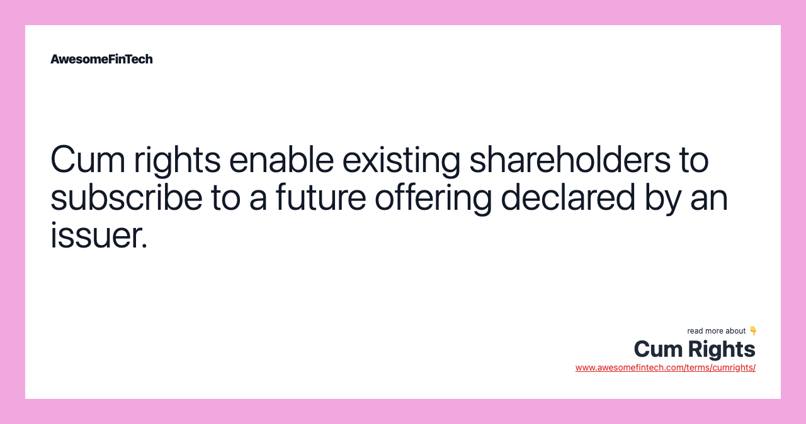

## Table of Contents

## What are cum rights in finance?

Cum rights in finance refer to a situation where a stock is traded with the rights to upcoming dividends or other benefits attached to it. When you buy a stock on a cum rights basis, you are entitled to receive any dividends that the company declares before the ex-dividend date. This means that if you purchase the stock before the ex-dividend date, you will get the dividend payment when it is distributed.

The term "cum" comes from Latin, meaning "with." So, cum rights essentially mean "with rights." This is important for investors because it affects the timing of when they need to buy the stock to be eligible for dividends. If an investor misses the cum rights period, they will have to buy the stock on an ex-rights basis, which means they will not receive the upcoming dividend. Understanding cum rights helps investors plan their investments more effectively.

## How do cum rights affect stock prices?

Cum rights can affect stock prices because they tell investors when they can buy a stock and still get the next dividend. When a stock is traded on a cum rights basis, it means the price of the stock includes the value of the upcoming dividend. Investors might be willing to pay more for the stock because they know they will get that extra money from the dividend.

As the ex-dividend date gets closer, the stock price might start to change. On the ex-dividend date, the stock switches to an ex-rights basis, and the price usually drops by about the amount of the dividend. This happens because new buyers after this date won't get the dividend, so they don't want to pay as much for the stock. Understanding cum rights helps investors decide the best time to buy or sell stocks to make the most of their investments.

## What is the difference between cum rights and ex-rights?

Cum rights and ex-rights are terms used in finance to describe whether a stock includes the right to receive an upcoming dividend. When a stock is traded on a cum rights basis, it means that if you buy the stock before the ex-dividend date, you will get the next dividend. The term "cum" means "with," so cum rights means "with rights" to the dividend. This is important for investors because it affects when they need to buy the stock to get the dividend.

On the other hand, ex-rights means "without rights" to the upcoming dividend. When a stock is traded on an ex-rights basis, it means that if you buy the stock on or after the ex-dividend date, you won't get the next dividend. The stock price usually drops by about the amount of the dividend on the ex-dividend date because new buyers won't receive the dividend. Understanding the difference between cum rights and ex-rights helps investors plan their buying and selling to maximize their returns.

## Can you explain the timeline of a rights issue?

A rights issue is when a company gives its current shareholders the chance to buy more shares at a special price. The timeline starts when the company announces the rights issue. They tell shareholders the date when they will get the rights, how many new shares they can buy, and the price for those shares. This announcement is important because it lets shareholders know they need to decide if they want to buy more shares.

After the announcement, there is a period called the cum rights period. During this time, if you own the stock, you have the right to buy the new shares. This period ends on the ex-rights date. If you buy the stock on or after this date, you won't get the rights to buy the new shares. The company then sets a record date, which is when they check who owns the stock to see who gets the rights. Shareholders then have a certain amount of time, called the subscription period, to decide if they want to use their rights and buy the new shares. If they don't use their rights, they might be able to sell them to someone else. The rights issue ends when the company gets the money from the new shares sold.

## How do cum rights impact investors?

Cum rights can have a big impact on investors because they decide if you get the next dividend when you buy a stock. If you buy a stock during the cum rights period, you will get the dividend that the company is going to pay soon. This can make the stock more attractive to investors because they know they will get some extra money. So, investors might be willing to pay a bit more for the stock if they know they will get a dividend.

But, if you miss the cum rights period and buy the stock after the ex-dividend date, you won't get the next dividend. This can affect how much you want to pay for the stock because it won't come with that extra money. Knowing about cum rights helps investors plan when to buy or sell their stocks to make the most of their money. It's important to keep track of these dates so you can make smart choices about your investments.

## What are the tax implications of cum rights?

When you buy a stock during the cum rights period, you get the right to the next dividend. This dividend is usually considered taxable income. So, when you get the dividend, you need to pay taxes on it, just like you would with any other income. The amount of tax you pay depends on your income and the tax laws in your country. It's important to keep track of these dividends because you'll need to report them on your tax return.

If you sell the stock during the cum rights period, any profit you make from the sale is also taxable. This profit is called a capital gain. The tax on capital gains can be different from the tax on dividends, and it might depend on how long you held the stock before selling it. Knowing about these tax rules can help you plan your investments better and understand how much money you'll keep after taxes.

## How can investors take advantage of cum rights?

Investors can take advantage of cum rights by buying stocks before the ex-dividend date. This way, they get the next dividend, which is like getting extra money. Knowing when the cum rights period ends helps investors plan their buying. If they buy the stock just before the ex-dividend date, they can get the dividend and then decide to sell the stock right after. This can be a good way to make some quick profit, but it depends on the stock's price and how much the dividend is worth.

Another way to use cum rights is to hold onto stocks that often pay good dividends. By buying these stocks during the cum rights period, investors can keep getting dividends over time. This can be a good strategy for people who want steady income from their investments. It's important to check the company's history of paying dividends and when they usually announce them to make the most of cum rights.

## What strategies should be employed when trading stocks with cum rights?

When trading stocks with cum rights, one key strategy is to buy the stock before the ex-dividend date. This way, you get the next dividend, which can add to your income. It's like getting a bonus for holding the stock. If you plan to sell the stock soon, you might want to buy it just before the ex-dividend date and then sell it right after. This can help you make a quick profit if the stock price doesn't drop too much after the dividend is paid. But remember, the stock price usually goes down by the amount of the dividend on the ex-dividend date, so you need to think about that when deciding when to sell.

Another strategy is to hold onto stocks that regularly pay good dividends. By buying these stocks during the cum rights period, you can keep getting dividends over time. This can be a good way to get steady income from your investments. It's important to look at the company's history of paying dividends and when they usually announce them. This helps you plan your buying and selling to make the most of cum rights. Knowing when to buy and sell can help you take advantage of these dividends and grow your money.

## How do cum rights influence a company's capital structure?

Cum rights can affect a company's capital structure because they let shareholders get dividends. When a company pays dividends, it uses money that could be used for other things, like growing the business or paying off debts. If a lot of shareholders buy the stock during the cum rights period to get the dividend, the company needs to have enough money to pay those dividends. This can change how much money the company has for other things, which can affect its capital structure.

If a company keeps paying dividends during the cum rights period, it might need to borrow more money or use up its cash reserves. This can make the company's debt go up or its cash go down. So, the company's capital structure, which is the mix of debt and equity it uses, can change because of cum rights. It's important for the company to balance paying dividends with keeping enough money for other needs.

## What are the regulatory requirements for issuing cum rights?

When a company wants to issue cum rights, it has to follow some rules set by the government or financial authorities. These rules are there to make sure that everything is fair and clear for investors. The company needs to tell everyone when the cum rights period will start and end, and how much the dividend will be. They also have to share this information with the stock exchange and other places where the stock is traded. This helps everyone know what's going on and makes sure no one is left out.

The company also needs to make sure that they have the money to pay the dividends they promise during the cum rights period. They have to follow the rules about how they can use their money and what they need to tell investors. If they don't follow these rules, they could get in trouble with the government or the people who watch over the stock market. So, it's important for the company to plan carefully and make sure they can meet all the requirements before they issue cum rights.

## How do cum rights compare to other forms of shareholder rights?

Cum rights are just one kind of right that shareholders have. They let you get the next dividend if you buy the stock before the ex-dividend date. Other rights that shareholders have can include voting on big decisions the company makes, like who should be on the board of directors or if the company should merge with another one. Shareholders might also have the right to buy more shares when the company issues new ones, which is called a rights issue. Each of these rights helps shareholders have a say in how the company is run and can help them make money from their investments.

Cum rights are special because they focus on getting dividends. They are different from other rights because they are about getting money back from the company regularly. Voting rights and rights issues, on the other hand, are about having a say in the company's future or getting a chance to own more of the company. All these rights together help shareholders feel more connected to the company and can make their investments more valuable. Knowing about all these different rights can help investors make better choices about which stocks to buy and how to manage their money.

## What are the historical trends and future predictions for cum rights in the financial market?

Historically, cum rights have been an important part of the financial market because they help investors get dividends. In the past, when companies paid good dividends, more investors bought stocks during the cum rights period to get that extra money. This made the stock more attractive and could even push up its price. Over time, as companies started to focus more on growth and reinvesting profits, some paid fewer dividends. But, for companies that kept paying good dividends, cum rights stayed important. Investors still looked at cum rights to plan when to buy and sell stocks to make the most of their investments.

Looking to the future, cum rights will likely keep being important for investors who want steady income from dividends. As more people look for ways to get regular money from their investments, especially as they get closer to retirement, cum rights will stay a key part of their strategies. Companies might change how often they pay dividends or how much they pay, but as long as dividends are important, cum rights will matter. Investors will keep using cum rights to decide the best times to buy and sell stocks to get those dividends.

## What are cum rights and what is their significance?

Cum rights, also known as 'with rights', refer to the entitlement of a shareholder to participate in a rights offering by a company. This mechanism allows shareholders to subscribe to additional shares, usually at a preferential price, preserving their proportional ownership in the company. Rights offerings are often used by companies seeking to raise additional capital by issuing new shares to existing shareholders. The term "cum rights" directly contrasts with "ex-rights," where the rights have been exercised or have expired.

The primary advantage of cum rights for shareholders lies in their ability to enhance the value of their investment. By subscribing to a rights offering at a discounted price, shareholders can increase their holdings at a lower cost than purchasing shares at the market price. This can be illustrated with the formula for calculating the theoretical ex-rights price (TERP):

$$
\text{TERP} = \frac{(\text{Current Market Value of Shares} + \text{New Shares Issued} \times \text{Subscription Price})}{\text{Total Shares After Issue}}
$$

For shareholders, holding cum rights provides not only the opportunity to buy additional shares at the discounted rate but also the potential for capital appreciation if the market price exceeds the subscription price after the rights are exercised.

For companies, rights offerings represent a strategic tool for raising additional funds while minimizing the risk of diluting existing shareholders' ownership too significantly. This method allows companies to quickly secure necessary capital to finance expansion, reduce debt, or fund other strategic initiatives. Additionally, because rights offerings are typically extended to existing shareholders, they are often viewed as a favorable alternative to other forms of equity financing.

Incorporating rights offerings into their financial strategies allows companies to maintain a balance between raising capital and sustaining shareholder value. The careful assessment of both cum and ex-rights conditions by investors is crucial to optimizing the potential benefits of participating in such offerings. Overall, the strategic application of cum rights can significantly influence investment decisions and outcomes, underscoring their relevance in contemporary financial markets.

## References & Further Reading

[1]: Bergstra, J., Bardenet, R., Bengio, Y., & Kégl, B. (2011). ["Algorithms for Hyper-Parameter Optimization."](https://dl.acm.org/doi/10.5555/2986459.2986743) Advances in Neural Information Processing Systems 24.

[2]: ["Advances in Financial Machine Learning"](https://www.amazon.com/Advances-Financial-Machine-Learning-Marcos/dp/1119482089) by Marcos Lopez de Prado

[3]: ["Evidence-Based Technical Analysis: Applying the Scientific Method and Statistical Inference to Trading Signals"](https://www.amazon.com/Evidence-Based-Technical-Analysis-Scientific-Statistical/dp/0470008741) by David Aronson

[4]: ["Machine Learning for Algorithmic Trading"](https://github.com/stefan-jansen/machine-learning-for-trading) by Stefan Jansen

[5]: ["Quantitative Trading: How to Build Your Own Algorithmic Trading Business"](https://github.com/LucindaYa/quant-resources/blob/master/Quantitative%20Trading%20How%20to%20Build%20Your%20Own%20Algorithmic%20Trading%20Business.pdf) by Ernest P. Chan