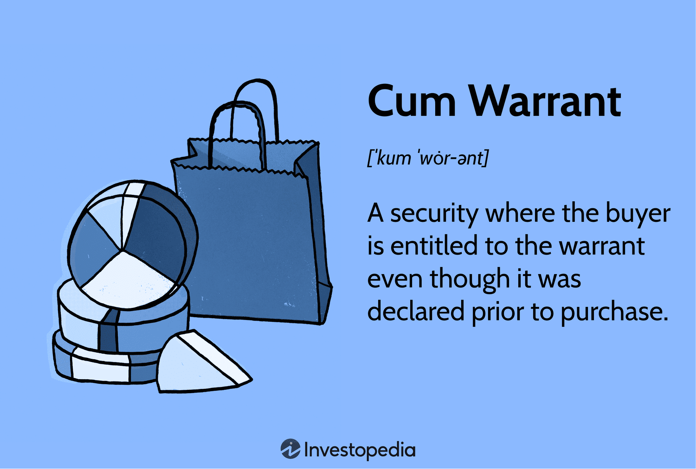

## Table of Contents

## What is a Cum Warrant?

A cum warrant is a type of financial instrument that combines a bond or stock with a warrant. A warrant is like an option that gives the owner the right to buy a specific amount of stock at a set price before a certain date. When you buy a cum warrant, you are getting both the bond or stock and the warrant together. This can be attractive to investors because it offers the potential for extra gains if the stock price goes up.

For example, if you buy a cum warrant that includes a bond and a warrant to buy shares of a company, you get the steady income from the bond and the chance to buy the company's stock at a lower price in the future. If the stock price rises above the price set in the warrant, you can use the warrant to buy the stock at the lower price and then sell it at the higher market price, making a profit. This makes cum warrants a useful tool for investors looking to diversify their investments and potentially increase their returns.

## How does a Cum Warrant differ from a regular warrant?

A cum warrant is different from a regular warrant because it comes with something extra. A regular warrant is just a right to buy a certain amount of stock at a set price before a certain date. But a cum warrant includes this right along with another investment, like a bond or a stock. So, when you buy a cum warrant, you are getting both the warrant and the additional investment at the same time.

This makes cum warrants more attractive to some investors because they offer more than one way to make money. With a regular warrant, your profit depends only on the stock price going up. But with a cum warrant, you also get the benefits of the bond or stock that comes with it. For example, if the cum warrant includes a bond, you get regular interest payments from the bond, plus the chance to make money from the warrant if the stock price rises.

## What are the key components of a Cum Warrant?

A cum warrant has two main parts: a bond or stock, and a warrant. The bond or stock is like a regular investment that gives you money over time, like interest from a bond or dividends from a stock. The warrant is a special right that lets you buy more stock at a set price before a certain date. When you buy a cum warrant, you get both the bond or stock and the warrant together in one package.

This combination makes cum warrants different from regular warrants. A regular warrant only gives you the right to buy stock, but a cum warrant gives you that right plus the bond or stock. This means you can get regular payments from the bond or stock, and also have the chance to make more money if the stock price goes up and you use the warrant to buy more stock at the lower set price.

## Who can issue a Cum Warrant?

Cum warrants can be issued by companies that want to raise money. These companies can be big or small, and they might be looking for ways to get more investors interested in their stocks or bonds. By offering a cum warrant, a company gives investors a chance to buy both a bond or stock and a warrant at the same time. This can make the investment more appealing because it offers more ways to make money.

Usually, it's the company's finance team or investment bankers who decide to issue cum warrants. They work together to set the terms of the cum warrant, like the price of the bond or stock and the price and date for the warrant. Once everything is set, the cum warrant is offered to investors, who can then decide if they want to buy it. This process helps companies raise money while giving investors a potentially rewarding investment option.

## What are the legal requirements for obtaining a Cum Warrant?

To obtain a cum warrant, you need to follow the rules set by the place where the company that issues the cum warrant is located. These rules can be different depending on the country or state. Usually, you need to be an adult and have a way to invest money, like a brokerage account. Some places might also have special rules about who can buy cum warrants, so it's important to check the local laws.

Once you meet the basic requirements, you can buy a cum warrant through a financial institution or directly from the company if they offer it. You'll need to read and understand the terms of the cum warrant, like the price of the bond or stock and the details of the warrant. It's a good idea to talk to a financial advisor to make sure you understand everything and that the cum warrant fits your investment goals.

## How is a Cum Warrant executed?

To execute a cum warrant, you first need to buy it from a company or through a financial institution. When you buy a cum warrant, you are getting two things: a bond or stock and a warrant. The bond or stock gives you regular payments, like interest or dividends. The warrant gives you the right to buy more stock at a set price before a certain date. You need to keep track of this date because the warrant will expire if you don't use it in time.

Once you have the cum warrant, you can decide when to use the warrant part. If the stock price goes above the set price in the warrant, you can use the warrant to buy the stock at the lower price. Then, you can sell the stock at the higher market price and make a profit. If the stock price doesn't go up, you can still keep the bond or stock for its regular payments. This way, you have two chances to make money with a cum warrant.

## What are the potential consequences of non-compliance with a Cum Warrant?

If you don't follow the rules of a cum warrant, you might lose the chance to use the warrant part. The warrant has a date when it stops working, so if you don't use it before this date, you can't buy the stock at the set price anymore. This means you miss out on any profit you could have made if the stock price went up.

Not using the warrant on time doesn't affect the bond or stock part of the cum warrant. You can still keep getting the regular payments from the bond or stock. But, if you were counting on making money from the stock price going up, not using the warrant means you won't get that extra money. It's important to keep track of the dates and rules to make the most out of your cum warrant.

## Can a Cum Warrant be challenged or appealed?

A cum warrant usually can't be challenged or appealed in a legal way because it's a financial agreement between you and the company. When you buy a cum warrant, you agree to the terms set by the company. If you don't follow these terms, like not using the warrant before it expires, you can't go to court to change the rules.

If you think the company did something wrong with the cum warrant, you might be able to talk to a financial regulator or a lawyer. They can help you figure out if there's a problem and what you can do about it. But most of the time, the terms of the cum warrant are final and you have to follow them or lose the chance to use the warrant.

## What are the historical origins of the Cum Warrant?

Cum warrants have been around for a long time, starting in the early 20th century. They became popular as a way for companies to raise money. Back then, companies were looking for new ways to get investors interested in their stocks and bonds. By offering a cum warrant, which includes both a bond or stock and a warrant, companies could make their investments more appealing. This gave investors a chance to get regular payments from the bond or stock and also the possibility of making more money if the stock price went up.

Over the years, cum warrants have been used by many different companies around the world. They became especially popular in the 1980s and 1990s when financial markets were growing fast. Investors liked cum warrants because they offered a way to diversify their investments and potentially increase their returns. Today, cum warrants are still used, but the rules and regulations around them have become more detailed to protect investors and make sure everything is fair.

## How have Cum Warrants evolved in modern legal systems?

Cum warrants have changed a lot over time as laws and rules have gotten stricter. In the past, there weren't many rules about cum warrants, so companies could offer them in many different ways. But as more people started investing, governments and financial regulators made new laws to protect investors. These laws make sure that companies tell investors everything they need to know about the cum warrant, like the price of the bond or stock and the details of the warrant. This helps investors make smart choices and understand the risks.

Today, cum warrants are part of a bigger set of financial rules that cover all kinds of investments. These rules are different in each country, but they all aim to make sure that cum warrants are fair and clear. For example, in some places, there are special rules about who can buy cum warrants and how they can be sold. These rules help keep the financial markets safe and trustworthy. Even though cum warrants are still used, they are now part of a more detailed and careful system that looks out for investors.

## What are some notable cases involving Cum Warrants?

One famous case about cum warrants happened in the 1980s with a company called Tandem Computers. They offered cum warrants to their investors, which helped them raise a lot of money. But some investors thought Tandem didn't tell them everything they needed to know about the cum warrants. They took the company to court, saying that Tandem broke the rules. The court looked at the case and decided that Tandem did have to give more information to the investors. This case showed how important it is for companies to be clear and honest when they offer cum warrants.

Another case that people remember happened in the 1990s with a company called WorldCom. They used cum warrants to get more money from investors. But later, it turned out that WorldCom was not being honest about its money. They were lying about how much money they had, and this made the cum warrants they offered worth less than people thought. When the truth came out, investors lost a lot of money. This case showed that cum warrants can be risky if the company is not telling the truth. It also made regulators make stricter rules to protect investors.

## How do Cum Warrants impact privacy and civil liberties?

Cum warrants don't usually affect privacy and civil liberties directly because they are financial tools used by companies to raise money. When you buy a cum warrant, you are getting a bond or stock and a right to buy more stock. The company gives you information about the cum warrant, but this information is about the investment, not about your personal life. So, buying a cum warrant is like any other investment where your privacy stays safe.

But, if a company doesn't follow the rules and lies about the cum warrant, it can cause problems. If the company gets in trouble, there might be investigations or court cases. These can bring up issues about transparency and fairness, which are part of civil liberties. However, these issues are more about the company's behavior and the laws that protect investors, not about the cum warrant itself affecting your privacy or civil liberties.

## What is a Cum Warrant?

The term 'cum warrant' refers to a specific type of security arrangement where the holder is entitled to a warrant alongside the primary security, even if the warrant was declared prior to the purchase. This feature makes cum warrants an attractive option for investors seeking additional potential value from their investments. Typically, cum warrants are attached to bonds, allowing the bondholder the right to purchase shares at a predetermined price within a specific timeframe. This setup can enhance the attractiveness of bonds by coupling them with warrants, potentially adding value and offering the holders an opportunity to benefit from future stock price increases without requiring the conversion of the bond itself.

Unlike convertible bonds, cum warrants do not necessitate the exchange of the bond for equities. Convertible bonds allow holders to convert the bond into a predetermined number of shares, thereby permanently changing the nature of the bond investment into an equity position. Cum warrants, however, allow investors to retain the bond as it is, while still benefiting from the option to purchase stock. This distinction provides strategic flexibility, enabling holders to benefit from both bond interest payments and the potential upside of owning company stock.

Cum warrants differ from ex-warrants, where the warrant is not included if the security is purchased after the declaration of the warrant. Understanding the nuances between cum and ex-warrants is critical for traders aiming to capitalize on these financial instruments. While cum warrants add a degree of complexity to investment strategies, they offer sophisticated investors an additional lever for maximizing returns.

Strategically, traders might use cum warrants to hedge against potential future price increases of the underlying stock, or as speculative instruments to gain leveraged exposure to equities. For example, if an investor anticipates a rise in the stock price but prefers not to directly invest in the stock, cum warrants provide a means to engage with the stock indirectly. This strategic flexibility is paramount in environments where stock market conditions are volatile or when interest rates are unfavorable for outright equity purchases.

The mechanics of trading cum warrants involve evaluating the warrant's exercise price relative to the current and anticipated future market prices of the associated stock. The Black-Scholes equation, commonly used for calculating option pricing, can effectively be applied to warrants as well:

$$
C = S_0N(d_1) - Xe^{-rt}N(d_2)
$$

where:
- $C$ is the call option price.
- $S_0$ is the current price of the stock.
- $X$ is the exercise price of the option.
- $r$ is the risk-free interest rate.
- $t$ is the time to maturity.
- $N(d)$ is the cumulative standard normal distribution.
- $d_1 = \frac{\ln(S_0/X) + (r + \sigma^2/2)t}{\sigma \sqrt{t}}$
- $d_2 = d_1 - \sigma \sqrt{t}$
- $\sigma$ is the volatility of the stock's returns.

By applying such mathematical models, investors can make informed decisions regarding whether to invest in cum warrants based on their expected returns and risk tolerance. In summary, cum warrants provide unique opportunities for investors to gain strategic and potentially lucrative positions within financial markets without altering the fundamental nature of their primary securities.

## References & Further Reading

[1]: Natenberg, S. (1994). [Option Volatility and Pricing: Advanced Trading Strategies and Techniques](https://www.amazon.com/Option-Volatility-Pricing-Strategies-Techniques/dp/0071818774). McGraw-Hill Education.

[2]: [Hull, J. C. (2015). Options, Futures, and Other Derivatives](https://elibrary.pearson.de/book/99.150005/9781292410623). Pearson.

[3]: [Carr, P., & Ells, E. R. (1998). "Warrants: Reasons, Rationale, and Valuation." Journal of Applied Corporate Finance,](https://engineering.nyu.edu/sites/default/files/2018-09/CarrEuropeanFinReview1998.pdf) 11(3).

[4]: ["Algorithmic Trading: Winning Strategies and Their Rationale"](https://www.wiley.com/en-us/Algorithmic+Trading%3A+Winning+Strategies+and+Their+Rationale-p-9781118746912) by Ernest P. Chan.

[5]: Black, F., & Scholes, M. (1973). ["The Pricing of Options and Corporate Liabilities."](https://www.cs.princeton.edu/courses/archive/fall09/cos323/papers/black_scholes73.pdf) Journal of Political Economy, 81(3), 637-654.

[6]: Aldridge, I. (2013). [High-Frequency Trading: A Practical Guide to Algorithmic Strategies and Trading Systems](https://www.wiley.com/en-us/High+Frequency+Trading%3A+A+Practical+Guide+to+Algorithmic+Strategies+and+Trading+Systems-p-9780470579770). Wiley.