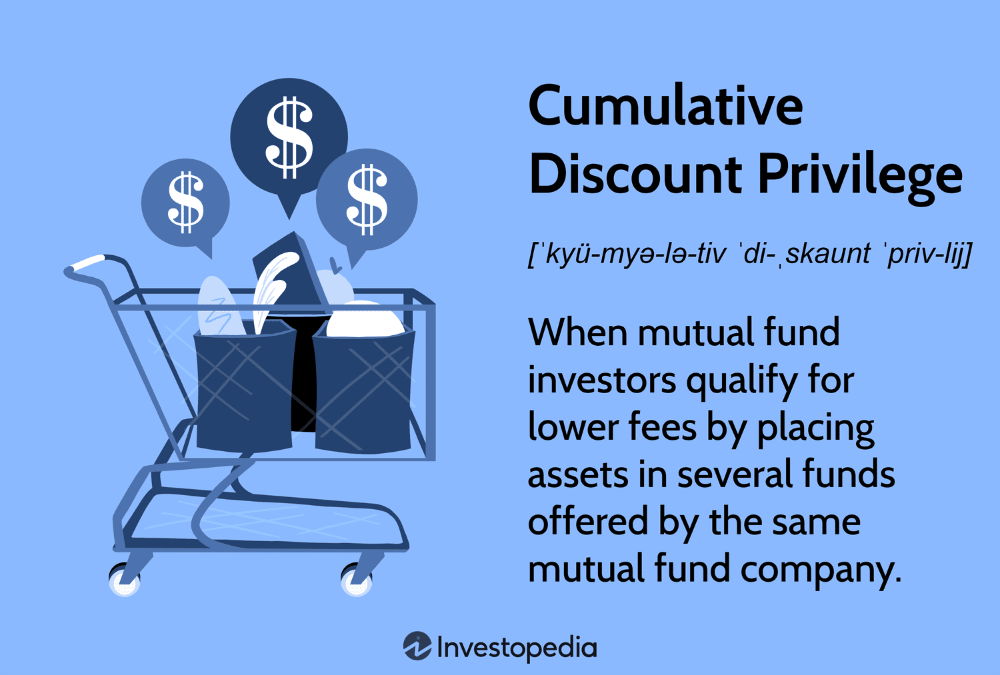

## Table of Contents

## What is a cumulative discount policy?

A cumulative discount policy is a way for businesses to reward customers for buying more over time. Instead of giving a discount on just one purchase, this policy gives bigger discounts the more a customer buys. For example, if you spend a certain amount over a few months, you might get a bigger discount on your next purchase.

This type of policy helps to keep customers coming back because they want to reach the next discount level. It's good for both the business and the customer. The business gets more sales, and the customer saves more money the more they buy. It's like a loyalty program where the more you spend, the more you save.

## How does a cumulative discount policy differ from other discount policies?

A cumulative discount policy is different from other discount policies because it looks at how much a customer spends over time, not just on one purchase. With a cumulative discount, the more you buy over several purchases, the bigger the discount you get. This is different from a one-time discount, where you get a discount only on the item you are buying right then. For example, a store might give you a 5% discount if you spend $100 in a month, but if you spend $500 over six months, you might get a 10% discount on your next purchase.

Other types of discount policies include [volume](/wiki/volume-trading-strategy) discounts and seasonal discounts. A volume discount gives you a lower price if you buy a lot of something all at once. For example, buying 10 items might get you a 15% discount on those items. Seasonal discounts are given during certain times of the year, like holidays, to encourage people to buy more. These discounts are usually for a short time and don't depend on how much you've spent before. The main difference is that a cumulative discount rewards you for being a loyal customer over time, while other discounts focus on the amount you buy at one time or during a specific period.

## What are the benefits of implementing a cumulative discount policy for a business?

Implementing a cumulative discount policy can help a business in many ways. First, it encourages customers to keep coming back to the store. When customers know that the more they spend over time, the bigger the discount they will get, they are more likely to choose that business over others. This can lead to more sales and a loyal customer base. Loyal customers are very valuable because they spend more money over time and often tell their friends and family about the business.

Second, a cumulative discount policy can help a business stand out from its competitors. Many businesses offer one-time discounts or seasonal sales, but a cumulative discount is special because it rewards customers for their loyalty over time. This can make customers feel valued and more likely to stay with the business. It also helps the business gather important information about what customers are buying and how often, which can be used to improve products and services.

## Can you explain how cumulative discounts are calculated?

Cumulative discounts are calculated by adding up how much a customer spends over time and then giving them a bigger discount based on that total. For example, a store might say that if you spend $100 in total over a few months, you get a 5% discount on your next purchase. If you spend $300, you might get a 10% discount. The key is that the store keeps track of all your purchases, adds them up, and then decides what discount you should get based on that total amount.

This system can work in different ways depending on the business. Some stores might reset the total every year, so you start over at zero. Others might keep adding to your total forever, so the more you spend over your lifetime with the store, the bigger your discount can get. The important thing is that the business has a clear rule about how much you need to spend to get each level of discount, and they keep good records of your spending to make sure they give you the right discount when it's time.

## What types of businesses typically use cumulative discount policies?

Many types of businesses use cumulative discount policies to keep their customers coming back. Stores that sell things like clothes, electronics, or home goods often use these policies. They want to make sure their customers keep choosing their store instead of going somewhere else. For example, a clothing store might give you a bigger discount the more you spend over a year, which makes you want to buy your clothes there instead of at another store.

Other businesses that use cumulative discounts are ones that sell things people need regularly, like grocery stores or beauty product shops. These businesses know that if they can get you to keep coming back, you'll spend more money with them over time. A grocery store might give you a bigger discount on your next shopping trip if you've spent a certain amount over the past few months, which encourages you to keep shopping there.

## How can a cumulative discount policy affect customer loyalty?

A cumulative discount policy can really help a business keep its customers loyal. When customers know they'll get bigger discounts the more they spend over time, they're more likely to keep coming back to the same store. This makes them feel like the business values them and wants to reward them for their loyalty. Instead of shopping around at different stores, they stick with one that gives them better deals the more they buy.

This policy also makes customers feel like they're part of a special group. When they see their discount growing as they spend more, it gives them a reason to keep shopping at that store. Over time, this can turn regular customers into loyal fans who not only spend more money but also tell their friends and family about the great deals they're getting. This kind of word-of-mouth can bring in even more customers, helping the business grow.

## What are the potential drawbacks of a cumulative discount policy?

A cumulative discount policy can be hard for a business to manage. They need to keep good records of how much each customer spends over time. This means using special computer systems and making sure the staff knows how to use them. If the business makes a mistake, customers might get the wrong discount, which can make them unhappy. Also, the policy can be confusing for customers. They might not understand how it works or how to get the bigger discounts, which can make them feel frustrated.

Another problem is that a cumulative discount policy can cost a business a lot of money. The more customers spend, the bigger the discounts they get, which means less profit for the business. If too many customers reach the highest discount levels, the business might lose money. Also, this policy might make customers wait to buy things. They might hold off on buying until they can get a bigger discount, which can hurt the business's sales in the short term.

## How should a business set thresholds for cumulative discounts?

A business should think carefully about where to set the spending levels for cumulative discounts. They need to look at how much their customers usually spend and how often they shop. If the levels are too high, customers might not buy enough to reach them and feel let down. If the levels are too low, the business might have to give away too many discounts and lose money. So, the business should start by looking at their sales data to find a good balance that keeps customers happy but also makes sure the business can still make a profit.

Once the business knows what their customers usually spend, they can set different levels for discounts. For example, they might give a 5% discount for spending $100 over a few months, and a 10% discount for spending $300. It's important to make these levels clear to customers so they understand how to get the discounts. The business should also keep an eye on how well the policy is working and be ready to change the levels if they need to, to make sure it's fair for both the customers and the business.

## What software tools can help manage a cumulative discount policy?

Businesses can use special software to keep track of how much their customers spend and give them the right discounts. One good tool is a Customer Relationship Management (CRM) system. A CRM system helps businesses keep all their customer information in one place. It can track how much each customer spends over time and automatically give them the right discount when they reach a certain level. Some popular CRM systems are Salesforce, HubSpot, and Zoho CRM. These tools make it easy for businesses to manage their cumulative discount policy without making mistakes.

Another useful tool is a loyalty program software. This kind of software is made just for running loyalty programs like cumulative discounts. It can keep track of customer spending, send out reminders about how close customers are to the next discount level, and even send special offers to keep customers coming back. Examples of loyalty program software include LoyaltyLion, Smile.io, and Yotpo. Using these tools can help businesses make their cumulative discount policy work smoothly and keep their customers happy.

## How can a cumulative discount policy be integrated with other sales strategies?

A cumulative discount policy can work well with other sales strategies to help a business grow. For example, a business can use it with a referral program. When customers tell their friends about the store and those friends start shopping there, the original customer can get extra points toward their cumulative discount. This makes customers want to spread the word about the store, bringing in more sales. Also, the business can use it with special events or seasonal sales. During these times, they can offer extra discounts or bonuses that count toward the cumulative total, which can make more people want to shop during those events.

Another way to mix a cumulative discount policy with other sales strategies is by using it with a tiered pricing model. In this model, the more a customer buys, the lower the price they pay for each item. The cumulative discount can add to this by giving an even bigger discount once the customer reaches certain spending levels. This can make customers want to buy more to get the best deal. Overall, combining a cumulative discount policy with other sales strategies can help a business attract more customers, keep them coming back, and increase sales.

## What are the legal considerations when implementing a cumulative discount policy?

When a business wants to start a cumulative discount policy, they need to think about the laws that might affect it. One big thing to consider is making sure the policy is fair to everyone. The business can't treat some customers better than others just because of things like their race, age, or where they come from. They also need to be clear about how the policy works so customers understand it. If the policy is too hard to understand, it might cause problems or even lawsuits.

Another important thing is to check the rules about discounts and promotions in the places where the business operates. Some places have special laws about how discounts can be given and what needs to be written down. The business should keep good records of all the discounts they give out to make sure they are following these rules. If they don't, they could get in trouble with the law. It's a good idea for the business to talk to a lawyer to make sure their cumulative discount policy follows all the legal rules.

## How can the effectiveness of a cumulative discount policy be measured and optimized?

To measure how well a cumulative discount policy is working, a business can look at a few key things. They can check if customers are coming back more often and spending more money over time. This means the policy is making customers want to shop more. The business can also see if the number of new customers is going up because of happy customers telling their friends. Another way to measure it is by looking at how much profit the business is making. If the discounts are too big, the business might lose money, so they need to find the right balance.

To make the policy even better, the business should keep an eye on how it's doing and be ready to change things if needed. They can ask customers for feedback to see if the policy is easy to understand and if it's making them happy. The business might also try different spending levels for the discounts to see which ones work best. By using special software to keep track of everything, the business can quickly see what's working and what's not. This way, they can keep making the policy better over time to keep customers coming back and spending more.

## What are effective discount strategies?

Discount strategies are vital for businesses striving to enhance sales and foster customer loyalty. Implementing these strategies can attract customers, encourage repeat purchases, and increase overall revenue. Various discount strategies effectively achieve these objectives, including bulk discounts, seasonal discounts, and early payment discounts.

**Bulk Discounts:** Bulk discounts incentivize customers to purchase larger quantities of a product in exchange for a reduced per-unit price. This strategy can help businesses manage inventory more effectively and increase sales volume. For instance, a company may offer a 10% discount on a product if the customer purchases 100 units or more. The formula to calculate the total cost with a bulk discount can be expressed as:

$$
\text{Total Cost} = (\text{Price per Unit} \times \text{Quantity}) \times (1 - \text{Discount Rate})
$$

**Seasonal Discounts:** Seasonal discounts are reductions in price offered during specific times of the year to boost sales during off-peak periods. These discounts help businesses clear out excess inventory and attract customers who are sensitive to price changes. For example, a retailer might offer discounts on winter clothing during the spring season to make room for upcoming seasonal inventory. Implementing effective seasonal discount strategies involves analyzing sales data to determine peak and off-peak periods and setting appropriate discount rates.

**Early Payment Discounts:** These discounts are offered to customers as an incentive for paying their invoices early. This strategy improves cash flow by providing businesses with quicker access to funds. An early payment discount might be formulated as "2/10, net 30," meaning a 2% discount is available if the invoice is paid within 10 days; otherwise, the full amount is due in 30 days. The financial impact of this discount can be calculated using the following formula:

$$
\text{Discounted Amount} = \text{Invoice Amount} \times \text{Discount Rate}
$$

**Cumulative Discount Privilege in Mutual Funds:** Cumulative discounts in mutual funds allow investors to qualify for lower fees based on their total investments across multiple funds within the same family. This encourages investors to increase their investments across a family of funds to attain fee reductions. By accumulating investments, investors can achieve significant cost savings. Businesses can market this privilege to attract more investments by emphasizing the potential for lower overall fees.

To effectively implement these discount strategies, businesses should conduct thorough market research and customer analysis to tailor their offerings to specific customer needs and purchasing behavior. Monitoring and analyzing the performance of each discount strategy is crucial for determining their effectiveness and making necessary adjustments. Businesses might employ data analytics tools and customer feedback to optimize their discount strategies for maximum impact on revenue and customer satisfaction.

In conclusion, discount strategies like bulk discounts, seasonal discounts, and early payment discounts are essential for enhancing sales and customer loyalty. Proper implementation and analysis can lead to significant business benefits, including increased revenue and a stronger customer base.

## What are Cumulative Discounts in Mutual Funds?

Cumulative discounts in mutual funds provide investors with an opportunity to lower the fees or sales charges associated with their investments. These discounts are determined by the total amount an investor has invested across multiple funds within the same fund family. Essentially, cumulative discounts reward investors for larger and more diverse investment portfolios within the same financial institution, offering a tiered fee structure that decreases as the total investment increases.

### Mechanics of Cumulative Discounts

The primary mechanism for cumulative discounts in mutual funds is through breakpoint pricing. Breakpoint pricing is a system where sales charges (often front-end loads) decrease at predetermined investment levels, known as breakpoints. For example, a fund may charge a 5% sales load on investments below $50,000, but reduce it to 4% for investments between $50,000 and $100,000, and further reduce it to 3% for investments exceeding $100,000.

Here's a simplified example of how cumulative discounts might be applied:

1. An investor has $40,000 in one fund and decides to invest an additional $20,000 in another fund within the same family.
2. Without cumulative discounts, the investor might face a higher sales charge due to smaller individual investments.
3. With cumulative discounts, the total $60,000 investment qualifies for a lower fee bracket (e.g., a 4% sales load instead of 5%).

Mathematically, if $L$ is the initial sales charge without discount, and $C$ is the cumulative discount applied, the discounted load $L_{\text{discounted}}$ is given by:

$$
L_{\text{discounted}} = L - C
$$

### Benefits and Key Takeaways

- **Cost Efficiency:** By leveraging cumulative discounts, investors reduce the costs associated with mutual fund transactions. Lower sales charges mean more of the investment capital is working within the portfolio, which can significantly enhance returns over time.

- **Encouragement of Larger Investments:** These discounts incentivize investors to consider larger or consolidated investments within the same fund family, facilitating better portfolio management and potential for scale economies.

- **Investor Loyalty:** Cumulative discounts foster a long-term relationship between investors and fund families, as they encourage staying within the same group of funds to maximize fee benefits.

For investors looking to maximize the benefits of cumulative discounts, it's essential to understand the specific breakpoints and fee structures offered by each mutual fund family. Consideration of investment goals, timelines, and the potential for achieving additional breakpoints through further investments should also play a role in investment decisions.

Through strategic planning and understanding of cumulative discount structures, investors can make more informed decisions that align closely with their financial objectives, ultimately enhancing their overall investment strategy.

## How can pricing models and discounts be integrated with algorithmic trading?

Integrating pricing models and discount strategies with [algorithmic trading](/wiki/algorithmic-trading) involves leveraging advanced computational tools to enhance trading decisions and optimize market strategies. Traders utilize [machine learning](/wiki/machine-learning) algorithms to analyze vast datasets, predict market trends, and accommodate dynamic pricing and discount mechanisms effectively. Machine learning, a subset of [artificial intelligence](/wiki/ai-artificial-intelligence), allows algorithms to learn from historical data, refine predictions, and make decisions based on evolving market conditions.

For example, consider the use of a linear regression model to predict asset prices. By analyzing historical data, traders can identify patterns and correlations that might predict future price movements. The mathematical expression for a simple linear regression model is:

$$
y = \beta_0 + \beta_1x + \epsilon
$$

where $y$ is the dependent variable (e.g., future price), $x$ is the independent variable (e.g., historical price), $\beta_0$ and $\beta_1$ are coefficients, and $\epsilon$ is the error term. More complex models, such as decision trees or neural networks, can capture non-linear relationships and account for multiple variables simultaneously, offering more precise predictions for pricing strategies.

Moreover, algorithmic trading systems integrate discount strategies to optimize transaction costs and enhance profitability. By applying volume discounts or utilizing early payment incentives, algorithms can strategically time trades to benefit from lower fees or better pricing, thereby improving overall trading efficiency. For instance, a mutual fund might offer reduced management fees for larger, cumulative investments, which can be strategically exploited by algorithms analyzing fund performance and fee structures.

Case studies illustrate the successful integration of algorithms in financial markets. For example, high-frequency trading firms use complex algorithms to execute trades in milliseconds, capturing price [arbitrage](/wiki/arbitrage) opportunities and benefiting from minimal price fluctuations. These algorithms adjust pricing models based on real-time data, ensuring swift responses to market changes. The scalability of such systems allows for processing thousands of trades across global markets, demonstrating enhanced trading outcomes.

Python, a popular programming language for data analysis and machine learning, provides a robust set of libraries for developing trading algorithms. Libraries like NumPy, pandas, and scikit-learn are extensively used to handle data manipulation, statistical analysis, and machine learning respectively. For instance, a simple algorithm to predict a stock's closing price using a machine learning model might look like this:

```python
import pandas as pd
from sklearn.model_selection import train_test_split
from sklearn.linear_model import LinearRegression

# Load dataset
data = pd.read_csv('stock_prices.csv')

# Feature selection
X = data[['Open', 'High', 'Low', 'Volume']]
y = data['Close']

# Split data into training and test sets
X_train, X_test, y_train, y_test = train_test_split(X, y, test_size=0.2, random_state=42)

# Train the model
model = LinearRegression()
model.fit(X_train, y_train)

# Predict and evaluate
predictions = model.predict(X_test)
print(predictions)
```

In summary, integrating pricing models and discount strategies with algorithmic trading enhances the efficiency and scalability of trading operations. Machine learning algorithms provide sophisticated tools for price prediction and market analysis, while discount strategies offer avenues for cost optimization. As technology advances, the synergy between these elements will continue to shape the dynamics of financial markets, offering competitive advantages to businesses that effectively harness these strategies.

## References & Further Reading

[1]: Bergstra, J., Bardenet, R., Bengio, Y., & Kégl, B. (2011). ["Algorithms for Hyper-Parameter Optimization."](https://dl.acm.org/doi/10.5555/2986459.2986743) Advances in Neural Information Processing Systems 24.

[2]: ["Advances in Financial Machine Learning"](https://www.amazon.com/Advances-Financial-Machine-Learning-Marcos/dp/1119482089) by Marcos Lopez de Prado

[3]: ["Evidence-Based Technical Analysis: Applying the Scientific Method and Statistical Inference to Trading Signals"](https://www.amazon.com/Evidence-Based-Technical-Analysis-Scientific-Statistical/dp/0470008741) by David Aronson

[4]: ["Machine Learning for Algorithmic Trading"](https://github.com/stefan-jansen/machine-learning-for-trading) by Stefan Jansen

[5]: ["Quantitative Trading: How to Build Your Own Algorithmic Trading Business"](https://www.amazon.com/Quantitative-Trading-Build-Algorithmic-Business/dp/1119800064) by Ernest P. Chan