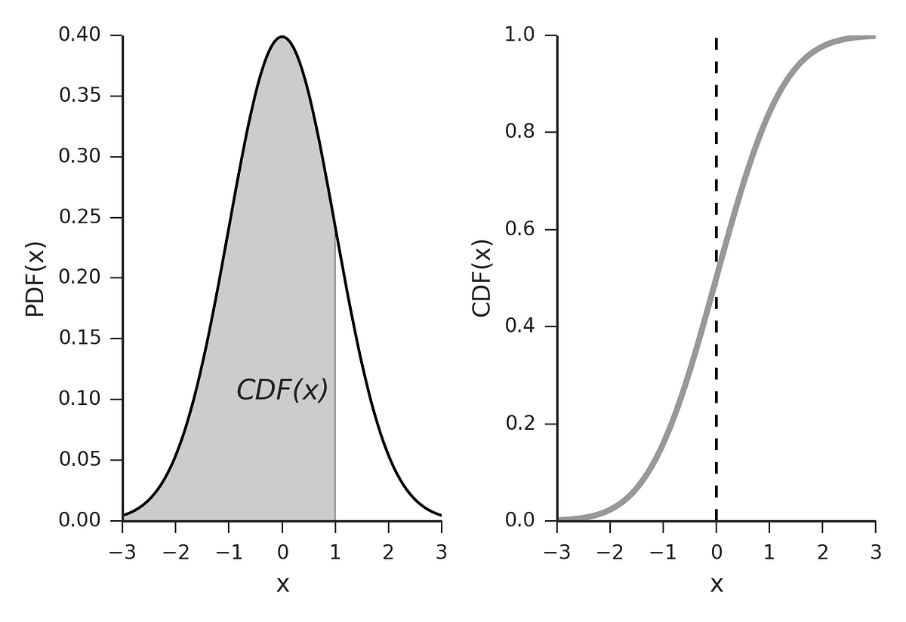

## Table of Contents

## What is a Cumulative Distribution Function (CDF) in the context of machine learning?

A Cumulative Distribution Function (CDF) in machine learning is a way to understand how data is spread out. It shows the probability that a random variable is less than or equal to a certain value. Imagine you have a bunch of test scores. The CDF would tell you the chance that a randomly picked score is below a specific number. For example, if you want to know the probability that a score is less than 70, the CDF helps you find that out. Mathematically, if $X$ is a random variable, the CDF is written as $$F(x) = P(X \leq x)$$.

In machine learning, CDFs are useful for many things. They help in understanding the distribution of data, which is important for building models. For instance, if you're working on a project to predict house prices, knowing the CDF of the prices can help you understand what range most houses fall into. This can guide you in making better predictions. CDFs are also used in algorithms like decision trees and in statistical tests to make decisions based on data. By using CDFs, machine learning models can become more accurate and reliable.

## How does a CDF differ from a Probability Density Function (PDF)?

A Cumulative Distribution Function (CDF) and a Probability Density Function (PDF) are both important in statistics and machine learning, but they give us different information about data. A CDF tells us the probability that a random variable is less than or equal to a certain value. For example, if you're looking at the heights of people, the CDF can tell you the chance that a randomly chosen person is shorter than a specific height. Mathematically, if $X$ is a random variable, the CDF is defined as $$F(x) = P(X \leq x)$$. This function always increases or stays the same as $x$ gets larger, and it always ends at 1 because the total probability must be 100%.

On the other hand, a PDF tells us the likelihood of a random variable taking on a specific value. It's like a curve that shows how the data is spread out. For the same example of heights, the PDF would show you how common it is to find someone at a particular height. The PDF is defined as $$f(x)$$, where the area under the curve from $-\infty$ to $x$ gives you the CDF at $x$. Unlike the CDF, the PDF can go above 1 and can be negative in some cases, but the total area under the PDF curve must equal 1. In simple terms, the CDF gives you cumulative probabilities, while the PDF gives you the density of probabilities at each point.

## Can you explain how to calculate a CDF from a dataset?

To calculate a Cumulative Distribution Function (CDF) from a dataset, you first need to sort your data in ascending order. Once your data is sorted, you can start calculating the CDF. For each value in your sorted dataset, the CDF at that point is the fraction of the total number of data points that are less than or equal to that value. For example, if you have a dataset of exam scores and you want to find the CDF for a score of 70, you count how many scores are 70 or below and divide that by the total number of scores. This gives you the probability that a randomly chosen score from your dataset is 70 or less.

Let's say you have a dataset of exam scores: [65, 70, 75, 80, 85]. To find the CDF for a score of 70, you count the number of scores that are 70 or below, which is 2 (65 and 70). Since there are 5 scores in total, the CDF at 70 is $$ \frac{2}{5} = 0.4 $$. This means there's a 40% chance that a randomly chosen score from this dataset is 70 or less. You can repeat this process for every unique value in your dataset to get the full CDF. 

Here's a simple Python code to calculate the CDF from a dataset:

```python
import numpy as np

def calculate_cdf(data):
    data_sorted = np.sort(data)
    cdf = []
    for value in data_sorted:
        count = np.sum(data_sorted <= value)
        cdf.append(count / len(data_sorted))
    return data_sorted, cdf

# Example usage
scores = [65, 70, 75, 80, 85]
sorted_scores, cdf_values = calculate_cdf(scores)
for score, cdf in zip(sorted_scores, cdf_values):
    print(f"Score: {score}, CDF: {cdf}")
```

This code sorts the data, calculates the CDF for each unique value, and prints the results.

## What role does the CDF play in statistical analysis for machine learning?

In [machine learning](/wiki/machine-learning), the Cumulative Distribution Function (CDF) helps us understand how data is spread out. It tells us the chance that a random value from our data is less than or equal to a certain number. For example, if we're looking at exam scores, the CDF can show us the probability that a student's score is below 70. This is useful because it helps us see patterns in our data, like how many students are doing well or struggling. By knowing the CDF, we can make better decisions about how to build our machine learning models, like choosing the right algorithms or setting the right thresholds.

The CDF also plays a big role in many machine learning algorithms. For instance, in decision trees, the CDF can help us decide where to split the data to make the best predictions. It's also used in statistical tests to check if our data fits certain patterns or if our model is working well. For example, if we want to see if our model's predictions are close to the actual values, we can use the CDF to compare them. By using the CDF, we can make our machine learning models more accurate and reliable, which is important for making good predictions.

## How can CDFs be used to understand the distribution of data in machine learning?

In machine learning, the Cumulative Distribution Function (CDF) helps us see how our data is spread out. It tells us the chance that a random value from our data is less than or equal to a certain number. For example, if we're looking at exam scores, the CDF can show us the probability that a student's score is below 70. This is useful because it helps us see patterns in our data, like how many students are doing well or struggling. By knowing the CDF, we can make better decisions about how to build our machine learning models, like choosing the right algorithms or setting the right thresholds.

The CDF also plays a big role in many machine learning algorithms. For instance, in decision trees, the CDF can help us decide where to split the data to make the best predictions. It's also used in statistical tests to check if our data fits certain patterns or if our model is working well. For example, if we want to see if our model's predictions are close to the actual values, we can use the CDF to compare them. By using the CDF, we can make our machine learning models more accurate and reliable, which is important for making good predictions.

## What are some common types of distributions whose CDFs are frequently used in machine learning?

In machine learning, some common types of distributions whose CDFs are often used include the normal distribution, the uniform distribution, and the exponential distribution. The normal distribution, also known as the Gaussian distribution, is very common because many natural phenomena follow this pattern. Its CDF, denoted as $$F(x) = \frac{1}{\sqrt{2\pi\sigma^2}} \int_{-\infty}^{x} e^{-\frac{(t-\mu)^2}{2\sigma^2}} \, dt$$, helps us understand how likely it is for a value to be below a certain point. The uniform distribution is simpler; its CDF is a straight line because every value within a range is equally likely. The exponential distribution is used for modeling time between events, and its CDF is $$F(x) = 1 - e^{-\lambda x}$$.

These distributions are important in machine learning because they help us understand and model our data. For example, if we know our data follows a normal distribution, we can use the CDF to find out the probability that a new data point will fall within a certain range. This is useful for making predictions or setting thresholds in our models. The uniform distribution's CDF can be used when we want to model data where every outcome is equally likely, like in random sampling. The exponential distribution's CDF is helpful when we're dealing with time-to-event data, such as the time until a machine fails or a customer makes a purchase. By understanding these CDFs, we can build more accurate and reliable machine learning models.

## How can you estimate the CDF empirically from a sample of data?

To estimate the Cumulative Distribution Function (CDF) empirically from a sample of data, you first need to sort the data in ascending order. Then, for each value in your sorted list, you count how many data points are less than or equal to that value. The CDF at any point is the fraction of the total number of data points that fall below or at that value. For example, if you have a list of exam scores and you want to find the CDF for a score of 70, you count the number of scores that are 70 or below and divide that by the total number of scores. This gives you the probability that a randomly chosen score from your sample is 70 or less.

Here's a simple way to do this in Python:

```python
import numpy as np

def calculate_cdf(data):
    data_sorted = np.sort(data)
    cdf = []
    for value in data_sorted:
        count = np.sum(data_sorted <= value)
        cdf.append(count / len(data_sorted))
    return data_sorted, cdf

# Example usage
scores = [65, 70, 75, 80, 85]
sorted_scores, cdf_values = calculate_cdf(scores)
for score, cdf in zip(sorted_scores, cdf_values):
    print(f"Score: {score}, CDF: {cdf}")
```

This code sorts the data, calculates the CDF for each unique value, and prints the results. By using this method, you can get a good estimate of the CDF from your sample data, which is very useful in understanding how your data is spread out.

## What is the significance of the CDF in evaluating model performance in machine learning?

The Cumulative Distribution Function (CDF) helps us check how well our machine learning model is doing. It does this by showing us how often our model's predictions match up with the real data. For example, if we're trying to predict house prices, the CDF can tell us the chance that our model's guess is less than or equal to the actual price. By looking at the CDF, we can see if our model's predictions are usually too high, too low, or just right. This helps us understand if our model is good at guessing or if we need to make some changes.

The CDF is also important when we want to compare different models. If we have two models trying to predict the same thing, like exam scores, we can use their CDFs to see which one is better. The model with a CDF that's closer to the CDF of the actual data is usually the better one. For instance, if the CDF of the actual scores shows that 80% of students scored below 70, and one model's CDF shows 75% below 70 while the other shows 85%, the first model is probably better. By using the CDF, we can make sure our machine learning models are as accurate and reliable as possible.

## How do quantile functions relate to CDFs, and why are they important in machine learning?

The quantile function is the opposite of the Cumulative Distribution Function (CDF). While the CDF tells us the chance that a random value is less than or equal to a certain number, the quantile function tells us the value below which a certain percentage of the data falls. For example, if you want to know the score below which 50% of students fall, the quantile function can tell you that. Mathematically, if $F(x)$ is the CDF, the quantile function $Q(p)$ is defined as $$Q(p) = \inf \{ x : F(x) \geq p \}$$, where $p$ is a probability between 0 and 1.

In machine learning, quantile functions are important because they help us understand and work with our data in different ways. For example, they can help us find important values like the median (the middle value) or the 90th percentile (the value below which 90% of the data falls). This is useful for setting thresholds or understanding the spread of our data. Quantile functions are also used in algorithms like quantile regression, which helps us predict not just the average outcome but also different percentiles of the outcome. By using quantile functions, we can make our machine learning models more accurate and reliable, which is important for making good predictions.

## Can you describe how CDFs are used in feature engineering for machine learning models?

In machine learning, feature engineering is all about making our data better so that our models can learn from it more easily. One way to do this is by using the Cumulative Distribution Function (CDF). The CDF helps us understand how our data is spread out. For example, if we have a dataset of exam scores, the CDF can show us the chance that a randomly picked score is below a certain number. By looking at the CDF, we can create new features that tell us important things about our data, like how many scores are below average or how spread out the scores are. This can help our models make better predictions.

For instance, if we want to know the probability that a score is less than 70, we can use the CDF to find that out. Mathematically, if $X$ is a random variable, the CDF is written as $$F(x) = P(X \leq x)$$. By calculating the CDF for each score in our dataset, we can create new features like the percentile rank of each score. This tells us where each score stands compared to all the other scores. These new features can help our models understand the data better, making them more accurate and reliable. By using the CDF in feature engineering, we can turn raw data into something more useful for our machine learning models.

## What advanced techniques involve CDFs for handling imbalanced datasets in machine learning?

In machine learning, imbalanced datasets are common and can make it hard for models to learn well. One advanced technique that uses the Cumulative Distribution Function (CDF) to handle this problem is called SMOTE (Synthetic Minority Over-sampling Technique). SMOTE works by creating new examples of the minority class to balance the dataset. It does this by looking at the CDF of the minority class to understand how the data is spread out. By using the CDF, SMOTE can create new data points that fit well with the existing data, making the dataset more balanced and helping the model learn better.

Another technique that involves CDFs is called ADASYN (Adaptive Synthetic Sampling). ADASYN also creates new examples of the minority class, but it does this in a smarter way. It uses the CDF to find areas where the minority class is most underrepresented and focuses on creating new data points there. This helps the model pay more attention to the parts of the data that are most important. By using the CDF, ADASYN can make the dataset more balanced and improve the model's performance on imbalanced data.

## How can CDFs be integrated into deep learning models for better performance and understanding?

In [deep learning](/wiki/deep-learning), the Cumulative Distribution Function (CDF) can help improve how models work and understand data better. For example, CDFs can be used to create new features that show important patterns in the data. If we have a dataset of exam scores, the CDF can tell us the chance that a score is less than 70. By adding this information as a new feature, deep learning models can learn more about the data's spread and make better predictions. This can be especially useful in tasks like regression, where understanding the distribution of the target variable can help the model predict more accurately.

Another way CDFs can be used in deep learning is through techniques like quantile regression. Quantile regression helps models predict not just the average outcome but also different percentiles of the outcome. The quantile function, which is the opposite of the CDF, is key to this. If $F(x)$ is the CDF, the quantile function $Q(p)$ is defined as $$Q(p) = \inf \{ x : F(x) \geq p \}$$. By using quantile regression, deep learning models can give us a fuller picture of what might happen, not just the most likely outcome. This is helpful in many real-world situations, like predicting how long a machine might last or how much a house might sell for, where understanding the range of possible outcomes is important.

## References & Further Reading

[1]: Papoulis, A., & Pillai, S. U. (2002). ["Probability, Random Variables, and Stochastic Processes"](https://searchworks.stanford.edu/view/4708590) (4th Edition). McGraw-Hill.

[2]: Sheskin, D. J. (2007). ["Handbook of Parametric and Nonparametric Statistical Procedures"](https://www.taylorfrancis.com/books/mono/10.1201/9780429186196/handbook-parametric-nonparametric-statistical-procedures-fifth-edition-david-sheskin) (4th Edition). CRC Press.

[3]: Bishop, C. M. (2006). ["Pattern Recognition and Machine Learning"](https://link.springer.com/book/9780387310732). Springer.

[4]: Wasserman, L. (2004). ["All of Statistics: A Concise Course in Statistical Inference"](https://link.springer.com/book/10.1007/978-0-387-21736-9). Springer.

[5]: Hastie, T., Tibshirani, R., & Friedman, J. (2009). ["The Elements of Statistical Learning: Data Mining, Inference, and Prediction"](https://link.springer.com/book/10.1007/978-0-387-84858-7) (2nd Edition). Springer.

[6]: Silverman, B. W. (1986). ["Density Estimation for Statistics and Data Analysis"](https://ned.ipac.caltech.edu/level5/March02/Silverman/paper.pdf). Chapman & Hall/CRC.

[7]: Goodfellow, I., Bengio, Y., & Courville, A. (2016). ["Deep Learning"](https://link.springer.com/article/10.1007/s10710-017-9314-z). MIT Press.

[8]: Vapnik, V. (1998). ["Statistical Learning Theory"](https://www.wiley.com/en-us/Statistical+Learning+Theory-p-9780471030034). Wiley.